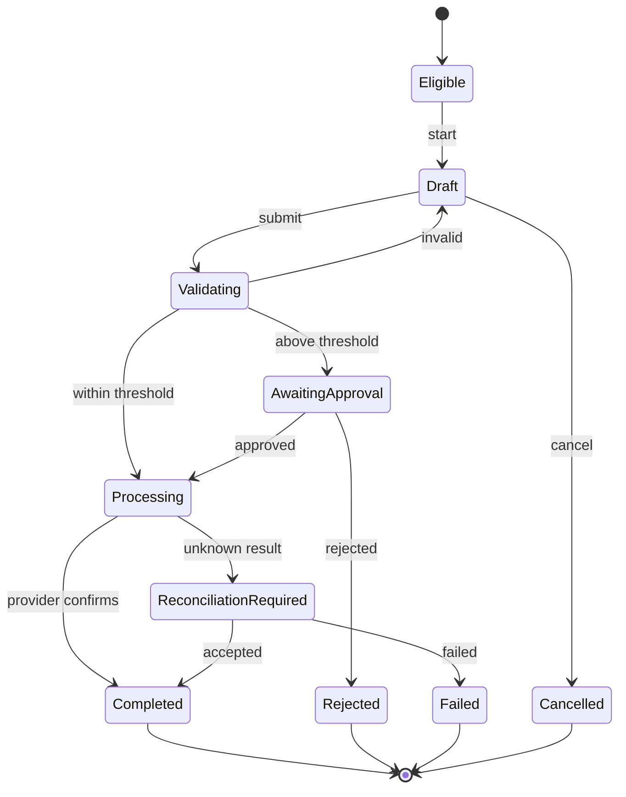

# Example: Refund Approval Flow

This example is illustrative. It is not project evidence.

## User needs

### UN-001
**As a:** store manager  
**When:** a customer refund is required  
**I need to:** submit it with clear approval and processing status  
**So that:** I avoid duplicate payment and repeated support contact.

### UN-002
**As a:** finance reviewer  
**When:** a refund exceeds the automatic threshold  
**I need to:** review complete order and payment context  
**So that:** I can approve or reject consistently.

## Roles
| Action | Store manager | Finance reviewer | Administrator |
|---|---|---|---|
| Create | Allowed | Allowed | Allowed |
| Submit | Allowed | Allowed | Allowed |
| Approve above threshold | Denied | Allowed | Allowed |
| Cancel before processing | Own | Scoped | Any |
| Retry uncertain result | Status check only | Status check only | Status check only |

## Rules

### BR-001 — Eligibility
Payment captured, refundable balance positive, not fully refunded.

### BR-002 — Threshold
At or below threshold processes automatically; above threshold awaits finance approval.

### BR-003 — Duplicate protection
Every provider submission uses an idempotency key. Unknown result must be reconciled before another submission.

## States
| ID | State | Meaning | Terminal |
|---|---|---|---|
| ST-001 | Eligible | Refund may start | No |
| ST-002 | Draft | Not submitted | No |
| ST-003 | Validating | Rules evaluated | No |
| ST-004 | AwaitingApproval | Finance action needed | No |
| ST-005 | Processing | Provider accepted | No |
| ST-006 | ReconciliationRequired | Result unknown | No |
| ST-007 | Completed | Refund confirmed | Yes |
| ST-008 | Rejected | Reviewer rejected | Yes |
| ST-009 | Failed | Cannot continue | Yes |
| ST-010 | Cancelled | Cancelled before processing | Yes |

## Transition table
| From | Trigger | Actor | Preconditions | Rules | To | Side effects | Failure |
|---|---|---|---|---|---|---|---|
| Eligible | Start | Manager | BR-001 | BR-001 | Draft | Create draft | Ineligible |
| Draft | Submit | Manager | Required data | BR-001, BR-002 | Validating | Lock version | Validation failed |
| Validating | Low amount | System | Valid | BR-002 | Processing | Provider request | Reconciliation |
| Validating | High amount | System | Valid | BR-002 | AwaitingApproval | Notify reviewer | Notification fail |
| AwaitingApproval | Approve | Reviewer | Permission | BR-002 | Processing | Provider request | Reconciliation |
| Processing | Provider confirms | System | Accepted | BR-003 | Completed | Update order | Reconciliation |
| AwaitingApproval | Reject | Reviewer | Permission | — | Rejected | Notify requester | Notification fail |
| Draft | Cancel | Manager | Not submitted | — | Cancelled | Release draft | — |

## Decision table
| Condition/result | Case 1 | Case 2 | Case 3 | Case 4 |
|---|---:|---:|---:|---:|
| Eligible | Yes | Yes | No | Yes |
| Above threshold | No | Yes | — | Yes |
| Reviewer approves | — | Yes | — | No |
| Result | Process | Process after approval | Ineligible | Rejected |

## Mermaid

## Critical failure
Provider timeout with unknown acceptance:

- move to `ReconciliationRequired`
- do not offer ordinary resubmit
- query status using original idempotency key
- notify when resolved
- escalate after defined limit

## Accessibility
- keyboard-completable
- focus moves to error summary on failed submission
- valid data remains
- processing/reconciliation announced programmatically
- critical review includes amount, destination and consequence
- re-authentication restores draft
- actions meet target requirements

## Heuristic issues

### HX-001 — Visibility
Timeout previously appeared as failure and caused repeat submission. Severity 4.

### HX-002 — Error prevention
Duplicate provider requests were possible. Severity 4.

## Analytics
| Event | Question |
|---|---|
| refund_flow_started | Can eligible users begin? |
| refund_validation_failed | Which rules block? |
| refund_approval_requested | How often is review needed? |
| refund_processing_started | Was request accepted? |
| refund_reconciliation_started | How often is result unknown? |
| refund_completed | Can users complete? |
| refund_failed | Which failures remain? |

## Acceptance criteria

### AC-001 — Unknown result
**Given** provider acceptance is unknown  
**When** the request times out  
**Then** state becomes `ReconciliationRequired`  
**And** ordinary resubmission is unavailable  
**And** status is checked with the original idempotency key.

### AC-002 — Review
**Given** the user is ready to submit  
**When** review is shown  
**Then** amount, destination and consequence are available  
**And** the user can return and correct information.

### AC-003 — Permission
**Given** the amount exceeds threshold  
**When** a store manager attempts approval  
**Then** the server denies the transition  
**And** state remains `AwaitingApproval`.
