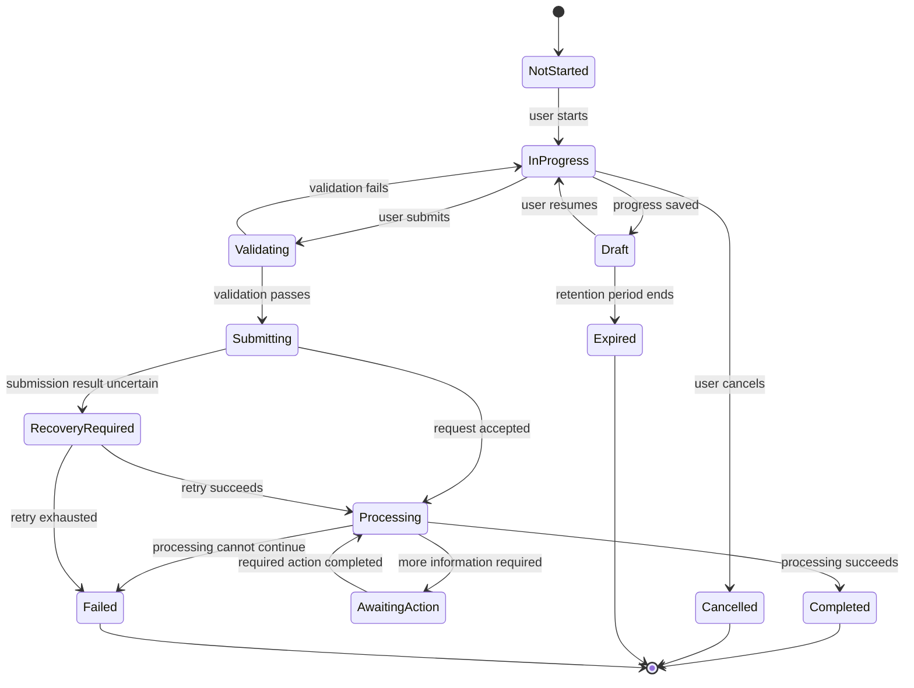

# States, Business Rules and Analytics

## Contents

- Event naming
- Event specification
- Minimum event properties
- Required flow metrics
- Analytics rules
- Recommended state categories
  - Initial
  - Active
  - Processing
  - Human dependency
  - Successful
  - Alternative outcome
  - Interrupted
  - Failure
- Transition rules
- Business rule: BR-[number]
  - Name
  - Purpose
  - Source
  - Applies to
  - Condition
  - Outcome when true
  - Outcome when false
  - Priority
  - User-facing consequence
  - Exceptions
  - Evidence or authority
  - Validation status
  - Test cases

Analytics must measure whether users can complete the intended outcome and where the flow fails.

Do not track events simply because they are easy to capture.

## Event naming

Use stable, outcome-oriented names:

```text
flow_started
step_completed
validation_failed
flow_saved
flow_resumed
permission_denied
submission_started
submission_accepted
processing_failed
retry_started
flow_cancelled
flow_completed
```

Add domain context through properties rather than creating uncontrolled event names.

## Event specification

| Event             | Trigger   | User role | Flow state | Required properties  | Success question         |
| ----------------- | --------- | --------- | ---------- | -------------------- | ------------------------ |
| flow_started      | [Trigger] | [Role]    | [State]    | flow_id, entry_point | Can users begin?         |
| validation_failed | [Trigger] | [Role]    | [State]    | rule_id, step_id     | Where are users blocked? |
| flow_completed    | [Trigger] | [Role]    | [State]    | outcome, duration    | Can users complete?      |

## Minimum event properties

- flow identifier
- flow version
- user-role category
- entry point
- current state
- previous state
- resulting state
- event timestamp
- outcome
- failure category
- validation rule identifier
- retry count
- channel
- duration where relevant

Do not capture sensitive values when identifiers or categories are sufficient.

## Required flow metrics

- start rate
- completion rate
- abandonment rate
- time to completion
- validation failure rate
- system failure rate
- retry success rate
- save-and-resume rate
- permission-denial rate
- support-contact rate
- completion by entry point
- completion by relevant user type
- alternative-outcome rate

## Analytics rules

- Connect every event to a product or research question.
- Define events before implementation.
- Distinguish user failure from system failure.
- Distinguish submission from completion.
- Track states rather than arbitrary screen views.
- Version event schemas when flow logic changes.
- Validate analytics in testing.
- Combine quantitative data with user research and support evidence.
- Define expected metric changes for every major flow hypothesis.
- Protect personal and sensitive data.

---

# 5. State catalogue

Every flow must define its possible states.

## Recommended state categories

### Initial

- unavailable
- eligible
- not started

### Active

- in progress
- draft
- awaiting input
- validating
- ready to submit

### Processing

- submitting
- queued
- processing
- retrying
- awaiting external system

### Human dependency

- awaiting review
- awaiting approval
- awaiting user response
- awaiting third party

### Successful

- accepted
- approved
- completed
- delivered

### Alternative outcome

- rejected
- ineligible
- partially completed
- superseded

### Interrupted

- paused
- expired
- cancelled
- abandoned

### Failure

- validation failed
- processing failed
- external dependency failed
- recovery required
- permanently failed

Use domain-specific names where they improve clarity.

---

# 6. State-transition table

Every flow must include a complete transition table.

| From state | Trigger | Actor | Preconditions        | Business rules   | To state   | Side effects   | Failure state     |
| ---------- | ------- | ----- | -------------------- | ---------------- | ---------- | -------------- | ----------------- |
| Draft      | Submit  | User  | Required data exists | BR-001 to BR-004 | Submitting | Create request | Validation failed |

## Transition rules

- Every state must have at least one valid entry path.
- Every non-terminal state must have an exit path.
- Terminal states must be explicitly identified.
- Invalid transitions must be rejected safely.
- Repeated transitions must be idempotent where required.
- Concurrent updates must have defined behaviour.
- Side effects must occur only after required rules pass.
- Partial side effects must have compensation or reconciliation rules.

---

# 7. Business-rule register

Business rules must be explicit, testable and independent of interface implementation.

## Business rule: BR-[number]

### Name

[Rule name]

### Purpose

[Why the rule exists]

### Source

- policy
- legal requirement
- security requirement
- validated business process
- operational constraint
- external system requirement
- assumption

### Applies to

[Flow, state, role or entity]

### Condition

[Boolean or decision condition]

### Outcome when true

[Result]

### Outcome when false

[Result]

### Priority

[Order when rules conflict]

### User-facing consequence

[What changes for the user]

### Exceptions

- [Exception]

### Evidence or authority

[Reference]

### Validation status

- Confirmed
- Proposed
- Assumed
- Deprecated

### Test cases

- Given [condition], when [event], then [outcome]
- Given [condition], when [event], then [outcome]

---

# 8. Decision table

Use a decision table when several conditions affect the result.

| Condition or outcome |   Case 1 |     Case 2 | Case 3 |  Case 4 |
| -------------------- | -------: | ---------: | -----: | ------: |
| User authorised      |      Yes |        Yes |     No |     Yes |
| Entity eligible      |      Yes |         No |    Yes |     Yes |
| Deadline valid       |      Yes |        Yes |    Yes |      No |
| Result               | Continue | Ineligible | Denied | Expired |

Do not rely on prose when a decision table communicates the logic more safely.

---

# 9. Flow diagram requirements

Produce at least one Mermaid state diagram.



Replace generic states and transitions with project-specific logic.

The diagram must include:

- start state
- successful terminal state
- alternative terminal states
- failure states
- retry loop
- cancellation
- save and resume when applicable
- human or external-system waiting states
- permission or eligibility branches

---