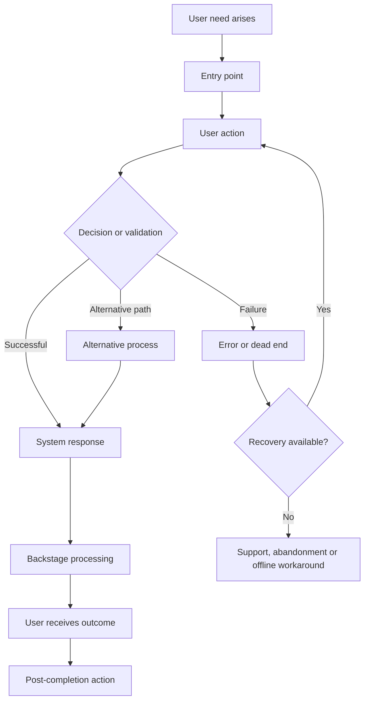

# Current Journey Problems and Service Blueprint

## Contents

- Purpose
- Current journey summary
- Current journey flow
- Problem: JP-[number]
  - Journey location
  - User affected
  - Description
  - Evidence
  - User impact
  - Root cause
  - Severity
  - Frequency
  - Existing workaround
  - Opportunity
- Transition: CT-[number]
  - From
  - To
  - Reason
  - Information transferred
  - Information lost
  - User instruction
  - Continuity
  - Problems
  - Evidence

## Purpose

The current journey documents what users experience today.

It must not describe:

- the intended process
- the documented company process when real behaviour differs
- the ideal implementation
- how stakeholders believe users behave
- an AI-generated best practice

It should reveal:

- current user behaviour
- actual service delivery
- workarounds
- repeated information
- delays
- failures
- cross-channel problems
- organisational dependencies
- differences between user types

---

## Current journey summary

| Stage   | User goal | User actions | Channel   | Frontstage response | Backstage activity | Pain points | Evidence |
| ------- | --------- | ------------ | --------- | ------------------- | ------------------ | ----------- | -------- |
| [Stage] | [Goal]    | [Actions]    | [Channel] | [Response]          | [Process]          | [Problems]  | E-[ID]   |

---

## Current journey flow



Replace this generic diagram with the project’s actual flow.

---

# 8. Current-journey problem analysis

For every problem, record:

## Problem: JP-[number]

### Journey location

[Stage and step]

### User affected

[User type]

### Description

[What goes wrong]

### Evidence

- [Evidence reference]
- [Observed behaviour or data]

### User impact

- unable to complete task
- delayed completion
- incorrect outcome
- repeated work
- avoidable support contact
- uncertainty or loss of trust
- accessibility exclusion
- increased cost
- abandonment
- other: [describe]

### Root cause

Choose one or more:

- unclear information
- missing information
- duplicate process
- incorrect ordering
- channel transition
- technical limitation
- system integration
- business rule
- organisational boundary
- staff process
- permission issue
- accessibility barrier
- external dependency
- unknown

### Severity

- **Critical:** prevents completion or creates serious harm
- **High:** many users fail or require support
- **Medium:** causes delay, confusion or repeated work
- **Low:** creates friction without preventing completion

### Frequency

- Frequent
- Occasional
- Rare
- Unknown

### Existing workaround

[How users or staff currently handle it]

### Opportunity

[Outcome that should improve, without prescribing a feature]

---

# 9. Dead-end analysis

A dead end exists when the user:

- cannot identify the next action
- cannot return to a previous step
- cannot correct an error
- is sent to an unavailable channel
- is rejected without explanation
- is told to contact an unidentified person
- reaches an external service with no continuation path
- loses entered information
- lacks required evidence without guidance
- has insufficient permission and no escalation path
- receives no outcome after submission
- cannot resume an interrupted journey

Record every dead end:

| ID     | Stage   | Cause   | Users affected | Existing outcome | Required recovery |
| ------ | ------- | ------- | -------------- | ---------------- | ----------------- |
| DE-001 | [Stage] | [Cause] | [Users]        | [What happens]   | [Recovery needed] |

---

# 10. Channel-transition analysis

Every change between channels must be evaluated.

Examples:

```text
Email → Web application
Web application → Telephone support
Mobile → Desktop
Online form → Paper evidence
Application → External payment provider
User interface → Staff review
SMS → Authentication flow
```

For each transition, record:

## Transition: CT-[number]

### From

[Channel, system or person]

### To

[Channel, system or person]

### Reason

[Why the transition occurs]

### Information transferred

[What data or context moves with the user]

### Information lost

[What the user must repeat or re-enter]

### User instruction

[How the next action is explained]

### Continuity

- Does the user know why they are moving?
- Do they know what to do next?
- Is their previous work retained?
- Is identity or authentication preserved appropriately?
- Is the destination accessible?
- Can they return?
- What happens if the other channel is unavailable?

### Problems

- [Problem]
- [Problem]

### Evidence

- [Evidence reference]

---

# 11. Backend and operational map

Create a service-blueprint layer beneath the user journey.

| Journey step | User-facing action | Application behaviour | Backend process | Staff action | External system | Policy or rule | Failure owner |
| ------------ | ------------------ | --------------------- | --------------- | ------------ | --------------- | -------------- | ------------- |
| [Step]       | [Action]           | [Behaviour]           | [Process]       | [Action]     | [System]        | [Rule]         | [Owner]       |

This layer must reveal:

- where manual work occurs
- where data is transferred
- where approvals happen
- where users wait
- where responsibilities change
- where failures can occur
- who detects failures
- who resolves failures
- whether the user is informed
- whether a fallback exists

---