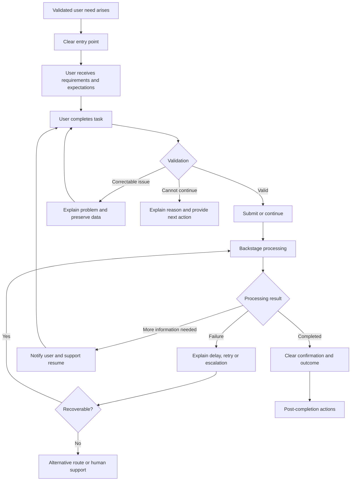

# Future Journey Mapping

## Contents

- Purpose
- Future journey summary
- Future journey flow
- Future step [number]: [Name]
  - User need supported
  - Current problem addressed
  - Proposed experience
  - User action
  - System response
  - Decision logic
  - Frontstage requirements
  - Backstage requirements
  - Channel requirements
  - Failure handling
  - Save and resume
  - Accessibility considerations
  - Measurement
  - Validation method
  - Status
- Scope
- Evidence
- User experience
- Channels
- Service delivery
- Future journey

## Purpose

The future journey describes a proposed improved experience.

It must:

- address validated current-journey problems
- connect every change to a user need
- preserve hard legal, security and contractual constraints
- challenge unnecessary soft constraints
- remove or improve dead ends
- reduce repeated work
- improve channel continuity
- define failure and recovery paths
- include backstage feasibility
- remain testable
- avoid unnecessary features

The future journey is not validated merely because it appears simpler.

It must be tested with relevant users and operational teams.

---

## Future journey summary

| Stage   | User goal | Proposed action | System response | Backstage requirement | Problem addressed | User need | Validation status |
| ------- | --------- | --------------- | --------------- | --------------------- | ----------------- | --------- | ----------------- |
| [Stage] | [Goal]    | [Action]        | [Response]      | [Requirement]         | JP-[ID]           | UN-[ID]   | Hypothesis        |

---

## Future journey flow

Replace this with the real proposed flow.

---

# 13. Future-step specification

For every proposed step, use:

## Future step [number]: [Name]

### User need supported

UN-[number]

### Current problem addressed

JP-[number]

### Proposed experience

[What should happen]

### User action

[What the user does]

### System response

[What the user sees or receives]

### Decision logic

- **If [condition]:** [result]
- **If [condition]:** [result]

### Frontstage requirements

- [Requirement]
- [Requirement]

### Backstage requirements

- [Process]
- [Staff action]
- [Integration]
- [Data requirement]

### Channel requirements

[Channels and transition behaviour]

### Failure handling

[How failures are identified, explained and recovered]

### Save and resume

[Whether and how the user can leave and return]

### Accessibility considerations

- [Interaction requirement]
- [Alternative channel or method]

### Measurement

- [Observable behaviour]
- [Completion metric]
- [Error or support metric]

### Validation method

- prototype testing
- usability testing
- technical spike
- operational review
- accessibility testing
- analytics after release
- other: [describe]

### Status

- Proposed
- Prototype tested
- Operationally reviewed
- Technically validated
- User validated
- Implemented
- Measured

---

# 14. Current-to-future traceability

Every proposed improvement must address evidence from the current journey.

| Change ID | Current problem | Evidence | User need | Proposed change | Expected outcome | Validation method |
| --------- | --------------- | -------- | --------- | --------------- | ---------------- | ----------------- |
| CH-001    | JP-001          | E-001    | UN-001    | [Change]        | [Outcome]        | Usability test    |

Reject or defer a proposed change when:

- it solves no documented journey problem
- it connects to no validated user need
- it adds complexity without improving an outcome
- it only reflects stakeholder preference
- it hides a backstage problem instead of fixing it
- it creates a new channel break
- it removes a necessary recovery path
- operational teams cannot deliver it
- technical feasibility is unknown and untested

---

# 15. Journey quality review

## Scope

- Does the journey begin when the user need arises?
- Does it end when the outcome is complete?
- Does it cover the wider goal rather than only the application?
- Are journey boundaries explicit?

## Evidence

- Is the current journey based on real behaviour?
- Are important findings linked to evidence?
- Are assumptions labelled?
- Are different user types represented?

## User experience

- Are user goals clear at every stage?
- Are decisions and alternative paths visible?
- Are waiting periods documented?
- Are pain points and workarounds included?
- Are dead ends documented?
- Are post-completion actions included?

## Channels

- Are all online and offline touchpoints included?
- Are channel transitions visible?
- Is information preserved between channels?
- Can users recover when a channel is unavailable?

## Service delivery

- Are frontstage and backstage activities connected?
- Are manual processes visible?
- Are staff and external systems included?
- Are business rules and dependencies documented?
- Is ownership of failures clear?

## Future journey

- Does every improvement address a validated problem?
- Does every change connect to a user need?
- Are failure and recovery paths designed?
- Is backstage delivery feasible?
- Are proposed changes labelled as hypotheses?
- Is there a validation method for each significant change?

---

# 16. Required outputs from the UX agent

For every journey-mapping task, produce:

1. Journey boundaries
2. Users and roles
3. Current journey stages
4. Detailed current journey steps
5. Current Mermaid flow diagram
6. Frontstage and backstage service blueprint
7. Online and offline touchpoints
8. Channel-transition analysis
9. Systems and people involved
10. Required information and evidence
11. Pain points and workarounds
12. Dead ends
13. Failure and recovery paths
14. Current-journey evidence gaps
15. Proposed future journey
16. Future Mermaid flow diagram
17. Current-to-future traceability
18. Operational and technical dependencies
19. Risks and assumptions
20. Validation plan

---

# 17. Agent operating rules

When using this document:

- map the current journey before proposing the future journey
- begin with the user need, not the application
- map until the user’s complete outcome is reached
- do not treat existing documentation as proof of actual behaviour
- do not invent user actions, evidence or operational processes
- clearly distinguish facts, assumptions and proposals
- include online, offline and staff-facing interactions
- include waiting periods and what users know while waiting
- include backend processes and service ownership
- show decisions, alternative paths and failure paths
- show where users change channels or systems
- identify information lost during transitions
- expose dead ends rather than hiding them
- include recovery, escalation and human-support routes
- connect every future change to a current problem and user need
- preserve hard constraints but challenge soft constraints
- test future journeys with users before treating them as validated
- keep both current and future maps updated as evidence changes

---

# 18. Source basis

This operating document is based on GOV.UK guidance that recommends:

- mapping what users do, think and experience from when they begin needing a service until they stop using it
- mapping interdependencies between teams and related services
- documenting online and offline touchpoints
- documenting backend processes and the people involved
- documenting evidence users must provide
- identifying dead ends and broken channel transitions
- creating an improved journey around user logic
- designing services end-to-end, front-to-back and across channels
- maintaining and iterating service blueprints as the service evolves