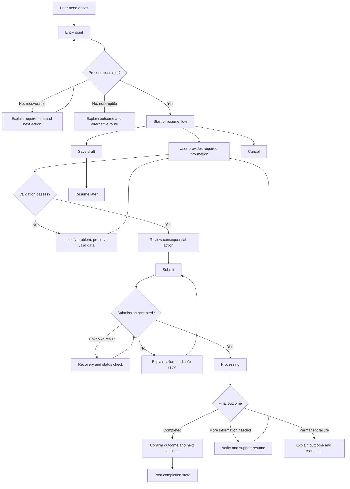

# Output: Evidence, Users and Journeys

## Contents

- Evidence register
- Evidence-strength rules
  - Strong
  - Medium
  - Weak
- Evidence limitations
- Evidence-to-decision traceability
- Assumption register
- Unknown register
- Contradictions
- Rules
- User and actor register
- Role involvement by journey stage
- Permission matrix
- Permission-state rules
- Permission denial outcomes
- User-need register
  - User need: UN-[number]
  - Evidence
  - Current method
  - Current problem
  - Success outcome
  - Priority
  - Validation status
- User-need quality rules
- Need-to-flow traceability
- Journey boundaries
- Current journey summary
- Current backstage process
- Current journey problems
  - Journey problem: JP-[number]
- Current dead ends
- Current channel transitions
- Proposed journey statement
- Design principles for this journey
- Proposed journey summary
- Proposed change register
  - Change: CH-[number]
- Current-to-future traceability
- Future journey status

## Evidence register

| ID | Type | Source | User or role | Finding | Related section | Strength | Date |
|---|---|---|---|---|---|---|---|
| E-001 | Interview / analytics / ticket / observation | [Source] | [Role] | [Finding] | UN-001, JP-001 | Strong / Medium / Weak | YYYY-MM-DD |

## Evidence-strength rules

### Strong

Use when:

- behaviour was repeatedly observed
- several relevant users reported the same issue
- qualitative and quantitative evidence agree
- operational evidence consistently confirms the behaviour
- a formal requirement is authoritative and current

### Medium

Use when:

- evidence comes from a small but relevant sample
- analytics show behaviour but not motivation
- support patterns are consistent but incomplete
- only one evidence method supports the finding

### Weak

Use when:

- one isolated report exists
- evidence is indirect
- the source may not represent the target users
- evidence is old or contextually different
- the finding comes from competitor behaviour
- the finding is a stakeholder interpretation

## Evidence limitations

Explicitly state:

- missing user groups
- outdated evidence
- analytics blind spots
- sample limitations
- conflicting evidence
- unavailable operational data
- unverified technical claims

## Evidence-to-decision traceability

| Decision | Evidence used | Evidence missing | Confidence |
|---|---|---|---|
| [Decision] | E-001, E-003 | [Gap] | High / Medium / Low |

---

# 5. Assumptions and unknowns

## Assumption register

| ID | Assumption | Origin | Why needed | Risk if wrong | Affected flow areas | Validation method | Status |
|---|---|---|---|---|---|---|---|
| A-001 | [Assumption] | Stakeholder / inference / technical team | [Reason] | High / Medium / Low | [Sections] | [Method] | Open / Confirmed / Rejected |

## Unknown register

| ID | Unknown | Why it matters | Decision blocked | Owner | Resolution method | Priority |
|---|---|---|---|---|---|---|
| U-001 | [Unknown] | [Impact] | [Decision] | [Role] | [Research, policy or technical investigation] | Critical / High / Medium / Low |

## Contradictions

When sources conflict, document:

| Topic | Source A | Source B | Impact | Resolution needed |
|---|---|---|---|---|
| [Topic] | [Claim] | [Conflicting claim] | [Flow effect] | [Method] |

## Rules

- Do not hide uncertainty in confident prose.
- Do not convert an assumption into a recommendation without labelling it.
- High-risk assumptions must appear in the final risks and research sections.
- Critical unknowns may block implementation readiness.

---

# 6. Users, roles and permissions

## User and actor register

| Role | Description | Primary goals | Frequency | Experience | Constraints | Related needs |
|---|---|---|---|---|---|---|
| [Role] | [Description] | [Goals] | [Frequency] | [Level] | [Constraints] | UN-001 |

Include:

- primary users
- secondary users
- administrators
- support staff
- reviewers
- approvers
- external parties
- automated systems
- users with limited permissions
- users requiring assisted support

## Role involvement by journey stage

| Stage | Primary actor | Supporting actor | System actor | Responsibility |
|---|---|---|---|---|
| [Stage] | [Role] | [Role] | [System] | [Responsibility] |

## Permission matrix

| Action | Role A | Role B | Role C | Conditions | Server-side enforcement |
|---|---|---|---|---|---|
| View | Allowed | Scoped | Denied | [Condition] | Required |
| Create | Allowed | Denied | Allowed | [Condition] | Required |
| Edit | Own only | All | Denied | [Condition] | Required |
| Submit | Allowed | Allowed | Denied | [Condition] | Required |
| Approve | Denied | Allowed | Denied | [Condition] | Required |
| Cancel | Conditional | Allowed | Denied | [Condition] | Required |

## Permission-state rules

Specify:

- authentication requirements
- account status requirements
- entity ownership
- organisation scope
- role scope
- entity-state restrictions
- separation-of-duty rules
- delegated access
- temporary permissions
- permission changes during an active flow
- behaviour when access is removed
- audit requirements
- information shown when an action is denied

## Permission denial outcomes

For each denial, state:

- whether the entity remains visible
- what explanation can safely be shown
- whether escalation is possible
- whether another role can continue
- whether work is retained
- whether an event is logged

---

# 7. User needs

## User-need register

### User need: UN-[number]

**As a:** [specific user type]

**When:** [trigger or context]

**I need to:** [complete task or resolve problem]

**So that:** [meaningful outcome]

**Because:** [constraint, when relevant]

### Evidence

- E-[number]

### Current method

[What happens today]

### Current problem

[Barrier or pain point]

### Success outcome

[Observable outcome]

### Priority

Critical / Important / Supporting

### Validation status

Validated / Partially validated / Assumed / Rejected

## User-need quality rules

Each need must:

- describe a problem or outcome
- avoid naming a feature
- connect to evidence
- identify a relevant user type
- remain valid if the implementation changes
- be specific enough to guide flow design

## Need-to-flow traceability

| User need | Journey stages | Flow sections | Proposed changes | Acceptance criteria |
|---|---|---|---|---|
| UN-001 | [Stages] | [Sections] | CH-001 | AC-001 |

---

# 8. Current journey

## Journey boundaries

- **Trigger:** [What begins the journey]
- **Start:** [First meaningful step]
- **End:** [Complete user outcome]
- **Primary user:** [Role]
- **Channels:** [Channels]
- **Dependencies:** [People or systems]

## Current journey summary

| Stage | User goal | User action | System response | Other actors | Channel | Pain point | Evidence |
|---|---|---|---|---|---|---|---|
| [Stage] | [Goal] | [Action] | [Response] | [Actors] | [Channel] | JP-001 | E-001 |

## Current backstage process

| User step | Frontstage response | Backend process | Staff action | External system | Wait time | Failure owner |
|---|---|---|---|---|---|---|
| [Step] | [Response] | [Process] | [Action] | [System] | [Time] | [Owner] |

## Current journey problems

### Journey problem: JP-[number]

- **Stage:** [Stage]
- **Affected users:** [Users]
- **Observed problem:** [Problem]
- **Evidence:** E-[number]
- **Frequency:** Frequent / Occasional / Rare / Unknown
- **Impact:** [Impact]
- **Workaround:** [Current workaround]
- **Root cause:** [Cause]
- **Severity:** Critical / High / Medium / Low

## Current dead ends

| ID | Stage | Cause | Result | Existing recovery | Required improvement |
|---|---|---|---|---|---|
| [ID] | [Stage] | [Cause] | [Outcome] | [Recovery] | [Need] |

## Current channel transitions

| From | To | Reason | Context preserved | Information repeated | Failure risk |
|---|---|---|---|---|---|
| [Channel] | [Channel] | [Reason] | Yes / Partial / No | [Data] | [Risk] |

---

# 9. Proposed journey

## Proposed journey statement

Summarise how the future journey improves the outcome without describing visual styling.

## Design principles for this journey

Examples:

- reveal known blockers early
- preserve progress
- prevent duplicate consequential actions
- communicate processing states
- provide recovery before escalation
- retain context across authentication
- make valid alternative outcomes explicit
- avoid unnecessary channel changes

## Proposed journey summary

| Stage | User goal | Proposed action | System response | Decision | Backstage requirement | Problem addressed | User need |
|---|---|---|---|---|---|---|---|
| [Stage] | [Goal] | [Action] | [Response] | [Decision] | [Requirement] | JP-001 | UN-001 |

## Proposed change register

### Change: CH-[number]

- **Current problem:** JP-[number]
- **User need:** UN-[number]
- **Proposed behaviour:** [Behaviour]
- **Business rules:** BR-[number]
- **Expected outcome:** [Outcome]
- **Risks introduced:** [Risks]
- **Validation method:** [Method]
- **Analytics events:** EV-[number]
- **Acceptance criteria:** AC-[number]
- **Status:** Proposed / Tested / Validated / Approved

## Current-to-future traceability

| Current issue | Evidence | Proposed change | Expected outcome | Validation |
|---|---|---|---|---|
| JP-001 | E-001 | CH-001 | [Outcome] | [Method] |

## Future journey status

Explicitly state:

- which parts are validated
- which parts remain hypotheses
- which depend on unresolved business decisions
- which require technical feasibility testing
- which require operational approval

---

# 10. Mermaid flow diagram

Every analysis must include at least one Mermaid diagram.

Use:

- `flowchart` for task and decision flow
- `stateDiagram-v2` for entity state transitions
- `sequenceDiagram` only when actor/system timing is central

## Required flowchart content

The diagram must show:

- trigger
- entry point
- precondition checks
- primary actions
- decisions
- happy path
- alternative outcomes
- validation failures
- system failures
- recovery loops
- cancellation
- save and resume when applicable
- waiting states
- completion
- post-completion action

## Example structure

## Diagram-quality rules

- Use domain-specific labels.
- Do not hide complex decisions inside one node.
- Do not show only the happy path.
- Keep user and system actions distinguishable.
- Ensure every non-terminal state has an exit.
- Ensure terminal states are explicit.
- Make retry loops finite or governed by a rule.
- Keep diagram logic consistent with decision tables and acceptance criteria.

---