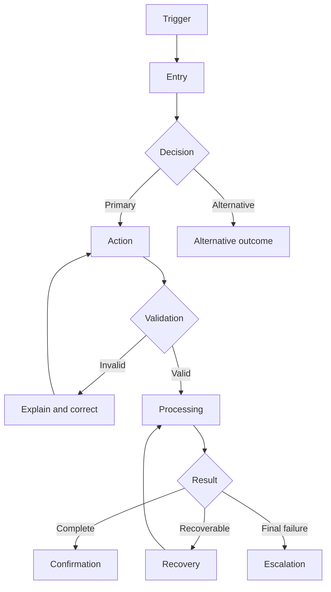

# Journey Map

## Boundaries
Journey:  
Primary user:  
Related users:  
Trigger:  
Outcome:  
Start:  
End:  
Needs:  
Channels:  
Exclusions:  

## Current journey
| Stage | Goal | User action | System response | Actors | Channel | Backstage | Wait | Pain point | Evidence |
|---|---|---|---|---|---|---|---|---|---|

## Problems
| ID | Stage | Problem | Impact | Root cause | Severity | Evidence |
|---|---|---|---|---|---|---|

## Dead ends and channel transitions
| ID | Type | From/location | To | Lost context | Recovery |
|---|---|---|---|---|---|

## Service blueprint
| Step | User | Frontstage | Backstage | Staff | External system | Rule | Owner |
|---|---|---|---|---|---|---|---|

## Future journey
| Stage | Goal | Behaviour | Response | Decision | Backstage | Problem | Need |
|---|---|---|---|---|---|---|---|

## Change traceability
| Change | Problem | Evidence | Need | Outcome | Validation |
|---|---|---|---|---|---|

## Mermaid

