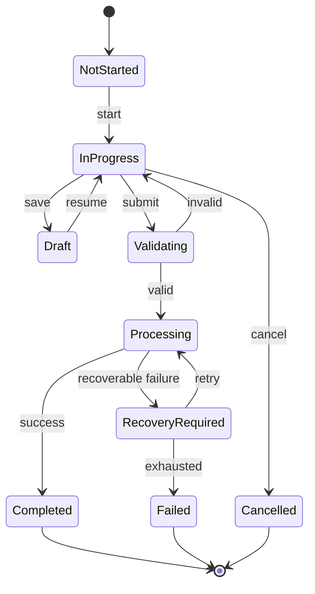

# State Model

## State catalogue
| ID | State | Meaning | Terminal |
|---|---|---|---|

## State: ST-001
Purpose:  
Entry conditions:  
Actor context:  
Information:  
Actions:  
System behaviour:  
Rules:  
Persisted data:  
Side effects:  
Exit transitions:  
Failures:  
Accessibility:  
Analytics:  

## Transitions
| From | Trigger | Actor | Preconditions | Rules | To | Side effects | Failure |
|---|---|---|---|---|---|---|---|

## Mermaid

