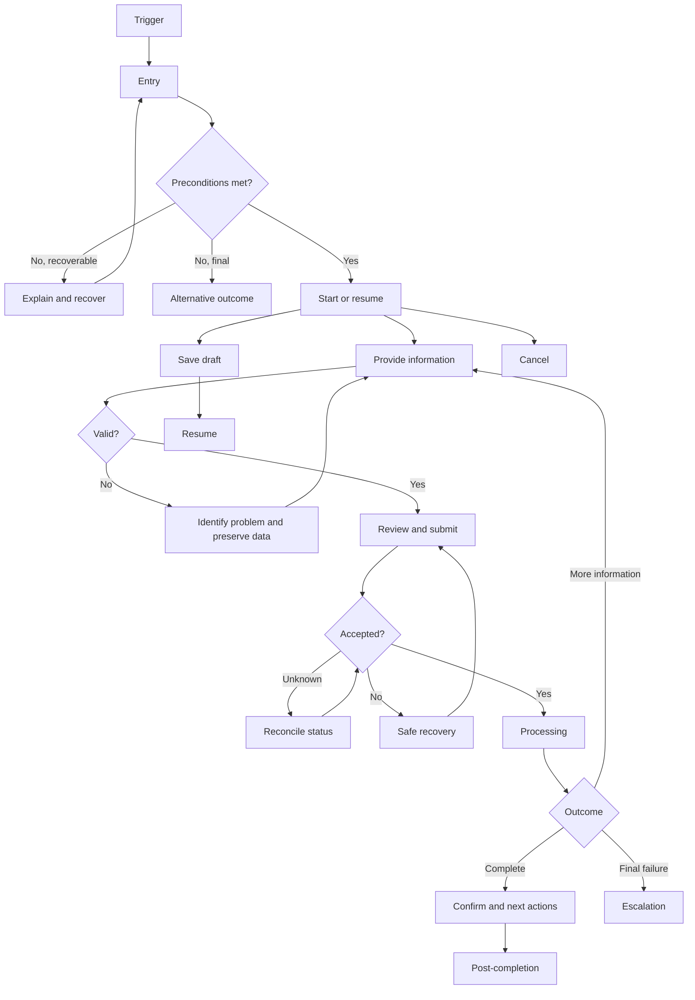

# UX Flow Specification

## Document control
| Field | Value |
|---|---|
| Project | |
| Flow/service | |
| Version | |
| Status | Draft / Review / Validated / Approved |
| Date | |
| Evidence sources | |
| Owner | |
| Reviewers | |

## Executive flow summary
- Primary user:
- Goal:
- Current problem:
- Proposed change:
- Main decisions:
- Completion state:
- Highest-risk failure:
- Accessibility risk:
- Evidence gap:
- Next validation:

## Problem and desired outcome
### Problem statement
[User, context, evidence-backed barrier, impact]

### Desired user outcome
[Complete outcome]

### Desired service outcome
[Outcome]

### Scope
**In scope**
- [Item]

**Out of scope**
- [Item and continuation]

### Success definition
- [Observable outcome]

## Available evidence
| ID | Type | Source | User/role | Finding | Strength | Date |
|---|---|---|---|---|---|---|

## Assumptions and unknowns
### Assumptions
| ID | Assumption | Origin | Risk | Affected decision | Validation | Status |
|---|---|---|---|---|---|---|

### Unknowns
| ID | Unknown | Impact | Decision blocked | Resolution | Priority |
|---|---|---|---|---|---|

## Users, roles and permissions
### Users
| Role | Goal | Responsibility | Constraints | Needs |
|---|---|---|---|---|

### Permissions
| Action | Role A | Role B | Conditions | Enforcement |
|---|---|---|---|---|

## User needs
### UN-001
**As a:**  
**When:**  
**I need to:**  
**So that:**  

Evidence:  
Success:  
Priority:  
Status:  

## Current journey
| Stage | Goal | Action | Response | Actors | Backstage | Pain point | Evidence |
|---|---|---|---|---|---|---|---|

## Proposed journey
| Stage | Goal | Behaviour | Response | Decision | Backstage | Problem | Need |
|---|---|---|---|---|---|---|---|

## Mermaid flow diagram

## Screen/state sequence
| Step | State | Goal | Entry condition | Information | Actions | System behaviour | Exit |
|---|---|---|---|---|---|---|---|

## State-transition table
| From | Trigger | Actor | Preconditions | Rules | To | Side effects | Failure |
|---|---|---|---|---|---|---|---|

## Business-rule decision table
| Condition/result | Case 1 | Case 2 | Case 3 | Case 4 |
|---|---:|---:|---:|---:|
| [Condition] | | | | |
| Result | | | | |

## Loading, empty, error and recovery states
### Loading
| ID | Trigger | Duration | User action | Status | Timeout | Exit |
|---|---|---|---|---|---|---|

### Empty
| ID | Cause | Meaning | Action | Permission consideration |
|---|---|---|---|---|

### Validation
| ID | State | Rule | Problem | Correction | Data retained |
|---|---|---|---|---|---|

### System failure
| ID | Failure | Result certainty | Data saved | Retry safe | Recovery | Owner |
|---|---|---|---|---|---|---|

## Edge cases
| ID | Scenario | Trigger | Expected behaviour | Rule | Recovery | Criteria |
|---|---|---|---|---|---|---|

## Accessibility review
| ID | Criterion | State | Problem/status | Required behaviour | Severity | Test |
|---|---|---|---|---|---|---|

## Heuristic review
| ID | Heuristic | State | Finding | Severity | Required behaviour |
|---|---|---|---|---:|---|

## Analytics events
| ID | Event | Trigger | State change | Properties | Question |
|---|---|---|---|---|---|

## Acceptance criteria
### AC-001
**Given**  
**When**  
**Then**  
**And**

## Questions requiring user research
| ID | Question | Decision | Users | Method | Priority |
|---|---|---|---|---|---|

## Risks and dependencies
### Risks
| ID | Risk | Likelihood | Impact | Mitigation | Owner |
|---|---|---|---|---|---|

### Dependencies
| ID | Dependency | Owner | Required by | Failure effect | Fallback |
|---|---|---|---|---|---|

## Implementation readiness
Ready for prototyping / technical design / implementation / conditionally ready / not ready

### Blockers
- [Blocker]

## Final recommendations
### Must resolve before implementation
- [Item]

### Must validate during prototyping
- [Item]

### Can iterate after release
- [Item]

### Rejected or deferred
- [Item and reason]
