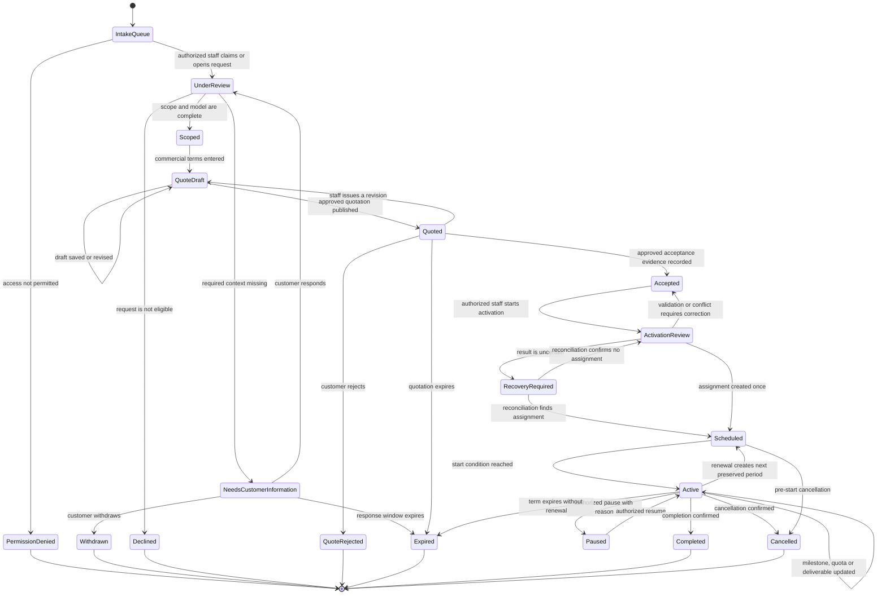

# UX Flow Specification

## Document control

| Field | Value |
|---|---|
| Project | Unixsee Admin Panel |
| Flow or service | Administrator complementary-service management |
| Version | 0.1 |
| Status | Draft |
| Date | 2026-08-07 |
| Prepared from | `docs/product/phase-1-application-features.md`, current admin routes and navigation, project architecture and frontend rules |
| Primary owner | Product and operations |
| Reviewers required | Product, commercial operations, service-delivery leads, engineering, QA, accessibility, security |

> **Canonical updates live under**
> [`docs/product/ux-flows/`](../../../../docs/product/ux-flows/).
> Staff create-and-attach (client-form-aligned):
> [`admin-create-complementary-service-assignment.md`](../../../../docs/product/ux-flows/admin-create-complementary-service-assignment.md).

## Confidence summary

| Area | Confidence | Reason |
|---|---|---|
| User needs | Medium | Derived from documented staff outcomes; no direct staff research is available |
| Current journey | High | The route and navigation were inspected; the destination is a placeholder |
| Business rules | Medium | Core lifecycle rules are documented, but approval, pricing and renewal policies remain open |
| Proposed journey | Medium | It traces to the Phase 1 specification but has not been tested with staff |
| Accessibility | Medium | Requirements are based on project rules and WCAG-oriented expert review, not usability testing |
| Measurement plan | Low | Events are proposed; baselines and analytics ownership are unknown |

## Executive flow summary

- **Primary user:** Authorized intake, commercial or service-delivery staff member.
- **Goal:** Turn a customer request into an agreed, activated and traceable service assignment, then manage delivery through its terminal state.
- **Current problem:** The admin navigation exposes complementary services, but the route contains no operational workflow.
- **Proposed change:** Provide one contextual workflow spanning intake, review, scoping, quotation, acceptance, activation, delivery and lifecycle management.
- **Main decisions:** Keep requests and assignments distinct; preserve quotation revisions; require state-valid actions; show customer-visible and internal information separately.
- **Completion state:** The assignment is completed, cancelled or expired with its history retained; activation is an intermediate outcome.
- **Highest-risk failure:** Duplicate activation or an unauthorized price, scope, quota or lifecycle change.
- **Accessibility risk:** Dynamic status, validation and queue updates may be invisible to keyboard or screen-reader users.
- **Evidence gap:** No staff interviews, workflow observation, support evidence or analytics exist.
- **Next validation:** Prototype the intake-to-activation path with commercial and delivery staff before technical design.

## Problem and desired outcome

### Problem statement

Authorized staff cannot currently qualify and deliver a complementary-service request in the admin panel because the destination is a placeholder. The intended workflow also spans several roles and waiting periods, creating risk of lost context, duplicate activation, invisible customer commitments and unaudited changes if it is represented as a simple edit form.

### Desired user outcome

Staff can understand what requires action, make only authorized and state-valid decisions, preserve customer and commercial context, and move each request into exactly one traceable assignment with clear ownership and next actions.

### Desired service outcome

Unixsee can operate complementary services consistently while preserving quotation history, acceptance evidence, delivery progress, customer-visible communication and auditability.

### Why this matters now

- Complementary services are a Phase 1 core capability and a revenue source.
- The administrator experience is required to produce and maintain the records customers will see.
- The current route creates a dead end and cannot support the documented end-to-end outcome.

### Scope

#### In scope

- Intake queues for submitted requests and waiting work.
- Customer, tenant, website and request context.
- Ownership and specialist assignment.
- Structured requests for customer information.
- Scope, exclusions and commercial-model definition.
- Versioned quotation preparation and publication.
- Recording an approved acceptance outcome.
- Controlled conversion into exactly one active assignment.
- Quota, milestone, deliverable, customer-visible activity and internal-note updates.
- Pause, renewal, completion, cancellation and expiry workflows.
- Operational revenue classification: estimated, quoted, agreed and realized.
- Loading, empty, permission, stale, conflict, failure and recovery states.
- Persian RTL and equivalent English LTR behavior.

#### Out of scope

- Customer self-service payment, refunds, dunning and accounting-grade invoicing; these are deferred in Phase 1.
- Final API, DTO, database and event contracts; architecture decisions own them.
- Final administrator role names; this specification uses capability-based role labels.
- Service-family-specific business rules not approved in the product specification.
- Visual styling, component selection and layout polish.

### Success definition

- Staff can progress an eligible request without an offline workaround.
- Every actionable record has an owner, state, next action and relevant deadline.
- One accepted request creates at most one assignment.
- Quotation revisions and acceptance evidence remain discoverable.
- Customer-visible content is distinguishable from internal content before publication.
- Every price, scope, quota, owner and lifecycle change is represented as auditable.
- Keyboard and screen-reader users can complete and recover from the same workflows.

## Available evidence

| ID | Type | Source | User/role | Finding | Strength | Date |
|---|---|---|---|---|---|---|
| E-001 | Documented product requirement | `docs/product/phase-1-application-features.md`, section 16 | Staff and customers | Defines service families, commercial models, request and assignment lifecycles, administrator outcomes and acceptance criteria | Medium | 2026-08-07 |
| E-002 | Implementation inspection | `src/app/complementary-services/page.tsx` | Administrator | The destination contains only a heading and no workflow | Strong | 2026-08-07 |
| E-003 | Implementation inspection | `src/components/app-sidebar.tsx` | Administrator | “خدمات تکمیلی” is a primary navigation destination; a duplicate configuration also exists in `src/lib/data/sidebar-data.tsx` | Strong | 2026-08-07 |
| E-004 | Architecture constraint | `docs/architecture/project.md` | Engineering | The current implementation phase is static UI only; backend integration is excluded | Strong | 2026-08-07 |
| E-005 | Locale constraint | `docs/frontend/styling.md` | All administrators | The application is Persian and RTL-first | Strong | 2026-08-07 |
| E-006 | Implementation inspection | `src/lib/data/tickets-data.ts` and `src/components/tickets/` | Support staff | The four service-family names exist only as ticket categories; no complementary-service request, quotation or assignment model exists | Strong | 2026-08-07 |

No user interviews, workflow observations, support records, usability tests or analytics were provided. E-001 is an approved-looking product document marked **Proposed**, not direct user research.

## Assumptions and unknowns

### Assumptions

| ID | Assumption | Origin | Risk | Affected decision | Validation | Status |
|---|---|---|---|---|---|---|
| A-001 | Intake, commercial review and delivery may be performed by different staff | Inference from assignment requirements | Medium | Ownership, handoff and permissions | Observe current operations and interview staff | Unvalidated |
| A-002 | Long scoping and quotation work requires server-side drafts | Inference from task complexity | Medium | Save and resume | Prototype interruption scenarios | Unvalidated |
| A-003 | Customer acceptance is recorded by staff or an approved external process in Phase 1 | Product specification leaves method open | High | Quoted-to-accepted transition | Product and legal decision | Unvalidated |
| A-004 | In-app notifications are the minimum durable channel for staff tasks | Existing application capability | Medium | Notification design | Confirm operations policy | Unvalidated |

### Unknowns

| ID | Unknown | Impact | Decision blocked | Resolution | Priority |
|---|---|---|---|---|---|
| U-001 | Final capability bundles and separation-of-duty rules | Unauthorized commercial or activation actions | Final permission matrix | Security/product decision | Critical |
| U-002 | Approved quotation acceptance method and evidence | Acceptance may be legally or operationally invalid | Accepted transition | Product/legal decision | Critical |
| U-003 | Pricing, discount and approval thresholds | Incorrect commitments | Quote publication | Commercial policy | Critical |
| U-004 | Quota overage and carryover rules | Invalid usage updates | Quota behavior | Product/commercial decision | High |
| U-005 | Renewal policy and notice periods | Missed renewals or accidental continuation | Renewal transitions | Commercial policy | High |
| U-006 | Attachment storage, scanning and retention | Unsafe or inaccessible evidence | Attachment workflow | Security/architecture decision | High |
| U-007 | Notification channels, reminders and escalation timing | Tasks may stall | Notification behavior | Operations decision | Medium |
| U-008 | Concurrent-edit conflict policy | Staff changes may overwrite each other | Save and update behavior | Technical design | High |
| U-009 | Audit retention and export policy | Incomplete operational evidence | Post-completion history | Security/legal decision | Medium |

## Users, roles and permissions

### Users

| Role | Goal | Responsibility | Constraints | Needs |
|---|---|---|---|---|
| Intake staff | Qualify new and waiting requests | Review context, assign owner, request information | Must not make unapproved commercial commitments | Prioritized queue and clear next action |
| Commercial reviewer | Produce an approvable offer | Define scope, exclusions, model, terms and revisions | Thresholds and approval method are unknown | Complete context and preserved revision history |
| Delivery specialist | Deliver agreed work | Maintain milestones, quota, deliverables and blockers | Cannot silently change accepted scope | Clear agreement and update rules |
| Operations manager | Control lifecycle and exceptions | Activate, pause, renew, complete or cancel where authorized | High-impact actions require reason and audit | Risk-proportionate confirmation and history |
| Read-only auditor | Inspect decisions and history | Review records without mutation | Must not expose customer-invisible data outside scope | Immutable chronological evidence |
| Customer | Provide information and accept or reject an offer | Acts outside the admin panel but changes admin state | Must see only customer-visible content | Truthful status and next action |

Role names are descriptive placeholders. Enforcement must use approved capabilities rather than these labels.

### Permissions

| Action | Intake | Commercial | Delivery | Operations | Auditor | Conditions and enforcement |
|---|---:|---:|---:|---:|---:|---|
| View request/assignment | Limited | Limited | Assigned scope | Authorized scope | Read only | Server checks capability and entity scope |
| Assign owner/specialist | Yes | Yes | No | Yes | No | State must permit reassignment; audit change |
| Request customer information | Yes | Yes | Assigned only | Yes | No | Content must be customer-visible |
| Edit scope/quotation draft | No | Yes | Suggest only | Yes | No | Lock accepted versions; preserve revisions |
| Publish quotation | No | Capability required | No | Capability required | No | Required terms complete; approval threshold satisfied |
| Record acceptance | No | Capability required | No | Capability required | No | Approved evidence method required |
| Activate assignment | No | Limited | No | Capability required | No | Accepted request and complete configuration |
| Update quota/milestones | No | No | Assigned only | Yes | No | Active or paused rules; accepted scope retained |
| Pause/complete/cancel/renew | No | Limited | Limited | Capability required | No | Valid state, reason and effect date required |
| View audit history | Limited | Limited | Limited | Yes | Yes | Sensitive fields filtered by capability |

## User needs

### UN-001 — Find and prioritize actionable work

**As an** intake or operations staff member, **when** customer requests or waiting tasks exist, **I need to** identify what requires action and why **so that** requests do not stall or miss commitments.

- Evidence: E-001.
- Success: Actionable requests can be filtered by tenant, website, service, owner, state, due date and renewal risk.
- Priority: Critical.
- Status: Partially validated by documented requirement; no user research.

### UN-002 — Produce a controlled customer commitment

**As a** commercial reviewer, **when** a request has enough information, **I need to** define and revise scope, exclusions, commercial terms and delivery expectations **so that** the customer can make an informed decision and prior offers remain traceable.

- Evidence: E-001.
- Success: Each published quotation is immutable as a version and acceptance refers to one exact version.
- Priority: Critical.
- Status: Partially validated.

### UN-003 — Activate the agreed work safely

**As an** authorized operations user, **when** the customer has accepted an approved quotation, **I need to** create the delivery assignment once with its complete agreement context **so that** delivery starts without duplication or lost history.

- Evidence: E-001.
- Success: Exactly one assignment is linked to the accepted request and quotation.
- Priority: Critical.
- Status: Partially validated.

### UN-004 — Maintain truthful delivery progress

**As a** delivery specialist, **when** work progresses or becomes blocked, **I need to** record meaningful milestones, deliverables or quota usage and the next required action **so that** staff and customers understand actual delivery state.

- Evidence: E-001.
- Success: Progress derives from milestones or quota records, not an unsupported percentage.
- Priority: Critical.
- Status: Partially validated.

### UN-005 — Resolve lifecycle changes with evidence

**As an** operations manager or auditor, **when** an assignment is paused, renewed, completed, cancelled or expires, **I need to** know who changed it, why, when it took effect and what happened to prior terms **so that** the service remains supportable and auditable.

- Evidence: E-001.
- Success: Prior periods and material history are preserved.
- Priority: Important.
- Status: Partially validated.

## Current journey

| Stage | Goal | Action | Response | Actors | Backstage | Pain point | Evidence |
|---|---|---|---|---|---|---|---|
| Discover | Open complementary services | Select “خدمات تکمیلی” in primary navigation | Route opens | Administrator | Route resolution | None observed at entry | E-003 |
| Orient | Understand work requiring action | Read destination | Only an English heading is shown | Administrator | None | JP-001: no queue, state, guidance or next action | E-002 |
| Act | Review or progress a request | Attempt to select or create work | No action exists | Administrator | None | JP-002: complete operational dead end | E-002 |
| Continue elsewhere | Finish the task | Unknown | Unknown | Staff/customer | Likely offline or not implemented | JP-003: current method and workaround are unknown | Evidence gap |

## Proposed journey

| Stage | Goal | Behaviour | Response | Decision | Backstage | Problem | Need |
|---|---|---|---|---|---|---|---|
| 1. Intake | Find actionable request | Filter or open prioritized request | Shows state, age, owner, tenant, website and next action | Is user permitted? | Scope authorization | JP-001 | UN-001 |
| 2. Review | Determine completeness | Inspect customer answers, attachments and related services | Distinguishes missing, internal and customer-visible information | Enough information? | Attachment safety checks | JP-002 | UN-001 |
| 3. Clarify | Obtain missing evidence | Send structured information request | State becomes `needs_customer_information` | Customer responds or request ends | Durable notification and response | JP-002 | UN-002 |
| 4. Scope | Define offer | Record included/excluded scope and commercial model | Validates model-specific terms | Does policy require approval? | Policy evaluation | JP-002 | UN-002 |
| 5. Quote | Publish controlled offer | Review and publish a quotation version | State becomes `quoted`; version is retained | Customer accepts, rejects or quote expires | Customer delivery channel | JP-002 | UN-002 |
| 6. Accept | Record decision | Verify acceptance evidence against exact version | State becomes `accepted` or terminal alternative | Evidence valid? | Audit acceptance | JP-002 | UN-003 |
| 7. Activate | Start agreed service | Review assignment configuration and confirm activation | Exactly one linked assignment is created | All activation preconditions met? | Idempotent creation | JP-002 | UN-003 |
| 8. Deliver | Maintain truthful progress | Record milestone, quota, deliverable, blocker or note | Updates assignment and permitted customer activity | Within accepted scope? | Audit and notify | JP-002 | UN-004 |
| 9. Resolve lifecycle | Close or continue service | Pause, renew, complete, cancel or allow expiry | Reason, effect date and next state are recorded | Transition valid? | Preserve periods/history | JP-002 | UN-005 |
| 10. Re-enter | Review durable record | Reopen request or assignment | Shows history, current state and available actions | Any action remains? | Retrieve audit and related records | JP-002 | UN-005 |

## Mermaid flow diagram

## Screen/state sequence

| Step | State | Goal | Entry condition | Information | Actions | System behaviour | Exit |
|---|---|---|---|---|---|---|---|
| S-01 | Queue ready | Choose work | Authorized route entry | Counts, filters, owner, state, age, next action | Filter, claim, open | Applies capability scope | Request selected |
| S-02 | Under review | Understand request | Request selected | Customer, website, request, duplicates, attachments, history | Assign, request information, scope, decline | Records assignment and viewed version | Clarify, scope or terminal state |
| S-03 | Awaiting customer | Track dependency | Information request sent | Requested items, sent time, due policy, response state | Remind if allowed, cancel request | Keeps staff task waiting | Response, withdrawal or expiry |
| S-04 | Scope/quote draft | Prepare commitment | Sufficient information | Scope, exclusions, model-specific terms, internal notes | Save, review, submit/publish | Validates and versions draft | Draft or quoted |
| S-05 | Quoted | Await customer decision | Quote published | Exact version, validity, delivery state | Revise, record decision | Locks published version | Accepted or terminal alternative |
| S-06 | Activation review | Prevent invalid start | Accepted exact quote | Tenant, website, owner, terms, dates, progress model | Confirm activation | Revalidates and creates once | Scheduled/active or correction |
| S-07 | Assignment active | Deliver agreed work | Start condition met | Scope, usage/stage, blockers, deliverables, activity | Update progress, pause, complete, cancel, renew | Audits material changes | Active or lifecycle state |
| S-08 | Durable history | Review outcome | Any non-deleted record | Request, quote versions, acceptance, assignment periods and audit | View permitted related records | Preserves history | Re-entry or no action |

### State-transition table

| From | Trigger | Actor | Preconditions | Rules | To | Side effects | Failure |
|---|---|---|---|---|---|---|---|
| `submitted` | Begin review | Intake staff | View and review capabilities | BR-001 | `under_review` | Owner/time recorded | Permission denied |
| `under_review` | Request information | Intake/commercial | Missing information identified | BR-002 | `needs_customer_information` | Customer-visible request recorded | Notification failure |
| `under_review` | Complete scope | Commercial | Scope and exclusions present | BR-003 | `scoped` | Scope version saved | Validation failed |
| `scoped` | Publish quote | Commercial/approver | Required model terms and approval | BR-004, BR-005 | `quoted` | Immutable quote version published | Validation/conflict |
| `quoted` | Record acceptance | Authorized staff/system | Valid evidence for current version | BR-006 | `accepted` | Evidence and actor recorded | Business rejection |
| `accepted` | Activate | Operations | Configuration complete and no assignment exists | BR-007 | `activated` plus assignment `scheduled`/`active` | One assignment created | Recovery required |
| `active` | Update delivery | Delivery specialist | Assigned and within scope | BR-008, BR-009 | `active` | Progress/activity/audit updated | Conflict or validation |
| `active`/`paused` | Lifecycle action | Operations | Transition permitted | BR-010 | Target state | Reason/effect date/audit | Permission/conflict |

## Business-rule decision table

### Activation decision

| Condition/result | Case 1 | Case 2 | Case 3 | Case 4 |
|---|---:|---:|---:|---:|
| Actor has activation capability | Yes | No | Yes | Yes |
| Request is accepted against current quote | Yes | Yes | No | Yes |
| Tenant, website, owner and delivery model complete | Yes | Yes | Yes | No |
| Existing assignment linked | No | No | No | Yes |
| Result | Create exactly one assignment | Deny without protected detail | Return to accepted state with missing prerequisite | Open existing assignment; do not create |

### Business-rule register

- **BR-001 — Capability and scope:** Every read and transition is authorized by staff capability and entity scope. Source: Phase 1 access model. Status: Confirmed at principle level; bundles unknown.
- **BR-002 — Visibility separation:** Internal notes and fields are never included in customer-visible communication. Source: E-001. Status: Confirmed.
- **BR-003 — Scope completeness:** Included scope and exclusions must be explicit before quotation. Source: E-001. Status: Confirmed.
- **BR-004 — Model-specific terms:** Required terms depend on commercial model; final field rules require policy approval. Source: E-001 and U-003/U-004. Status: Proposed.
- **BR-005 — Quote versioning:** Publishing or revising never overwrites a prior published version. Source: E-001. Status: Confirmed.
- **BR-006 — Acceptance evidence:** Acceptance must identify actor/method, time and exact quote version. Source: E-001; method unresolved in U-002. Status: Partially confirmed.
- **BR-007 — Single activation:** One accepted request creates exactly one assignment; repeated activation resolves to the existing assignment. Source: E-001. Status: Confirmed.
- **BR-008 — Truthful project progress:** Project progress uses stages, milestones and deliverables rather than an unsupported percentage. Source: E-001. Status: Confirmed.
- **BR-009 — Quota integrity:** Usage cannot be negative or silently exceed agreed handling rules. Source: E-001. Status: Confirmed; overage behavior unresolved.
- **BR-010 — Lifecycle evidence:** Pause, cancellation and completion require reason and effect date; renewal preserves prior periods. Source: E-001. Status: Confirmed.
- **BR-011 — Auditability:** State, price, scope, quota and ownership changes record actor, time and before/after context. Source: E-001. Status: Confirmed.
- **BR-012 — Operational revenue labels:** Values are explicitly estimated, quoted, agreed or realized and are not represented as accounting-grade. Source: E-001. Status: Confirmed.
- **BR-013 — Domain separation:** A support ticket category does not constitute a complementary-service request or assignment. Related tickets link to the service record explicitly without sharing lifecycle state. Source: E-001 and E-006. Status: Confirmed by documented entity responsibilities.

## Loading, empty, error and recovery states

### Loading

| ID | Trigger | User action | Status | Timeout/recovery | Exit |
|---|---|---|---|---|---|
| LD-001 | Queue entry/filter | Continue using available navigation | Identify queue section loading | Offer retry for failed section | Ready, empty or unavailable |
| LD-002 | Record entry | Wait or return to queue | Identify record loading | Retry without duplicate mutation | Ready, denied or unavailable |
| LD-003 | Consequential transition | Do not resubmit | Announce submitting/processing | Reconcile on timeout | Accepted, failed or recovery required |

### Empty

| ID | Cause | Meaning | Action | Permission consideration |
|---|---|---|---|---|
| EM-001 | No requests in scope | No matching intake work | Change filters or view assignments | Do not imply global emptiness |
| EM-002 | Filter excludes all | No matching results | Clear selected filters | Keep inaccessible records undisclosed |
| EM-003 | No activity/deliverables yet | Work has not produced records | Add only if authorized and state-valid | Read-only users receive explanation |

### Validation

| ID | State | Rule | Problem | Correction | Data retained |
|---|---|---|---|---|---|
| VR-001 | Scope draft | Included scope and exclusions required | Commitment is ambiguous | Identify missing section | Yes |
| VR-002 | Quote draft | Commercial-model terms must be complete | Quote cannot be evaluated | Supply model-specific values | Yes |
| VR-003 | Quote/activation | Dates must be internally valid | Invalid service period | Correct identified dates | Yes |
| VR-004 | Activation | Tenant, website, owner and model required | Delivery cannot start | Return to missing prerequisite | Yes |
| VR-005 | Quota update | Usage must follow non-negative and overage rules | Invalid usage | Correct amount or use approved exception | Yes |
| VR-006 | Lifecycle change | Reason and effect date required | Material change lacks evidence | Supply both values | Yes |

### System failure

| ID | Failure | Result certainty | Data saved | Retry safe | Recovery | Owner |
|---|---|---|---|---|---|---|
| SF-001 | Draft save fails | Failed | Last confirmed version only | Yes after correction | Preserve local inputs, show unsaved state, retry | Application team |
| SF-002 | Quote publication times out | Unknown | Unknown | Not until reconciled | Retrieve current quote state; publish only if absent | Application team |
| SF-003 | Activation times out | Unknown | Unknown | Not until reconciled | Search by request/idempotency key; open existing or resume | Application/operations |
| SF-004 | Notification delivery fails | Core state may succeed | State change saved | Notification retry only | Keep in-app state authoritative; retry/escalate delivery | Notification owner |
| SF-005 | Concurrent edit conflict | Failed for stale writer | Prior valid version saved | Manual retry after review | Compare latest state, preserve proposed input, reapply | User/application |
| SF-006 | Attachment unavailable | Request remains available | Existing request saved | Yes when service recovers | Identify attachment failure without hiding other context | Storage/security |

### User control and save/resume

- **Back:** Returns to the prior task state without changing entity state; valid draft input is retained.
- **Cancel editing:** Ends the editing session and offers to retain or discard a draft. It does not cancel the request or assignment.
- **Cancel request/assignment:** A separate capability-protected lifecycle action with impact summary, reason, effect date and confirmation.
- **Undo:** Low-risk unpublished edits can be reverted. Published quotations, recorded acceptance and lifecycle changes are corrected through a new auditable event, not silent undo.
- **Save and resume:** Long scope and quotation work should use explicit or checkpoint server-side drafts. Retention and expiry are blocked by U-009.
- **Session expiry:** Preserve confirmed draft state and intended destination, then restore context after reauthentication.

## Edge cases

| ID | Scenario | Expected behaviour | Rule | Recovery | Criteria |
|---|---|---|---|---|---|
| EC-001 | Same customer/site/service has another pending request | Warn and show authorized related record; backend decides eligibility | BR-001 | Continue only if policy permits | AC-004 |
| EC-002 | Accepted quotation is revised | Acceptance remains tied to old version; new revision requires a new decision | BR-005/006 | Return to quoted | AC-005 |
| EC-003 | Two staff activate simultaneously | One assignment succeeds; both land on the same record | BR-007 | Reconcile | AC-006 |
| EC-004 | Delivery update exceeds scope/quota | Do not silently absorb as included work | BR-009 | Start separately quoted additional-work path | AC-008 |
| EC-005 | Owner loses permission mid-edit | Prevent submission, preserve safe draft, explain reassignment route | BR-001 | Authorized reassignment | AC-011 |
| EC-006 | Customer withdraws during review | Stop progression if state permits and retain history | Valid transition policy | Show terminal outcome | AC-009 |
| EC-007 | Renewal occurs with active unresolved work | Preserve prior period and explicitly associate carryover per approved policy | BR-010/U-004 | Require policy decision | AC-010 |
| EC-008 | Record has very long Persian and English content | Preserve meaning and operability without truncating required evidence | E-005 | Accessible full-value access | AC-012 |
| EC-009 | A support ticket uses a complementary-service category | Keep it a ticket and offer an explicit authorized link to a request or assignment when one exists | BR-013 | Create or link through the appropriate workflow | AC-013 |

## Accessibility review

These are required behaviors from an expert review, not observed defects.

| ID | Criterion | State | Problem/status | Required behaviour | Severity | Test |
|---|---|---|---|---|---:|---|
| AX-001 | Keyboard operation | All | Complex queue and record actions may become pointer-only | Every action and filter works without drag, hover or precision gestures | 4 provisional | Keyboard |
| AX-002 | Focus order/restoration | Route, dialog and validation transitions | Dynamic changes may lose task context | Move focus to meaningful heading/error summary and restore after cancellation | 3 provisional | Keyboard/screen reader |
| AX-003 | Labels and instructions | Scope, quote and lifecycle inputs | Conditional commercial requirements may be unclear | Expose labels, required state, constraints and conditional rules programmatically | 3 provisional | Screen reader/code inspection |
| AX-004 | Error identification | Validation and conflict | Generic errors would prevent correction | Identify each problem in text, link to affected input and retain valid data | 3 provisional | Keyboard/screen reader |
| AX-005 | Status messages | Save, publish, activate and progress | Silent updates create result uncertainty | Announce save, loading, accepted, waiting, failed and completed states without disruptive focus | 4 provisional | Screen reader |
| AX-006 | Critical submissions | Quote, activation, cancellation | User may commit incorrect commercial or lifecycle action | Provide review/correction before final action and truthful confirmation after it | 4 provisional | Keyboard/usability |
| AX-007 | RTL/LTR task order | All | Direction changes may alter logical order | Preserve semantic reading, focus and state sequence in Persian RTL and English LTR | 3 provisional | Screen reader/keyboard |
| AX-008 | Timing and expiry | Quote/customer response | Unwarned expiry can end work | Explain timing, warn where policy allows and preserve durable history | 3 provisional | Functional/accessibility |

## Heuristic review

This predictive review must be validated with staff; severity is provisional.

| ID | Heuristic | State | Finding | Severity | Required behaviour |
|---|---|---|---|---:|---|
| HX-001 | Visibility of system status | Processing/waiting | Users must distinguish draft, published, accepted, scheduled and active | 4 | Show truthful state, last change, actor and next action |
| HX-002 | Match with real world | Commercial/delivery | Generic progress obscures milestones and quota meaning | 3 | Use service, scope, milestone and quota language |
| HX-003 | User control | Editing/lifecycle | Editing cancellation must not equal service cancellation | 3 | Separate back, discard draft, cancel request and cancel assignment |
| HX-004 | Consistency | Requests/assignments | Similar labels could hide that these are separate records | 3 | Use consistent distinct lifecycle terminology |
| HX-005 | Error prevention | Publish/activate | Duplicate or incomplete commitments create high impact | 4 | Revalidate permissions/state and make activation idempotent |
| HX-006 | Recognition | Review/quote | Staff should not recall customer context across routes | 2 | Keep relevant agreement, history and related records available in context |
| HX-007 | Efficiency | Queue/delivery | Frequent users require action-based filtering | 2 | Support saved or repeatable filters after evidence validates need |
| HX-008 | Minimal necessary information | Record state | Mixing internal, customer and audit content impairs decisions | 3 | Group by purpose and reveal only relevant authorized context |
| HX-009 | Error recovery | Timeout/conflict | Blind retry could duplicate publication or activation | 4 | Reconcile uncertain outcomes before retry |
| HX-010 | Help and guidance | Exceptions | Staff need policy guidance for overage, acceptance and cancellation | 3 | Provide contextual approved policy and escalation route |

## Analytics events

Analytics must exclude customer content, free text, prices and sensitive identifiers unless separately approved.

| ID | Event | Trigger | State change | Properties | Question |
|---|---|---|---|---|---|
| EV-001 | `flow_started` | Staff opens actionable request | Queue → review | flow version, role category, entry point, request state | Can staff begin from each entry point? |
| EV-002 | `step_completed` | Review/scoping stage completed | Stage transition | service family, commercial-model category, resulting state | Where does work spend time? |
| EV-003 | `validation_failed` | Server rejects progression | No change | rule ID, state, role category | Which rules block completion? |
| EV-004 | `flow_saved` | Draft persistence confirmed | Editing → draft | draft type, state | Is interruption support used? |
| EV-005 | `flow_resumed` | Saved draft reopened | Draft → editing | age band, entry point | Can staff successfully resume? |
| EV-006 | `permission_denied` | Protected action rejected | No change | capability category, state | Are roles or entry points misaligned? |
| EV-007 | `submission_accepted` | Quote publication or activation accepted | Processing begins | operation category, prior/result state | Are consequential submissions accepted reliably? |
| EV-008 | `processing_failed` | System cannot complete operation | Processing → failure/recovery | failure category, result certainty | Which dependencies create blocked work? |
| EV-009 | `retry_started` | Safe recovery begins | Failure → retry | operation category, retry count | Does recovery succeed without support? |
| EV-010 | `flow_completed` | Assignment reaches terminal outcome | Active → terminal | outcome category, duration band, service family | Can staff complete the service lifecycle? |

## Acceptance criteria

### AC-001 — Prioritized intake
**Given** an authorized staff member has complementary-service records in scope, **when** they enter the service, **then** actionable requests and waiting tasks expose current state, owner and next action, **and** filters do not reveal inaccessible records.

### AC-002 — Information request
**Given** a request lacks required information, **when** authorized staff send a customer-visible information request, **then** the request enters `needs_customer_information`, **and** the message, actor and time are retained.

### AC-003 — Controlled quotation
**Given** scope and required commercial terms are complete, **when** an authorized user publishes a quotation, **then** an immutable version is created and the request becomes `quoted`, **and** internal notes are excluded.

### AC-004 — Duplicate warning
**Given** the same website and service family has a pending request or active assignment, **when** staff review another request, **then** the authorized related record is identified and the duplicate policy is enforced by trusted application logic.

### AC-005 — Acceptance evidence
**Given** a quotation is current and eligible, **when** acceptance is recorded through the approved method, **then** the exact version, actor or source, method and time are retained, **and** later revision does not inherit that acceptance.

### AC-006 — Idempotent activation
**Given** an accepted request meets activation prerequisites, **when** one or more activation submissions occur, **then** exactly one assignment exists, **and** all successful/reconciled responses lead to that assignment.

### AC-007 — Truthful progress
**Given** an assignment is active, **when** delivery staff update progress, **then** project progress is supported by a stage, milestone or deliverable and quota progress by a valid usage record.

### AC-008 — Additional work
**Given** proposed work is outside accepted scope, **when** staff attempt to record it as included delivery, **then** the system prevents silent inclusion and directs staff to an approved additional-work workflow.

### AC-009 — Lifecycle control
**Given** an assignment is in a state that permits pause, completion or cancellation, **when** an authorized user confirms the action, **then** reason and effect date are required and the change is audited.

### AC-010 — Renewal history
**Given** an assignment is renewed, **when** the next service period is created, **then** prior terms, usage and progress remain available and are not overwritten.

### AC-011 — Permission change
**Given** a staff member loses required capability while editing, **when** they submit, **then** the transition is denied by trusted application logic, safe draft work is preserved where permitted, and protected information is not disclosed.

### AC-012 — Accessible completion
**Given** a keyboard or screen-reader user performs any primary path, validation recovery or consequential action, **when** state changes, **then** focus remains logical, status is announced, errors identify correction, and the task can be completed without pointer-only interaction in RTL and LTR.

### AC-013 — Ticket and service separation
**Given** a support ticket is categorized as SEO, graphic design, product data entry or social-media support, **when** staff review it, **then** it remains a support record and does not inherit request or assignment state, **and** any relationship to a complementary service is explicit and authorized.

## Questions requiring user research

| ID | Question | Decision | Users | Method | Priority |
|---|---|---|---|---|---|
| RQ-001 | How do staff currently receive, prioritize and hand off complementary-service work? | Queue grouping, ownership and escalation | Intake, commercial, delivery | Contextual interviews and workflow observation | Critical |
| RQ-002 | What evidence do staff need before they can confidently scope and quote each service family? | Intake and scoping requirements | Commercial and specialists | Recent-case walkthroughs | Critical |
| RQ-003 | Where do quotation revisions and customer decisions occur today? | Acceptance evidence and channel transitions | Commercial, customers, legal | Service blueprint and artifact review | Critical |
| RQ-004 | Which delivery updates are meaningful to staff and customers? | Milestone, quota and activity model | Delivery, customers | Interviews and prototype testing | High |
| RQ-005 | Which exceptions most often cause delay, rework or support escalation? | Edge cases and recovery priorities | Operations and support | Case review/support analysis | High |
| RQ-006 | Which filters and repeated actions matter to frequent staff users? | Queue efficiency | Intake and operations | Task observation and prototype test | Medium |

## Risks and dependencies

### Risks

| ID | Risk | Source | Likelihood | Impact | Mitigation | Owner | Release effect |
|---|---|---|---|---|---|---|---|
| R-001 | Product rules appear more final than their Proposed source | E-001 | Medium | High | Keep status visible and resolve U-001–U-009 | Product | Conditional |
| R-002 | Static UI fixtures encode unapproved policy | E-004 | High | High | Label fixtures and keep policy boundaries replaceable | Product/engineering | Conditional |
| R-003 | Internal notes leak into customer-visible communication | BR-002 | Medium | High | Separate visibility model and test every publish path | Security/QA | Block |
| R-004 | Duplicate publication or activation after timeout | SF-002/SF-003 | Medium | High | Idempotency and reconciliation in technical design | Engineering | Block |
| R-005 | Generic progress misrepresents delivery | E-001 | Medium | Medium | Use milestone/quota evidence | Product/delivery | Conditional |
| R-006 | Unvalidated workflow increases staff effort | Evidence gap | Medium | Medium | Test prototype against real cases | UX/product | Conditional |
| R-007 | Ticket categories are mistaken for service requests or assignments | E-006 | Medium | High | Keep distinct models and use explicit relationships | Product/engineering | Block |

### Dependencies

| ID | Dependency | Type | Owner | Required by | Failure effect | Fallback |
|---|---|---|---|---|---|---|
| D-001 | Capability and separation-of-duty policy | Policy | Security/product | Permission design | Unsafe or blocked actions | Prototype with capability placeholders only |
| D-002 | Commercial and quotation policy | Policy | Commercial/product | Quote publication | Invalid commitments | Keep publication non-operational |
| D-003 | Acceptance evidence policy | Policy/legal | Product/legal | Accepted transition | Cannot prove agreement | Stop at quoted state |
| D-004 | Typed application contracts and idempotency | System | Backend engineering | Real integration | Duplicate or inconsistent state | Static UI states only |
| D-005 | Attachment security policy | System/policy | Security | Request review | Unsafe files | Use metadata-only fixtures |
| D-006 | Notification policy/provider | System/policy | Operations | Waiting tasks | Missed actions | In-app fixture behavior |
| D-007 | Analytics governance | Team/policy | Product/data | Measurement | No trustworthy metrics | Manual research and operational review |

## Implementation readiness

**Ready for prototyping.**

The documented outcomes and proposed state model are sufficient to create a static, Persian RTL admin prototype using realistic fixtures. The feature is **not ready for production implementation or backend integration**.

### Blockers

- Resolve U-001 capability and separation-of-duty rules.
- Resolve U-002 acceptance method and evidence.
- Resolve U-003 pricing and approval policy.
- Define overage, carryover, renewal, attachment and audit policies.
- Validate the workflow with actual intake, commercial and delivery staff.
- Complete technical design for authorization, concurrency, idempotency and reconciliation.

## Final recommendations

### Must resolve before implementation

- **REC-001:** Approve the capability matrix and revalidation points before enabling mutations. Traces to UN-001–UN-005, BR-001 and AC-011.
- **REC-002:** Define quotation approval and acceptance evidence before enabling `quoted → accepted`. Traces to UN-002/003, BR-004–006 and AC-003/005.
- **REC-003:** Require idempotent activation and uncertain-result reconciliation. Traces to UN-003, BR-007, SF-003 and AC-006.
- **REC-004:** Separate customer-visible content from internal notes and audit data in every state. Traces to UN-002/004, BR-002 and AC-002/003.
- **REC-005:** Model requests, quotations and assignments independently from support tickets, with explicit links where needed. Traces to E-006, BR-013 and AC-013.

### Must validate during prototyping

- Queue priorities, filters, ownership and handoffs using recent staff cases.
- Service-family intake differences without hardcoding catalog names into workflow logic.
- Scope, quotation and activation review sequence with commercial and operations staff.
- Milestone and quota update behavior with delivery specialists.
- Keyboard, screen-reader, Persian RTL and English LTR completion.

### Can iterate after release

- Saved views and other expert-user shortcuts after usage evidence exists.
- Operational revenue summaries after definitions and data quality are proven.
- Additional notification channels after timing and interruption needs are validated.

### Explicitly rejected or deferred

- Self-service payment and accounting-grade reporting: deferred by Phase 1 scope.
- Arbitrary percentage progress: rejected because it does not evidence delivery.
- Silent overwrite of published quotes, accepted scope or prior renewal periods: rejected by auditability requirements.
- Frontend-only authorization or duplicate prevention: rejected because consequential rules require trusted enforcement.
