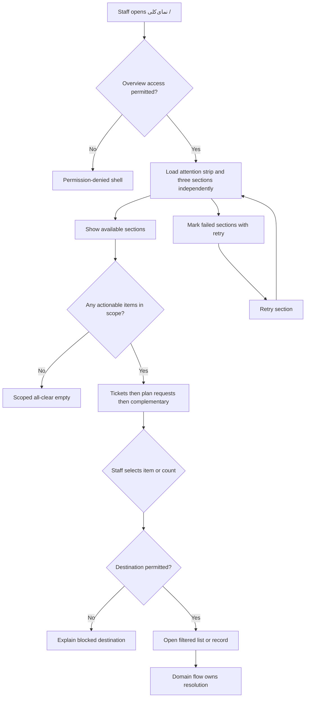
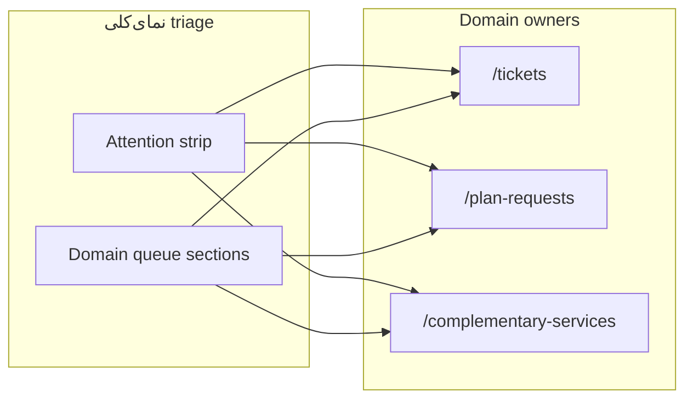

# UX Flow Specification

## Document control

| Field | Value |
|---|---|
| Project | Unixsee Admin Panel |
| Flow or service | Administrator overview / home (`نمای‌کلی`) |
| Version | 0.2 |
| Status | Draft |
| Date | 2026-08-08 |
| Prepared from | `docs/product/phase-1-application-features.md` §§6–7, 10.2–10.3, 23–24; `docs/architecture/project.md`; companion UX flows for tickets, plan requests, complementary services; implemented `/` overview prototype |
| Primary owner | Product and operations |
| Reviewers required | Product, operations, backend engineering, QA, accessibility |
| Change note | v0.2 narrows the home surface to tickets → plan requests → complementary services. Removes unified priority list and website/server/alert/onboarding/audit sections from overview. |

## Confidence summary

| Area | Confidence | Reason |
|---|---|---|
| User needs | High for narrowed intent | Phase 1 §10.2 now lists tickets, plan requests, and complementary-service review as the overview queues |
| Current journey | High | `/` prototype exists with attention strip + three domain sections |
| Business rules | High for link-out and triage-only | Aggregation and destinations are existing domain routes |
| Proposed journey | Medium | Ops validation still needed for density and empty copy |
| Accessibility | Medium | Expert review against project rules, not usability testing |
| Measurement plan | Low | Events proposed; analytics ownership unknown |

## Executive flow summary

- **Primary user:** Support, enablement, and operations staff opening the admin home.
- **Goal:** See attention load for tickets, plan requests, and complementary-service reviews, then open the correct filtered queue or record.
- **Current problem:** Without overview, staff must open `/tickets`, `/plan-requests`, and `/complementary-services` separately to learn what needs review.
- **Proposed change:** Make `/` a capability-scoped triage board with an attention strip and three ordered domain sections that deep-link into existing feature routes.
- **Main decisions:** Overview is triage and navigation, not a mutation surface; it is not a customer dashboard; actionable cards link to filtered lists or records; one failed section must not hide the others.
- **Completion state:** Staff understand current attention load and have opened (or consciously dismissed) the next work item; overview itself does not “resolve” work.
- **Highest-risk failure:** Inventing totals outside the staff member’s capabilities, or implying global fleet health from an empty scoped queue.
- **Accessibility risk:** Severity conveyed by color alone; silent section failures; non-keyboard row activation.
- **Evidence gap:** Staff capability bundles and saved-view persistence not finalized.
- **Next validation:** Attention-strip density on mobile RTL and all-clear copy honesty for limited roles.

## Problem and desired outcome

### Problem statement

Authorized staff currently struggle to know what customer-facing work needs attention first because tickets, plan requests, and complementary-service reviews live in separate queues. Without a home triage surface, SLA-risk tickets and awaiting-review requests are easy to miss.

### Desired user outcome

Staff can open نمای‌کلی, immediately see prioritized ticket, plan-request, and complementary-service work they are allowed to act on, and jump into the correct filtered queue or record.

### Desired service outcome

Unixsee can surface a truthful, permission-scoped operations summary for the three home queues while preserving domain ownership in existing feature routes.

### Why this matters now

- Phase 1 marks administrator overview as Core and defines it as an operations queue.
- Domain queues for `/tickets`, `/plan-requests`, and `/complementary-services` already exist; overview should aggregate and route, not re-implement them.
- Website/server monitoring, alerts, onboarding, and audit remain available from their own nav destinations and are not duplicated on home in this phase.

### Scope

#### In scope

- Admin home at `/` labeled `نمای‌کلی`.
- Capability-scoped attention counts for:
  1. Tickets
  2. Plan requests
  3. Complementary-service requests awaiting admin review
- Domain queue sections in that fixed order, each with top items and “مشاهده همه” deep links.
- Explicit loading, empty, filtered-empty, permission, partial-failure, and retry states per section.
- Deep links to filtered domain lists or specific records.
- Last-refresh visibility for the overview snapshot.
- Persian RTL and equivalent English LTR behaviour.
- Static/fixture-backed UI behaviour for the current UI-only phase.

#### Out of scope

- Unified cross-domain priority work list on home.
- Website monitoring / unavailable-or-stale website sections on home.
- Server / Agent health sections on home.
- Alerts and operational-actions sections on home.
- Onboarding-wait sections on home.
- High-risk administrative-change / audit sections on home.
- Customer dashboard overview (`§10.1`) and tenant-scoped customer metrics.
- Completing mutations on the overview itself (assign ticket, enable plan, create complementary service, etc.).
- Building a full analytics/BI dashboard, charts gallery, or decorative KPI wall.
- Final NestJS aggregation API contracts and realtime event schemas.
- Final staff role/capability bundle naming.
- Visual styling and component polish as a design-system rewrite.
- Saved-view persistence backend (may be prototyped as local UI filters only).

### Success definition

- Staff can answer “what needs attention now?” for tickets, plan requests, and complementary reviews from `/`.
- Every actionable overview item opens a relevant filtered list or record.
- Staff totals respect administrator permissions and never invent out-of-scope work.
- A failed secondary section identifies itself and allows retry without hiding other sections.
- Keyboard and screen-reader users can scan, open items, and perceive section status changes.

## Available evidence

| ID | Type | Source | User/role | Finding | Strength | Date |
|---|---|---|---|---|---|---|
| E-001 | Product specification | `phase-1-application-features.md` §10.2 | Administrator | Admin home is a prioritized operations queue focused on tickets, plan requests, and complementary-service review | Strong | 2026-08-08 |
| E-002 | Product specification | `phase-1-application-features.md` §10.3 | Administrator | Staff totals respect permissions; actionable cards link to filtered lists/records; partial failures are sectional with retry | Strong | 2026-08-08 |
| E-003 | Product specification | `phase-1-application-features.md` §§6.2, 6.5, 23–24 | Administrator | Shared loading/empty/permission/partial states; IA is queue/entity oriented; status color is supplemental | Strong | 2026-08-08 |
| E-004 | Implementation inspection | `src/app/page.tsx` + `src/components/overview/` | Administrator | `/` renders attention strip + tickets / plan-requests / complementary sections | Strong | 2026-08-08 |
| E-005 | Implementation inspection | `src/lib/data/sidebar-data.tsx` | Administrator | Nav exposes `نمای‌کلی` → `/` as first item | Strong | 2026-08-08 |
| E-006 | Related UX flows | `admin-plan-requests.md`, `admin-complementary-services.md`, tickets domain | Staff | Domain ownership and handoffs already specified; overview should link out rather than own mutations | Strong | 2026-08-08 |
| E-007 | Architecture constraint | `docs/architecture/project.md` | Engineering | Current admin phase is UI-only / fixture-backed | Strong | 2026-08-08 |
| E-008 | Implementation inspection | Existing feature pages/views | Staff | Established page pattern: Persian title + subtitle + queue/view; status badges; summary cards; clickable rows | Strong | 2026-08-08 |

## Assumptions and unknowns

### Assumptions

| ID | Assumption | Origin | Risk | Affected decision | Validation | Status |
|---|---|---|---|---|---|---|
| A-001 | Overview completes when staff open the right destination or confirm there is no attention work; it does not own resolution | E-001, E-006 | Medium if product later wants in-place acknowledge | Keep overview read/navigate-only | Product walkthrough | Accepted for this phase |
| A-002 | Domain queues remain source of truth for mutations and detail workflows | E-006 | High if overview duplicates enablement/assignment | Deep-link only | Architecture review | Accepted for this phase |
| A-003 | Home section order is fixed: tickets → plan requests → complementary services | Product decision 2026-08-08 | Low | Section layout | Ops walkthrough | Accepted for this phase |
| A-004 | Website/server/alert/onboarding/audit attention stays on domain routes, not home | Product decision 2026-08-08 | Medium if ops later wants infra on home | Out-of-scope list | Ops review | Accepted for this phase |
| A-005 | “All clear” empty state is useful and truthful only within the viewer’s capability scope | E-002 | High if empty implies global health | Empty copy | Product | Accepted |

### Unknowns

| ID | Unknown | Impact | Decision blocked | Resolution | Priority |
|---|---|---|---|---|---|
| U-001 | Whether ticket SLA-risk ranking inside the tickets section needs ops-tuned thresholds | Wrong ticket order inside section | Ticket preview sort | Ops workshop | Medium |
| U-002 | Staff capability bundles and whether overview hides sections or shows locked placeholders | Permission UX | Section visibility model | Access design | Critical |
| U-003 | Saved-view persistence vs session-only filters for Phase 1 | Filter complexity | Filters/saved views scope | Product | Medium |

## Domain distinctions

| Concept | Meaning | Not the same as |
|---|---|---|
| نمای‌کلی / overview | Cross-customer triage home for tickets, plan requests, and complementary reviews | Customer dashboard home; infra monitoring console |
| Attention item | Capability-scoped work unit needing staff action | Decorative KPI |
| Domain queue section | Top-N preview of one work type with link-out | Full feature page |
| Partial section failure | One feed unavailable while others remain usable | Whole-page outage |
| Saved view / filter | Capability-appropriate narrowing of overview work | Global search |

## Users, roles and permissions

### Users

| Role | Goal | Responsibility | Constraints | Needs |
|---|---|---|---|---|
| Support / ticket staff | Clear customer issues on time | Triage unassigned and SLA-risk tickets | Mutations stay on `/tickets` | Ticket attention strip + filtered ticket links |
| Enablement / commercial ops | Clear plan and complementary requests | Spot awaiting-review plan and complementary requests | Do not enable/create from overview | Request attention items |
| Operations staff | Stay oriented on customer-facing queues | Use overview for ticket/request load; use domain nav for infra | Infra not shown on home in this phase | Ticket/request strip + domain browse |
| Auditor / read-only staff | Inspect scoped attention | Read scoped overview | No mutation CTAs | Read-only sections |
| Unauthorized / limited staff | Avoid out-of-scope work | See only permitted sections/counts | Must not infer global emptiness from hidden work | Honest permission/empty copy |

### Permissions

| Action | Support | Enablement | Ops | Auditor | Conditions |
|---|---:|---:|---:|---:|---|
| View overview shell | Yes | Yes | Yes | Yes | Authenticated staff with any overview capability |
| View ticket attention | Capability required | Limited | Limited | Yes | Scope + capability |
| View plan/complementary attention | Limited | Capability required | Limited | Yes | Scope + capability |
| Open deep link to domain record/queue | Yes if target permitted | Yes if target permitted | Yes if target permitted | Yes if target permitted | Destination authorization still enforced |
| Mutate from overview | No | No | No | No | Mutations owned by domain flows |

## User needs

### UN-001 — Know what needs attention now

**As** authorized staff, **when** I open the admin panel, **I need to** see ticket, plan-request, and complementary-review attention within my capabilities **so that** I can start the right work without scanning every nav destination.

- Evidence: E-001, E-004, E-005.
- Success: `/` shows actionable attention items or a scoped all-clear state.
- Priority: Critical.

### UN-002 — Jump to the correct work surface

**As** authorized staff, **when** I select an attention item or summary count, **I need to** land on a filtered list or relevant record **so that** I can continue the domain workflow without reconstructing filters from memory.

- Evidence: E-002, E-006.
- Success: Every actionable card/row deep-links with useful context.
- Priority: Critical.

### UN-003 — Keep working when one feed fails

**As** authorized staff, **when** one overview section is unavailable, **I need to** still use other sections and retry the failed one **so that** a secondary outage does not hide primary operational work.

- Evidence: E-002, E-003.
- Success: Partial failure is sectional; retry is available; other sections remain.
- Priority: Critical.

### UN-004 — See only work I am allowed to act on

**As** capability-limited staff, **when** I view overview totals, **I need** counts and lists scoped to my permissions **so that** I do not chase inaccessible work or believe all queues are clear when they are only hidden.

- Evidence: E-002, E-003.
- Success: Totals respect capabilities; empty copy does not claim global health if sections are hidden.
- Priority: Critical.

### UN-005 — Spot request waits without leaving home first

**As** enablement staff, **when** plan requests or complementary requests await staff review, **I need** those waits visible on overview **so that** commercial handoffs do not stall unnoticed.

- Evidence: E-001, E-006.
- Success: Awaiting-review requests appear as attention items with link-outs.
- Priority: Important.

## Current journey

| Stage | Goal | Action | Response | Actors | Backstage | Pain point | Evidence |
|---|---|---|---|---|---|---|---|
| Enter panel | Start shift / find work | Open `/` or `نمای‌کلی` | Attention strip + three sections | Administrator | Fixture aggregator | — | E-004, E-005 |
| Hunt domains | Find urgent work | Open tickets/requests separately if leaving home | Domain queues | Staff | Existing feature fixtures | JP-001: no single entry without overview | E-006, E-008 |

## Proposed journey

| Stage | Goal | Behaviour | Response | Decision | Backstage | Problem | Need |
|---|---|---|---|---|---|---|---|
| 1. Enter | Orient | Open `/`; see header, last refresh, attention strip | Scoped counts for tickets / plans / complementary | Permitted? | Capability aggregation | JP-001 | UN-001, UN-004 |
| 2. Triage | Rank work | Scan ordered domain sections | Tickets first, then plan requests, then complementary | What first? | Fixed section order A-003 | Missed queue | UN-001, UN-005 |
| 3. Navigate | Continue work | Open item or summary deep link | Filtered domain queue/record | Destination allowed? | Domain auth | Wrong queue | UN-002 |
| 4. Recover | Stay productive | If a section fails, retry it; keep using others | Sectional error + retry | Retry? | Partial aggregation | Feed outage | UN-003 |
| 5. Complete overview use | Leave home | Finish or park work in domain flow; return later | Overview remains triage entry | — | Domain owns mutation | Overview not a sink | A-001 |

## Mermaid flow diagram

## Screen/state sequence

| Step | State | Goal | Entry condition | Information | Actions | System behaviour | Exit |
|---|---|---|---|---|---|---|---|
| S-01 | Overview loading | Orient without blank page | Authorized `/` entry | Skeletons per section; shell visible | Wait / navigate away | Progressive section load | Ready, partial, empty, or denied |
| S-02 | Overview ready | Triage | One or more sections loaded | Attention counts, three section previews, refresh hint | Open item, open “مشاهده همه”, retry failed section | Capability scoping; independent sections | Domain destination or remain |
| S-03 | Scoped all-clear | Confirm no attention work | No actionable items in permitted scope | Explicit empty copy; browse links to the three domains | Open domain browse links | Does not claim global fleet health if sections hidden | Re-entry later |
| S-04 | Section unavailable | Keep other work usable | One feed fails | Section error + retry; other sections intact | Retry section | Partial failure isolation | Section recovered or still failed |
| S-05 | Permission-denied overview | Stop unauthorized access | No overview capability | Denied explanation | Leave / contact admin | No fake empty healthy state | Exit |
| S-06 | Domain handoff | Continue real work | Item/count opened and permitted | Filtered destination context preserved | Domain mutations | Overview does not mutate | Domain completion states |

### Attention item model

Each overview work item exposes:

| Field | Purpose |
|---|---|
| Severity | بحرانی / هشدار / عادی — text + icon, color supplemental |
| Type | Ticket, plan request, complementary request |
| Title | Human-readable subject (ticket subject, request title) |
| Customer / tenant | Visible when permitted |
| Age / SLA hint | Relative time and SLA-risk or next-action marker where applicable |
| Destination | Filtered list query or record href |
| Next hint | Short verb phrase such as مشاهده، بررسی، تخصیص — navigation only |

### Default section order (accepted — A-003)

1. تیکت‌ها — unassigned and open tickets, emphasizing SLA-risk and NEW
2. درخواست‌های پلن — awaiting review / ready-to-enable
3. خدمات تکمیلی — customer-submitted requests awaiting admin review

### State-transition table

| From | Trigger | Actor | Preconditions | Rules | To | Side effects | Failure |
|---|---|---|---|---|---|---|---|
| `unloaded` | Open `/` | Staff | Authenticated | BR-001 | `loading` | Start sectional fetches | Auth failure |
| `loading` | Section succeeds | System | Capability allows section | BR-001, BR-002 | `ready` or `all_clear` | Render section | — |
| `loading` / `ready` | Section fails | System | Other sections may succeed | BR-004 | `partial_failure` | Show sectional error | Whole-shell failure only if shell cannot load |
| `ready` | Apply filter/view | Staff | Filter supported | BR-005 | `ready` or filtered empty | Narrow visible items | Invalid filter ignored/explained |
| `ready` | Open item/count | Staff | Destination permitted | BR-003 | domain handoff | Navigate with context | Permission denied on destination |
| `partial_failure` | Retry section | Staff | Section still permitted | BR-004 | `loading` section → `ready`/`failed` | Refetch only that section | Remains failed |
| any | Lack overview capability | Staff | None | BR-001 | `permission_denied` | No fake counts | Denied |

Overview has no terminal “resolved” business state; resolution happens in domain flows.

## Business-rule decision table

### Whether an item appears on overview

| Condition/result | Case 1 | Case 2 | Case 3 | Case 4 | Case 5 |
|---|---:|---:|---:|---:|---|
| Actor has overview access | Yes | No | Yes | Yes | Yes |
| Actor has capability for item domain | Yes | Yes | No | Yes | Yes |
| Item is actionable ticket/plan/complementary work | Yes | Yes | Yes | No | Yes |
| Item data feed available | Yes | Yes | Yes | Yes | No |
| Result | Show item | Deny overview | Hide/omit from totals | Omit | Section error + retry; do not invent zero-as-healthy |

### Business-rule register

- **BR-001 — Capability scope:** Overview totals and sections respect administrator capabilities and never invent out-of-scope work. Source: E-002, E-003. Status: Confirmed principle.
- **BR-002 — Operations queue, not customer clone:** Overview prioritizes staff attention queues over decorative tenant metrics. Source: E-001. Status: Confirmed.
- **BR-003 — Actionable deep links:** Every actionable card/row links to a filtered list or relevant record; destination auth remains authoritative. Source: E-002. Status: Confirmed.
- **BR-004 — Partial failure isolation:** One unavailable feed identifies its section and allows retry without hiding other sections. Source: E-002, E-003. Status: Confirmed.
- **BR-005 — Filters/views are capability-appropriate:** Filters or saved views only narrow work the actor may see. Source: E-001. Status: Confirmed principle; persistence is U-003.
- **BR-006 — Triage, not mutation:** Overview does not perform domain mutations; domain flows own assignment, enablement, and complementary intake handling. Source: A-001, A-002, E-006. Status: Accepted for this phase.
- **BR-007 — Cross-flow ownership preserved:** Plan enablement stays in `/plan-requests`; tickets in `/tickets`; complementary services in `/complementary-services`. Source: E-006. Status: Confirmed.
- **BR-008 — Empty is scoped:** All-clear copy describes the viewer’s permitted scope and must not imply global fleet health when sections are hidden. Source: A-005, E-002. Status: Accepted.
- **BR-009 — Home surface is limited:** Website/server/alert/onboarding/audit attention is not shown on `/` in this phase; staff use domain nav for those queues. Source: A-004. Status: Accepted.
- **BR-010 — Realtime optional:** Overview remains usable on REST/refetch if realtime is disconnected; disconnection is indicated. Source: E-003. Status: Confirmed.

## Loading, empty, error and recovery states

### Loading

| ID | Trigger | User action | Status | Timeout/recovery | Exit |
|---|---|---|---|---|---|
| LD-001 | Initial overview open | Use other nav | Section skeletons | Retry failed sections | Ready/empty/partial |
| LD-002 | Manual refresh / reconnect | Wait | Announce refreshing | Keep prior items until replaced | Updated or failed section |
| LD-003 | Retry one section | Continue other sections | Section loading only | Retry again | Section ready/failed |

### Empty

| ID | Cause | Meaning | Action | Permission consideration |
|---|---|---|---|---|
| EM-001 | No actionable items in permitted scope | Scoped all-clear | Browse links to tickets / plan requests / complementary | Do not claim global emptiness |
| EM-002 | Filter hides all items | No matches for current view | Clear/adjust filter | Keep filter state visible |
| EM-003 | Section hidden by capability | Not visible work | None in that section | Do not show deceptive zero for hidden domains |

### Validation

| ID | State | Rule | Problem | Correction | Data retained |
|---|---|---|---|---|---|
| VR-001 | Open destination | Destination must be permitted | Unauthorized deep link | Explain blocked; stay on overview or safe fallback | Yes |
| VR-002 | Apply filter | Filter values must be known | Unknown filter | Ignore/explain; keep previous valid filter | Yes |

Overview has no form submission validation beyond filters/navigation.

### System failure

| ID | Failure | Result certainty | Data saved | Retry safe | Recovery | Owner |
|---|---|---|---|---|---|---|
| SF-001 | One aggregation feed fails | Other sections known | N/A | Yes for that section | Sectional error + retry | Backend/BFF later; fixture mock now |
| SF-002 | Overview shell fails entirely | Unknown | N/A | Yes | Full-page unavailable with retry | Frontend/backend |
| SF-003 | Deep link target missing | Navigation uncertain | N/A | Open parent queue | Fallback to domain list with explanation | Frontend |

### User control and save/resume

- **Back:** Browser/app back returns from domain destination to overview when history allows.
- **Cancel:** Not applicable as a lifecycle action; leaving overview abandons nothing.
- **Undo:** Not applicable; overview does not mutate.
- **Save/resume:** Not applicable beyond optional filter/view persistence (U-003).
- **Refresh:** Explicit refresh or sectional retry reconciles attention data without duplicate side effects.

## Edge cases

| ID | Scenario | Expected behaviour | Rule | Recovery | Criteria |
|---|---|---|---|---|---|
| EC-001 | Staff has tickets capability only | Ticket attention visible; plan/complementary omitted or locked per U-002 | BR-001, BR-008 | Use ticket deep links | AC-003 |
| EC-002 | All-clear while another role has hidden critical work | Empty copy is scoped; no global “everything healthy” claim | BR-008 | — | AC-003 |
| EC-003 | Item disappears after navigation because another staff resolved it | Domain page shows current state; returning overview refreshes | BR-006 | Refresh overview | AC-005 |
| EC-004 | Long Persian names / LTR domains in RTL | Truncate safely; keep identifiers readable/`dir=ltr` where needed | E-003 | Open detail for full value | AC-006 |

## Accessibility review

| ID | Criterion | State | Problem/status | Required behaviour | Severity | Test |
|---|---|---|---|---:|---|
| AX-001 | Keyboard operation | Section rows | Pointer-only rows | Rows/links operable with keyboard; no hover-only actions | 4 provisional | Keyboard |
| AX-002 | Status messages | Refresh, sectional failure | Silent updates | Announce refresh result and section failure/recovery | 4 provisional | SR |
| AX-003 | Color alone | Severity | Color-only severity | Text + icon for severity; color supplemental | 4 provisional | Visual/SR |
| AX-004 | Heading hierarchy | Page sections | Skipped headings | One `h1` نمای‌کلی, section `h2`s, item titles subordinate | 3 provisional | SR/code |
| AX-005 | Focus restoration | Return from domain page | Context loss | Restore useful focus or preserve scroll where practical | 3 provisional | Keyboard |
| AX-006 | Target size | Mobile attention chips/rows | Tiny hit areas | Practical touch targets; no hover-dependent controls | 3 provisional | Mobile |
| AX-007 | RTL/LTR | Domains, IDs, emails | Bidirectional confusion | Logical CSS; LTR islands for identifiers | 3 provisional | Manual |
| AX-008 | Reduced motion | Loading skeletons | Motion noise | Respect reduced motion | 2 provisional | Manual |

## Heuristic review

| ID | Heuristic | State | Finding | Severity | Required behaviour |
|---|---|---|---|---:|---|
| HX-001 | Visibility of system status | Failed vs ready sections | Staff must not infer health from silence | 4 | Explicit sectional errors and refresh time |
| HX-002 | Match with real world | Ops language | Use attention/queue language, not analytics vanity | 3 | Copy matches operations work |
| HX-003 | User control and freedom | Deep links | Easy return to overview and clear filters | 3 | Back/filter clear preserved |
| HX-004 | Consistency | Queues | Same status language as domain pages | 4 | Reuse domain status language |
| HX-005 | Error prevention | Fake healthy zeros | Hidden capability must not look like all-clear global | 4 | Scoped empty copy |
| HX-006 | Recognition rather than recall | Destinations | Deep links carry filters | 4 | BR-003 |
| HX-007 | Flexibility and efficiency | Experienced staff | Ordered sections + optional filters/views | 3 | Keep advanced filters light |
| HX-008 | Minimalism | Charts/KPI wall / extra infra sections | Decorative or infra-heavy home distracts from triage | 4 | Keep only the three home queues |
| HX-009 | Help users recover | Partial outage | Retry section without losing other work | 4 | BR-004 |
| HX-010 | Help and documentation | Empty queues | Replace dead-end with actionable empty guidance | 3 | All-clear + browse links |

## Analytics events

Exclude free-text notes, secrets, raw customer contact values, and unauthorized identifiers.

| ID | Event | Trigger | State change | Properties | Question |
|---|---|---|---|---|---|
| EV-001 | `overview_opened` | Staff opens `/` | Entry | entry_point | Is home used as triage start? |
| EV-002 | `overview_item_opened` | Item/count deep link used | Navigate away | item_type, severity_bucket | Which attention types drive action? |
| EV-003 | `overview_section_retried` | Section retry | Section reload | section_id | Which feeds are unreliable? |
| EV-004 | `overview_filter_applied` | Filter/view changed | Visible set narrowed | filter_key | Are filters useful before saved views? |
| EV-005 | `overview_all_clear_viewed` | Scoped empty shown | Ready empty | hidden_sections_count_bucket | Is empty truthful and common? |
| EV-006 | `overview_partial_failure_shown` | Section error rendered | Partial failure | section_id | Where do aggregations fail? |

## Acceptance criteria

### AC-001 — Operable operations overview
**Given** authorized staff open نمای‌کلی, **when** actionable items exist in their capability scope, **then** the page shows an attention strip and the three ordered domain sections rather than a non-interactive placeholder, **and** items expose severity, type, and next destination.

### AC-002 — Actionable deep links
**Given** an actionable overview card, count, or row is shown, **when** staff activate it, **then** they land on a filtered list or relevant record for that work, **and** destination authorization is still enforced.

### AC-003 — Capability-scoped totals
**Given** staff lack a domain capability, **when** overview renders, **then** that domain’s work is omitted or explicitly unavailable per the approved permission UX, **and** empty/all-clear copy does not claim global fleet health.

### AC-004 — Partial failure isolation
**Given** one overview feed fails while others succeed, **when** the page renders, **then** the failed section identifies the problem and offers retry, **and** successful sections remain usable.

### AC-005 — Triage-only surface
**Given** staff are on overview, **when** they need to assign, enable, create, or otherwise mutate, **then** those actions are completed in the owning domain flow after navigation, not as overview mutations.

### AC-006 — Accessible triage
**Given** keyboard and screen-reader users use overview, **when** they scan sections and open items, **then** controls are operable without pointer/hover-only paths, severity is not color-only, and status changes for refresh/failure are announced.

### AC-007 — Home surface limitation
**Given** staff are on نمای‌کلی, **when** the page renders, **then** it does not include website monitoring, server/agent, alerts/actions, onboarding, audit, or a unified cross-domain priority list.

## Questions requiring decision

| ID | Question | Decision | Users | Method | Priority |
|---|---|---|---|---|---|
| RQ-001 | When a section is not permitted, is it hidden or shown as locked? | U-002 | Product/security | Access design | Critical |
| RQ-002 | Are saved views in Phase 1, or session filters only? | U-003 | Product | Scope cut | Medium |
| RQ-003 | What ticket age/SLA threshold defines SLA-risk preview items? | U-001 | Ops/product | Ops note | Medium |

## Risks and dependencies

### Risks

| ID | Risk | Source | Likelihood | Impact | Mitigation | Owner | Release effect |
|---|---|---|---|---|---|---|---|
| R-001 | Building a vanity KPI/chart dashboard instead of a triage queue | Common dashboard bias | Medium | High | Keep BR-002/HX-008 and out-of-scope list authoritative | Product | Block |
| R-002 | Reintroducing infra/alert sections onto home without product decision | Scope creep | Medium | Medium | Enforce BR-009 + AC-007 | Product | Warn |
| R-003 | Overview becomes a second mutation console | Scope creep | Medium | High | Enforce BR-006 + AC-005 | Product | Block |
| R-004 | Misleading all-clear for limited roles | Permission UX | Medium | High | BR-008 + RQ-001 | Product/security | Block |

### Dependencies

| ID | Dependency | Type | Owner | Required by | Failure effect | Fallback |
|---|---|---|---|---|---|---|
| D-001 | Domain queues and record routes for tickets, plan requests, complementary services | UX/system | Feature workstreams | Deep links | Overview cannot complete handoff | Link to nearest existing list |
| D-002 | Capability model for staff overview sections | Policy/system | Access design | Scoped totals | Ambiguous hide vs lock | Hide unauthorized sections until decided |
| D-003 | Aggregation source (fixtures now; NestJS later) | System | Backend later | Live counts | Prototype-only data | Fixture aggregator in UI phase |
| D-004 | Related UX flows remaining authoritative for mutations | Docs/process | Product | Cross-flow consistency | Duplicated workflows | Overview links only |

## Implementation readiness

**Ready for UI prototyping / current fixture implementation** covering:

- `/` overview shell and header
- attention summary strip for the three queues
- domain queue sections in tickets → plan requests → complementary order
- sectional loading/empty/error/retry
- deep links into existing feature routes

**Not ready for production implementation** until RQ-001–RQ-002 and D-002–D-003 are resolved.

### Blockers

- Decide hide vs locked for unauthorized sections.
- Confirm ticket SLA-risk threshold for preview ordering.

## Final recommendations

### Must keep for this phase

- **REC-001:** `نمای‌کلی` is a prioritized operations triage board for tickets, plan requests, and complementary reviews. Traces to UN-001, BR-002, AC-001.
- **REC-002:** Every actionable overview item deep-links to a filtered list or record. Traces to UN-002, BR-003, AC-002.
- **REC-003:** Totals and sections are capability-scoped; empty copy is scoped. Traces to UN-004, BR-001/008, AC-003.
- **REC-004:** Partial failures are sectional with retry. Traces to UN-003, BR-004, AC-004.
- **REC-005:** Overview does not own mutations. Traces to BR-006, AC-005.
- **REC-006:** Home does not duplicate infra/alert/onboarding/audit queues. Traces to BR-009, AC-007.

### Must validate during prototyping

- Attention strip density on mobile RTL.
- Sectional failure and all-clear copy honesty for limited roles.
- Deep-link quality into tickets, plan requests, and complementary services.

### Explicitly rejected for this phase

- Unified cross-domain priority work list on home.
- Website monitoring, server/agent, alerts/actions, onboarding, or audit sections on home.
- Customer-dashboard-style website gallery and “add website” hero on admin home.
- Chart-first or decorative KPI wall as the primary surface.
- In-place assign/enable/create actions on overview.
- Treating overview empty state as proof the entire fleet is healthy for all roles.

---

## Appendix — Companion documents

- Product source: `docs/product/phase-1-application-features.md` §§6–7, 10.2–10.3, 23–24
- Architecture: `docs/architecture/project.md`
- Plan requests: `docs/product/ux-flows/admin-plan-requests.md`
- Complementary services: `docs/product/ux-flows/admin-complementary-services.md`
- Servers/agents/websites (domain owner, not home surface): `docs/product/ux-flows/admin-servers-websites-agents.md`
- Users/tenants: `docs/product/ux-flows/admin-users.md`

This v0.2 draft defines `نمای‌کلی` as a triage-and-navigate home for tickets, plan requests, and complementary-service reviews without taking ownership of their mutations or duplicating infra/monitoring queues.
