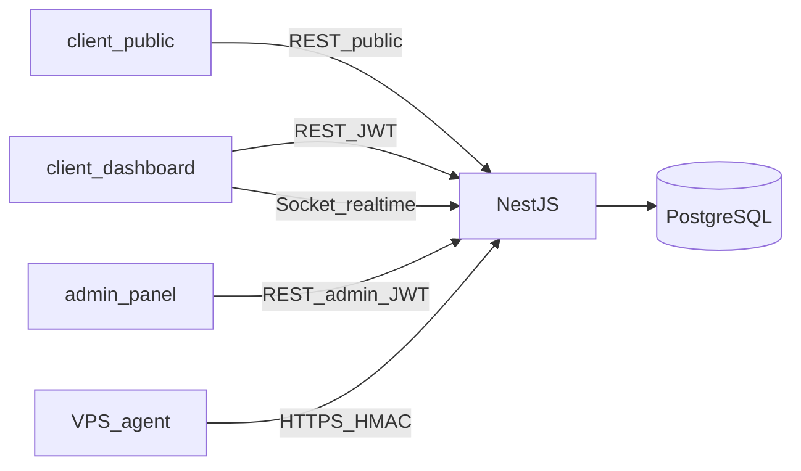

# Backend modules and routes (Phase 1)

> **Status:** Accepted
>
> **Last verified:** 2026-08-10
>
> **ADRs:**
> [`../architecture/decisions/0004-api-audience-namespaces.md`](../architecture/decisions/0004-api-audience-namespaces.md),
> [`../architecture/decisions/0005-domain-modules-multi-audience-controllers.md`](../architecture/decisions/0005-domain-modules-multi-audience-controllers.md),
> [`../architecture/decisions/0008-phase1-agent-typescript-node.md`](../architecture/decisions/0008-phase1-agent-typescript-node.md),
> [`../architecture/decisions/0009-nest-agent-kind-module-split.md`](../architecture/decisions/0009-nest-agent-kind-module-split.md)

High-level NestJS module and route map for Phase 1. Resource paths are planning
contracts, not final OpenAPI. Keep authentication as implemented in
`backend/src/modules/auth`.

## Audience namespaces

```text
/api/v1/public/...          # unauthenticated intake + published catalogs
/api/v1/...                 # customer (tenant JWT)
/api/v1/admin/...           # staff JWT + role/capability
/api/internal/agent/v1/...  # Phase 1 agent plane (`agent/`; not browser-facing)
```

Socket.io: `/realtime` for **customer monitoring** only in Phase 1. Admin
queues are REST-first.

## REST rules

- Plural nouns; nest one level when ownership is clear (`/tickets/:id/messages`).
- Lifecycle mutations prefer explicit actions: `enable`, `assign`, `decline`.
- Idempotency keys on enablement, assignment, message create, operational actions.
- Lists: filter + cursor/page; never leak other tenants.
- Errors: stable `error.code` on every failure; EN/FA copy lives in frontends
  (see [`contracts/api-errors.md`](./contracts/api-errors.md)); auth failures
  non-enumerating.
- Split public / customer / admin **controllers**; do not branch one handler on a role flag.

## Trust and authz

- Keep `AtGuard` as `APP_GUARD` and `@Public()` for public + agent ingest.
- Customer routes: access JWT + **tenant membership** scope on every query.
- Admin routes: access JWT + staff role/capability (start coarse: `ADMIN` /
  `OPERATOR`; refine later).
- Agent: enrollment token exchange, then HMAC-signed ingest/heartbeat only;
  never expose agent secrets to browsers. Backend may still accept a legacy
  activation header during transition; the edge agent is enrollment-only.
- Do not redesign OTP, refresh, or monitoring-access JWT flows.



---

## 1. Foundations (keep / extend)

### Auth — keep

| Method | Path | Audience | Notes |
|---|---|---|---|
| POST | `/api/v1/auth/register` | Public | Existing |
| POST | `/api/v1/auth/login` | Public | Existing |
| POST | `/api/v1/auth/refresh` | Public + refresh JWT | Existing |
| POST | `/api/v1/auth/logout` | Customer/staff JWT | Existing |
| POST | `/api/v1/auth/otp/request` | Public | Existing |
| POST | `/api/v1/auth/otp/verify` | Public | Existing |
| POST | `/api/v1/auth/otp/monitoring-access/request` | Customer JWT | Existing |
| POST | `/api/v1/auth/otp/monitoring-access/verify` | Customer JWT | Existing |

Module: `auth`. No redesign.

### Users — extend `user` → `users`

| Method | Path | Audience |
|---|---|---|
| GET | `/api/v1/users/me` | Customer (existing) |
| PATCH | `/api/v1/users/me` | Customer |
| GET | `/api/v1/admin/users` | Admin |
| GET | `/api/v1/admin/users/:id` | Admin |
| POST | `/api/v1/admin/users` | Admin |
| PATCH | `/api/v1/admin/users/:id` | Admin |
| POST | `/api/v1/admin/users/:id/suspend` | Admin |
| POST | `/api/v1/admin/users/:id/restore` | Admin |

Never return passwords, OTP codes, recovery secrets, refresh hashes, or agent keys.

### Tenants — add

| Method | Path | Audience |
|---|---|---|
| GET | `/api/v1/tenants/me` | Customer |
| GET | `/api/v1/tenants/me/members` | Customer owner/admin |
| GET | `/api/v1/admin/tenants` | Admin |
| GET | `/api/v1/admin/tenants/:id` | Admin |
| POST | `/api/v1/admin/tenants` | Admin |
| PATCH | `/api/v1/admin/tenants/:id` | Admin |
| GET/POST/PATCH | `/api/v1/admin/memberships` | Admin |

Tenant membership is the customer access boundary (not raw `userId` on websites alone).

### Dashboard — keep

| Method | Path | Audience |
|---|---|---|
| GET | `/api/v1/dashboard/overview` | Customer (existing) |
| GET | `/api/v1/dashboard/overview/charts` | Customer (existing) |
| GET | `/api/v1/dashboard/websites/:websiteId` | Customer (existing) |
| GET | `/api/v1/dashboard/websites/:websiteId/charts` | Customer (existing) |
| GET | `/api/v1/dashboard/vps/:vpsNodeId/charts` | Customer (existing) |
| GET | `/api/v1/dashboard/monitoring` | Customer + monitoring JWT (existing) |

Customer read-model only. Prefer importing exported `websites` / `metrics` /
`alerts` services instead of duplicating providers.

### Websites, metrics, ssl-certificates, alerts, uptime, health, event

| Change | Detail |
|---|---|
| Export services | So dashboard/realtime consume module exports |
| Customer reads | `GET /api/v1/websites`, `GET /api/v1/websites/:id`, `GET /api/v1/alerts` |
| Admin reads/mutations | `/api/v1/admin/websites`, `/api/v1/admin/alerts`, assign/ack/resolve as product requires |
| Fix stub | Replace `GET /api/dashboard/incidents/recent` with versioned, authenticated alerts routes |

### Agent plane — Phase 1 (`agent/`)

| Method | Path | Audience |
|---|---|---|
| POST | `/api/internal/agent/v1/enroll` | Agent (one-time `x-enrollment-token` → `secretKey`) |
| POST | `/api/internal/agent/v1/ingest` | Agent (HMAC; `schemaVersion: "phase1"` discoveries + `activeVisitors3m`) |
| POST | `/api/internal/agent/v1/heartbeat` | Agent (HMAC freshness + `agentVersion`) |

Product install uses enrollment, then HMAC. **Source of truth:**
[`../agent/prd.md`](../agent/prd.md) and
[`../agent/phase1-api-contract.md`](../agent/phase1-api-contract.md).
Deployable: [`../../agent/`](../../agent/). Nest module:
[`../../backend/src/modules/agent/`](../../backend/src/modules/agent/) (ADR 0009).

Archived monitoring-agent Nest leftovers (batch ingest DTOs/events, not wired
into `AppModule`) live under
[`../../backend/src/modules/monitoring-agent/`](../../backend/src/modules/monitoring-agent/).
When monitoring work returns, resume under `/api/internal/monitoring-agent/v1`
(ADR 0007 / 0008 / 0009).

---

## 2. Public intake — add

Consultant requests are modeled as **complementary-service** public intake
(Phase 1), not a separate product.

### Plans — add `plans`

| Method | Path | Audience |
|---|---|---|
| GET | `/api/v1/public/plans` | Public |
| GET | `/api/v1/plans` | Customer (published) |
| GET/POST/PATCH | `/api/v1/admin/plans` | Admin |

### Plan requests — add `plan-requests`

| Method | Path | Audience |
|---|---|---|
| POST | `/api/v1/public/plan-requests/account-check` | Public (early phone/email/website match; `{ exists, matchedBy }`) |
| POST | `/api/v1/public/plan-requests` | Public (rejects existing customer phone/email/website with `409 ACCOUNT_EXISTS`) |
| POST | `/api/v1/plan-requests` | Customer (logged-in create) |
| GET | `/api/v1/plan-requests` | Customer (own) |
| GET | `/api/v1/plan-requests/:id` | Customer (own) |
| GET | `/api/v1/admin/plan-requests` | Admin |
| GET | `/api/v1/admin/plan-requests/:id` | Admin |
| POST | `/api/v1/admin/plan-requests/:id/link` | Admin (existing user/tenant) |
| POST | `/api/v1/admin/plan-requests/:id/enable` | Admin |
| POST | `/api/v1/admin/plan-requests/:id/decline` | Admin |

Rules: public submit ≠ payment ≠ enablement; enablement links an **existing**
user/tenant and at most one active plan per website.

### Complementary services — add `complementary-services`

| Method | Path | Audience |
|---|---|---|
| GET | `/api/v1/public/service-catalog` | Public |
| POST | `/api/v1/public/complementary-service-requests` | Public (consultant/complementary intake) |
| GET | `/api/v1/complementary-service-requests` | Customer (own) |
| GET | `/api/v1/complementary-service-requests/:id` | Customer (own) |
| POST | `/api/v1/complementary-service-requests/:id/withdraw` | Customer |
| GET/PATCH | `/api/v1/admin/complementary-service-requests` | Admin |
| POST | `/api/v1/admin/complementary-service-requests/:id/quotations` | Admin |
| POST | `/api/v1/admin/service-assignments` | Admin |
| GET/PATCH | `/api/v1/admin/usage`, `/api/v1/admin/deliverables` | Admin |

---

## 3. Admin onboarding spine — add

### Servers — add `servers`

| Method | Path | Audience |
|---|---|---|
| GET/POST | `/api/v1/admin/servers` | Admin |
| GET/PATCH | `/api/v1/admin/servers/:id` | Admin |
| POST | `/api/v1/admin/servers/:id/enrollment-tokens` | Admin (one-time reveal) |
| POST | `/api/v1/admin/servers/:id/enrollment-tokens/:tokenId/revoke` | Admin |
| POST | `/api/v1/admin/servers/:id/agent/revoke` | Admin (invalidate agent secret; reason required) |

### Discoveries — add `discoveries`

| Method | Path | Audience |
|---|---|---|
| GET | `/api/v1/admin/discoveries` | Admin |
| GET | `/api/v1/admin/discoveries/:id` | Admin |
| POST | `/api/v1/admin/discoveries/:id/assign` | Admin → managed website |

Discovery never enables a plan or customer visibility by itself. Assignment may
default plan from a linked plan request.

### Admin website assignment

Owned with `websites` + `discoveries` services:

| Method | Path | Audience |
|---|---|---|
| POST | `/api/v1/admin/websites` | Admin |
| POST | `/api/v1/admin/websites/:id/assign` | Admin |
| POST | `/api/v1/admin/websites/:id/transfer` | Admin (audited) |
| POST | `/api/v1/admin/websites/:id/retire` | Admin |

---

## 4. Support and communications — add

### Tickets — add `tickets`

Customer DTO/lifecycle contract:
[`contracts/tickets-customer.md`](./contracts/tickets-customer.md).
Shared service taxonomy:
[`contracts/ticket-service-categories.md`](./contracts/ticket-service-categories.md).

| Method | Path | Audience |
|---|---|---|
| GET | `/api/v1/tickets/services` | Customer (service category catalog) |
| GET/POST | `/api/v1/tickets` | Customer |
| GET | `/api/v1/tickets/:id` | Customer |
| POST | `/api/v1/tickets/:id/messages` | Customer |
| POST | `/api/v1/tickets/:id/attachments` | Customer |
| POST | `/api/v1/tickets/:id/close` | Customer (`RESOLVED` → `CLOSED`) |
| POST | `/api/v1/tickets/:id/reopen` | Customer (`CLOSED` → `IN_PROGRESS`) |
| GET | `/api/v1/admin/tickets` | Admin |
| GET | `/api/v1/admin/tickets/:id` | Admin (incl. internal notes) |
| POST | `/api/v1/admin/tickets/:id/assign` | Admin |
| POST | `/api/v1/admin/tickets/:id/resolve` | Admin (`*` → `RESOLVED`; sets auto-close) |
| POST | `/api/v1/admin/tickets/:id/reopen` | Admin (`RESOLVED` → `IN_PROGRESS`) |
| POST | `/api/v1/admin/tickets/:id/messages` | Admin (blocked when `RESOLVED`/`CLOSED`) |

Staff shapes:
[`contracts/tickets-admin.md`](./contracts/tickets-admin.md).

Create body includes required `service`, optional `websiteId`, `subject`,
`description`, and optional `attachments[]`. Default status is `SUBMITTED`
(customer «ارسال‌شده»). S3 upload provider is deferred; keep `storageKey` shape.

### Notifications — add `notifications`

| Method | Path | Audience |
|---|---|---|
| GET | `/api/v1/notifications` | Customer |
| POST | `/api/v1/notifications/:id/read` | Customer |
| GET/POST/PATCH | `/api/v1/admin/notifications` | Admin (`locales.fa` + `locales.en`) |

### Activities — add `activities`

| Method | Path | Audience |
|---|---|---|
| GET | `/api/v1/activities` | Customer |
| GET | `/api/v1/admin/activities` | Admin |

### Audit — add `audit`

| Method | Path | Audience |
|---|---|---|
| GET | `/api/v1/admin/audit-records` | Admin |

Customer activities ≠ staff audit. Do not silently rewrite history.

### Admin overview — thin `admin-overview`

| Method | Path | Audience |
|---|---|---|
| GET | `/api/v1/admin/overview` | Admin |

Triage aggregates only (tickets → plan-requests → complementary reviews). No
mutations. Capability-scoped counts.

---

## 5. Ops hardening

### Operational actions — add `operational-actions`

| Method | Path | Audience |
|---|---|---|
| POST | `/api/v1/websites/:id/actions` | Customer |
| GET | `/api/v1/websites/:id/actions/:actionId` | Customer |
| GET | `/api/v1/admin/operational-actions` | Admin |
| POST | `/api/v1/admin/operational-actions/:id/retry` | Admin (when safe) |

### Realtime (existing, keep narrow)

| Channel | Who | Purpose |
|---|---|---|
| `/realtime` rooms `user:{id}`, `vps:{id}`, `website:{id}` | Customer JWT (+ monitoring JWT for infra rooms) | Live monitoring ticks/snapshots |
| Admin sockets | Deferred | REST for queues until needed |

Realtime never carries enrollment secrets, refresh tokens, or cross-tenant data.
Reconnect must refetch REST as source of truth.

### Deferred (not Phase 1 module work)

- Dedicated `search` module
- Admin Socket.io
- Payments / checkout / refunds
- Customer domain/DNS
- CMS, impersonation, microservices

---

## Suggested Nest folder pattern

```text
backend/src/modules/<domain>/
  <domain>.module.ts
  controllers/
    public-<domain>.controller.ts      # @Controller('v1/public/...')
    <domain>.controller.ts             # @Controller('v1/...')
    admin-<domain>.controller.ts       # @Controller('v1/admin/...')
  services/
    <domain>.service.ts
  dto/
```

Omit controllers that an audience does not need.

## Implementation slices

1. **Foundations:** tenant model + membership checks; staff guard on `/admin/*`;
   fix alerts stub; export websites/metrics services.
2. **Public intake:** `plans`, `plan-requests`, `complementary-services`.
3. **Admin onboarding:** admin users/tenants, plan-request enablement, servers +
   enrollment tokens, discoveries + website assign.
4. **Support & comms:** tickets, notifications, activities, audit, admin overview.
5. **Ops hardening:** operational-actions, richer alerts; retire legacy agent
   activation bootstrap once fleet is fully enroll-based; persist discovery
   metadata/`WebsiteDiscovery` ownership if product assignment requires it.

## Related docs

- Backend index: [`README.md`](./README.md)
- Product Phase 1: [`../product/phase-1-application-features.md`](../product/phase-1-application-features.md)
- Agent trust: [`../product/notes/servers-agent-data-flow.md`](../product/notes/servers-agent-data-flow.md)
- Local historical notes: `backend/docs/modules-apis.md` (superseded where it
  conflicts with ADR 0005)
