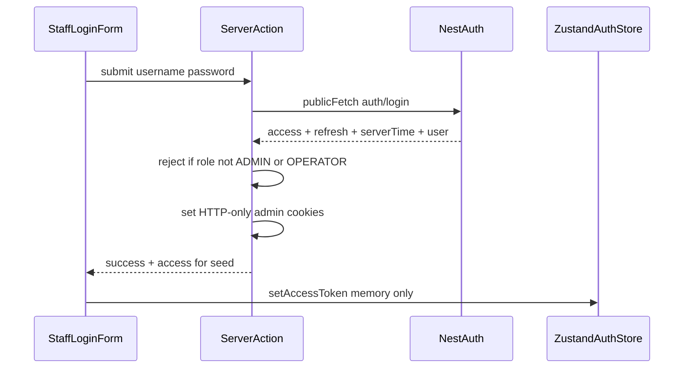
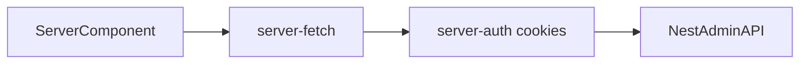

# Admin data fetching (hybrid auth)

> **Status:** Accepted  
> **Owner:** Frontend  
> **Last verified:** 2026-08-10  
> **Applies to:** `admin-panel/`  
> **Transport design:** [`../architecture/decisions/0010-client-hybrid-auth-data-fetching.md`](../architecture/decisions/0010-client-hybrid-auth-data-fetching.md)  
> **Integration:** [`../architecture/decisions/0012-admin-nest-auth-integration.md`](../architecture/decisions/0012-admin-nest-auth-integration.md)

Live Nest wiring is **allowed in `admin-panel/`** for staff auth and admin JWT
fetches (ADR 0012). First live slice: **username/password** sign-in for
`ADMIN` / `OPERATOR`, then session transport. Domain panes stay fixture-backed
until each is wired under Layer 2.

**Same as `client/`:** hybrid cookies + memory access token +
`server-fetch` / `client-fetch` / Server Actions / refresh BFF.

**Different from `client/`:** staff password login (not phone OTP); cookie name
prefix; `/api/v1/admin/*` audience; staff product UX
([`../product/`](../product/)) — do not mirror customer dashboard screens.

## Purpose

Define how `admin-panel/` obtains NestJS data after staff authentication: token
storage, runtime-split auth helpers, Server Component prefetch, and (later)
React Query for interactive ops panes.

Nest routes stay in
[`../backend/modules-and-routes.md`](../backend/modules-and-routes.md). Do not
redesign login/refresh contracts or invent admin DTOs here.

## Token responsibilities

| Token / value | Storage | Purpose | Readable by JS? |
|---|---|---|---|
| Access | HTTP-only cookie (`unixsee_admin_*`) | RSC, proxy, Server Actions → Nest Bearer | No |
| Access | Zustand (memory, per-request store) | Browser → Nest Bearer via `client-fetch` | Yes (in-memory only) |
| Refresh | HTTP-only cookie (`unixsee_admin_*`) | Session continuity; refresh BFF / server refresh | No |
| Server clock offset | HTTP-only cookie | Expiry buffer vs Nest time | No |

Never persist access or refresh in `localStorage` / `sessionStorage`. Never use
`client/` cookie names (`unixsee_access_token`, …) for admin sessions.

Refresh Route Handler responses must return `accessToken` +
`serverTimeInSeconds` only (never `refreshToken`).

## Module map

Paths under `admin-panel/src/` (target layout; implement with the auth slice):

```text
admin-panel/src/
├── proxy.ts                          # optimistic staff shell gates (+ optional light refresh)
├── app/api/auth/refresh/route.ts     # browser refresh BFF (admin cookies)
├── lib/auth/
│   ├── cookie-names.ts               # unixsee_admin_* defaults (env-overridable)
│   ├── jwt.ts                        # jose decode; shouldRefresh + buffer
│   ├── refresh-manager.ts            # single in-flight refresh promise (client)
│   ├── client-auth.ts                # getValidAccessToken (Zustand)
│   ├── server-auth.ts                # read access cookie for RSC
│   ├── server-action-auth.ts         # read / refresh / write cookies for Actions
│   └── …
├── lib/api/
│   ├── public-fetch.ts               # unauthenticated Nest login
│   ├── client-fetch.ts               # Bearer from client-auth → Nest
│   ├── server-fetch.ts               # cookie access → Nest (no Zustand)
│   ├── server-action-fetch.ts        # Action-scoped authenticated Nest calls
│   ├── map-api-error.ts              # Nest error.code → UI keys (code first)
│   └── toast-api-error.ts            # toast.error for failed mutations
├── stores/auth-store.ts              # access token + staff user DTO
└── components/providers/             # AuthStoreProvider (+ boot reseed)
```

Domain conventions (Layer 2):
[`admin-domain-data-fetching.md`](./admin-domain-data-fetching.md).

## Flows

### Auth success → cookies + Zustand seed



Prefer Server Actions for credential exchange. Clear cookies and show a
non-enumerating failure when Nest returns a non-staff role.

### Server Component fetch



Server Components never read Zustand. Prefer `cache: "no-store"` for
staff-authz data.

### Client / React Query fetch

Same shape as client Layer 1: Query → `client-fetch` → `getValidAccessToken` →
optional refresh BFF → Nest Bearer. Auth stays in `lib/auth/*`. TanStack Query
is deferred until an interactive pane needs it.

### Proxy gate

Optimistic protection for the staff shell via admin refresh/access cookie
presence. Not a substitute for auth checks in Server Actions or data helpers.

## Rules

- No JWT decode, refresh, or Bearer attachment inside page/feature components.
- No auth orchestration inside React Query hooks.
- Proactive refresh with expiry buffer is primary; one 401→refresh→retry via
  the same lock is secondary.
- `jose` decode is for timing only—not authorization.
- Staff role/capability enforcement for `/admin/*` remains Nest-owned; UI must
  not invent capability matrices that conflict with backend docs.
- Do not share auth modules or cookie jars with `client/` via a shared package
  until a separate ADR introduces one; copy the pattern, keep deployables
  separate.

## Implementation status

**Documented / authorized:** ADR 0012 + this Layer 1 sheet.

**Implemented in `admin-panel/`:** staff password login, `unixsee_admin_*`
cookies, fetch helpers, refresh BFF, proxy gate, AuthStoreProvider, `/users/me`
shell gate.

**Domain wiring:** `/tickets` list + detail + assign / resolve /
reopen / messages (see Layer 2). Other panes still use fixtures under `src/lib/data/`.

## Implementation order

1. Staff password login + hybrid session (Layer 1).
2. Wire Nest domains one at a time via
   [`admin-domain-data-fetching.md`](./admin-domain-data-fetching.md) (product
   priority; admin UX, not customer dashboard parity).
3. Add TanStack Query when an interactive pane needs client cache/refetch.

## Non-goals

- Sharing customer OTP UX or `client/` dashboard screens.
- Cookie-only BFF unless a new ADR replaces ADR 0010 for admin.
- Redesigning Nest login/refresh contracts.
- Inventing Nest DTOs beyond backend docs / contracts.
- Direct browser calls to agents or VPS hosts.

## Related

- Layer 2: [`admin-domain-data-fetching.md`](./admin-domain-data-fetching.md)
- Parallel customer docs: [`client-data-fetching.md`](./client-data-fetching.md)
- ADRs: [0010](../architecture/decisions/0010-client-hybrid-auth-data-fetching.md),
  [0012](../architecture/decisions/0012-admin-nest-auth-integration.md)
- Nest routes: [`../backend/modules-and-routes.md`](../backend/modules-and-routes.md)
- Zustand: [`state.md`](./state.md)
- Next.js: [`nextjs.md`](./nextjs.md)
