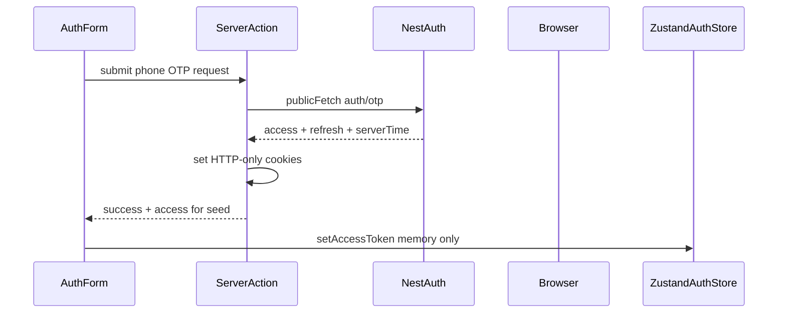
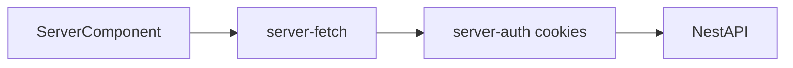
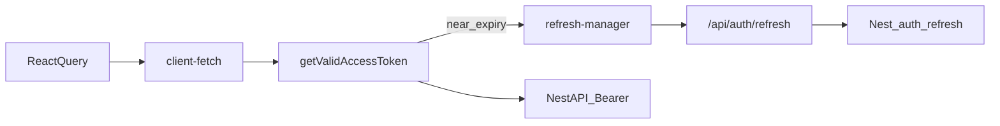
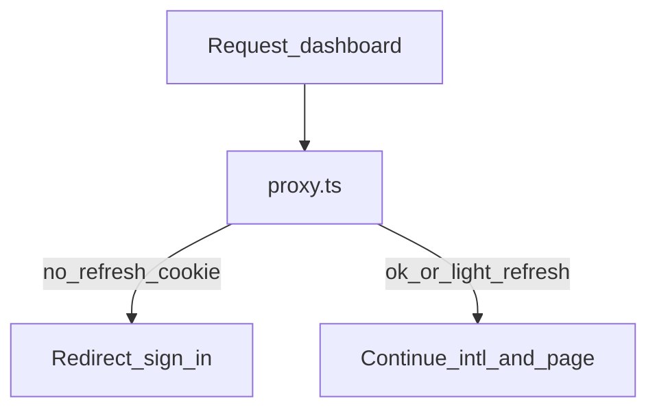

# Client data fetching (hybrid auth)

> **Status:** Accepted  
> **Owner:** Frontend  
> **Last verified:** 2026-08-11  
> **Applies to:** `client/`  
> **ADR:** [`../architecture/decisions/0010-client-hybrid-auth-data-fetching.md`](../architecture/decisions/0010-client-hybrid-auth-data-fetching.md)  
> **Integration:** [`../architecture/decisions/0011-client-nest-auth-integration.md`](../architecture/decisions/0011-client-nest-auth-integration.md)

Live Nest wiring is **allowed in `client/`** for auth and customer JWT fetches
(ADR 0011). First live slice: **phone OTP** sign-in / sign-up. Nest creates the
OTP and **delivers it** (temporary mock: SMTP email to
`PHONE_OTP_MOCK_DELIVERY_EMAIL`, default `arvin.ramezani6@gmail.com`, for any
phone number until a real SMS provider is wired). The client only calls
`/auth/otp/request` and `/auth/otp/verify` — it does not send OTP email.
Email OTP, password login, Google, and TanStack Query dashboard panes remain
deferred. Staff Nest wiring lives in `admin-panel/` under ADR 0012 /
[`admin-data-fetching.md`](./admin-data-fetching.md) (same hybrid transport,
different UX and cookies).

## Purpose

Define how `client/` obtains NestJS data after authentication: token storage,
runtime-split auth helpers, Server Component prefetch, and React Query for
live dashboard state.

Product UX (OTP-first, phone default) remains in
[`../product/ux-flows/client-auth.md`](../product/ux-flows/client-auth.md) and
[`client-auth-ui.md`](./client-auth-ui.md). Nest routes stay in
[`../backend/modules-and-routes.md`](../backend/modules-and-routes.md). Do not
redesign OTP, refresh, or invent DTOs here.

## Token responsibilities

| Token / value | Storage | Purpose | Readable by JS? |
|---|---|---|---|
| Access | HTTP-only cookie | RSC, proxy, Server Actions → Nest Bearer | No |
| Access | Zustand (memory, per-request store) | Browser → Nest Bearer via `client-fetch` | Yes (in-memory only) |
| Refresh | HTTP-only cookie | Session continuity; refresh BFF / server refresh | No |
| Server clock offset | HTTP-only cookie (or equivalent) | Expiry buffer vs Nest time | No |
| Pending login phone | HTTP-only cookie | OTP verify / resend target | No |
| OTP cooldown end | HTTP-only cookie | Absolute end of Nest resend wait (`retryAfterSeconds`) so `/otp` refresh keeps remaining seconds | No |

Never persist access or refresh in `localStorage` / `sessionStorage`. Refresh
must never appear in browser JSON responses from the refresh Route Handler.

## Module map

Paths under `client/src/` (phone OTP slice implemented; Query provider deferred):

```text
client/src/
├── proxy.ts                          # optimistic dashboard gates; guest auth bounce when signed in; optional light refresh
├── app/api/auth/refresh/route.ts     # browser refresh BFF (sets cookies; returns access + serverTime only)
├── lib/auth/
│   ├── jwt.ts                        # jose decode; shouldRefresh + buffer
│   ├── refresh-manager.ts            # single in-flight refresh promise (client)
│   ├── client-auth.ts                # getValidAccessToken (Zustand)
│   ├── server-auth.ts                # read access cookie for RSC
│   ├── server-action-auth.ts         # read / refresh / write cookies for Actions
│   └── server-cookie.ts              # cookie name helpers
├── lib/api/
│   ├── public-fetch.ts               # unauthenticated Nest auth calls
│   ├── client-fetch.ts               # Bearer from client-auth → Nest
│   ├── server-fetch.ts               # cookie access → Nest (no Zustand)
│   ├── server-action-fetch.ts        # Action-scoped authenticated Nest calls
│   ├── map-api-error.ts              # Nest error.code → UI keys (code first)
│   ├── resolve-api-error-message.ts  # Mapped key → ApiErrors i18n string
│   └── toast-api-error.ts            # toast.error for failed mutations
├── stores/auth-store.ts              # access token + user DTO; per-request provider
└── components/providers/             # AuthStoreProvider (+ boot reseed); future QueryClientProvider
```

Domain conventions (Layer 2): [`client-domain-data-fetching.md`](./client-domain-data-fetching.md).

## Flows

### Auth success → cookies + Zustand seed



Exact Nest email OTP path is unsupported today; phone OTP is the live slice.
Prefer Server Actions for credential/OTP exchange.

### Server Component fetch



Server Components never read Zustand. Prefer `cache: "no-store"` for
user-specific authz data unless Cache Components policy is decided separately.

### Client / React Query fetch



Auth logic stays in `lib/auth/*`. React Query must not decode JWTs or call
refresh itself (Query deferred for this slice).

### Proxy gate



Proxy is optimistic only. Re-check auth inside every Server Action and
privileged data helper. Do not claim Proxy “protects” Server Actions.

## Rules

- **API endpoint format:** The base URL (`UNIXSEE_CORE_API_BASE_URL`) is always `.../api/v1`. When calling `serverFetch`, `clientFetch`, or `publicFetch`, pass the path **after** `/api/v1`. **Never** include `/v1/` in the endpoint — this creates a double `/api/v1/v1/...` URL. Use `/auth/otp/request`, `/plan-requests`, `/users/me`, etc. — not `/v1/auth/otp/request`.
  - ✅ `serverFetch('/auth/otp/request')` → `http://host:4000/api/v1/auth/otp/request`
  - ❌ `serverFetch('/v1/auth/otp/request')` → `http://host:4000/api/v1/v1/auth/otp/request`
- No JWT decode, refresh, or Bearer attachment inside page/feature components.
- No auth orchestration inside React Query hooks.
- Proactive refresh with expiry buffer is primary; one 401→refresh→retry via
  the same lock is secondary.
- Refresh Route Handler response: `accessToken` + `serverTimeInSeconds` only
  (never `refreshToken`).
- `jose` decode is for timing only—not authorization.
- Prefer Server Components for initial dashboard shell; dehydrate/hydrate when
  React Query is introduced so the client does not duplicate the first fetch
  unnecessarily.

## Implementation status

**Layer 1 (session):** phone OTP request/verify (sign-in and phone sign-up);
Nest owns OTP delivery (email mock today / SMS later) and resend cooldown
(`data.retryAfterSeconds` / `429` `error.details.retryAfterSeconds`); hybrid
cookies + Zustand access seed, refresh Route Handler, proxy dashboard gate,
`GET /users/me` via `server-fetch`, boot reseed of memory access token via
`/api/auth/refresh`.

**Layer 2 (domain):** conventions in
[`client-domain-data-fetching.md`](./client-domain-data-fetching.md) — transport
table, `ApiResponse` errors, Query keys/dehydrate, feature checklist. TanStack
Query package still deferred until the first interactive pane needs it.

**Deferred auth surfaces:** email OTP (Nest phone-only DTOs), password
login/register wiring, Google, forgot/reset.

## Implementation order (remaining)

1. Follow Layer 2 checklist when wiring each Nest domain (start with tickets).
2. Add TanStack Query when an interactive pane needs client cache/refetch.
3. Email OTP only after Nest supports it—do not invent DTOs.

## Non-goals

- Cookie-only BFF (Model B)—rejected by ADR 0010 unless a new ADR replaces it.
- Redesigning Nest OTP/refresh contracts.
- Inventing Nest DTOs beyond backend docs.
- Treating external monitoring-app code as canonical Unixsee (inspiration only;
  not a monorepo source of truth).
- Nest wiring details for `admin-panel/` — see
  [`admin-data-fetching.md`](./admin-data-fetching.md) and ADR 0012.

## Related

- Layer 2 domain fetching: [`client-domain-data-fetching.md`](./client-domain-data-fetching.md)
- Design ADR: [`../architecture/decisions/0010-client-hybrid-auth-data-fetching.md`](../architecture/decisions/0010-client-hybrid-auth-data-fetching.md)
- Integration ADR: [`../architecture/decisions/0011-client-nest-auth-integration.md`](../architecture/decisions/0011-client-nest-auth-integration.md)
- Superseded UI-only: [`../architecture/decisions/0003-ui-only-phase-boundaries.md`](../architecture/decisions/0003-ui-only-phase-boundaries.md)
- Auth UI: [`client-auth-ui.md`](./client-auth-ui.md)
- Auth UX: [`../product/ux-flows/client-auth.md`](../product/ux-flows/client-auth.md)
- Nest routes: [`../backend/modules-and-routes.md`](../backend/modules-and-routes.md)
- Zustand: [`state.md`](./state.md)
- Next.js conventions: [`nextjs.md`](./nextjs.md)
