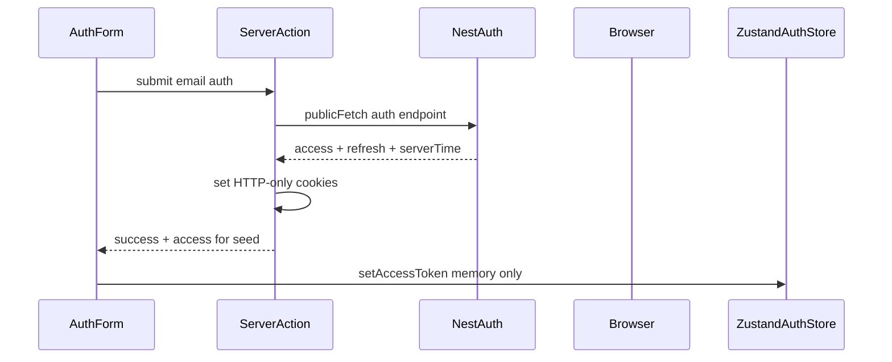
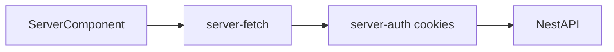
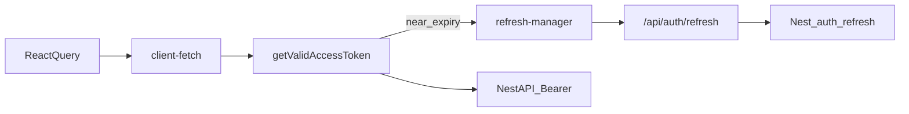
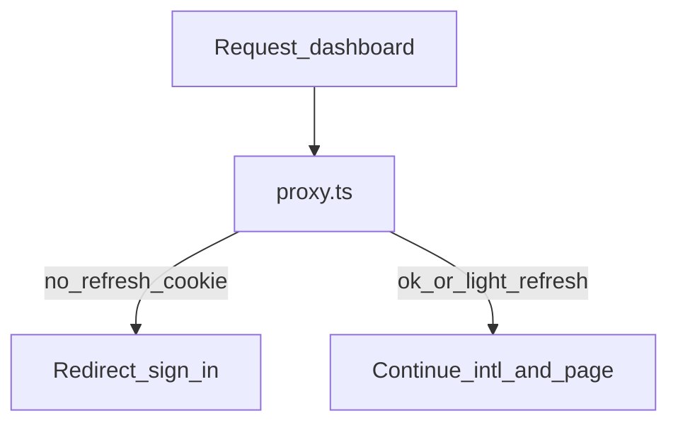

# Client data fetching (hybrid auth)

> **Status:** Draft  
> **Owner:** Frontend  
> **Last verified:** 2026-08-10  
> **Applies to:** `client/` (planned)  
> **ADR:** [`../architecture/decisions/0010-client-hybrid-auth-data-fetching.md`](../architecture/decisions/0010-client-hybrid-auth-data-fetching.md)

**Planned architecture only.** Live Nest/auth wiring in Next.js apps is
**blocked** by
[`../architecture/decisions/0003-ui-only-phase-boundaries.md`](../architecture/decisions/0003-ui-only-phase-boundaries.md).
Paths below are target layout when a later ADR lifts UI-only—not a claim that
modules already exist in `client/`.

## Purpose

Define how `client/` obtains NestJS data after authentication: token storage,
runtime-split auth helpers, Server Component prefetch, and React Query for
live dashboard state.

Product UX (OTP-first, phone default) remains in
[`../product/ux-flows/client-auth.md`](../product/ux-flows/client-auth.md) and
[`client-auth-ui.md`](./client-auth-ui.md). Nest routes stay in
[`../backend/modules-and-routes.md`](../backend/modules-and-routes.md). Do not
redesign OTP, refresh, or invent DTOs here.

## Token responsibilities

| Token / value | Storage | Purpose | Readable by JS? |
|---|---|---|---|
| Access | HTTP-only cookie | RSC, proxy, Server Actions → Nest Bearer | No |
| Access | Zustand (memory, per-request store) | Browser → Nest Bearer via `client-fetch` | Yes (in-memory only) |
| Refresh | HTTP-only cookie | Session continuity; refresh BFF / server refresh | No |
| Server clock offset | HTTP-only cookie (or equivalent) | Expiry buffer vs Nest time | No |

Never persist access or refresh in `localStorage` / `sessionStorage`. Refresh
must never appear in browser JSON responses from the refresh Route Handler.

## Planned module map

```text
client/src/
├── proxy.ts                          # optimistic dashboard gates (+ optional light refresh)
├── app/api/auth/refresh/route.ts     # browser refresh BFF (sets cookies; returns access + serverTime only)
├── lib/auth/
│   ├── jwt.ts                        # jose decode; shouldRefresh + buffer
│   ├── refresh-manager.ts            # single in-flight refresh promise (client)
│   ├── client-auth.ts                # getValidAccessToken (Zustand)
│   ├── server-auth.ts                # read access cookie for RSC
│   ├── server-action-auth.ts         # read / refresh / write cookies for Actions
│   └── server-cookie.ts              # cookie name helpers
├── lib/api/
│   ├── public-fetch.ts               # unauthenticated Nest auth calls
│   ├── client-fetch.ts               # Bearer from client-auth → Nest
│   ├── server-fetch.ts               # cookie access → Nest (no Zustand)
│   └── server-action-fetch.ts        # Action-scoped authenticated Nest calls
├── stores/auth-store.ts              # access token + user DTO; per-request provider
└── components/providers/             # AuthStoreProvider; future QueryClientProvider
```

## Flows

### Auth success → cookies + Zustand seed



Exact Nest email path (password vs OTP-email) is product/backend open until
contracts confirm it. Prefer Server Actions + `useActionState` for credential
exchange when implementation starts.

### Server Component fetch



Server Components never read Zustand. Prefer `cache: "no-store"` for
user-specific authz data unless Cache Components policy is decided separately.

### Client / React Query fetch



Auth logic stays in `lib/auth/*`. React Query must not decode JWTs or call
refresh itself.

### Proxy gate



Proxy is optimistic only. Re-check auth inside every Server Action and
privileged data helper. Do not claim Proxy “protects” Server Actions.

## Rules

- No JWT decode, refresh, or Bearer attachment inside page/feature components.
- No auth orchestration inside React Query hooks.
- Proactive refresh with expiry buffer is primary; one 401→refresh→retry via
  the same lock is secondary.
- Refresh Route Handler response: `accessToken` + `serverTimeInSeconds` only
  (never `refreshToken`).
- `jose` decode is for timing only—not authorization.
- Prefer Server Components for initial dashboard shell; dehydrate/hydrate when
  React Query is introduced so the client does not duplicate the first fetch
  unnecessarily.

## Email-first implementation order (after ADR 0003 is lifted)

1. Public email auth Server Action via `public-fetch` → Nest.
2. Set HTTP-only access + refresh (+ clock offset) cookies.
3. Seed Zustand access token for the client store.
4. `proxy.ts` gate for locale-aware `/dashboard/*`.
5. RSC `server-fetch` for `/users/me` (or equivalent) shell.
6. Add TanStack Query + `client-fetch` for interactive dashboard panes.
7. Prefetch → dehydrate → hydrate only after auth helpers are stable.

OTP phone flows and Google remain product surfaces; wire them with the same
token and fetch boundaries—do not invent a second session model.

## Non-goals

- Cookie-only BFF (Model B)—rejected by ADR 0010 unless a new ADR replaces it.
- Redesigning Nest OTP/refresh contracts.
- Inventing Nest DTOs beyond backend docs.
- Treating external monitoring-app code as canonical Unixsee (inspiration only;
  not a monorepo source of truth).
- Installing `jose` / TanStack Query or adding `lib/auth` while ADR 0003 holds.

## Related

- Design ADR: [`../architecture/decisions/0010-client-hybrid-auth-data-fetching.md`](../architecture/decisions/0010-client-hybrid-auth-data-fetching.md)
- UI-only phase: [`../architecture/decisions/0003-ui-only-phase-boundaries.md`](../architecture/decisions/0003-ui-only-phase-boundaries.md)
- Auth UI: [`client-auth-ui.md`](./client-auth-ui.md)
- Auth UX: [`../product/ux-flows/client-auth.md`](../product/ux-flows/client-auth.md)
- Nest routes: [`../backend/modules-and-routes.md`](../backend/modules-and-routes.md)
- Zustand: [`state.md`](./state.md)
- Next.js conventions: [`nextjs.md`](./nextjs.md)
