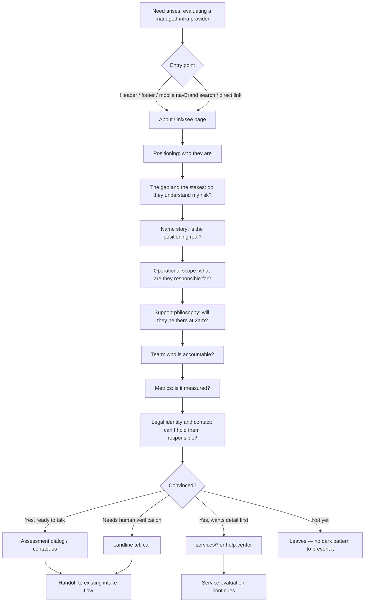

# About Unixsee page — Product Requirements Document (PRD)

> **Status:** Proposed
> **Owner:** Product, content, and frontend teams
> **Surfaces:** Public marketing site only — `client/src/app/[locale]/(website)/about-us/`
> **Phase:** Phase 1 — public site; no backend dependency
> **Page name:** About Unixsee / درباره یونیکسی
> **Route:** `/about-us` (FA default, unprefixed) and `/en/about-us`
> **Not this PRD:** Service/pricing pages, contact intake mechanics, help center, careers, parent-company content
> **Audience:** Product, content strategy, UX, and client frontend teams
> **Last verified:** 2026-08-25

## 1. Purpose

Define the intended contract for a public **About Unixsee** page whose job is
**trust and due diligence**, not selling. The reader has usually already seen
the service pages; this page must let them decide whether a real, accountable,
competent organization stands behind the infrastructure their revenue depends
on.

This PRD carries three layers in one document, as requested: content
architecture (§6–§11), UX and flow specification (§12–§19), and the product
contract (§3–§5, §20–§24).

### 1.1 Why this page is being written now

`«درباره یونیکسی»` is already published in the header, footer, and mobile
navigation and points at `/about-us`, which **does not exist**. Every visitor
who follows the most trust-motivated link on the site currently receives a 404.
This is a live defect, not a greenfield feature. Evidence: §22 E-1, E-2.

## 2. Decisions taken (do not re-litigate)

Recorded so later agents and sessions do not re-open settled questions.

| ID | Decision | Consequence |
|---|---|---|
| D-1 | **Fully independent brand. No parent-company mention.** | novinsatrap.com is *source evidence only*. "نوین ساتراپ" / "Novin Satrap" must never appear in page copy, metadata, or structured data. `info@novinsatrap.com` must **not** be published here (§21 B-2). |
| D-2 | **Primary job: trust / due diligence.** | Section order answers "can I rely on you", not "buy now". CTA is present but secondary and low-pressure (§9.9). Do not duplicate service-page selling. |
| D-3 | **All four proof categories are publishable:** legal entity + address + landline; founding year + operating history; named team and leadership; operational metrics. | Each gets a real section with a real slot. Categories are approved; **the values are not all supplied yet** — see §14 and §21. |
| D-4 | **Content lives in next-intl messages** (`client/src/messages/fa.json` + `en.json`). | No WordPress dependency. Matches every other page and the mandatory next-intl rule in `client/AGENTS.md`. The commented-out `wordpressClient` path is explicitly not revived for this page. |

Source: product decision session 2026-08-25.

## 3. Product outcomes

- A visitor following `«درباره یونیکسی»` from any navigation surface reaches a
  real page instead of a 404.
- A store owner evaluating Unixsee can, without contacting sales, establish:
  who operates the service, since when, from where, under what legal identity,
  reachable on what number, and with what demonstrated operational record.
- The brand's existing Persian narrative — the hosting-gap thesis and the
  Unix + See naming story — becomes a readable, scannable page instead of a
  ~1,700-character wall of text buried in the footer (§22 E-3).
- The page carries Unixsee's entity/organization SEO signals (§11), which no
  current page owns.
- English reaches genuine content parity with Persian rather than remaining a
  269-character summary (§22 E-4).
- A reader who becomes convinced has an obvious, non-aggressive next step.

## 4. Non-goals (explicit exclusions)

| Excluded | Owner instead |
|---|---|
| Selling plans, listing prices, comparing tiers | `/services/*`, `/dashboard/plans` |
| Contact form mechanics, subject taxonomy, file upload | `/contact-us` (`ContactUsPage` messages) |
| Plan or consultation request intake and OTP | [`ux-flows/customer-public-plan-request.md`](./ux-flows/customer-public-plan-request.md) |
| Parent-company story, group ecosystem, brand portfolio | Out of scope by D-1 |
| Careers / `«فرصت‌های همکاری»` | Deferred; likely belongs to the parent site |
| Case studies and testimonials as a main section | Existing `portfolio-logos.tsx`, `testimonial/` components; About links out only |
| Blog / `«دیدگاه‌ها»` | Existing `blog-section.tsx` |
| Any backend route, DTO, or CMS schema | No API dependency; page is static content |
| Publishing an SLA or uptime **guarantee** | Commercial contract, not marketing copy (§10.3) |
| Team member individual profile pages | Out for v1; single section only |

## 5. Actors and access

| Actor | Capability | Restrictions |
|---|---|---|
| Anonymous visitor | Full read of the page in FA or EN; may call the landline, open the assessment dialog, or navigate onward | No auth required; page must never gate content behind sign-in |
| Authenticated customer | Same page, same content | Page is locale-aware but not session-aware; do not personalize |
| Search crawler | Full render without JS execution | All trust-critical content must be server-rendered (§13.2) |
| Content editor | Edits FA/EN message keys, ships via deploy | No CMS by D-4; key mirroring is enforced by review (§11.4) |

No tenant scoping, no authorization, no backend authority. This page sits fully
inside the presentation-only boundary described in
[`../architecture/decisions/0003-ui-only-phase-boundaries.md`](../architecture/decisions/0003-ui-only-phase-boundaries.md).

## 6. Users and user needs

Written as outcomes, not features. Confidence labelled per
[`../quality/documentation.md`](../quality/documentation.md) conventions.

| ID | Need | Confidence |
|---|---|---|
| N-1 | As a WooCommerce store owner about to hand over the infrastructure my revenue depends on, I need to establish that a real and accountable organization stands behind it, so that I can justify the risk to myself and to my partners. | Inferred from D-2 and category norms |
| N-2 | As a technically literate evaluator, I need to see whether this provider understands ecommerce *operations* specifically, so that I can tell them apart from a generic host reselling shared hosting. | Confirmed — this gap is the brand's own stated founding thesis (§22 E-3) |
| N-3 | As a cautious buyer of a specialist service, I need evidence the provider will still exist and will answer during a 2 a.m. incident, so that I am not left alone mid-crisis. | Inferred; directly addressed by the existing support-philosophy copy |
| N-4 | As someone who clicked the most trust-seeking link in the navigation, I need to arrive at a page at all, so that my confidence is not destroyed at the exact moment I was seeking reassurance. | **Confirmed — currently fails** (§22 E-1) |
| N-5 | As a non-Persian stakeholder assessing this vendor, I need the same substance in English, so that I can participate in the decision. | Observed gap (§22 E-4); audience composition is **Unknown** (O-5) |

Every section in §9 traces to at least one of these.

## 7. Positioning and messaging architecture

### 7.1 Positioning statement (from approved copy, not invented)

> یونیکسی فقط میزبان فروشگاه شما نیست؛ شریک عملیاتی رشد آن است.

Unixsee is the operational layer a WooCommerce store's stability depends on —
managed servers, observability, security, and operational responsiveness — not
a hosting product.

### 7.2 Messaging pillars

| # | Pillar | Persian anchor | Why it earns page space | Proof it requires |
|---|---|---|---|---|
| 1 | Observability — we see it before you do | مشاهده‌پذیری | The brand name itself encodes it; strongest differentiator against generic hosts | The name story; monitoring scope; metrics (§9.7) |
| 2 | Operational stability built for selling, not just uptime | پایداری عملیاتی | Reframes the category from "is it up" to "is it selling" | The stakes narrative; operational scope |
| 3 | Proactive ownership, not ticket-answering | مسئولیت‌پذیری | Directly answers N-3, the strongest unspoken objection | Support philosophy; named team; response metrics |
| 4 | WooCommerce specialization | تخصص ووکامرس | The founding thesis; answers N-2 | Founding story; scope; operating history |

### 7.3 Voice

Plain, technically credible, calm. Persian is native and structurally
Persian — not translated English. Forbidden: fake urgency, unqualified
superlatives (`بهترین`, `شماره یک`), startup filler, keyword stuffing, and any
number that is not measured. The existing footer narrative is the tonal
reference; it is confident without inflation and should be preserved in
character.

## 8. Market and localization architecture

**Model: Localized.** Structure is shared FA/EN; messaging is transcreated, not
translated.

| Content | Behavior | Note |
|---|---|---|
| Section order and structure | **Shared unchanged** | One page architecture, two locales |
| Positioning, founding thesis, name story, support philosophy | **Transcreated** | Preserve meaning, intent, and emotional effect; never word-for-word. FA is authored first and is the reference. |
| Legal entity, address, landline | **Translated with locale formatting** | Already correctly handled: FA `۰۱۱-۴۴۴-۱۲۴۴۶` / EN `+98-11-444-12446`; EN address is prefixed `Iran,` (§22 E-6). Reuse `common.phone` and `common.address` — do not duplicate these values into new keys. |
| Founding year | **Translated with locale formatting** | Persian digits and Jalali/Gregorian presentation to be decided (O-3) |
| Team names and roles | **Transcreated** | Transliterate names; do not translate personal names literally |
| Operational metrics | **Translated with locale formatting** | Persian digits in FA; identical underlying values in both locales |
| Meta title/description | **Transcreated** | Distinct search intent per language (§11) |

FA is the default locale and renders unprefixed (`localePrefix: "as-needed"`,
`defaultLocale: "fa"`). Persian is primary in priority, not merely first in a
list.

## 9. Page content architecture

Section order follows the reader's decision sequence for a due-diligence
visit, not a generic landing-page template. The reader arrives already knowing
roughly what Unixsee sells; they are deciding whether to believe it.

### 9.1 Section summary

| # | Section | Job | Serves | Priority | Mobile |
|---|---|---|---|---|---|
| 1 | Positioning hero | State plainly who Unixsee is and what it claims to be | N-1, N-2 | Critical | Above fold, compressed |
| 2 | چرا یونیکسی ساخته شد — the gap and the stakes | Prove we understand what is at risk for the reader | N-2 | Critical | Decomposed, progressive |
| 3 | معنای نام — Unix + See | Prove the positioning is intentional, not marketing | N-2 | Important | Full, it is short |
| 4 | کاری که انجام می‌دهیم — operational scope | Define the responsibility boundary without re-selling | N-1, N-2 | Important | Condensed list |
| 5 | نگاه ما به پشتیبانی — support philosophy | Answer the 2 a.m. objection | N-3 | Critical | Full |
| 6 | تیم — named team and leadership | Put accountable human names behind the service | N-1, N-3 | Critical (per D-3) | Compressed cards |
| 7 | اعداد عملیاتی — operational metrics | Convert claims into measured evidence | N-1, N-3 | Important | 2-up grid |
| 8 | هویت حقوقی و تماس — legal identity and contact | Close due diligence with verifiable facts | N-1 | Critical | Full, tappable |
| 9 | Next step | Give a low-pressure exit for the convinced reader | All | Supporting | Persistent or inline |

### 9.2 Section 1 — Positioning hero

- **Reader question:** "Who are you, in one sentence I can repeat to a colleague?"
- **Key message:** §7.1 positioning statement.
- **Content:** H1 `درباره یونیکسی`; the operational-partner line as the lead
  statement; one supporting sentence drawn from
  «یونیکسی برای فروشگاه‌هایی ساخته شده که نمی‌خواهند زیرساخت برایشان یک دغدغه دائمی باشد».
  Optionally the `I see you` slogan already in `common.slogan`.
- **Must not:** carry a sales headline, a price, or a plan CTA.
- **Above the fold on mobile:** positioning line **plus one credibility
  anchor** — operating-since or city. A trust page whose first screen carries
  no verifiable fact wastes its most valuable space.

### 9.3 Section 2 — چرا یونیکسی ساخته شد

- **Reader question:** "Do you actually understand my risk, or are you a host with better copy?"
- **Key message:** A store is not a website. The gap between generic hosting
  and real WooCommerce needs is why Unixsee exists.
- **Content source:** the existing footer narrative, **decomposed** — see §9.10.
- **Structure requirement:** this must become a lead statement plus scannable
  stake items (slowness, payment errors, database faults, security issues,
  short outages → sales, customer trust, brand credibility). Do **not** paste
  the paragraph. The current single-block form is the defect being fixed.
- **Objection addressed:** "every host says this."  Countered by naming
  specific ecommerce failure modes rather than generic uptime language.

### 9.4 Section 3 — معنای نام

- **Reader question:** "Is this positioning real or retrofitted?"
- **Key message:** Unix = power, stability, technical roots. See =
  observability, monitoring, continuous watch. The combination defines the
  approach: infrastructure that is always watched.
- **Why it stays despite being "brand fluff":** it is the cheapest available
  proof that observability is structural rather than a feature list item, and
  it is memorable in both languages. Keep it short — two sentences and the
  closing line.

### 9.5 Section 4 — کاری که انجام می‌دهیم

- **Reader question:** "What exactly are you responsible for?"
- **Content:** continuous monitoring of managed servers and services;
  infrastructure maintenance and operations; 24/7 operational support;
  incident management; security; and the web applications for control,
  observability, access, and security of store infrastructure.
- **Boundary rule:** this is a **responsibility boundary**, not a service
  catalogue. Two to three lines per item maximum. Every item links out to the
  owning `/services/*` page rather than expanding here.
- **Internal links:** `/services/managed-woocommerce-server`,
  `/services/migration-optimization`, `/help-center`.

### 9.6 Section 5 — نگاه ما به پشتیبانی

- **Reader question:** "Will you actually be there when it breaks?"
- **Key message:** Support is not ticket-answering. Problems are identified
  before they become crises; the store's technical state is continuously
  watched; technical obstacles are removed ahead of growth.
- **Serves N-3 directly.** This is the highest-value section for the page's
  stated job and must not be trimmed for length.
- **Proof it should carry if available:** the response-time metric from §9.7,
  placed inline rather than only in the metrics grid.

### 9.7 Section 6/7 — Team and operational metrics

Both approved by D-3; both currently **unvalued** (§21).

**Team (§6):** real names, roles, and optionally faces of the people running
operations. This is a genuine differentiator against anonymous resellers — and
only if the values are real. Minimum viable form: name, role, one line of
relevant responsibility. Photos optional; a consistent illustrated or initial
treatment is acceptable and preferable to stock photography, which would
actively damage the page's only job.

**Metrics (§7):** each published metric **must** carry:

| Requirement | Reason |
|---|---|
| A stated definition (what is counted) | "Uptime" without a definition is unfalsifiable |
| A measurement window and source system | Makes the number auditable internally |
| A last-reviewed date and a named review owner | Prevents a stale number becoming a lie |
| Past/observed phrasing, never forward-looking | A forward promise is an SLA, which belongs in the contract, not on a marketing page (§4) |

Metrics that cannot meet all four are omitted, not rounded or estimated. See
§14 for the render/omit rule and O-2 for the open guardrail decision.

### 9.8 Section 8 — هویت حقوقی و تماس

- **Reader question:** "Are you a registered company I could hold responsible?"
- **Content:** registered legal entity name, registration identifiers, full
  physical address, landline. In Iranian B2B infrastructure purchasing this is
  the strongest single trust signal, which is why it closes the page rather
  than hiding in a footer.
- **Available now (Confirmed, already in the repo):** address —
  `مازندران، بابلسر، خیابان پاسداران، نبش پاسداران ۲۴، مجتمع ترنم، طبقه ۶`;
  landline — `۰۱۱-۴۴۴-۱۲۴۴۶` / `+98-11-444-12446`. Reuse `common.address` and
  `common.phone`; do not fork these values.
- **Unknown / blocking:** registered entity name, registration number, and a
  **Unixsee-owned email address**. No email exists anywhere in the message
  catalogue, and D-1 forbids using the parent's (§21 B-2).
- **Markup:** semantic `<address>`; landline as a `tel:` link; feeds the
  Organization structured data in §11.3.

### 9.9 Section 9 — Next step

- Low-pressure by D-2. Primary: store assessment / consultation via the
  existing `request-assessment-dialog`. Secondary: `/contact-us` and the
  landline.
- **Forbidden:** countdowns, scarcity claims, "limited slots" language, or a
  plan-selection CTA. A due-diligence reader converts on confidence, and
  pressure at this position reads as compensation for weak evidence.

### 9.10 Existing-copy decomposition map

The Persian narrative in `HomePage.SiteFooter.description` is approved brand
copy and the primary content input. It maps to the new architecture as follows —
this is a restructure, not a rewrite.

| Existing sentence (abbreviated) | Destination |
|---|---|
| «یونیکسی با یک هدف روشن متولد شد: پر کردن فاصله‌ای که میان هاستینگ‌های عمومی و نیازهای واقعی فروشگاه‌های ووکامرس وجود دارد» | §9.3 lead |
| «فروشگاه اینترنتی، فقط یک وب‌سایت نیست. هر ثانیه کندی، هر خطای پرداخت، هر اختلال در دیتابیس…» | §9.3 stake items |
| «به همین دلیل، زیرساخت یک فروشگاه ووکامرس باید فراتر از میزبانی معمولی باشد…» | §9.3 close / bridge |
| «نام یونیکسی از ترکیب دو مفهوم شکل گرفته است: Unix… و See…» | §9.4 body |
| «این ترکیب، نگاه ما را تعریف می‌کند: زیرساختی قدرتمند که همیشه دیده می‌شود…» | §9.4 close |
| «ما در یونیکسی فقط هاست ارائه نمی‌کنیم. ما یک بستر عملیاتی… می‌سازیم» | §9.5 lead |
| «نگاه ما به پشتیبانی، صرفاً پاسخ‌دادن به تیکت نیست…» | §9.6 body |
| «یونیکسی برای فروشگاه‌هایی ساخته شده که نمی‌خواهند زیرساخت برایشان یک دغدغه دائمی باشد» | §9.2 supporting line |
| «یونیکسی فقط میزبان فروشگاه شما نیست؛ شریک عملیاتی رشد آن است» | §9.2 lead / positioning |

**Footer decision required (O-4):** whether the footer keeps the full narrative,
is reduced to a short summary linking to `/about-us`, or is left untouched.
Recommended: reduce the footer to two or three sentences and link out. Keeping
both at full length creates duplicate content and an SEO self-competition
problem for the same entity topic.

## 10. Content priority and mobile hierarchy

### 10.1 Priority classification

| Priority | Sections |
|---|---|
| Critical | 1 positioning, 2 the gap, 5 support philosophy, 6 team, 8 legal identity |
| Important | 3 name story, 4 operational scope, 7 metrics |
| Supporting | 9 next step |
| Optional | Team photos; slogan in hero; inline links to case studies |

### 10.2 Mobile treatment

- **Above the fold:** positioning line + one credibility anchor (§9.2).
- **Progressive disclosure:** §9.3 stake items may collapse after the first
  two; §9.5 scope items may collapse after three. Never collapse §9.6, §9.8, or
  any legal fact.
- **Persistent CTA:** not required. A due-diligence page with a sticky sales
  bar contradicts D-2. The existing bottom floating navigation is sufficient.
- **Removable on small viewports:** the slogan, decorative backgrounds, team
  photos (fall back to name + role), and any inline case-study links.
- **Tap targets:** the landline and the CTA must meet the minimum target size
  in `client/docs/engineering/ui.md`; the phone number is the single most
  likely mobile interaction on this page.

### 10.3 Honesty constraints

- No metric without §9.7's four requirements.
- No stock-photo "team".
- No claim of scale, client count, or years of operation that is not verified.
- No uptime or response **guarantee** — only observed record.

## 11. SEO architecture

### 11.1 Topic ownership

This page owns the **entity/brand topic** — "who is Unixsee" — and nothing
commercial. Commercial intent stays with `/services/*`. No page currently owns
the entity topic, which is why brand and due-diligence queries have no
authoritative destination.

### 11.2 Intent and targeting

| Locale | Intent | Direction |
|---|---|---|
| FA | Brand/entity and trust intent — brand-name queries, "درباره یونیکسی", "یونیکسی چیست", provider-credibility queries | Primary target |
| EN | Brand-name and vendor-verification intent | Secondary |

**Research required:** actual Persian query variants, demand, and competing
result patterns. No volume, difficulty, or ranking figure is asserted in this
PRD and none may be invented downstream (O-6).

### 11.3 Technical SEO

| Element | Direction |
|---|---|
| URL | `/about-us` FA unprefixed, `/en/about-us`. Do **not** introduce `/about` (§12.4). |
| H1 | One only — `درباره یونیکسی` / `About Unixsee` |
| Heading order | Strict h1 → h2 per section; no level skipping |
| Metadata | New `Metadata.about` key in both locales. Transcreated, not translated. No `Metadata.about` key exists today. |
| Structured data | `Organization` JSON-LD: `name`, `legalName`, `url`, `logo`, `address` (PostalAddress), `telephone`, `foundingDate`, `sameAs`. This is the natural home for it and it consumes exactly the D-3 proof assets. Emit only populated fields. |
| hreflang | Already handled by `alternateLinks: true` in `routing.ts` — no per-page work |
| Internal links in | Header, footer, mobile nav (all three already link here), plus service pages |
| Internal links out | `/services/*`, `/contact-us`, `/help-center` |

Structured data must contain **no** parent-company reference (D-1) and must not
assert a `foundingDate` until O-3 resolves.

### 11.4 Message-key contract

- Namespace: `AboutPage` in both `fa.json` and `en.json`, mirrored key-for-key.
- Reuse `common.phone`, `common.address`, `common.brand`, `common.slogan`
  rather than duplicating values.
- All copy through `useTranslations` / `t()`. The `no-restricted-syntax` lint
  rule blocks Persian literals at `error` level — hardcoding Persian will fail
  lint, per `client/AGENTS.md`.

## 12. Implementation contract

### 12.1 Placement

```text
client/src/app/[locale]/(website)/about-us/
  page.tsx                     # Server Component, metadata export
  _components/                 # page-local sections
```

Follows the `(website)` route-group convention used by `contact-us` and
`services`. Sections are page-local unless reused elsewhere, per
`client/docs/engineering/repository-structure.md`.

### 12.2 Rendering

- Server Component by default; static — no data fetching, no backend call.
- Client boundaries only where interaction requires them (progressive
  disclosure, the assessment dialog trigger, any Framer Motion).
- No `loading.tsx` required: the dashboard skeleton rule in `client/AGENTS.md`
  applies to `(dashboard)` routes, not `(website)`.

### 12.3 Reuse

- `Header` / `Footer` come from the `(website)` layout automatically.
- `request-assessment-dialog` for the §9.9 CTA — do not build a new form.
- Follow existing section-component patterns in
  `(website)/_components/sections/`.
- `about-us-section.tsx` is an empty stub, commented out of the home page.
  Either delete it or repurpose it as a short home-page teaser linking to
  `/about-us` — do not leave a second empty About surface (O-7).

### 12.4 Navigation and route-conflict repair

Two conflicting definitions exist. Resolving this is **in scope** for the
implementing change.

| File | Href | Status | Action |
|---|---|---|---|
| `client/src/lib/translation-keys.ts:61` | `/about-us` | **Live** — consumed by `header.tsx`, `footer/footer.tsx`, `mobile-navigation.tsx` | Keep. Building at `/about-us` fixes all three surfaces with no nav edit. |
| `client/src/components/layout/navigation.tsx:10` | `/about` | **Dead code** — only imported by `disabled.header.tsx` | Delete the stale module, or correct the href so a future re-enable does not resurrect the 404. |

Do not add a `/about` route or redirect for a link that is not reachable from
any live surface.

## 13. Journeys and entry points

### 13.1 Entry points

| Entry | Reader state | Implication |
|---|---|---|
| Header `«درباره یونیکسی»` | Mid-evaluation, has seen services | Primary path — assume prior context |
| Footer `«درباره ما»` | Finished reading another page, seeking reassurance | Same page serves both labels |
| Mobile navigation | As above, small viewport | §10.2 governs |
| Organic brand search | Verifying a vendor, may have zero prior context | Page must stand alone without home-page context |
| Direct / referral link | Shared by a colleague during internal evaluation | Must read well to a second-hand reader |

Two of these five arrive with **no** prior site context, so the page cannot
assume the reader has read the service pages — hence the self-contained
positioning in §9.2.

### 13.2 Proposed journey



The journey ends when the reader either transfers to an existing intake flow,
continues evaluating elsewhere on the site, or leaves informed. Intake beyond
that handoff belongs to
[`ux-flows/customer-public-plan-request.md`](./ux-flows/customer-public-plan-request.md).

### 13.3 Current journey (for contrast)

Reader clicks `«درباره یونیکسی»` → **404** → trust damaged at the moment of
maximum receptiveness → likely abandonment or an unnecessary support contact.
The only place the brand narrative currently exists is the footer, where it is
a ~1,700-character single block that is effectively unreadable on mobile.

## 14. Rendering states and the omit rule

This is a static content page, so it has few states — but the proof-slot
behavior is a genuine contract, not a styling detail.

| State | User-visible result | Rule |
|---|---|---|
| Fully populated | All nine sections render | Normal case |
| A proof value is missing | The section is **absent entirely** | Never render an empty shell, a placeholder, a `—`, or `«به‌زودی»` on a trust page. A visible gap where accountability should be is worse than a shorter page. |
| Team not yet approved | §9.6 omitted; §9.8 still renders | Legal identity carries accountability on its own |
| Metrics not measurable | §9.7 omitted; §9.6 response claim stays qualitative | Do not substitute an estimate |
| Locale missing a key | next-intl fallback behavior | Mirrored keys are a review gate (§11.4); a missing EN key must fail review, not ship silently |
| JS disabled / crawler | Full content renders | All trust-critical content is server-rendered; progressive disclosure must degrade to expanded, never hidden |
| `prefers-reduced-motion` | Motion suppressed | Per `client/docs/engineering/ui.md` |
| Locale switch on page | Same page in the other locale, same scroll position where feasible | Existing `languageSwitcher` behavior |

### 14.1 Proof-section decision table

| Legal entity | Founding year | Team | Metrics | Page renders | Verdict |
|---|---|---|---|---|---|
| Yes | Yes | Yes | Yes | §1–§9 complete | Target state |
| Yes | Yes | Yes | No | §7 omitted | **Acceptable launch** |
| Yes | Yes | No | No | §6, §7 omitted | Acceptable launch — weaker on N-3 |
| Yes | No | No | No | §6, §7 omitted; no `foundingDate` in JSON-LD | Minimum viable — fixes N-4, partially serves N-1 |
| No | any | any | any | §8 renders address + landline only | Ship, but the strongest trust signal is missing; treat entity name as a launch blocker if at all obtainable (§21 B-1) |

The bottom row is the current evidentiary position.

## 15. Failures and recovery

Per the failure rule, consequential operations only. This page performs no
mutation, so the failure surface is small and mostly navigational.

| Failure | Can it fail before acceptance? | Behavior | Recovery |
|---|---|---|---|
| Reader reaches `/about` (stale link, old bookmark) | n/a | 404 | Not remediated by design — `/about` is unreachable from any live surface (§12.4). Revisit only if analytics show real traffic. |
| Assessment dialog submission fails | Yes | Existing dialog error handling owns this | Unchanged by this PRD; do not reimplement |
| `tel:` unsupported (desktop) | Yes | Number must be selectable text, not only a link | Always render the human-readable number alongside the link |
| Structured data references an unpopulated field | Yes | Emit only populated fields | Never emit an empty or placeholder JSON-LD value |
| Metric goes stale | Yes, silently — the worst case here | Review owner and last-reviewed date required (§9.7) | Scheduled review; omit rather than carry an unverified number |

Retry duplication is not a concern: no idempotency risk exists on a read-only
page.

## 16. User control

- **Back:** standard browser navigation; no interception, no scroll hijacking.
- **Cancel:** the assessment dialog must be dismissible by Escape, backdrop
  click, and an explicit close control, returning focus to the trigger.
- **Undo:** not applicable — no user action on this page is destructive or
  persistent.

## 17. Accessibility

Reviewed as task completion, not visual taste. Detailed rules:
`client/docs/engineering/ui.md`.

| Check | Requirement |
|---|---|
| Keyboard operation | Every disclosure control, link, and the CTA reachable and operable by keyboard |
| No keyboard trap | The assessment dialog traps focus while open and releases it on close |
| Logical focus order | Follows the RTL visual order in FA and LTR in EN |
| Visible focus | Never suppressed; not obscured by sticky elements or the bottom floating nav |
| Heading semantics | One h1; strict h2 per section; disclosure controls are buttons, not headings |
| RTL correctness | Logical CSS properties throughout; no physical `left`/`right` for directional layout |
| Contact semantics | `<address>` element; `tel:` link with an accessible name that includes the number |
| Digit direction | Persian-digit phone and metric values must not reverse or split under RTL bidi — explicit verification required |
| Progressive disclosure | Programmatic expanded/collapsed state; content reachable when JS is unavailable |
| Reduced motion | All animation respects `prefers-reduced-motion` |
| Target size | Landline and CTA meet the minimum target size |
| Images | Team photos carry meaningful alt text or are marked decorative; no text baked into images |

Bidi digit handling on the phone number and metrics is the highest-risk item
here and is easy to miss in review.

## 18. Heuristic review

Findings only, severity 0–4.

| # | Heuristic | Finding | Severity | Release impact |
|---|---|---|---|---|
| 1 | Visibility of system status | `«درباره یونیکسی»` leads to a 404 from three live surfaces | **4** | This PRD exists to fix it |
| 2 | Match to the user's domain | Existing Persian copy uses real ecommerce-operations vocabulary; retain it | 0 | None |
| 4 | Consistency | Two nav definitions disagree (`/about-us` vs `/about`) | 3 | Resolve in the implementing change (§12.4) |
| 6 | Recognition over recall | The ~1,700-character footer block cannot be scanned; the reader must hold the whole argument in memory | 2 | Fixed by the §9.10 decomposition |
| 8 | Aesthetic and minimalist design | Same footer block mixes founding thesis, name story, scope, and support philosophy in one undifferentiated paragraph | 2 | Fixed by §9 |
| 10 | Help and documentation | Reader seeking credibility has no destination today | 3 | Fixed by this page |

Heuristics 3, 5, 7, and 9 raise no findings: a read-only content page has no
destructive action to undo, no input to validate, no repeated task to
accelerate, and no error to explain.

## 19. Analytics

Meaningful outcomes only, not arbitrary clicks. Each event answers a question.

| Event | Question it answers |
|---|---|
| `about_page_viewed` (with locale, referrer bucket) | Does this page get traffic, and from nav or search? Establishes the N-4 baseline. |
| `about_section_viewed` (per proof section) | Which proof do readers actually consume? Directly tests whether team/metrics/legal earn their space. |
| `about_disclosure_expanded` | Is progressive disclosure hiding content people want? |
| `about_phone_clicked` | **High-intent trust signal** — on a due-diligence page, a call is often stronger than a form submit. |
| `about_cta_clicked` / `about_dialog_opened` | Does a trust-first page convert without pressure? Tests D-2. |
| `about_outbound_to_services` | Are readers returning to evaluation with more confidence? |
| `about_locale_switched` | Is there real EN demand? Feeds O-5. |

Submission and completion events belong to the existing intake flow — do not
duplicate them here.

## 20. Acceptance criteria

**Routing and navigation**

- [ ] Given a visitor on any page, when they click `«درباره یونیکسی»` in the header, footer, or mobile navigation, then they reach a rendered About page and not a 404.
- [ ] Given the FA default locale, when the page is requested, then it serves at `/about-us` unprefixed and at `/en/about-us` for English.
- [ ] Given the stale `/about` definition in `navigation.tsx`, when this change ships, then the conflict is resolved by deletion or correction and no live surface links to `/about`.

**Content architecture**

- [ ] Given the page, when it renders, then sections appear in the §9.1 order with exactly one h1 and no skipped heading levels.
- [ ] Given the approved footer narrative, when the page is authored, then its content is distributed per §9.10 rather than pasted as a single block.
- [ ] Given a due-diligence reader on mobile, when the page first paints, then the positioning line and at least one verifiable credibility anchor are above the fold.

**Proof honesty**

- [ ] Given a proof value that is not verified, when the page renders, then that section is absent entirely — no placeholder, no `«به‌زودی»`, no estimated figure.
- [ ] Given a published operational metric, when it renders, then a definition, measurement window, and last-reviewed date exist in the content record and a review owner is named.
- [ ] Given any published metric, when it is phrased, then it describes an observed record and not a forward-looking guarantee.

**Brand boundary**

- [ ] Given D-1, when the page and its metadata and structured data are inspected, then no parent-company name, URL, or email appears anywhere.

**Localization**

- [ ] Given every new `AboutPage` key, when review runs, then the key exists in both `fa.json` and `en.json`.
- [ ] Given the EN locale, when the page renders, then it carries transcreated content of equivalent substance to FA, not a summary.
- [ ] Given no hardcoded Persian, when `npm run lint` runs, then the `no-restricted-syntax` rule passes.

**Accessibility**

- [ ] Given keyboard-only navigation, when the reader traverses the page, then every control is reachable with visible focus, the assessment dialog traps and releases focus correctly, and no trap exists.
- [ ] Given RTL, when Persian-digit phone numbers and metrics render, then digits are not reordered or split by bidi handling.
- [ ] Given `prefers-reduced-motion`, when the page renders, then no non-essential motion plays.
- [ ] Given JS disabled, when the page loads, then all trust-critical content — including anything behind progressive disclosure — is present.

**SEO**

- [ ] Given the page, when metadata renders, then a transcreated `Metadata.about` title and description exist per locale.
- [ ] Given populated proof values, when JSON-LD renders, then a valid `Organization` object emits only populated fields and validates without errors.

**Validation commands** (client): `npm run lint`, `npm run typecheck`,
`npm run build:static`, `npm run docs:check`. Report only checks that actually
ran.

## 21. Dependencies and blockers

| ID | Item | Type | Owner | Impact |
|---|---|---|---|---|
| B-1 | Registered legal entity name and registration identifiers | Content blocker for §9.8 | Business/legal | Without it, the strongest Iranian B2B trust signal is missing. Address and landline can ship alone (§14.1 bottom row). |
| B-2 | A **Unixsee-owned** email address | Content blocker | Business | No email exists in the message catalogue, and D-1 forbids the parent's `info@novinsatrap.com`. The page must not publish a parent-owned address. |
| B-3 | Founding year and operating history | Content blocker for §9.2 anchor and JSON-LD `foundingDate` | Business | The source page carries no founding date at all |
| B-4 | Team names, roles, approval to publish | Content blocker for §9.6 | Leadership | Section omitted until supplied; stock photography is forbidden |
| B-5 | Measured operational metrics meeting all four §9.7 requirements | Content blocker for §9.7 | Operations | Section omitted until supplied |
| B-6 | EN transcreation of the full narrative | Content dependency | Content | EN currently 269 characters vs FA ~1,700 |
| B-7 | Footer treatment decision (O-4) | Content decision | Product/content | Unresolved duplicate-content risk between footer and page |

No engineering dependency, no backend dependency, no CMS dependency.

## 22. Evidence ledger

| ID | Claim | Level | Source | Notes |
|---|---|---|---|---|
| E-1 | `«درباره یونیکسی»` → `/about-us` is live in header, footer, and mobile nav, and the route does not exist | **Confirmed** | `client/src/lib/translation-keys.ts:61`; imported by `header.tsx:18`, `footer/footer.tsx:19`, `mobile-navigation.tsx:8`; no `about-us` directory under `(website)` | The defect driving this PRD |
| E-2 | A second, conflicting definition points at `/about` | **Confirmed** | `client/src/components/layout/navigation.tsx:10`; imported only by `disabled.header.tsx` | Dead code; §12.4 |
| E-3 | The full Persian brand narrative already exists as approved copy | **Confirmed** | `HomePage.SiteFooter.description` in `fa.json` (~1,700 chars) | Founding thesis, stakes, Unix + See story, support philosophy, operational-partner positioning |
| E-4 | EN is not at content parity | **Confirmed** | `en.json` `HomePage.SiteFooter.description` = 269 chars | B-6 |
| E-5 | `about-us-section.tsx` is an empty stub, commented out of the home page | **Confirmed** | `(website)/_components/sections/about-us-section.tsx`; `(website)/page.tsx`; `src/lib/constants.ts:43` | O-7 |
| E-6 | Unixsee-owned address and landline exist and are already locale-formatted | **Confirmed** | `common.address`, `common.phone` in both `fa.json` and `en.json` | FA `۰۱۱-۴۴۴-۱۲۴۴۶`; EN `+98-11-444-12446`, address prefixed `Iran,` |
| E-7 | No email address exists anywhere in the message catalogue | **Confirmed** | Search of `fa.json` and `en.json` | B-2 |
| E-8 | No `Metadata.about` key exists in either locale | **Confirmed** | `Metadata` key list, `fa.json` / `en.json` | §11.3 |
| E-9 | Brand positioning as the operational layer stores depend on; scope = monitoring, maintenance, 24/7 ops, incident management, security, and infrastructure web applications | **Confirmed** | novinsatrap.com/fa brand page, retrieved 2026-08-25 | Used as source evidence only; parent must not appear in copy (D-1) |
| E-10 | The parent deliberately keeps brand identity boundaries distinct, with technical detail on Unixsee's own site | **Confirmed** | Same source: «مرز هویت شرکت مادر و برند عملیاتی روشن بماند» | Consistent with D-1 |
| E-11 | The source page carries no founding date, country of origin, certifications, team, or model numbers | **Confirmed** | Same source | B-3, B-4 |
| E-12 | The only contact details on the source page are parent-owned | **Confirmed** | Same source: `info@novinsatrap.com`, `01144412446` | Landline matches E-6; email is parent-only → B-2 |
| E-13 | FA is the default locale, unprefixed, with hreflang already automated | **Confirmed** | `client/src/i18n/routing.ts` | §11.3 |
| E-14 | All user-facing text must be next-intl; Persian literals fail lint at `error` | **Confirmed** | `client/AGENTS.md` | §11.4 |
| E-15 | Existing PRD house format — status blockquote, numbered sections, evidence ledger | **Confirmed** | `unixsee-messages-prd.md`, `../quality/documentation.md` | This document follows it |
| E-16 | Page job is trust/due diligence; brand fully independent; four proof categories approved; next-intl content source | **Confirmed** | Product decision session 2026-08-25 | §2 |
| E-17 | Actual values for entity name, founding year, team, and metrics | **Unknown** | — | Categories approved (D-3), values not supplied; §21 |
| E-18 | Persian search demand, query variants, and competing results for the entity topic | **Unknown** | — | Research required; O-6. No figure invented anywhere in this PRD. |
| E-19 | EN audience composition and whether EN warrants full parity investment | **Unknown** | — | O-5; `about_locale_switched` will inform it |
| E-20 | Whether an About page reduces or increases pre-sales contact volume | **Unknown** | — | No baseline exists; §19 establishes one |

## 23. Open decisions

| ID | Decision | Why it matters | Level |
|---|---|---|---|
| O-1 | Does the team section publish photos, illustrated avatars, or names only? | Affects trust and asset production; stock photography is excluded outright | **Unknown** — recommend names + roles first, photos later |
| O-2 | Exact metric guardrail wording and review cadence | An unreviewed metric becomes a false claim over time | Inferred default: §9.7's four requirements plus a quarterly review |
| O-3 | Jalali or Gregorian founding-year presentation, and per-locale digit handling | Iranian readers expect Jalali; JSON-LD `foundingDate` requires ISO Gregorian | **Unknown** — likely Jalali in FA copy, Gregorian in structured data |
| O-4 | Footer treatment once the page exists | Duplicate content and entity-topic self-competition | Recommended: reduce footer to 2–3 sentences and link to `/about-us` |
| O-5 | Whether EN warrants full parity or a shorter credible version | Content cost vs unverified EN demand | **Unknown** — depends on E-19 |
| O-6 | Persian keyword and query research before metadata is finalized | Metadata should not be guessed | **Research required** |
| O-7 | Delete `about-us-section.tsx` or repurpose it as a home-page teaser | Avoids a second empty About surface | Recommended: repurpose as a short teaser linking to `/about-us` |
| O-8 | Whether a case-study or testimonial strip belongs on this page | Social proof is strong for N-1 but risks turning About into a sales page | Recommended: link out only, per §4 |

## 24. Readiness

**Conditionally ready.**

| Track | State |
|---|---|
| Content architecture (§6–§11) | Ready — decided and traceable to approved copy |
| UX and flow specification (§13–§19) | Ready for prototyping |
| Route and navigation repair (§12.4) | Ready for implementation — unblocked, and it fixes a live 404 |
| Sections 1–5 and 9 | Ready for implementation — content exists (E-3) |
| Sections 6, 7 | **Not ready** — blocked on B-4, B-5 |
| Section 8 | Partially ready — address and landline confirmed (E-6); entity name and email blocked (B-1, B-2) |
| EN parity | **Not ready** — blocked on B-6, pending O-5 |
| Structured data | Partially ready — emit populated fields only; `foundingDate` blocked on B-3, O-3 |

Implementation readiness is **not** claimed for the full page. The recommended
delivery split is deliberate: shipping §14.1's minimum-viable row removes the
404 immediately and delivers the sections whose content already exists, while
the proof sections land as their values are verified. Nothing in the
architecture requires them to ship together.

## 25. Delivery notes

1. **This PRD** — proposed contract; content architecture, UX, and requirements in one document.
2. **Wave 1** — route at `/about-us`, nav conflict repaired, sections 1–5 and 9 from existing approved copy, `Metadata.about`, `Organization` JSON-LD with populated fields only, EN interim version.
3. **Wave 2** — sections 6, 7, 8 as B-1 through B-5 resolve; full EN transcreation per O-5.
4. **Wave 3** — footer reduction (O-4), home-page teaser (O-7), analytics review against §19 to test whether the proof sections earn their space.

## 26. Related documents

- Product index: [`README.md`](./README.md)
- Phase 1 feature brief: [`phase-1-application-features.md`](./phase-1-application-features.md)
- Public entry channels: [`notes/phase-1-public-entry-channels.md`](./notes/phase-1-public-entry-channels.md)
- Downstream intake flow: [`ux-flows/customer-public-plan-request.md`](./ux-flows/customer-public-plan-request.md)
- PRD format reference: [`unixsee-messages-prd.md`](./unixsee-messages-prd.md)
- Documentation conventions: [`../quality/documentation.md`](../quality/documentation.md)
- UI-only phase boundaries: [`../architecture/decisions/0003-ui-only-phase-boundaries.md`](../architecture/decisions/0003-ui-only-phase-boundaries.md)
- Frontend conventions index: [`../frontend/README.md`](../frontend/README.md)
- Client agent guide: [`../../client/AGENTS.md`](../../client/AGENTS.md)
- Client UI, RTL, motion, accessibility: [`../../client/docs/engineering/ui.md`](../../client/docs/engineering/ui.md)
- Client routing, data, localization: [`../../client/docs/engineering/nextjs.md`](../../client/docs/engineering/nextjs.md)
- Client file placement: [`../../client/docs/engineering/repository-structure.md`](../../client/docs/engineering/repository-structure.md)
</content>
</invoke>
