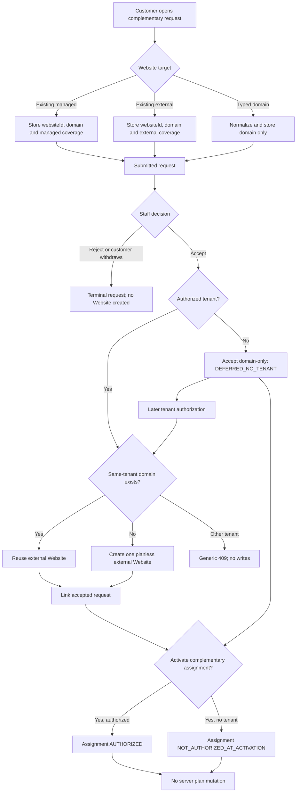

# Complementary request external-target flow

> Status: Accepted  
> Last verified: 2026-08-24

```mermaid
flowchart TD
  A[Customer opens complementary request] --> B{Website target}
  B -->|Existing managed| C[Store websiteId, domain and managed coverage]
  B -->|Existing external| D[Store websiteId, domain and external coverage]
  B -->|Typed domain| E[Normalize and store domain only]
  C --> F[Submitted request]
  D --> F
  E --> F
  F --> G{Staff decision}
  G -->|Reject or customer withdraws| H[Terminal request; no Website created]
  G -->|Accept| I{Authorized tenant?}
  I -->|Yes| J{Same-tenant domain exists?}
  J -->|Yes| K[Reuse external Website]
  J -->|No| L[Create one planless external Website]
  J -->|Other tenant| M[Generic 409; no writes]
  K --> N[Link accepted request]
  L --> N
  I -->|No| O[Accept domain-only: DEFERRED_NO_TENANT]
  N --> P{Activate complementary assignment?}
  O --> P
  P -->|Yes, authorized| Q[Assignment AUTHORIZED]
  P -->|Yes, no tenant| R[Assignment NOT_AUTHORIZED_AT_ACTIVATION]
  O --> S[Later tenant authorization]
  S --> J
  Q --> T[No server plan mutation]
  R --> T
```
