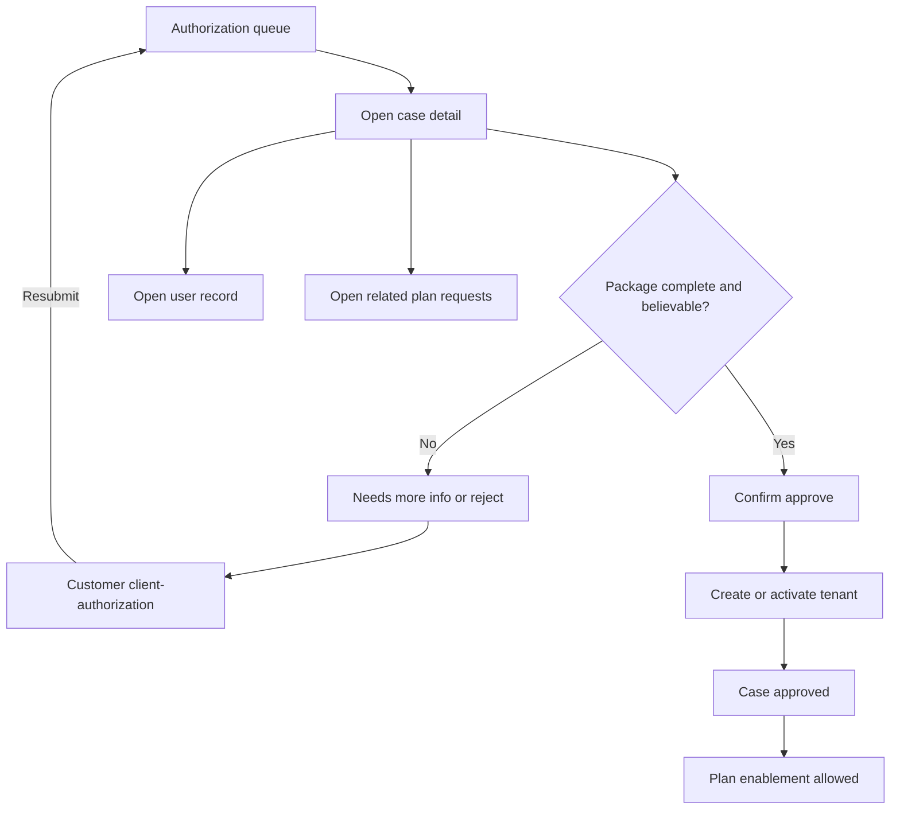

# UX Flow Specification — Admin authorization review (احراز هویت)

## Document control

| Field | Value |
|---|---|
| Project | Unixsee Admin Panel (`admin-panel/`) |
| Flow or service | Staff review of customer احراز هویت packages → approve tenant |
| Version | 0.2 |
| Status | Draft |
| Date | 2026-08-15 |
| Evidence sources | Stakeholder field list 2026-08-13; `docs/product/notes/customer-authorization-and-tenant.md`; `docs/product/ux-flows/client-authorization.md`; `docs/product/ux-flows/admin-users.md`; `docs/product/ux-flows/admin-plan-requests.md`; inspected admin `/users` fixture queue/detail — no certification review queue yet |
| Owner | Product, operations, customer administration |
| Reviewers | Product, ops, security, backend, frontend (`admin-panel/`), QA, accessibility |

## Confidence summary

| Area | Confidence | Reason |
|---|---|---|
| User needs | Medium | Derived from product stance + enablement blockers; no staff interviews |
| Current journey | High | Users list/create/detail exist; authorization review UI absent |
| Business rules | High for approve→tenant and enablement gate; Medium for reject taxonomy | Product confirmed |
| Proposed journey | Medium | Aligns with note; not ops-validated |
| Accessibility | Medium | Expert review |
| Measurement plan | Low | Events proposed |

## Executive flow summary

- **Primary user:** Authorized staff reviewing customer identity packages.
- **Goal:** Review submitted fields and کارت ملی photo, then approve (create/activate tenant), request more information, or reject—with reasons the customer can act on.
- **Current problem:** Admin can create customers/tenants in fixtures, but cannot review a customer-submitted احراز هویت package; plan enablement must wait on a tenant.
- **Proposed change:** An authorization review queue and detail surface (under users/tenants domain) that shows the required package, contact verification evidence, document preview, and consequential approve/reject actions.
- **Main decisions:** Approve = customer becomes tenant (authorized). Staff-mediated create/approve without upload remains allowed for ops exceptions. Plan enablement and other commercial applyments stay blocked until tenant exists.
- **Completion state:** Case `approved` with tenant + owner membership, or terminal `rejected`, or returned `needs_more_info`.
- **Highest-risk failure:** Approving incomplete/fraudulent identity, or enabling services for non-tenant users.
- **Accessibility risk:** Document preview, reason fields, and irreversible approve confirmation.
- **Evidence gap:** Shahkar automation; document retention; exact queue IA.
- **Next validation:** Prototype queue → open case → approve creates tenant → plan-request enablement unblocks.

## Problem and desired outcome

### Problem statement

Customers will submit identity packages to become tenants, but staff currently have no in-product review path. Without it, authorization stays offline, enablement stays blocked or is done unsafely, and customers cannot get clear reject/fix feedback.

### Desired user outcome

Staff can find pending packages, verify required fields and کارت ملی, confirm contact verification state (including skip-reverify cases), and finish with approve / needs-info / reject without leaving the users domain context.

### Desired service outcome

Every sold/enabled service is attached to a staff-approved tenant created from a complete authorization package (or an explicit staff-mediated exception path), with audit history.

### Scope

#### In scope

- Queue of authorization cases filtered by status (pending, needs info, rejected, approved).
- Detail view of all required customer fields + کارت ملی image (authorized staff only).
- Show whether mobile/email challenges were completed or skipped because already verified at signup.
- Actions: approve → tenant; request more information (reason + fields); reject (reason).
- Cross-links to user record, related plan requests, and return paths for enablement.
- Blockers visible on plan-request enablement when tenant missing (consume this outcome).
- Audit of decisions; no secret OTP/password display.
- Persian RTL staff UI.

#### Out of scope

- Customer submission UX (see [`client-authorization.md`](./client-authorization.md)).
- Redesigning general `/users` create/membership (see [`admin-users.md`](./admin-users.md)) beyond authorization hooks.
- Payment settlement.
- Visual polish.
- Inventing Nest routes/DTOs in this document.

### Success definition

- Pending cases are discoverable and reviewable end-to-end.
- Approve creates/activates a tenant and owner membership under existing tenant rules.
- Reject / needs-info returns actionable reasons to the customer flow.
- Staff cannot “enable plan” as a substitute for approve-tenant.

## Available evidence

| ID | Type | Source | Finding | Strength | Date |
|---|---|---|---|---|---|
| E-001 | Stakeholder | Field list + skip-reverify | Required package contents | Strong | 2026-08-13 |
| E-002 | Product note | `customer-authorization-and-tenant.md` | Approve → tenant; enablement blocked without tenant | Strong | 2026-08-13 |
| E-003 | Implementation | `admin-panel` users views | Queue/detail/create exist; no review queue | Strong | 2026-08-13 |
| E-004 | UX flow | `admin-plan-requests.md` | Enablement requires tenant | Strong | 2026-08-13 |
| E-005 | UX flow | `client-authorization.md` | Customer states pending/needs_info/rejected/approved | Strong | 2026-08-13 |

## Assumptions and unknowns

### Assumptions

| ID | Assumption | Risk | Status |
|---|---|---|---|
| A-001 | Authorization review lives in users/tenants domain (queue + detail), not under plan-requests | Medium | Unvalidated |
| A-002 | Staff-mediated `/users/new` tenant create remains an exception path without customer upload | Medium | Accepted for ops |
| A-003 | One active non-terminal case per user | Medium | Unvalidated |
| A-004 | کارت ملی preview is view-only; download is capability-gated | Medium | Unvalidated |

### Unknowns

| ID | Unknown | Priority |
|---|---|---|
| U-001 | Auto Shahkar / registry checks vs human judgment only | Critical |
| U-002 | Retention period for ID images after approve/reject | High |
| U-003 | Capability name(s) for review vs approve vs view document | High |
| U-004 | Whether approve can attach to an existing empty tenant shell | Medium |

## Required package (staff must see)

Same customer-required set:

کد ملی؛ تاریخ تولد؛ موبایل متعلق به کد ملی؛ وضعیت تأیید موبایل (OTP یا skipped-already-verified)؛ ایمیل؛ وضعیت تأیید ایمیل؛ استان؛ شهر؛ آدرس کامل؛ کد پستی؛ عکس کارت ملی.

## Users, roles and permissions

| Role | Goal | Constraints |
|---|---|---|
| Authorization reviewer | Clear pending packages | Must record reason on reject/needs-info |
| Customer admin | Find user ↔ case | May lack document-download capability |
| Enablement staff | Know tenant readiness | Cannot approve from plan-request surface |
| Auditor | Inspect decisions | Read-only |

### Permissions

| Action | Reviewer | Enablement | Conditions |
|---|---|---|---|
| List/filter cases | Yes | Limited | Capability |
| View ID image | Capability | No by default | Audit access |
| Approve → tenant | Yes | No | Complete package or explicit exception policy |
| Needs info / reject | Yes | No | Reason required |
| Enable plan | No | Yes | Tenant must already exist |

## User needs

### UN-001 — Review a complete package quickly
**As** reviewer staff, **when** a case is pending, **I need** all fields, verification evidence, and کارت ملی in one detail **so that** I can decide without offline tools.

### UN-002 — Return fixable outcomes
**As** reviewer staff, **when** data is wrong or photo unreadable, **I need** to request more info or reject with reasons **so that** the customer can resubmit correctly.

### UN-003 — Make enablement safe
**As** enablement staff, **when** a plan request is ready commercially, **I need** a clear tenant/authorization state **so that** I never enable for a non-tenant user.

## Current journey

| Stage | Action | Response | Pain |
|---|---|---|---|
| Users queue | Find/create customer | Fixture user/tenant create | No submitted KYC package |
| Plan request detail | Try enable | Needs tenant | No link to pending authorization case |
| Offline | WhatsApp/email docs | Manual | No audit, slow, unsafe |

## Proposed journey

| Stage | Behaviour | Decision | Need |
|---|---|---|---|
| 1. Queue | Filter pending authorization cases | Pick case | UN-001 |
| 2. Open | View fields, contact verify flags, photo | Complete enough? | UN-001 |
| 3a. Approve | Confirm impact → create/activate tenant + owner | Valid? | UN-003 |
| 3b. Needs info | Select issues + message | Sent to customer | UN-002 |
| 3c. Reject | Reason + confirm | Terminal or allow later reapply per policy | UN-002 |
| 4. Handoff | Link back to plan request / user | Enablement unblocked only if approved | UN-003 |

## Mermaid flow diagram

## Screen/state sequence

| Step | State | Goal | Information | Actions | Exit |
|---|---|---|---|---|---|
| S-01 | Queue | Find work | Status, user, submitted at, blockers | Filter, open | Detail |
| S-02 | Detail | Decide | Full package + verify flags + photo | Approve, needs info, reject, open user | Outcome |
| S-03 | Approve confirm | Prevent accidents | Tenant name impact summary | Confirm / cancel | Approved |
| S-04 | Needs-info form | Ask fixes | Reason, field checklist | Send | Pending customer |
| S-05 | Reject form | Terminal/deny | Reason | Confirm | Rejected |
| S-06 | Approved read | Audit | Tenant id, actor, time | Open tenant / plan request | Re-entry |

## State-transition table

| From | Trigger | Actor | To | Side effects |
|---|---|---|---|---|
| `pending_review` | Approve confirmed | Staff | `approved` | Tenant + owner; audit; notify customer |
| `pending_review` | Needs info | Staff | `needs_more_info` | Notify customer; unlock customer edit |
| `pending_review` | Reject | Staff | `rejected` | Notify customer; audit |
| `needs_more_info` | Customer resubmit | Customer | `pending_review` | Back on queue |
| `rejected` | Reapply allowed | Customer | `draft` / new case | Policy-dependent (`Unknown` if forever-ban) |

## Business-rule decision table

| Condition | Approve | Needs info | Reject | Enable plan |
|---|---|---|---|---|
| Package incomplete | No | Yes | Optional | No |
| Photo unreadable | No | Yes | Optional | No |
| Contacts not verified and not skip-eligible | No | Yes | Optional | No |
| Package complete + staff satisfied | Yes | — | — | Only after approve |
| User has no tenant yet | Approve creates tenant | — | — | Blocked |
| Staff exception create without upload | Allowed on `/users` path | — | — | Allowed after tenant exists |

## Loading, empty, error and recovery

| ID | Kind | Behaviour |
|---|---|---|
| L-001 | Queue/detail load | Section busy; retry |
| L-002 | Approve submit | Disable double confirm; reconcile if timeout |
| E-001 | Empty pending queue | Explain no work |
| V-001 | Missing reject reason | Block submit |
| F-001 | Approve uncertain | Reconcile tenant/case before retry |

## Edge cases

| ID | Scenario | Expected |
|---|---|---|
| EC-001 | Skip-reverify mobile/email | Show “verified at signup — challenge skipped” |
| EC-002 | Approve timeout | Reconcile; do not create duplicate tenants |
| EC-003 | Case pending + staff also uses `/users/new` | Prevent conflicting tenants; show conflict |
| EC-004 | Enablement attempted without tenant | Hard block with link to authorization case/user |
| EC-005 | Document access by unauthorized role | Denied; no image bytes |

## Accessibility review

| ID | Criterion | Required | Severity |
|---|---|---|---|
| AX-001 | Keyboard queue/detail/actions | Fully operable | 4 |
| AX-002 | Approve confirmation | Explicit confirm; focus restore | 4 |
| AX-003 | Reasons | Labels + errors for needs-info/reject | 4 |
| AX-004 | Image | Alt/accessible name; not information-only color | 3 |
| AX-005 | Status updates | Announce decision result | 4 |

## Heuristic review

| ID | Heuristic | Finding | Severity |
|---|---|---|---:|
| HX-001 | Status | Distinguish pending vs approved clearly | 4 |
| HX-003 | Control | Cancel confirm; no silent approve | 4 |
| HX-005 | Prevention | Block approve without package / reasonless reject | 4 |
| HX-009 | Errors | Uncertain approve must reconcile | 4 |
| HX-010 | Help | Link to related plan request when present | 3 |

## Analytics events

| ID | Event | Question |
|---|---|---|
| EV-001 | `authorization_case_opened` | Review throughput |
| EV-002 | `authorization_approved` | Time-to-tenant |
| EV-003 | `authorization_needs_info` | Fix-loop rate |
| EV-004 | `authorization_rejected` | Reject reasons distribution |
| EV-005 | `authorization_approve_reconcile` | Uncertainty handling |

## Acceptance criteria

### AC-001 — Queue
**Given** pending cases exist, **when** authorized staff open the authorization queue, **then** each item shows user identity summary, submitted time, and status, **and** they can open detail.

### AC-002 — Package visibility
**Given** a pending case, **when** staff open detail, **then** all required fields and کارت ملی are visible (per capability), **and** skip-reverify contacts are explicitly marked.

### AC-003 — Approve creates tenant
**Given** a complete acceptable package, **when** staff confirm approve, **then** the case becomes `approved`, a tenant exists with owner membership, **and** the customer can see approved status.

### AC-004 — Needs info / reject require reason
**Given** staff choose needs info or reject, **when** they submit without a reason, **then** the action is blocked; **when** reason is provided, **then** the customer case moves to the matching state.

### AC-005 — Enablement still gated
**Given** a user is not yet a tenant, **when** staff attempt plan enablement, **then** enablement is blocked regardless of a pending authorization case.

### AC-006 — No secrets
**Given** any authorization screen, **when** staff view the case, **then** OTPs, passwords, and raw tokens are never shown.

### AC-007 — Narrow-viewport queue (no horizontal table scroll)
**Given** authorized staff open the authorization queue on a narrow viewport, **when** filtered cases exist, **then** each case is presented as a single navigable card (not a horizontally scrolling multi-column table), **and** the card shows customer identity, package status, contact identifiers, contact-challenge summary, and submitted time, **and** activating the card opens the same case detail as desktop.

**Given** the same queue on a wide viewport, **when** cases exist, **then** the multi-column table remains available for scan-and-compare.

**Given** filters yield no cases, **when** staff view the queue on any viewport, **then** one shared empty state explains no matches and offers clearing filters (no duplicate empty chrome).

## Responsive queue presentation (v0.2 addendum)

Focused change only — does not alter approve/reject/needs-info business rules.

| Item | Value |
|---|---|
| Primary user | Staff reviewing authorization cases on phone/tablet |
| Goal | Scan and open a case without losing context to horizontal scroll |
| Trigger | Queue rendered below `md` breakpoint |
| Complete outcome | Same case opened as from the desktop table row |
| Evidence | Observed horizontal scrollbar on `/users/authorization` queue at ~406px; established admin pattern on users / plan-requests / servers queues (`md:hidden` cards + `md:block` table) |
| Assumption | Card density may omit column headers as persistent chrome; labels live with each field (`dl`) so meaning is not memorised |
| Hard constraint | BR-009 / AC-006 — never show OTP/password/token material |
| Presentation | `< md`: one card per case; `md+`: existing table. Filters, search, summary chips, permission denial, and empty state stay shared |

### Card information hierarchy

1. Customer display name (primary) + case status badge
2. Contact line (mobile · email) — LTR
3. Contact-challenge summary
4. Submitted time
5. User id as secondary identifier (muted, LTR)

### Interaction

- Whole card is one link to `/users/authorization/:id` (same destination as table row).
- Keyboard: tab to card, Enter/Space activate via native link behaviour.
- Search/filter results feed both presentations from one filtered list.

### Heuristic notes (queue list only)

| Heuristic | Note | Severity |
|---|---|---|
| HX-001 Visibility | Status badge remains on the card header | 3 |
| HX-006 Recognition | Field labels on card replace table headers | 3 |
| HX-004 Consistency | Match users/plan-requests mobile queue pattern | 2 |

## Questions requiring user research

| ID | Question | Priority |
|---|---|---|
| RQ-001 | What reject reason taxonomy do ops need? | High |
| RQ-002 | Should document download be allowed or view-only? | High |
| RQ-003 | SLA expectation for pending review? | Medium |

## Risks and dependencies

| ID | Risk | Mitigation |
|---|---|---|
| R-001 | Fraudulent documents approved | Dual control / checklist; optional registry checks |
| R-002 | PII leakage via image URLs | Capability-gated secure fetch; audit |
| R-003 | Duplicate tenants from race | Idempotent approve + reconcile |

| ID | Dependency | Owner |
|---|---|---|
| D-001 | Client submission + states | `client-authorization.md` |
| D-002 | Tenant/owner rules | `admin-users.md` |
| D-003 | Enablement hard gate | `admin-plan-requests.md` |
| D-004 | Nest persistence | Backend |

## Implementation readiness

**Conditionally ready for prototyping** (fixture queue/detail/actions). **Not ready for production** until U-001–U-003 and Nest contracts are decided.

### Blockers

- Capability matrix for document access.
- Matching/automation policy for موبایل ↔ کد ملی.
- Image retention policy.

## Final recommendations

### Must resolve before implementation
- REC-001: Approve is the only customer-upload path that creates the tenant from this queue.
- REC-002: Keep staff `/users` create as explicit exception, audited.
- REC-003: Never enable plans from this surface; only unblock enablement by creating tenant.

### Must validate during prototyping
- Approve confirmation copy and focus restore.
- Needs-info reason → customer resubmit loop.
- Cross-link from plan-request blocker to case.

### Rejected or deferred
- Approving from plan-request detail (rejected — identity stays in users/authorization).
- Showing ID images to all staff roles (deferred to capability design).

## Related

- Product note: [`../notes/customer-authorization-and-tenant.md`](../notes/customer-authorization-and-tenant.md)
- Customer flow: [`client-authorization.md`](./client-authorization.md)
- Users/tenants: [`admin-users.md`](./admin-users.md)
- Plan enablement: [`admin-plan-requests.md`](./admin-plan-requests.md)
- Phase 1: [`../phase-1-application-features.md`](../phase-1-application-features.md) §§8–9
