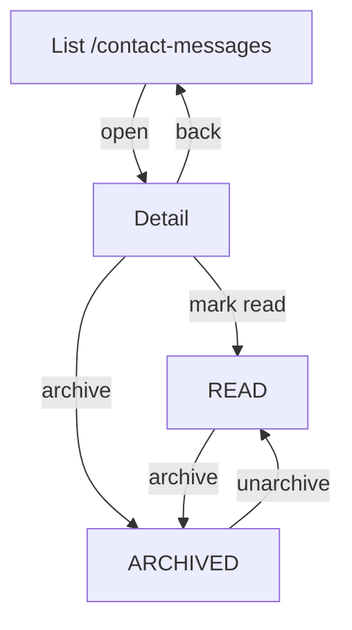

# UX Flow Specification

## Document control

| Field              | Value                                                                                                                                                                                                                                                                          |
| ------------------ | ------------------------------------------------------------------------------------------------------------------------------------------------------------------------------------------------------------------------------------------------------------------------------ |
| Project            | Unixsee Admin Panel (`admin-panel/`)                                                                                                                                                                                                                                           |
| Flow or service    | Staff contact-us inbox (`پیام‌های تماس`)                                                                                                                                                                                                                                       |
| Version            | 0.1                                                                                                                                                                                                                                                                            |
| Status             | Draft                                                                                                                                                                                                                                                                          |
| Date               | 2026-08-27                                                                                                                                                                                                                                                                     |
| Prepared from      | Public contract `docs/backend/contracts/contact-messages-public.md`; Prisma `ContactMessage` / statuses; implemented public `POST /api/v1/public/contact-messages`; companion client contact-us form; analogous staff queues (`admin-plan-requests`, `admin-unixsee-messages`) |
| Primary owner      | Product, operations, admin frontend, Nest backend                                                                                                                                                                                                                              |
| Reviewers required | Product, support/ops, backend, QA, accessibility                                                                                                                                                                                                                               |

## Confidence summary

| Area             | Confidence  | Reason                                                                                                   |
| ---------------- | ----------- | -------------------------------------------------------------------------------------------------------- |
| User needs       | Medium–High | Persistence exists; staff inbox was explicitly deferred and is now requested                             |
| Current journey  | High        | Messages persist with no staff surface; ops must use DB or external tools                                |
| Business rules   | Medium      | Status enum confirmed (`NEW` / `READ` / `ARCHIVED`); transitions and reply channel not product-validated |
| Proposed journey | Medium      | Thin queue + detail mirrors existing admin intake patterns                                               |
| Accessibility    | Medium      | Expert review only                                                                                       |
| Measurement plan | Low         | Events proposed; analytics ownership unknown                                                             |

## Executive flow summary

- **Primary user:** Authorized staff (`ADMIN` / `OPERATOR`) triaging public contact-us submissions.
- **Goal:** Find new messages, read full intake (contacts, subject, body, attachments), mark read, and archive when done.
- **Current problem:** Public form writes to Nest, but staff have no in-product inbox; notification email is still deferred.
- **Proposed change:** Admin queue at `/contact-messages` and detail at `/contact-messages/[id]` wired to Nest admin APIs.
- **Main decisions:** Distinct from `پیام‌های یونیکسی` (outbound tenant messages) and from tickets; no in-app reply in this phase; attachments are signed download links only.
- **Completion state:** Message is `READ` (reviewed) or `ARCHIVED` (done / not actionable); history retained.
- **Highest-risk failure:** Conflating contact intake with tickets or Unixsee messages; losing attachment access when signed URLs fail.
- **Accessibility risk:** Status actions and archive confirmation must expose focus and status messages.
- **Evidence gap:** Whether opening detail should auto-mark `READ`; whether staff should create a ticket from a message.
- **Next validation:** Ops walkthrough of NEW → READ → ARCHIVE with a real attachment.

## Problem and desired outcome

### Problem statement

Public visitors can submit contact-us messages that Nest persists, but staff cannot review, triage, or archive those messages in the admin panel. This forces offline tracking and delays response.

### Desired user outcome

Staff can open a contact-us queue, filter by status, open a message, see all intake fields and downloadable attachments, mark it read, and archive it when work is finished—without leaving the admin app.

### Desired service outcome

Unixsee can operate a durable staff inbox for public contact intake with auditable status transitions, while keeping reply, CRM, and notification email out of this thin phase.

### Why this matters now

- Public create is already shipped; messages accumulate as `NEW` with no staff surface.
- Contract text previously deferred the inbox; product now requires the admin page.
- Without a queue, ops cannot close the frontstage → backstage loop for contact-us.

### Scope

#### In scope

- Admin list `/contact-messages` with status filter (`ALL`, `NEW`, `READ`, `ARCHIVED`) and pagination.
- Admin detail `/contact-messages/[id]` showing subject, identity contacts, optional website/activity basin, message body, locale/source, timestamps, and attachment download links.
- Status transitions: mark read (`NEW` → `READ`), archive (`NEW`|`READ` → `ARCHIVED`), unarchive (`ARCHIVED` → `READ`).
- Nest staff APIs under `/api/v1/admin/contact-messages`.
- Loading, empty, not-found, permission/API failure, and recovery states.
- Persian RTL staff labels; English technical identifiers in code/docs.
- Sidebar nav entry distinct from `پیام‌های یونیکسی`.

#### Out of scope

- Staff reply / email send / SMS from this surface (notification email remains deferred).
- Creating tickets, plan requests, or complementary-service cases from a contact message.
- Customer account linking or tenant matching.
- Soft-delete / hard-delete of messages.
- Newsletter subscription admin.
- Visual design polish beyond existing admin patterns.

### Success definition

- Staff can clear a `NEW` queue without database tools.
- Opening detail shows the full public payload staff need to act offline (call/email).
- Status transitions are explicit, reversible from archive via unarchive, and visible after refresh.
- Keyboard and screen-reader users can filter, open, mark read, and archive.

## Available evidence

| ID    | Type           | Source                                 | Finding                                                                      | Strength | Date       |
| ----- | -------------- | -------------------------------------- | ---------------------------------------------------------------------------- | -------- | ---------- |
| E-001 | API contract   | `contact-messages-public.md`           | Public create persists; staff inbox and email deferred                       | Strong   | 2026-08-27 |
| E-002 | Schema         | Prisma `ContactMessage`                | Statuses `NEW`, `READ`, `ARCHIVED`; subjects match contact-us form           | Strong   | 2026-08-27 |
| E-003 | Implementation | `backend/src/modules/contact-messages` | Only public POST exists; no admin controller                                 | Strong   | 2026-08-27 |
| E-004 | Implementation | `admin-panel`                          | No contact-messages routes; sidebar has Unixsee messages only                | Strong   | 2026-08-27 |
| E-005 | Pattern        | `/unixsee-messages`, `/plan-requests`  | Nest-wired list+detail + Server Actions is the canonical staff queue pattern | Strong   | 2026-08-27 |

## Assumptions and unknowns

### Assumptions

| ID    | Assumption                                                                                    | Origin                                          | Risk                                      | Validation          | Status   |
| ----- | --------------------------------------------------------------------------------------------- | ----------------------------------------------- | ----------------------------------------- | ------------------- | -------- |
| A-001 | Opening detail does **not** auto-mark `READ`; staff use an explicit action                    | Safer than silent side effects on prefetch/open | Medium if ops expect Gmail-like auto-read | Ops walkthrough     | Open     |
| A-002 | Nav label is `پیام‌های تماس`                                                                  | Distinguish from `پیام‌های یونیکسی`             | Low                                       | Product copy review | Open     |
| A-003 | Default list filter is `NEW`                                                                  | Actionable inbox first                          | Low                                       | Ops preference      | Open     |
| A-004 | Unarchive restores `READ` (not `NEW`)                                                         | Avoid re-inflating “new” counts after archive   | Medium                                    | Product             | Open     |
| A-005 | Attachment download uses short-lived signed URLs; raw `storageKey` is not enough for staff UI | Same as tickets / Unixsee messages              | Low                                       | Engineering         | Accepted |

### Unknowns

| ID    | Unknown                                                          | Impact             | Priority                   |
| ----- | ---------------------------------------------------------------- | ------------------ | -------------------------- |
| U-001 | Whether staff should spawn a ticket from a contact message       | Handoff UX         | Medium                     |
| U-002 | Whether email/phone click-to-call/mail is required vs plain text | Detail affordances | Low                        |
| U-003 | SLA / aging indicators for unanswered `NEW` items                | Queue urgency      | Medium                     |
| U-004 | Whether OPERATOR vs ADMIN capability differs for this inbox      | Permissions        | Low (Phase 1 both allowed) |

## Domain distinctions

| Concept         | Meaning                            | Not the same as                                  |
| --------------- | ---------------------------------- | ------------------------------------------------ |
| Contact message | Public contact-us intake row       | Ticket, Unixsee message, newsletter subscription |
| `NEW`           | Unreviewed by staff                | Customer unread                                  |
| `READ`          | Staff acknowledged                 | Customer reply received                          |
| `ARCHIVED`      | Staff closed triage without delete | Soft-deleted                                     |
| Attachment key  | Public upload `storageKey`         | Ticket attachment entity                         |

## Users, roles and permissions

| Role                       | Goal              | Responsibility                                       | Constraints                                  |
| -------------------------- | ----------------- | ---------------------------------------------------- | -------------------------------------------- |
| Support / ops staff        | Triage contact-us | List, open, mark read, archive, download attachments | No in-app reply; no delete                   |
| Auditor (same staff roles) | Inspect history   | Read archived messages                               | Read-only if product later splits capability |

**Permissions:** Nest `@Roles(ADMIN, OPERATOR)`. No finer capability in Phase 1 (U-004).

## User needs

| ID     | Need                                                                                                                                                |
| ------ | --------------------------------------------------------------------------------------------------------------------------------------------------- |
| UN-001 | As staff, when a visitor submits contact-us, I need to see new messages in one queue so I can respond via phone/email without hunting the database. |
| UN-002 | As staff, when I open a message, I need the full intake (subject, contacts, body, attachments) so I can act with certainty.                         |
| UN-003 | As staff, when I have finished or deferred a message, I need to mark it read and later archive so the new queue stays actionable.                   |
| UN-004 | As staff, when I archive by mistake, I need to unarchive so the message returns to a reviewable state.                                              |

## Current journey

1. Visitor submits contact-us on client site → Nest creates `ContactMessage` (`NEW`).
2. Staff have **no** admin surface (channel break).
3. Optional: engineer queries DB / storage manually.
4. Visitor waits for offline follow-up; no status feedback in-product.

**Pain points:** JP-001 no inbox; JP-002 no status workflow; JP-003 attachments hard to retrieve; JP-004 conflation risk with Unixsee messages nav.

## Proposed journey

1. Staff open `/contact-messages` (default `NEW`).
2. Filter/paginate; open a row → `/contact-messages/[id]`.
3. Review fields and download attachments if present.
4. Mark as read → status `READ`.
5. After offline follow-up (or decide not to act), archive → `ARCHIVED`.
6. If needed, unarchive → `READ` and resume.

## States and transitions

| From       | Trigger            | Actor  | To         | Notes                                     |
| ---------- | ------------------ | ------ | ---------- | ----------------------------------------- |
| —          | Public create      | System | `NEW`      | Existing public API                       |
| `NEW`      | Mark read          | Staff  | `READ`     | Explicit action (A-001)                   |
| `NEW`      | Archive            | Staff  | `ARCHIVED` | Confirm optional; recommended for clarity |
| `READ`     | Archive            | Staff  | `ARCHIVED` | Confirm with AlertDialog                  |
| `ARCHIVED` | Unarchive          | Staff  | `READ`     | A-004                                     |
| any        | Invalid transition | System | unchanged  | `400` validation                          |

## Business rules

| ID     | Rule                                                                                                                           |
| ------ | ------------------------------------------------------------------------------------------------------------------------------ |
| BR-001 | Only staff JWT with `ADMIN` or `OPERATOR` may list/get/update contact messages.                                                |
| BR-002 | Status values are exactly `NEW`, `READ`, `ARCHIVED`.                                                                           |
| BR-003 | Allowed transitions: `NEW→READ`, `NEW→ARCHIVED`, `READ→ARCHIVED`, `ARCHIVED→READ`.                                             |
| BR-004 | Detail returns signed download URLs for each `attachmentKeys` entry when signing succeeds; failures omit URL but keep the key. |
| BR-005 | This flow does not send email or create tickets.                                                                               |
| BR-006 | Nav and copy must not reuse “پیام‌های یونیکسی”.                                                                                |

## Failure and recovery

| ID     | Failure                      | User recovery                                                         |
| ------ | ---------------------------- | --------------------------------------------------------------------- |
| SF-001 | List/detail Nest unavailable | Show staff error; retry via refresh                                   |
| SF-002 | Message not found            | `404` / notFound page                                                 |
| SF-003 | Invalid status transition    | Toast validation; keep current status                                 |
| SF-004 | Signed URL generation fails  | Show attachment key unavailable for download; staff can retry refresh |
| SF-005 | Concurrent archive           | Last write wins; refresh shows server status                          |

## Accessibility (minimum)

- Keyboard: filter Select, row activation (Enter/Space), mark-read/archive/unarchive buttons, AlertDialog focus trap.
- Status changes announced via toast + visible badge after `router.refresh()`.
- Archive uses AlertDialog (irreversible-ish triage close).
- Labels in Persian; contact values remain readable as entered.

## Heuristic notes (release-impacting)

| ID     | Heuristic                           | Issue                                           | Severity |
| ------ | ----------------------------------- | ----------------------------------------------- | -------- |
| HX-001 | Visibility of system status         | Status badge must update after actions          | 3        |
| HX-002 | Match between system and real world | Label inbox as contact-us, not Unixsee messages | 3        |
| HX-003 | User control                        | Unarchive required (UN-004)                     | 2        |
| HX-004 | Error recovery                      | Failed downloads need honest empty state        | 2        |

## Analytics (proposed)

| ID     | Event                                 | Question                 |
| ------ | ------------------------------------- | ------------------------ |
| EV-001 | `contact_message_list_viewed`         | Queue volume by status   |
| EV-002 | `contact_message_opened`              | Time-to-open from create |
| EV-003 | `contact_message_marked_read`         | Triage latency           |
| EV-004 | `contact_message_archived`            | Completion rate          |
| EV-005 | `contact_message_attachment_download` | Attachment usefulness    |

## Acceptance criteria

| ID     | Criterion                                                                                                                                                                                                                |
| ------ | ------------------------------------------------------------------------------------------------------------------------------------------------------------------------------------------------------------------------ |
| AC-001 | **Given** staff are signed in, **when** they open `/contact-messages`, **then** Nest-backed messages load with default filter `NEW`.                                                                                     |
| AC-002 | **Given** a `NEW` message, **when** staff open detail, **then** subject, fullName, email, phone, optional website/activityBasin, message, locale, source, timestamps, and attachment links (when available) are visible. |
| AC-003 | **Given** a `NEW` message, **when** staff mark read, **then** status becomes `READ` and list filters reflect it after refresh.                                                                                           |
| AC-004 | **Given** a `NEW` or `READ` message, **when** staff confirm archive, **then** status becomes `ARCHIVED`.                                                                                                                 |
| AC-005 | **Given** an `ARCHIVED` message, **when** staff unarchive, **then** status becomes `READ`.                                                                                                                               |
| AC-006 | **Given** Nest is down, **when** staff open the list, **then** a clear error is shown (no fake empty success).                                                                                                           |
| AC-007 | **Given** keyboard-only use, **when** staff complete mark-read and archive, **then** focus remains usable and dialogs are escapable.                                                                                     |

## Research questions

| ID     | Question                             | Blocks |
| ------ | ------------------------------------ | ------ |
| RQ-001 | Auto-mark read on open?              | A-001  |
| RQ-002 | Ticket handoff from contact message? | U-001  |
| RQ-003 | Aging / SLA on `NEW`?                | U-003  |

## Risks and readiness

| Risk                               | Mitigation                              |
| ---------------------------------- | --------------------------------------- |
| IA confusion with Unixsee messages | Distinct nav label + page subtitle      |
| Staff expect email send            | Explicit empty reply; out-of-scope copy |
| Attachment signing failures        | Honest unavailable state + refresh      |

**Readiness:** Ready for implementation (thin Phase 1 inbox).

## Implementation mapping

| Surface                  | Path                                              |
| ------------------------ | ------------------------------------------------- |
| List                     | `/contact-messages`                               |
| Detail                   | `/contact-messages/[id]`                          |
| Nest list                | `GET /api/v1/admin/contact-messages`              |
| Nest get                 | `GET /api/v1/admin/contact-messages/:id`          |
| Nest status              | `PATCH /api/v1/admin/contact-messages/:id/status` |
| Public create (existing) | `POST /api/v1/public/contact-messages`            |
