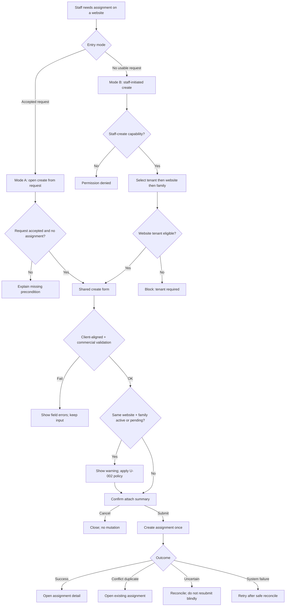

# UX Flow Specification

## Document control

| Field              | Value                                                                                                                |
| ------------------ | -------------------------------------------------------------------------------------------------------------------- |
| Project            | Unixsee Admin Panel                                                                                                  |
| Flow or service    | Staff create complementary-service assignment and attach to website                                                  |
| Version            | 0.2                                                                                                                  |
| Status             | Draft                                                                                                                |
| Date               | 2026-08-24                                                                                                           |
| Prepared from      | Client `request-service-form.tsx`; Phase 1 §16; `admin-complementary-services.md`; admin `create-service-dialog.tsx` |
| Primary owner      | Product and operations                                                                                               |
| Reviewers required | Product, commercial operations, service-delivery, engineering, QA, accessibility                                     |
| Parent flow        | [`admin-complementary-services.md`](./admin-complementary-services.md)                                               |

## Confidence summary

| Area                 | Confidence | Reason                                                                                                  |
| -------------------- | ---------- | ------------------------------------------------------------------------------------------------------- |
| User needs           | Medium     | Derived from Phase 1 staff outcomes and client intake fields; no staff research                         |
| Current journey      | High       | Admin can open create Dialog only from an accepted request; website is locked to that request           |
| Field model          | High       | Client form and Phase 1 §16.4 define intake; admin Dialog defines commercial activation fields          |
| Staff-initiated path | Medium     | Requested capability; Phase 1 emphasizes request→accept→activate; bypass rules are labelled assumptions |
| Accessibility        | Medium     | Based on client form patterns and WCAG-oriented review, not staff testing                               |
| Measurement plan     | Low        | Events proposed; ownership unknown                                                                      |

## Executive flow summary

- **Primary user:** Authorized commercial or operations staff.
- **Goal:** Create exactly one complementary-service **assignment** attached to a specific **tenant website**, with scope and commercial terms staff can deliver against.
- **Current problem:** Activation exists only as “ایجاد سرویس” from an accepted customer request; staff cannot start from a website when work was agreed offline or the customer never submitted the client form.
- **Proposed change:** One create-and-attach flow with two entry modes that share the same field model: (1) request-bound activation, (2) staff-initiated create with tenant → website selection.
- **Main decisions:** Reuse client intake fields for service family, website context, engagement preference, service-specific scope, title, description, and attachments; add admin-only commercial block; keep request and assignment distinct; require tenant before attach.
- **Completion state:** Assignment exists in `scheduled` or `active`, linked to website (and optionally to a source request), with audit of who created it and why.
- **Highest-risk failure:** Duplicate active assignment for same website + service family, or activation without tenant / wrong website.
- **Accessibility risk:** Long Dialog/form with conditional scope fields, duplicate warning, and submit confirmation may trap focus or hide errors.
- **Evidence gap:** No confirmed policy for skipping quotation/acceptance when staff create offline-agreed work.
- **Next validation:** Walkthrough with commercial + delivery staff on both entry modes before implementation.

## Problem and desired outcome

### Problem statement

Customers request complementary services through the client form (`ServiceTypeSelector`, website, engagement, scope, title, description, attachments, duplicate warning). Staff today can only turn an **accepted** request into an assignment via `CreateServiceDialog`, with website and family locked. When work is agreed by phone, ticket, or renewal without a fresh request, staff have no first-class way to create the assignment and attach it to the correct website without inventing a fake request path offline.

### Desired user outcome

Authorized staff can create a complementary-service assignment for the correct tenant website, with the same service-context fields customers already provide plus commercial terms, and leave with a single durable assignment record and clear next delivery action.

### Desired service outcome

Unixsee can attach deliverable work to websites consistently whether intake started with the customer form or with staff, without losing auditability or creating duplicate active services of the same family on one website.

### Why this matters now

- Client intake already defines the customer-facing information model.
- Admin already prototypes activation Dialog fields (owner, commercial model, dates, amount, scope, exclusions).
- Gap between those two surfaces blocks ops when the customer did not use the form.

### Scope

#### In scope

- Entry mode A — **Request-bound create:** from `/complementary-services/[id]` when request is `accepted` (current prototype path, field-aligned to client).
- Entry mode B — **Staff-initiated create:** from complementary-services list (and optionally website detail), selecting tenant → website → service family.
- Shared form sections derived from client `RequestServiceForm` + admin commercial block.
- Duplicate active/pending warning for same website + service family (warn; server enforces).
- Managed and external tenant websites are selectable; show explicit coverage
  and do not require an active server plan. Canonical behavior:
  [`website-management-coverage.md`](./website-management-coverage.md).
- Tenant prerequisite for attachment (authorization/tenant rule).
- Confirm before create; success → assignment detail; cancel/back without mutation.
- Loading, validation, permission, conflict, and recovery for create.
- Persian RTL labels consistent with existing admin complementary-services UI.

#### Out of scope

- Full quotation revision UI (owned by parent flow).
- Customer self-service payment.
- Catalog admin for inventing new service families beyond Phase 1 four.
- Visual styling and component polish.
- Final Nest routes/DTOs (architecture owns contracts; behaviour must not invent conflicting APIs).

### Success definition

- Staff can attach a new assignment to a website from either entry mode without offline spreadsheets.
- Required fields mirror client intake where applicable and commercial fields where staff-only.
- Same website + service family duplicate is visible before submit; second active assignment is blocked or explicitly allowed by policy with reason.
- Create is idempotent under retry; at most one assignment is produced per successful intent.
- Customer-visible vs internal fields remain distinguishable after create.

## Available evidence

| ID    | Type                  | Source                                       | User/role      | Finding                                                                                                                                                               | Strength | Date       |
| ----- | --------------------- | -------------------------------------------- | -------------- | --------------------------------------------------------------------------------------------------------------------------------------------------------------------- | -------- | ---------- |
| E-001 | Product requirement   | `phase-1-application-features.md` §16        | Staff/customer | Four families; request fields; assignment contents; single activation from accepted request                                                                           | Medium   | 2026-08-15 |
| E-002 | Client implementation | `client/.../request-service-form.tsx`        | Customer       | Required: service, website, engagement, title; description ≥20 chars; conditional scope; attachments ≤5 / 5MB / typed; duplicate alert; success panel                 | Strong   | 2026-08-15 |
| E-003 | Admin implementation  | `create-service-dialog.tsx`, request detail  | Staff          | Create Dialog from accepted request; fields: owner, commercial model, start date, agreed amount, scope, exclusions; website read-only from request; duplicate warning | Strong   | 2026-08-15 |
| E-004 | Parent UX flow        | `admin-complementary-services.md`            | Staff          | Request vs assignment distinct; BR-007 single activation; tenant required for commercial activation                                                                   | Strong   | 2026-08-15 |
| E-005 | Tenant constraint     | `notes/customer-authorization-and-tenant.md` | Staff          | Commercial activation / assignment requires tenant                                                                                                                    | Strong   | 2026-08-15 |
| E-006 | Route map             | `docs/backend/modules-and-routes.md`         | Engineering    | Admin complementary-service-request routes exist; staff-initiated assignment create is not explicitly listed as a separate public/customer route                      | Medium   | 2026-08-15 |

No staff interviews or support tickets were provided for the staff-initiated bypass.

## Assumptions and unknowns

### Assumptions

| ID    | Assumption                                                                                                               | Origin                                                  | Risk   | Affected decision        | Validation                | Status      |
| ----- | ------------------------------------------------------------------------------------------------------------------------ | ------------------------------------------------------- | ------ | ------------------------ | ------------------------- | ----------- |
| A-001 | Staff-initiated create may skip customer quotation/acceptance when commercial staff record offline agreement with reason | Inference from ops need; not explicit in §16.10         | High   | Preconditions for Mode B | Product/legal decision    | Unvalidated |
| A-002 | Mode B still creates an **assignment**, optionally linking a synthetic or staff-origin request record for history        | Inference to preserve request/assignment distinction    | Medium | Data model               | Engineering + product     | Unvalidated |
| A-003 | `not-sure` engagement is allowed on staff create only if staff then choose a concrete commercial model before submit     | Client allows not-sure; assignment needs concrete model | Medium | Validation rules         | Product                   | Unvalidated |
| A-004 | Website picker lists only websites of the selected tenant that staff are scoped to see                                   | Tenancy model                                           | Medium | Selector behaviour       | Confirm with access model | Unvalidated |
| A-005 | Attachments on staff create are optional evidence (brief, SOW); same type/size caps as client unless security tightens   | Client caps                                             | Medium | Attachment policy        | Security                  | Unvalidated |

### Unknowns

| ID    | Unknown                                                                                    | Impact                         | Decision blocked         | Resolution                  | Priority |
| ----- | ------------------------------------------------------------------------------------------ | ------------------------------ | ------------------------ | --------------------------- | -------- |
| U-001 | Whether Mode B requires a capability distinct from request activation                      | Wrong staff can bind revenue   | Permission matrix        | Security/product            | Critical |
| U-002 | Whether duplicate same-family active assignment is hard-blocked or overridable with reason | Double delivery / billing risk | Submit rules             | Commercial policy           | Critical |
| U-003 | Customer visibility of staff-created assignments before any customer acknowledgement       | Trust / surprise activation    | Post-create notification | Product                     | High     |
| U-004 | Nest endpoint for staff-initiated assignment create vs activating from request only        | Implementation contract        | API design               | Backend ADR / routes update | Critical |
| U-005 | Required commercial fields by model (quota units, renewal, milestones) on first create     | Incomplete assignments         | Conditional validation   | Commercial policy           | High     |

## Users, roles and permissions

### Users

| Role                          | Goal                                  | Responsibility                                        | Constraints                                       | Needs                                   |
| ----------------------------- | ------------------------------------- | ----------------------------------------------------- | ------------------------------------------------- | --------------------------------------- |
| Commercial / operations staff | Attach agreed work to a website       | Complete create form, confirm, own initial assignment | Capability + tenant scope; Mode B policy          | Correct website, clear commercial terms |
| Delivery specialist           | Receive workable assignment           | Not primary creator unless permitted                  | Cannot invent commercial terms without capability | Complete scope on day one               |
| Customer                      | See truthful service on their website | Outside admin create UI                               | Sees only customer-visible fields                 | No surprise unpaid obligation (U-003)   |
| Auditor                       | Trace origin                          | Read create reason, actor, source request if any      | Read-only                                         | Immutable create audit                  |

### Permissions

| Action                | Request-bound (Mode A)                     | Staff-initiated (Mode B)        | Conditions                         |
| --------------------- | ------------------------------------------ | ------------------------------- | ---------------------------------- |
| Open create surface   | Activation capability + request `accepted` | Staff-create capability (U-001) | Server-enforced                    |
| Select tenant/website | Locked from request                        | Required; scoped list           | Tenant must exist (E-005)          |
| Change service family | Locked from request                        | Required                        | One of four Phase 1 families       |
| Set commercial terms  | Yes                                        | Yes                             | Model-specific required fields     |
| Submit create         | Yes if no linked assignment                | Yes if policy allows            | Idempotent; duplicate rule (U-002) |
| View assignment after | Yes                                        | Yes                             | Scope                              |

## User needs

### UN-001 — Attach work to the right website

**As** commercial/operations staff, **when** complementary work is agreed for a customer site, **I need to** create an assignment bound to that website **so that** delivery and customer views share one record.

- Evidence: E-001, E-003, E-005.
- Success: Assignment stores tenant, website id, family, title, owner.
- Priority: Critical.

### UN-002 — Reuse known intake context

**As** staff, **when** creating or activating, **I need** the same service-context fields the customer form already collects **so that** I do not invent a second incompatible intake model.

- Evidence: E-001 §16.4, E-002.
- Success: Service family, engagement, service-specific scope, title, description, attachments behave consistently with client semantics.
- Priority: Critical.

### UN-003 — Record commercial commitment safely

**As** commercial staff, **when** attaching a service, **I need** owner, commercial model, dates, amount, included/excluded scope **so that** delivery starts from agreed terms, not from a vague ticket note.

- Evidence: E-001 §16.6, E-003.
- Success: Assignment cannot submit without model-required commercial fields.
- Priority: Critical.

### UN-004 — Avoid duplicate active services

**As** staff, **when** the website already has a pending request or active assignment of the same family, **I need** a clear warning and a policy-backed block or override **so that** we do not double-sell or double-deliver.

- Evidence: E-001 §16.4, E-002 duplicate alert, E-003 warning.
- Success: Warning before submit; server enforces U-002.
- Priority: Critical.

### UN-005 — Know origin of the assignment

**As** auditor or delivery lead, **when** an assignment exists, **I need** to know whether it came from an accepted request or staff-initiated create (and why) **so that** disputes and renewals remain supportable.

- Evidence: E-004 BR-011; A-002.
- Success: Create source + reason + actor in audit.
- Priority: Important.

## Current journey

| Stage           | Goal                  | Action                                        | Response                            | Actors   | Pain                                                        | Evidence  |
| --------------- | --------------------- | --------------------------------------------- | ----------------------------------- | -------- | ----------------------------------------------------------- | --------- |
| Customer intake | Request service       | Fill client form                              | Local success mock / request record | Customer | Admin may never see if offline                              | E-002     |
| Admin queue     | Find accepted request | Filter “آماده ایجاد سرویس”                    | List of accepted requests           | Staff    | No path without request                                     | E-003     |
| Activate        | Create assignment     | Dialog with commercial fields; website locked | Fixture assignment                  | Staff    | Cannot choose another website; cannot start without request | E-003     |
| Dead end        | Offline agreement     | Spreadsheet / memory                          | No durable assignment               | Staff    | JP-001                                                      | Inference |

## Proposed journey

| Stage              | Goal               | Behaviour                                                                                                                      | Response                             | Decision                          | Need           |
| ------------------ | ------------------ | ------------------------------------------------------------------------------------------------------------------------------ | ------------------------------------ | --------------------------------- | -------------- |
| 1. Enter           | Start create       | Mode A from request detail CTA, or Mode B from list “ایجاد و اتصال سرویس”                                                      | Open create surface                  | Permitted?                        | UN-001         |
| 2. Target          | Bind website       | Mode A: show locked tenant/website/family from request. Mode B: select tenant → website → family                               | Context summary                      | Tenant present? Website in scope? | UN-001         |
| 3. Service context | Capture intake     | Fill engagement, service-specific scope, title, description, optional attachments (client-aligned)                             | Inline validation                    | Valid? Duplicate?                 | UN-002, UN-004 |
| 4. Commercial      | Capture agreement  | Owner, commercial model, start (and end/renewal if required), agreed amount, included scope, exclusions; Mode B: create reason | Model-specific checks                | Terms complete?                   | UN-003         |
| 5. Confirm         | Prevent mis-attach | Review summary: website, family, model, amount, start; confirm                                                                 | Confirm step or Dialog footer review | User confirms                     | UN-001         |
| 6. Create          | Persist once       | Submit; disable control; reconcile on timeout                                                                                  | Assignment `scheduled`/`active`      | Success / conflict / recovery     | UN-001, UN-005 |
| 7. Complete        | Continue delivery  | Success state with link to assignment detail                                                                                   | Staff lands on assignment            | —                                 | UN-003         |

## Mermaid flow diagram

## Screen / state sequence

| Step | State                  | Goal                  | Information shown                                                                             | Primary actions                     | Exit                     |
| ---- | ---------------------- | --------------------- | --------------------------------------------------------------------------------------------- | ----------------------------------- | ------------------------ |
| S-01 | Entry choose           | Pick mode             | List CTA + request CTA                                                                        | Open Mode A or B                    | Form opening             |
| S-02 | Target binding         | Identify website      | Mode A locked cards; Mode B tenant/website/family selectors                                   | Continue                            | Context ready            |
| S-03 | Service context        | Fill intake           | Radio service (Mode B), engagement radios, conditional scope, title, description, attachments | Edit fields                         | Valid context            |
| S-04 | Duplicate attention    | Prevent clash         | Warning like client duplicate alert + link to existing                                        | Continue per policy / open existing | Proceed or abandon       |
| S-05 | Commercial terms       | Fill agreement        | Owner, model, dates, amount, scope, exclusions, Mode B reason                                 | Edit fields                         | Ready to confirm         |
| S-06 | Confirming             | Verify attach         | Summary of website domain, family, model, amount, start                                       | Confirm create / back               | Submitting               |
| S-07 | Submitting             | Prevent double submit | Progress status                                                                               | None (disabled)                     | Success / fail / recover |
| S-08 | Success                | Hand off              | Assignment id, website, next delivery action                                                  | View assignment / back to list      | Done                     |
| S-09 | Denied / empty / error | Recover               | Explanation + next step                                                                       | Retry, fix, escalate                | Re-entry                 |

## Field model (aligned to client + admin)

### Section A — Target (attach)

| Field          | Mode A                             | Mode B                                                               | Required | Notes                                                                            |
| -------------- | ---------------------------------- | -------------------------------------------------------------------- | -------- | -------------------------------------------------------------------------------- |
| Tenant         | Read-only from request             | Select first                                                         | Yes      | Block if missing (E-005)                                                         |
| Website        | Read-only name + domain + coverage | Select from tenant websites                                          | Yes      | Display `name — domain — management coverage`; managed and external are eligible |
| Service family | Read-only                          | Radio: seo, graphic-design, product-data-entry, social-media-support | Yes      | Same four as client                                                              |

### Section B — Service context (from client form)

| Field                  | Control                                              | Required    | Rules (from E-002 unless noted)                                           |
| ---------------------- | ---------------------------------------------------- | ----------- | ------------------------------------------------------------------------- |
| Engagement preference  | Radio: one-time, recurring, not-sure                 | Yes         | A-003: if not-sure, commercial model must still be concrete before submit |
| Service-specific scope | SEO/design select; product count / post count number | Conditional | Same option sets as client `ServiceSpecificFields`                        |
| Title                  | Text                                                 | Yes         | Max 100                                                                   |
| Description            | Textarea                                             | Yes         | Min 20, max 800; hint + counter                                           |
| Attachments            | Multi file                                           | No (A-005)  | Max 5; ≤5MB; png/jpeg/webp/pdf/csv/xlsx                                   |

### Section C — Commercial (from admin Dialog + §16.6)

| Field                    | Required                         | Notes                                                                         |
| ------------------------ | -------------------------------- | ----------------------------------------------------------------------------- |
| Owner / specialist       | Yes                              | Staff directory / capability-scoped                                           |
| Commercial model         | Yes                              | Fixed-scope, retainer, quota, milestone, custom, additional-work              |
| Start date               | Yes                              |                                                                               |
| End / renewal date       | Model-dependent                  | U-005                                                                         |
| Agreed amount + currency | Yes for paid models              | Label as agreed, not realized                                                 |
| Included scope           | Yes                              | Prefill from description/request; staff edits agreed text                     |
| Exclusions               | Recommended                      | Required before publish in parent quote flow; here required if policy says so |
| Create reason            | Mode B only                      | Short internal reason; audited (UN-005)                                       |
| Link to source request   | Mode A required; Mode B optional | Preserve history                                                              |

## State-transition table (this slice)

| From               | Trigger                       | Actor                    | Preconditions                           | To                                                             | Data change                          | Failure                      |
| ------------------ | ----------------------------- | ------------------------ | --------------------------------------- | -------------------------------------------------------------- | ------------------------------------ | ---------------------------- |
| `accepted` request | Confirm create (Mode A)       | Activation-capable staff | No linked assignment; config complete   | Request `activated`; assignment `scheduled`/`active`           | One assignment; audit                | Conflict → existing          |
| No request         | Confirm staff create (Mode B) | Staff-create capability  | Tenant + website + fields; policy A-001 | Assignment `scheduled`/`active`; optional staff-origin request | One assignment; source=staff; reason | Deny / validation / conflict |
| Submitting         | Timeout uncertain             | System/staff             | Create may have succeeded               | Recovery required                                              | No blind second create               | Reconcile by idempotency key |
| Assignment exists  | Open existing                 | Any permitted            | Duplicate detected                      | View existing                                                  | None                                 | —                            |

## Business-rule decision table

### Attach / create decision

| Condition                          |          C1 |   C2 |                     C3 |           C4 |                                      C5 |
| ---------------------------------- | ----------: | ---: | ---------------------: | -----------: | --------------------------------------: |
| Actor permitted for mode           |         Yes |   No |                    Yes |          Yes |                                     Yes |
| Tenant present for website         |         Yes |  Yes |                     No |          Yes |                                     Yes |
| Required intake + commercial valid |         Yes |  Yes |                    Yes |           No |                                     Yes |
| Active same family on website      |          No |   No |                     No |           No |                                     Yes |
| Result                             | Create once | Deny | Block: tenant required | Field errors | Warn + U-002 (block or override+reason) |

### Business-rule register

- **BR-S01 — Shared intake semantics:** Service family, engagement, scope, title, description, attachment caps match client form semantics (E-002, §16.4).
- **BR-S02 — Tenant gate:** Assignment attach requires tenant (E-005).
- **BR-S03 — Single active intent:** Create uses idempotency; repeat submit resolves to same assignment (parent BR-007).
- **BR-S04 — Duplicate visibility:** UI warns on pending request or active assignment same website+family before submit (E-002/E-003); enforcement is server-side (U-002).
- **BR-S05 — Mode lock:** Mode A cannot change website or family; change requires different request or Mode B with audit reason.
- **BR-S06 — Visibility separation:** Create reason and internal notes are not customer-visible by default (parent BR-002).
- **BR-S07 — Origin audit:** Every assignment stores create mode, actor, time, optional request id, Mode B reason (UN-005).
- **BR-S08 — Coverage is orthogonal:** Assignment creation does not require an active server plan and never changes website management coverage; external infrastructure remains explicitly external.

## Alternative, validation, failure and recovery

| Path                              | Trigger                 | Behaviour                                                                | Exit                           |
| --------------------------------- | ----------------------- | ------------------------------------------------------------------------ | ------------------------------ |
| Validation failure                | Missing/short fields    | Inline errors; focus first error; retain input                           | Edit                           |
| Invalid attachment                | Type/size/count         | File error; do not add file                                              | Fix files                      |
| Duplicate soft                    | Existing active/pending | Warning + link; continue only if policy allows                           | Confirm or open existing       |
| Duplicate hard                    | Server conflict         | Do not create; open existing                                             | Existing assignment            |
| Permission denied                 | Missing capability      | Explain without leaking other tenants                                    | Leave                          |
| No websites for tenant            | Empty selector          | Explain; link to websites domain if permitted                            | Abort or add website elsewhere |
| Submit network fail before accept | Error                   | Safe retry                                                               | Resubmit                       |
| Uncertain after timeout           | Unknown                 | Reconcile by idempotency / website+family+intent; forbid blind duplicate | Success or retry               |
| Cancel / dismiss                  | User exits              | No write                                                                 | Prior page                     |

## User control

| Control          | Behaviour                                                                                        |
| ---------------- | ------------------------------------------------------------------------------------------------ |
| Back             | From confirm → edit form; preserves values                                                       |
| Cancel / dismiss | Ends flow; no assignment created                                                                 |
| Undo             | Not applicable after create; use pause/cancel lifecycle on assignment (parent flow)              |
| Save draft       | Not required for v0.1 if form is one sitting; **Unknown** if Mode B drafts needed (parent A-002) |

## Roles and completion

- **Completion:** Staff sees success with assignment id, website domain, status, and primary CTA to assignment detail.
- **Notifications:** Optional customer-visible “service activated” only if U-003 allows; staff owner notified on Mode B create.
- **Post-completion:** Assignment appears in admin filters and customer active-services list per visibility rules.

## Accessibility interactions

| Check             | Requirement for this flow                                                                                  |
| ----------------- | ---------------------------------------------------------------------------------------------------------- |
| Keyboard          | Full create path operable; no focus trap in Dialog                                                         |
| Focus             | On open, focus title; on validation fail, move to first invalid control; on success, focus success heading |
| Labels            | Every control labelled; required indicated in accessible name/text                                         |
| Errors            | `aria-invalid` + describedby; errors text, not colour alone                                                |
| Status            | Submitting and success announced (`aria-live`)                                                             |
| Duplicate warning | `role="alert"`; actions keyboard reachable                                                                 |
| Targets           | Primary actions ≥ 44×44 CSS px equivalent                                                                  |
| RTL               | Persian labels; domain/`dir="ltr"` where needed like current Dialog                                        |

## Heuristic review (flow)

| #   | Heuristic            | Finding                                                                | Severity | Release impact               |
| --- | -------------------- | ---------------------------------------------------------------------- | -------- | ---------------------------- |
| 1   | Visibility of status | Must show submitting vs created vs conflict                            | 3        | Block without live status    |
| 2   | Match real world     | Use client family names and website “name — domain”                    | 2        | Confusing if renamed         |
| 3   | User control         | Cancel before create; no silent attach                                 | 3        | Block if dismiss still saves |
| 4   | Consistency          | Mode A/B share sections; Mode A locks target                           | 2        | Dual forms drift             |
| 5   | Error prevention     | Confirm summary + duplicate warning + tenant gate                      | 3        | Mis-attach risk              |
| 6   | Recognition          | Prefill from request in Mode A                                         | 2        | —                            |
| 7   | Flexibility          | Mode B for offline deals                                               | 2        | —                            |
| 8   | Minimalism           | Do not require full quote UI when activating accepted request          | 1        | —                            |
| 9   | Error recovery       | Idempotent reconcile copy                                              | 3        | Duplicate assignments        |
| 10  | Help                 | Short hints on scope/exclusions; link to existing service on duplicate | 2        | —                            |

## Analytics

| Event                                | Question answered               |
| ------------------------------------ | ------------------------------- |
| `cs_assign_create_started`           | Which mode is used?             |
| `cs_assign_create_validation_failed` | Which fields fail most?         |
| `cs_assign_create_duplicate_warned`  | How often do collisions appear? |
| `cs_assign_create_duplicate_blocked` | Is hard-block firing?           |
| `cs_assign_create_submitted`         | Intent to attach                |
| `cs_assign_create_succeeded`         | Completion rate by mode         |
| `cs_assign_create_conflict_existing` | Race/idempotency health         |
| `cs_assign_create_failed`            | System failure rate             |
| `cs_assign_create_cancelled`         | Abandonment                     |

Do not track attachment file contents.

## Acceptance criteria

1. **Mode A happy path:** Given an accepted request with no assignment, when staff complete commercial fields and confirm, then exactly one assignment is attached to the request’s website and the request is activated.
2. **Mode B happy path:** Given staff-create capability and a tenant website, when staff complete shared intake + commercial fields with reason and confirm, then exactly one assignment is attached to that website with `source=staff`.
3. **Client field parity:** Given SEO selected, when scope is shown, then options match client SEO scope list; design/product/social behave likewise.
4. **Validation:** Given empty title or description &lt; 20 chars, when submit, then errors show and no assignment is created.
5. **Tenant gate:** Given a website without tenant eligibility, when Mode B continues, then create is blocked with recovery guidance.
6. **Duplicate:** Given active same-family assignment on website, when staff reach review, then warning appears and server policy U-002 is applied.
7. **Idempotency:** Given a double submit or retry after timeout, when reconcile runs, then a second assignment is not created.
8. **Cancel:** Given form with values, when cancel, then no assignment exists.
9. **Permissions:** Given user without Mode B capability, when opening staff-initiated entry, then action is denied.
10. **Accessibility:** Given keyboard-only user, when completing Mode A create, then success is reachable without trap and errors are announced.
11. **Audit:** Given successful Mode B create, when auditor opens history, then actor, reason, website, family, and commercial snapshot are present.
12. **Analytics:** Given successful create, when instrumentation runs, then `cs_assign_create_succeeded` includes mode.
13. **External website:** Given an eligible external tenant website, when staff create an assignment for a current service family, then create is allowed without an active server plan and coverage remains external.

## Edge cases

- Website transferred or renamed after form open → revalidate on submit.
- Request accepted but website deleted → block with explanation.
- Concurrent staff create on same website+family → one wins; other gets conflict → existing.
- Mode A request withdrawn during Dialog → deny create.
- Large attachment set → enforce caps before submit.
- `not-sure` engagement with retainer model → allow only if A-003 accepted; else force engagement.

## Research questions

1. Should Mode B require a recorded customer acknowledgement before the assignment is customer-visible? (U-003)
2. Hard-block vs override on duplicate active same family? (U-002)
3. Is a separate Nest admin “create assignment” route required, or only activate-from-request? (U-004)
4. Which commercial fields are mandatory per model on first create? (U-005)

## Risks and dependencies

| Risk                                                 | Mitigation                                                      |
| ---------------------------------------------------- | --------------------------------------------------------------- |
| Staff-initiated bypass undermines quotation controls | Gate with capability + reason; product decision on A-001        |
| Wrong website attached                               | Confirm summary with domain `dir=ltr`; revalidate ids on submit |
| Drift from client intake                             | Share field definitions/docs; copy option keys from client      |
| API not specified for Mode B                         | Block implementation readiness until U-004 resolved             |

Dependencies: parent complementary-services flow; tenant/website data; staff capability model; attachment storage policy.

## Readiness

**Conditionally ready** for prototyping of the shared form and Mode A field alignment.

**Not ready** for full implementation of Mode B until U-001, U-002, U-003, and U-004 are decided.

## Recommendations

1. Prototype one shared create surface: Sections A–C above; Mode A locks Section A.
2. Align conditional scope controls with client `ServiceSpecificFields` option sets exactly.
3. Keep Mode A as default for accepted requests; add Mode B only after product signs A-001 and U-002.
4. Update `docs/backend/modules-and-routes.md` when U-004 is decided—do not invent routes in UI first.
5. Mirror this doc from `docs/product/ux-flows/` into admin-panel docs index if the app-local copy is kept in sync.
