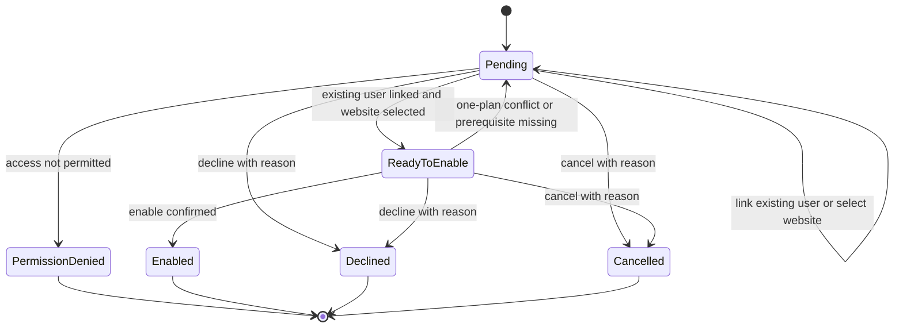
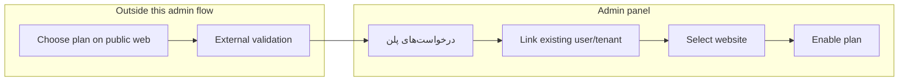

# UX Flow Specification

## Document control

| Field | Value |
|---|---|
| Project | Unixsee Admin Panel |
| Flow or service | Administrator plan-request enablement (`درخواست‌های پلن`) |
| Version | 0.3 |
| Status | Draft |
| Date | 2026-08-15 |
| Prepared from | Stakeholder scope clarification (2026-08-08); guest OTP → account before submit (2026-08-14 / customer-public-plan-request v0.4); prior draft 0.2 |
| Primary owner | Product and operations |
| Reviewers required | Product, operations, backend engineering, QA, accessibility |

## Confidence summary

| Area | Confidence | Reason |
|---|---|---|
| User needs | High for this thin phase | Direct stakeholder scope for Phase 1 admin behaviour |
| Current journey | High | `/plan-requests` is a placeholder heading |
| Business rules | High for stated rules | Existing user required; one plan per website; enablement is the admin outcome |
| Proposed journey | Medium | Aligns to stated scope; not yet ops-validated |
| Accessibility | Medium | Expert review against project rules, not usability testing |
| Measurement plan | Low | Minimal events proposed; analytics ownership unknown |

## Executive flow summary

- **Primary user:** Authorized staff working درخواست‌های پلن.
- **Goal:** Enable a customer-requested plan on exactly one website that already has a usable existing **tenant** (authorized customer).
- **Current problem:** `/plan-requests` historically lacked an in-product enablement path; enablement also must respect احراز هویت.
- **Proposed change:** Provide a thin queue and detail flow: review the requested plan on an already user-linked request, confirm **tenant**, choose the target website, and enable the plan. Do **not** surface guest vs logged-in intake badges — public visitors get an account on OTP verify before submit (see `customer-public-plan-request.md`).
- **Main decisions:** Public catalog choice and external validation are out of this app; admin does not create users here; admin does not run sales communication or quotation workflows here; each website has at most one active plan at a time; **request submission is allowed before tenant approval**, but **enablement is not**; admin treats all requests as account-linked (no “درخواست مهمان” queue distinction).
- **Completion state:** Request is `enabled` (plan active on the target website) or a simple terminal alternative (`declined` / `cancelled`) with history retained.
- **Highest-risk failure:** Enabling a plan without a tenant, or putting a second active plan on a website that already has one.
- **Accessibility risk:** Enable confirmation and blocking reasons may be silent for keyboard or screen-reader users.
- **Evidence gap:** Exact public-intake payload fields and decline reasons are not finalized.
- **Next validation:** Prototype queue → link customer with tenant → select website → enable, and confirm the one-plan-per-website block plus non-tenant enablement block.

## Problem and desired outcome

### Problem statement

Customers can choose a plan on the public web app, but the admin panel cannot yet enable that requested plan on a website. Without a thin enablement flow, staff cannot connect an existing customer and website to the chosen plan in-product.

### Desired user outcome

Staff can see pending plan requests, confirm the existing customer, choose the website that should receive the plan, and enable that plan—or decline/cancel with a reason—without offline tracking.

### Desired service outcome

Unixsee can turn a validated public plan choice into one active plan on one website, owned by an existing customer, with a durable request history.

### Why this matters now

- Phase work already includes users/tenants and website assignment surfaces.
- Plan enablement is the missing commercial step that makes a requested plan real on a website.
- Broader sales CRM behaviour (communicate, request information, quote, create accounts from the request) is explicitly not part of this phase.

### Scope

#### In scope

- Admin queue at `/plan-requests` and request detail at `/plan-requests/[id]`.
- Display of the plan the customer already chose on the public web app.
- Confirming and linking an **existing** customer; enablement requires a usable
  **tenant** (authorized via احراز هویت or staff approve).
- Selecting the target website for enablement.
- Enforcing **one active plan per website**.
- Enabling the requested plan on that website.
- Blocking enablement when the linked customer is not yet a tenant, while
  keeping the request in queue.
- Simple decline / cancel with reason.
- Loading, empty, permission, validation, conflict, failure, and recovery states needed for the thin path.
- Persian RTL and equivalent English LTR behaviour.

#### Out of scope

- Public web plan-catalog and plan-request form UX.
- External validation that happens before or beside admin enablement.
- Admin communication, information-request, quotation, or agreement-evidence workflows.
- Creating a user or tenant from the plan-request surface.
- Changing the requested plan inside a sales recommendation workflow.
- Payment, refunds, dunning, and accounting-grade invoicing.
- Agent enrollment, discovery, or server provisioning owned by this flow.
- Final NestJS DTO/event contracts.
- Visual styling and component polish.

### Success definition

- Staff can enable an eligible request without an offline spreadsheet.
- Enablement is blocked when no usable existing **tenant** is linked.
- Enablement is blocked when the target website already has another active plan.
- Enabling a request results in exactly one active plan on the chosen website.
- Keyboard and screen-reader users can complete queue review and enablement.

## Available evidence

| ID | Type | Source | User/role | Finding | Strength | Date |
|---|---|---|---|---|---|---|
| E-001 | Stakeholder scope clarification | This rewrite request | Product | Public app: choose plan from list; validation out of app scope; admin enables the requested plan; user must already exist; one plan per website | Strong | 2026-08-08 |
| E-002 | Implementation inspection | `src/app/plan-requests/page.tsx` | Administrator | Route is placeholder heading only | Strong | 2026-08-08 |
| E-003 | Implementation inspection | `src/components/app-sidebar.tsx` | Administrator | Nav exposes “درخواست‌های پلن” → `/plan-requests` | Strong | 2026-08-08 |
| E-004 | Related implementation | Users and websites admin flows | Staff | Existing customer/tenant and website surfaces already exist for linking and ownership | Strong | 2026-08-08 |
| E-005 | Architecture constraint | `docs/architecture/project.md` | Engineering | Current admin phase is UI-only / fixture-backed | Strong | 2026-08-08 |

## Assumptions and unknowns

### Assumptions

| ID | Assumption | Origin | Risk | Affected decision | Validation | Status |
|---|---|---|---|---|---|---|
| A-001 | External validation has already happened, or is not represented as admin work in this phase | E-001 | Medium if staff still need an in-app validation checklist | Keep validation out of UI | Product confirmation | Accepted for this phase |
| A-002 | The public request already contains the chosen plan identifier/name staff need to enable | E-001 | Medium if payload is incomplete | Detail fields | Intake contract review | Unvalidated |
| A-003 | The target website already exists as an assignable managed/discovered website record by enablement time | Related servers/websites work | High if website is missing | Website selector | Ops walkthrough | Unvalidated |
| A-004 | “Enable plan” is the admin outcome that makes the requested plan the website’s active plan | E-001 | High if product later splits approve vs activate again | Completion state | Product walkthrough | Accepted for this phase |

### Unknowns

| ID | Unknown | Impact | Decision blocked | Resolution | Priority |
|---|---|---|---|---|---|
| U-001 | Exact public-intake fields available on the admin detail | Incomplete detail screen | Field list | Public/admin contract | High |
| U-002 | Required decline/cancel reason taxonomy | Incomplete terminal records | Reason control | Product/ops | Medium |
| U-003 | Whether enablement may replace an existing active plan, or must always block until the current plan is ended elsewhere | Conflict UX | One-plan rule enforcement mode | Product | Critical |
| U-004 | Whether the request arrives already tied to a user id, or only contact identifiers for matching | Linking UX | Auto-link vs search-and-link | Intake contract | High |

## Domain distinctions

| Concept | Meaning | Not the same as |
|---|---|---|
| Plan request | Customer’s choice of a plan, awaiting admin enablement | Payment, validation checklist, sales ticket |
| Chosen plan | Plan selected on the public web app | Active website plan until enabled |
| Customer user | Existing authenticatable identity | A lead to be created from this flow |
| Tenant | Existing owner of websites/services | Plan request record |
| Website | Target site that may hold one active plan | Plan request |
| Enablement | Making the chosen plan the website’s active plan | Public submission, external validation |

## Users, roles and permissions

### Users

| Role | Goal | Responsibility | Constraints | Needs |
|---|---|---|---|---|
| Enablement staff | Clear pending plan requests | Review request, link existing customer, choose website, enable or decline | Must not create users here; must not enable without website/tenant | Queue, blockers, confirm enable |
| Customer admin (supporting) | Resolve missing identity / احراز هویت outside this flow | Ensure the correct user and **tenant** exist in Users before enablement | Identity work stays in `/users` | Clear “tenant missing” / “user missing” blocker |
| Auditor | Inspect enablement history | Read request transitions and resulting website plan link | Read-only | Timeline and reasons |

### Permissions

| Action | Enablement staff | Customer admin | Auditor | Conditions |
|---|---:|---:|---:|---|
| View plan-request queue/detail | Yes | Limited | Yes | Capability + scope |
| Link existing customer / require tenant | Yes | Yes | No | Existing match only; no create; enablement needs tenant |
| Select target website | Yes | Limited | No | Website eligible and in scope |
| Enable plan | Capability required | No | No | Existing user + website + one-plan rule |
| Decline / cancel | Capability required | No | No | Reason required |

## User needs

### UN-001 — See plan requests that need enablement

**As** enablement staff, **when** public plan choices arrive, **I need to** see the chosen plan, customer link state, and whether enablement is blocked **so that** requests do not stall as a dead-end page.

- Evidence: E-001, E-002, E-003.
- Success: Queue shows state, chosen plan, linked user/tenant, target website readiness, and next action.
- Priority: Critical.

### UN-002 — Connect an existing customer before enablement

**As** enablement staff, **when** a request is not yet tied to a usable account, **I need to** find and link an existing user/tenant **so that** the plan is owned correctly.

- Evidence: E-001, E-004.
- Success: Enablement stays blocked until an existing **tenant** is linked; create-user is not offered here.
- Priority: Critical.

### UN-003 — Enable one plan on one website

**As** enablement staff, **when** the customer and website are ready, **I need to** enable the requested plan on that website **so that** the website has exactly one active plan.

- Evidence: E-001.
- Success: Enablement sets the website’s active plan to the requested plan, or blocks when another active plan already exists (per U-003 policy).
- Priority: Critical.

### UN-004 — Stop or refuse a request cleanly

**As** enablement staff, **when** a request should not be enabled, **I need to** decline or cancel with a reason **so that** the queue stays truthful.

- Evidence: E-001.
- Success: Terminal states require a reason and remain in history.
- Priority: Important.

## Current journey

| Stage | Goal | Action | Response | Actors | Backstage | Pain point | Evidence |
|---|---|---|---|---|---|---|---|
| Public choice | Choose a plan | Customer selects a plan on public web | Request intended for ops | Customer | Public app + external validation | Outside admin | E-001 |
| Admin entry | Open plan requests | Select درخواست‌های پلن | Placeholder heading | Administrator | None | JP-001: dead end | E-002, E-003 |
| Enable | Put plan on website | Offline coordination assumed | Unknown | Staff | None | JP-002: no in-product enablement | E-001 |

## Proposed journey

| Stage | Goal | Behaviour | Response | Decision | Backstage | Problem | Need |
|---|---|---|---|---|---|---|---|
| 1. Intake | Find work | Open `/plan-requests`, filter by state | Shows chosen plan, link state, blockers | Permitted? | Capability scope | JP-001 | UN-001 |
| 2. Review | Understand request | Open `/plan-requests/[id]`: chosen plan, contacts, current link/website state | Shows what is missing | Ready to enable? | Fixture/API later | JP-002 | UN-001 |
| 3. Link customer | Attach existing owner | Search/link existing user; confirm tenant (احراز هویت done) | Request linked, or blocked with “tenant required” | Tenant ready? | Users domain read/search | Missing user/tenant | UN-002 |
| 4. Choose website | Pick target | Select eligible website for this tenant/context | Website selected or blocked | Website eligible? | Websites domain | Missing/conflicted website | UN-003 |
| 5. Enable or refuse | Finish | Confirm enable, or decline/cancel with reason | `enabled` or terminal | Valid? | One-plan rule + audit | Wrong plan/site | UN-003, UN-004 |

## Mermaid flow diagram

## Screen/state sequence

| Step | State | Goal | Entry condition | Information | Actions | System behaviour | Exit |
|---|---|---|---|---|---|---|---|
| S-01 | Queue ready | Choose work | Authorized `/plan-requests` | State, chosen plan, user-link state, website readiness, next action | Filter, open | Capability scoping | Request selected |
| S-02 | Pending review | Understand blockers | Request opened at `/plan-requests/[id]` | Chosen plan, contacts, linked user/tenant, website candidate, history | Link existing user, select website, decline/cancel | No create-user action | Ready, still pending, or terminal |
| S-03 | Ready to enable | Confirm outcome | Existing user linked + website selected + no active-plan conflict | Summary: user, tenant, website, chosen plan | Confirm enable, go back, decline/cancel | Validates one-plan rule | Enabled or blocked |
| S-04 | Enabled / terminal | Durable outcome | Enable or refuse completed | Timeline, linked website/plan, reasons | Open linked user/website records | Preserves history | Re-entry read-only or related records |

### State-transition table

| From | Trigger | Actor | Preconditions | Rules | To | Side effects | Failure |
|---|---|---|---|---|---|---|---|
| `pending` | Link existing user/tenant | Enablement staff | Match exists and is usable | BR-002, BR-003 | `pending` or `ready_to_enable` | Link audit | No match / ambiguous match |
| `pending` | Select website | Enablement staff | User/tenant linked; website in scope | BR-004 | `pending` or `ready_to_enable` | Website target recorded | Website ineligible |
| `ready_to_enable` | Enable plan | Authorized staff | User linked, website selected, one-plan rule passes | BR-001, BR-004, BR-005 | `enabled` | Website active plan becomes chosen plan; history retained | Conflict / permission denied |
| `pending` or `ready_to_enable` | Decline / cancel | Authorized staff | Transition allowed | BR-006 | `declined` / `cancelled` | Reason retained | Missing reason |
| any | View without capability | Any | None | BR-001 | no change / denied | None | Permission denied |

## Business-rule decision table

### Enablement readiness

| Condition/result | Case 1 | Case 2 | Case 3 | Case 4 | Case 5 |
|---|---:|---:|---:|---:|---|
| Actor has enable capability | Yes | No | Yes | Yes | Yes |
| Existing tenant linked | Yes | Yes | No | Yes | Yes |
| Target website selected | Yes | Yes | Yes | No | Yes |
| Website has no conflicting active plan | Yes | Yes | Yes | Yes | No |
| Result | Allow enable | Deny | Block; require existing user | Block; select website | Block; one-plan conflict |

### Business-rule register

- **BR-001 — Capability scope:** Queue and enablement actions are authorized capabilities. Source: E-001, project access model. Status: Confirmed principle.
- **BR-002 — Existing tenant required for enablement:** A plan request can be enabled only when linked to an existing usable **tenant** (authorized customer). A user account without a tenant is not enough. Source: E-001; [`../notes/customer-authorization-and-tenant.md`](../notes/customer-authorization-and-tenant.md). Status: Confirmed for this phase.
- **BR-002a — Request before tenant allowed:** Customers may submit plan requests before احراز هویت completes; admin must not treat submission as a sale, and customer copy must state certifications are required for delivery. Source: product clarification 2026-08-13. Status: Confirmed for this phase.
- **BR-003 — No create-from-request:** This flow must not create users or tenants; missing identity or incomplete احراز هویت is resolved in `/users`, then linked here. Source: E-001. Status: Confirmed for this phase.
- **BR-004 — One active plan per website:** A website may have at most one active plan at a time. Source: E-001. Status: Confirmed; replacement vs hard-block mode is U-003.
- **BR-005 — Enablement assigns the chosen plan:** Enabling a request makes that request’s chosen plan the website’s active plan. Source: E-001, A-004. Status: Confirmed for this phase.
- **BR-006 — Reasoned refusal:** Decline and cancel require a reason and retain history. Source: operational completeness. Status: Proposed.
- **BR-007 — External validation out of band:** Admin enablement does not implement the public/external validation checklist. Source: E-001. Status: Confirmed for this phase.
- **BR-008 — Cross-flow ownership:** Plan-request flow owns request state and enablement; users flow owns identity; websites/servers flows own website inventory and infrastructure. Source: E-004. Status: Confirmed for this phase.
- **BR-009 — Idempotent enablement:** Uncertain retries reconcile by request/idempotency key before duplicating an active plan assignment. Source: failure rule. Status: Proposed.

## Loading, empty, error and recovery states

### Loading

| ID | Trigger | User action | Status | Timeout/recovery | Exit |
|---|---|---|---|---|---|
| LD-001 | Queue load/filter | Use other nav | Section loading | Retry section | Ready/empty/unavailable |
| LD-002 | Enable submit | Do not resubmit | Announce enabling | Reconcile request + website plan | Enabled/failed/recovery |

### Empty

| ID | Cause | Meaning | Action | Permission consideration |
|---|---|---|---|---|
| EM-001 | No requests in scope | No enablement work | Adjust filters | Do not imply global emptiness |
| EM-002 | No existing user match | Cannot enable yet | Resolve in `/users`, then return and link | Do not offer create here |
| EM-003 | No eligible website | Cannot enable yet | Resolve website readiness in websites/servers flows | Read-only sees explanation |

### Validation

| ID | State | Rule | Problem | Correction | Data retained |
|---|---|---|---|---|---|
| VR-001 | Link | Existing user required | No usable match | Link existing account after it exists | Yes |
| VR-002 | Enable | Website required | No target | Select website | Yes |
| VR-003 | Enable | One plan per website | Conflicting active plan | Resolve per U-003 policy | Yes |
| VR-004 | Decline/cancel | Reason required | Incomplete record | Provide reason | Yes |

### System failure

| ID | Failure | Result certainty | Data saved | Retry safe | Recovery | Owner |
|---|---|---|---|---|---|---|
| SF-001 | Enable times out | Unknown | Unknown | Not until reconciled | Reload request and website plan; enable only if not already enabled | Backend |
| SF-002 | Concurrent enable on same website | One write wins or conflict | Prior valid version | Manual retry | Show latest website plan and request state | Backend |

### User control and save/resume

- **Back:** Leaves the confirm step without enabling.
- **Cancel editing:** Ends link/website selection edits, not the request lifecycle.
- **Decline/cancel request:** Separate capability-protected lifecycle actions with reason.
- **Undo:** Not available for enablement; corrections are new audited events.
- **Cross-flow pause:** Leaving to `/users` or `/websites` to resolve blockers must keep the same request resumable.

## Edge cases

| ID | Scenario | Expected behaviour | Rule | Recovery | Criteria |
|---|---|---|---|---|---|
| EC-001 | Request has contacts but no existing user or no tenant | Block enablement; explain that a tenant must already exist | BR-002, BR-003 | Create/approve tenant in `/users` (احراز هویت), then link | AC-003 |
| EC-002 | Website already has an active plan | Block enablement (or follow approved replacement policy from U-003) | BR-004 | Resolve current plan, then retry | AC-005 |
| EC-003 | User linked but no eligible website | Keep request pending with website blocker | BR-008 | Finish website readiness elsewhere | AC-004 |
| EC-004 | Two staff enable the same request | One success; the other sees already-enabled state | BR-009 | No duplicate active plan | AC-007 |
| EC-005 | Request already enabled | Detail is read-only for enablement; show linked website/plan | BR-005 | Open related records | AC-002 |

## Accessibility review

| ID | Criterion | State | Problem/status | Required behaviour | Severity | Test |
|---|---|---|---|---|---:|---|
| AX-001 | Keyboard operation | Queue, detail, confirm | Actions may become pointer-only | All enablement actions keyboard operable | 4 provisional | Keyboard |
| AX-002 | Status messages | Enable / block / terminal | Silent result | Announce enabled, blocked reason, declined/cancelled | 4 provisional | SR |
| AX-003 | Focus restoration | Return from `/users` or `/websites` | Context loss | Restore to request heading/next action | 4 provisional | Keyboard |
| AX-004 | Labels/errors | Link and website fields | Blockers unclear | Programmatic labels and recoverable errors | 3 provisional | SR/code |
| AX-005 | Critical submission | Enable confirm | Accidental irreversible enablement | Review summary + confirm | 4 provisional | Usability |
| AX-006 | RTL/LTR | Domains/emails in Persian UI | Bidirectional confusion | Keep identifiers readable/copyable | 3 provisional | Manual |

## Heuristic review

| ID | Heuristic | State | Finding | Severity | Required behaviour |
|---|---|---|---|---:|---|
| HX-001 | Visibility of system status | Pending vs enabled | Staff must see what blocks enablement | 4 | Explicit blocker labels |
| HX-002 | Match with real world | Thin enablement | Use “enable plan”, not sales-CRM language | 3 | Vocabulary matches this phase |
| HX-003 | Error prevention | Enable | Prevent enablement without user/website or against one-plan rule | 4 | Gated confirm |
| HX-004 | Consistency | User linking | Same existing-user search rules as users domain | 4 | No create shortcut here |
| HX-005 | Minimalism | Detail | Do not embed communication, quoting, or agent enrollment | 3 | Link out only for blockers |
| HX-006 | Error recovery | Timeout | No blind re-enable | 4 | Reconcile first |

## Analytics events

Exclude free-text notes, raw contact values, and secrets.

| ID | Event | Trigger | State change | Properties | Question |
|---|---|---|---|---|---|
| EV-001 | `plan_request_flow_opened` | Staff opens queue/detail | Entry | entry point | Is the destination used? |
| EV-002 | `plan_request_user_linked` | Existing user/tenant linked | pending update | — | How often is linking needed? |
| EV-003 | `plan_request_enabled` | Enable confirmed | → enabled | — | Do staff finish enablement in-product? |
| EV-004 | `plan_request_blocked` | Enable blocked | no change | blocker=`missing_user`/`missing_website`/`active_plan_conflict` | Which prerequisite fails most? |
| EV-005 | `plan_request_declined` | Decline confirmed | → declined | reason category | Why are requests refused? |

## Acceptance criteria

### AC-001 — Operable plan-request queue
**Given** authorized staff open درخواست‌های پلن, **when** requests exist in scope, **then** each item exposes state, chosen plan, user-link state, and next action, **and** the route is not a dead-end heading.

### AC-002 — Enable chosen plan on a website
**Given** a pending request with an existing linked **tenant** and an eligible selected website that has no conflicting active plan, **when** staff confirm enablement, **then** the request becomes `enabled` and that website’s active plan is the request’s chosen plan.

### AC-003 — Existing user required
**Given** a request has no linked usable **tenant**, **when** staff attempt enablement, **then** the action is blocked, **and** the UI does not offer create-user inside this flow (resolve احراز هویت / tenant in `/users`).

### AC-004 — Website required
**Given** a request has a linked user but no selected eligible website, **when** staff attempt enablement, **then** the action is blocked until a website is selected.

### AC-005 — One active plan per website
**Given** the selected website already has an active plan, **when** staff attempt enablement, **then** the action follows the approved one-plan policy from U-003 and does not leave two active plans on that website.

### AC-006 — Decline or cancel with reason
**Given** staff refuse a request, **when** the action is confirmed, **then** a reason is required and history is retained.

### AC-007 — Uncertain-result recovery
**Given** enablement times out, **when** staff retry, **then** the client reconciles by request/website state before duplicating the active plan assignment.

### AC-008 — Accessible completion
**Given** keyboard/screen-reader users run queue, link, and enable paths, **when** state changes, **then** status is announced, focus remains usable, and RTL/LTR completion remains possible.

### AC-009 — Permission enforcement
**Given** a user lacks enable capability, **when** they attempt enablement, **then** the system denies it and the UI does not fake success.

## Questions requiring decision

| ID | Question | Decision | Users | Method | Priority |
|---|---|---|---|---|---|
| RQ-001 | If a website already has an active plan, does enablement hard-block or offer an explicit replace path? | U-003 | Product/ops | Decision | Critical |
| RQ-002 | Does the public request arrive with a user id, or only contact fields for matching? | U-004 | Product/backend | Intake contract | **Resolved:** guest OTP creates/authenticates the user before submit; admin UI no longer distinguishes guest intake. Nest sync still needed for legacy anonymous create | High |
| RQ-003 | Which decline/cancel reasons are required in Phase 1? | U-002 | Ops | Short list | Medium |

## Risks and dependencies

### Risks

| ID | Risk | Source | Likelihood | Impact | Mitigation | Owner | Release effect |
|---|---|---|---|---|---|---|---|
| R-001 | Reintroducing sales CRM scope into this flow | Prior draft 0.1 | Medium | High | Keep out-of-scope list authoritative | Product | Block |
| R-002 | Enabling without an existing tenant | BR-002 drift | Medium | High | Hard gate + AC-003 | Product/engineering | Block |
| R-003 | Two active plans on one website | U-003 unresolved | Medium | High | Enforce BR-004 before enable | Product/engineering | Block |

### Dependencies

| ID | Dependency | Type | Owner | Required by | Failure effect | Fallback |
|---|---|---|---|---|---|---|
| D-001 | Public plan-request intake providing chosen plan (+ identity fields) | System | Public web/backend | Queue population | Empty/incomplete admin queue | Manual fixture in prototype |
| D-002 | Existing users/tenants searchable for linking | UX/system | Users workstream | Customer link | Cannot enable | Block with clear message |
| D-003 | Website records available for selection | UX/system | Websites/servers workstream | Enablement target | Cannot enable | Block with clear message |
| D-004 | One-plan conflict policy (U-003) | Policy | Product | Enable confirm | Ambiguous conflict UX | Hard-block until decided |

## Implementation readiness

**Ready for thin prototyping** after RQ-001 is decided or temporarily hard-blocked.

Sufficient for static Persian RTL admin flows covering:

- plan-request queue and detail
- link existing customer; enable only when tenant exists
- select website
- enable / decline / cancel
- one-plan-per-website conflict handling
- authorization note: `docs/product/notes/customer-authorization-and-tenant.md`

**Not ready for production implementation** until D-001–D-004 and U-001/U-004 are resolved.

### Blockers

- Decide hard-block vs explicit replace when a website already has an active plan.
- Confirm whether requests arrive pre-linked to a user id.
- Keep user creation and external validation outside this flow.

## Final recommendations

### Must keep for this phase

- **REC-001:** `/plan-requests` is only for reviewing and enabling already-chosen plans. Traces to UN-001, AC-001.
- **REC-002:** Require an existing **tenant** before enablement; do not create accounts here; do not enable for user-only (non-tenant) customers. Traces to UN-002, BR-002/002a/003, AC-003.
- **REC-003:** Enablement sets one active plan on one website. Traces to UN-003, BR-004/005, AC-002/005.
- **REC-004:** Keep public choice and external validation out of this admin flow. Traces to E-001, BR-007.

### Must validate during prototyping

- Missing-user blocker and return-from-`/users` resume.
- Website selector and one-plan conflict message.
- Enable confirm summary and status announcement.

### Explicitly rejected for this phase

- In-admin communication / information-request workflow.
- Agreement-evidence or quotation steps before enablement.
- Admin create user/tenant from the plan request.
- Multi-state sales pipeline (`needs_customer_information`, `agreement_ready`, separate commercial `approved` vs infra `provisioning` owned by this surface).
- Treating this flow as agent enrollment or server provisioning.
- Payment checkout as part of enablement.

---

## Appendix — Companion documents

- Operating model: `docs/product/notes/onboarding-plan-request-user-website.md`
- Paths/handoffs: `docs/product/notes/onboarding-paths-and-handoffs.md`
- Public entry sync: `docs/product/notes/phase-1-public-entry-channels.md`
- Agent sequence: `docs/product/notes/servers-agent-data-flow.md`
- Users/tenants / احراز هویت: `docs/product/ux-flows/admin-users.md`
- Authorization review: `docs/product/ux-flows/admin-authorization.md`
- Customer authorization: `docs/product/ux-flows/client-authorization.md`
- Authorization note: `docs/product/notes/customer-authorization-and-tenant.md`
- Servers/agents/websites: `docs/product/ux-flows/admin-servers-websites-agents.md`
- Product source: `docs/product/phase-1-application-features.md` §11

All of the above are aligned to this v0.2 thin enablement scope for
`/plan-requests`.
