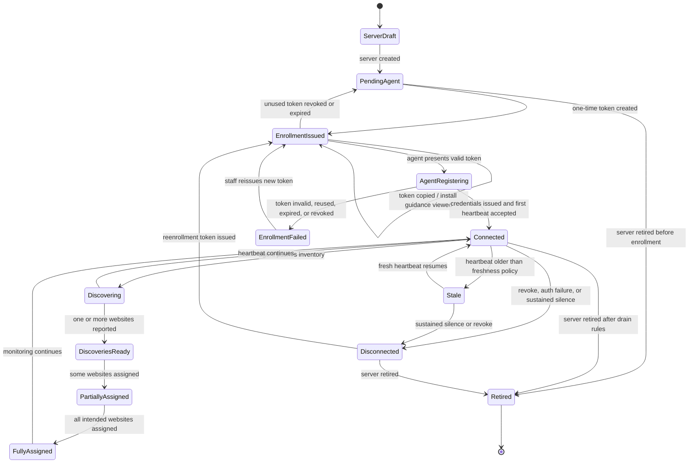
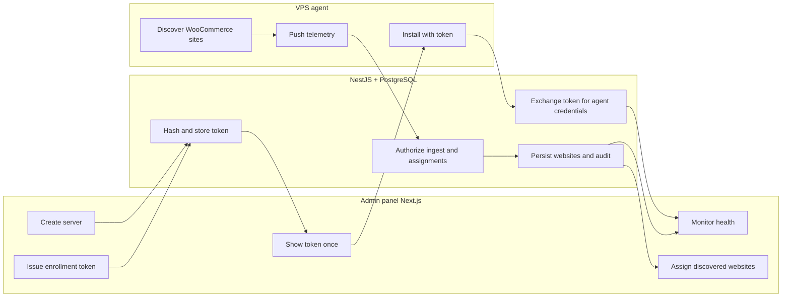

# UX Flow Specification

> **Accepted v0.2 update (2026-08-21):** The web-server-only PRD and ADR 0014
> supersede older discovery research below. Live UX uses OLS inventory only;
> DirectAdmin/WP admin URLs are manual fields; stack refresh is Admin → Nest →
> heartbeat command → protected local probe; 3m/24h traffic shows freshness and
> warming coverage while preserving last-good stack values on failures.

## Document control

| Field              | Value                                                                                                                          |
| ------------------ | ------------------------------------------------------------------------------------------------------------------------------ |
| Project            | Unixsee Admin Panel                                                                                                            |
| Flow or service    | Administrator servers, websites, and agent enrollment                                                                          |
| Version            | 0.4                                                                                                                            |
| Status             | Draft                                                                                                                          |
| Date               | 2026-08-24                                                                                                                     |
| Prepared from      | `docs/product/phase-1-application-features.md` §§12–14, 21, 23, 25; prior draft 0.2; fixture renew/replace on `/websites/[id]` |
| Primary owner      | Product, operations, and platform security                                                                                     |
| Reviewers required | Product, operations, backend engineering, security, QA, accessibility                                                          |

## Confidence summary

| Area             | Confidence | Reason                                                                                        |
| ---------------- | ---------- | --------------------------------------------------------------------------------------------- |
| User needs       | Medium     | Derived from Phase 1 staff outcomes and described ops workflow; no staff interviews           |
| Current journey  | High       | Admin routes inspected; operator-described agent path is explicit                             |
| Business rules   | Medium     | Ownership and security boundaries are documented; token lifetime and rotation policy are open |
| Proposed journey | Medium     | Aligns with documented NestJS/edge-agent boundaries; not yet validated with ops               |
| Accessibility    | Medium     | Based on project rules and expert review, not usability testing                               |
| Measurement plan | Low        | Events proposed; analytics ownership unknown                                                  |

## Executive flow summary

- **Primary user:** Authorized provisioning / operations staff.
- **Goal:** Register a VPS once, enroll its agent safely, see discovered websites, and assign them to the correct tenant without handling secrets or talking to agents from the browser.
- **Current problem:** `/servers` is a placeholder; websites UI shows monitoring status but has no enrollment, token, or assignment workflow. Agents are started manually per VPS by developers.
- **Proposed change:** Keep NestJS as the only control plane for agents. Use the admin panel only to create server records, issue one-time enrollment tokens, monitor agent health, and assign discovered websites. Plan entitlement comes from درخواست‌های پلن (or explicit staff plan selection); missing customers use the users-flow create-and-continue path.
- **Main decisions:** Do not run or host agents from this Next.js project. Tokens are created by NestJS, shown once in admin, never re-readable. Agents push to NestJS; the browser never receives agent credentials or agent addresses. Discovery assignment may consume a linked plan request’s chosen plan as default plan source but never treats discovery as plan enablement. Discovery **assign** and website **renew/replace** require unauthorized confirm override when the commercial principal has `authorized === false` (**1A**). Website details may **renew the commercial period** (advance renewal date by billing period, no payment) and **replace the active plan** via Nest commercial billing records (ADR 0015). First-time plan enablement stays in درخواست‌های پلن.
- **Completion state:** Agent is healthy, websites are discovered and assigned, telemetry is fresh, and enrollment secrets are no longer visible.
- **Highest-risk failure:** Enrollment token leakage, reused install credentials, or browser exposure of agent secrets.
- **Accessibility risk:** One-time secret display and copy actions may be inaccessible or lost without announced state.
- **Evidence gap:** No staff interviews; token TTL, rotation, and DirectAdmin/OpenLiteSpeed discovery contracts are undefined.
- **Next validation:** Prototype server → enroll token → agent connected → discovered websites → tenant assignment with ops and security.

## Problem and desired outcome

### Problem statement

Operations staff currently struggle to connect a VPS and its websites into Unixsee when a new server is provisioned because agent enrollment is a developer-run offline process and the admin panel has no safe workflow for servers, tokens, agent health, or website assignment. This causes slow onboarding, opaque connectivity failures, and elevated risk of insecure credential handling.

### Desired user outcome

Staff can register a server, obtain a one-time enrollment token, confirm the agent is connected, review discovered websites, and assign each website to the correct tenant and plan with clear status, recovery paths, and no need to hold long-lived secrets.

### Desired service outcome

Unixsee can onboard infrastructure consistently while NestJS remains the sole trusted authority for agent authentication, persistence, authorization, and orchestration, preserving auditability and tenant isolation.

### Why this matters now

- Phase 1 explicitly includes website, server, service-assignment, and agent-assignment administration.
- Current `/servers` is a dead end; websites already surface agent status without an enrollment path.
- The existing developer-run agent flow works but does not scale or provide staff-facing security controls.
- Security boundaries are already decided: browser must not talk to agents or PostgreSQL directly.

### Scope

#### In scope

- Server record lifecycle in the admin panel.
- One-time agent enrollment token creation, display, revoke, and reissue.
- Agent health, version, last communication, and freshness.
- Website discovery results pushed by the agent through NestJS.
- Website-to-server and website-to-agent association visibility.
- Tenant/plan assignment after discovery.
- Explicit separation from external websites: server/agent/discovery states
  apply only to Unixsee-managed coverage. See
  [`website-management-coverage.md`](./website-management-coverage.md).
- Stale, disconnected, permission-denied, validation, and recovery states.
- Persian RTL and equivalent English LTR behaviour.

#### Out of scope

- Running, shipping, or remotely installing the agent binary from this Next.js project.
- Browser-direct agent or VPS SSH/API access.
- Showing plaintext long-lived agent credentials after enrollment.
- Designing public plan-request or public signup journeys.
- Owning first-time plan enablement; that belongs to `admin-plan-requests.md` (website details may renew period / replace active plan as staff commercial fixture actions — Nest later).
- DirectAdmin, OpenLiteSpeed, or WooCommerce console embedding.
- Customer-facing agent management.
- Final NestJS DTO/event contracts; architecture owns those.
- Visual styling and component polish.

### Success definition

- Staff can enroll a new VPS without asking a developer for ad-hoc credentials.
- Enrollment secrets are shown once, revocable, and never stored in the browser beyond the display session.
- Agent connectivity and website discovery are visible without exposing internal agent addresses.
- Discovered websites cannot become customer-visible until tenant assignment succeeds.
- Every consequential enrollment and assignment action is authorized and audited by NestJS.

## Available evidence

| ID    | Type                               | Source                                                    | User/role            | Finding                                                                                                                                                 | Strength | Date       |
| ----- | ---------------------------------- | --------------------------------------------------------- | -------------------- | ------------------------------------------------------------------------------------------------------------------------------------------------------- | -------- | ---------- |
| E-001 | Documented product requirement     | `docs/product/phase-1-application-features.md` §12.3–12.4 | Staff                | Admin must create websites, assign plan/server/agent, and expose only application-level server and agent management                                     | Medium   | 2026-08-07 |
| E-002 | Security constraint                | Phase 1 §§14.4, 25                                        | Engineering/security | Browser never receives agent credentials or direct agent addresses; NestJS owns orchestration; browser must not access PostgreSQL or privileged systems | Strong   | 2026-08-07 |
| E-003 | Architecture constraint            | `docs/architecture/project.md`                            | Engineering          | Current admin phase is UI-only; no API/auth/backend integration yet                                                                                     | Strong   | 2026-08-07 |
| E-004 | Implementation inspection          | `src/app/servers/page.tsx`                                | Administrator        | `/servers` is a placeholder heading only                                                                                                                | Strong   | 2026-08-07 |
| E-005 | Implementation inspection          | `src/components/websites/*`, `websites-data.ts`           | Administrator        | Websites list/detail show agent connected/disconnected/stale and server labels, but no enrollment or assignment workflow                                | Strong   | 2026-08-07 |
| E-006 | Navigation inspection              | `src/components/app-sidebar.tsx`                          | Administrator        | Primary nav already exposes “وب‌سایت‌ها” and “سرورها”                                                                                                   | Strong   | 2026-08-07 |
| E-007 | Operator-described current process | Stakeholder description in this request                   | Developer/ops        | Developer runs one agent per VPS; agent detects WooCommerce DirectAdmin sites with OpenLiteSpeed; data is pushed to NestJS and stored in PostgreSQL     | Medium   | 2026-08-07 |
| E-008 | Product IA                         | Phase 1 §23                                               | Staff                | Admin IA centres on websites and infrastructure assignments, not customer-shell mirroring                                                               | Medium   | 2026-08-07 |

No staff interviews, support tickets, or analytics were available. E-001 is from a **Proposed** product document.

## Assumptions and unknowns

### Assumptions

| ID    | Assumption                                                                                                                 | Origin                                               | Risk          | Affected decision             | Validation                        | Status      |
| ----- | -------------------------------------------------------------------------------------------------------------------------- | ---------------------------------------------------- | ------------- | ----------------------------- | --------------------------------- | ----------- |
| A-001 | One agent process runs per VPS/server, not per website                                                                     | Current ops description + Phase 1 server/agent model | High if wrong | Server ↔ agent cardinality    | Confirm with platform engineering | Unvalidated |
| A-002 | Agent initiates outbound HTTPS to NestJS; NestJS does not open inbound SSH/agent ports from the admin UI                   | Security best practice + E-002                       | High if wrong | Enrollment and firewall model | Confirm agent networking design   | Unvalidated |
| A-003 | Discovered websites remain staff-only until tenant assignment                                                              | Inference from tenant isolation and activation rules | Medium        | Website visibility states     | Confirm product rule              | Unvalidated |
| A-004 | Staff who can manage servers may create enrollment tokens; a narrower capability may later separate create vs revoke       | Capability-based access model                        | Medium        | Permission matrix             | Security decision                 | Unvalidated |
| A-005 | Token creation in admin is a NestJS mutation proxied through trusted server-side admin APIs, not Next.js secret generation | E-002                                                | High if wrong | Trust boundary                | Architecture review               | Unvalidated |

### Unknowns

| ID    | Unknown                                                                      | Impact                                | Decision blocked                       | Resolution                | Priority |
| ----- | ---------------------------------------------------------------------------- | ------------------------------------- | -------------------------------------- | ------------------------- | -------- |
| U-001 | Enrollment token TTL, use-count, and bind-to-server rules                    | Insecure or unusable enrollment       | Token UX and revocation                | Security/architecture ADR | Critical |
| U-002 | Long-lived agent credential rotation and revoke-all behaviour                | Compromised agent recovery            | Agent security lifecycle               | Security/architecture ADR | Critical |
| U-003 | Exact discovery contract for DirectAdmin / OpenLiteSpeed / WooCommerce       | Incomplete or noisy website inventory | Discovered-website states              | Backend/agent contract    | Critical |
| U-004 | Whether multiple websites on one VPS always share one agent                  | Assignment model ambiguity            | Server detail information architecture | Platform decision         | High     |
| U-005 | Who performs VPS install today and whether non-developers will enroll agents | Copy, guidance, and handoff design    | Install instructions channel           | Ops interview             | High     |
| U-006 | Capacity and location metadata required on server create                     | Incomplete server records             | Server create form                     | Ops/product               | Medium   |
| U-007 | Concurrent enrollment of two agents to one server                            | Duplicate identity risk               | Registration conflict handling         | Backend design            | High     |
| U-008 | Audit retention for token create/revoke events                               | Incomplete security evidence          | Post-incident review                   | Security/legal            | Medium   |

## Architecture decision for this flow

### Recommended control-plane split

| Surface                            | Owns                                                                                      | Must not own                                                      |
| ---------------------------------- | ----------------------------------------------------------------------------------------- | ----------------------------------------------------------------- |
| Admin panel (this Next.js project) | Staff UX for servers, token issue/revoke, agent health, website assignment                | Agent process, PostgreSQL, secret storage, direct VPS/agent calls |
| NestJS + PostgreSQL                | Token generation/hashing, agent auth, discovery ingest, authorization, audit, assignments | Presentation concerns                                             |
| Edge agent on VPS                  | Local discovery and telemetry push using enrolled credentials                             | Business authorization or tenant rules                            |

### Should agents be handled from this Next.js project?

**No — not as process ownership.** Even if a thin “start agent” helper feels simple, it would place privileged infrastructure control in the presentation layer and violate E-002.

**Yes — as staff workflow.** The admin panel should handle the _human_ parts of agent management:

1. Create/select server.
2. Request enrollment token from NestJS.
3. Show install command / token once.
4. Observe connected / stale / disconnected.
5. Revoke or reissue enrollment.
6. Review discovered websites and assign tenants.

This preserves the existing “one agent per VPS, push to NestJS” model while making security operable by staff.

### Token creation from the admin panel?

**Yes, as a NestJS-backed action with one-time reveal.**

Recommended behaviour:

- Staff selects a server and chooses “ایجاد توکن اتصال”.
- NestJS creates a high-entropy token, stores only a hash + metadata, returns plaintext once.
- Admin shows plaintext in a one-time reveal surface with copy and install guidance
  that points operators to [`../../agent/setup.md`](../../agent/setup.md).
- After dismiss/navigation/refresh, plaintext is no longer retrievable; only status (`unused`, `used`, `expired`, `revoked`) remains.
- Agent exchanges the enrollment token for long-lived agent credentials over NestJS.
- Staff can revoke unused enrollment tokens and revoke/re-enroll compromised agents without seeing prior secrets.

## Users, roles and permissions

### Users

| Role                         | Goal                                 | Responsibility                                                                  | Constraints                                                                | Needs                                       |
| ---------------------------- | ------------------------------------ | ------------------------------------------------------------------------------- | -------------------------------------------------------------------------- | ------------------------------------------- |
| Provisioning staff           | Bring a VPS into Unixsee             | Create server, issue enrollment token, confirm connection                       | Must not see long-lived secrets after enrollment                           | Clear install steps and connection status   |
| Operations staff             | Keep fleet healthy                   | Monitor agent freshness, investigate stale/disconnected servers, reissue tokens | Cannot talk to agents from browser                                         | Prioritized unhealthy infrastructure queue  |
| Website administrator        | Make discovered sites customer-ready | Assign tenant, plan, and lifecycle state                                        | Cannot activate without required associations                              | Discovery context and assignment validation |
| Security/auditor             | Verify enrollment integrity          | Review token create/revoke and agent identity events                            | Read-only for mutations                                                    | Immutable audit trail                       |
| Developer/operator (offline) | Install agent on VPS                 | Run agent with enrollment token                                                 | Outside admin UI after token is issued                                     | Short, copyable install instructions        |
| Customer                     | See managed website health           | Consumes assigned website state                                                 | Never sees agents, tokens, or server internals beyond approved safe fields | Truthful service status                     |

### Permissions

| Action                        |          Provisioning |            Operations | Website admin | Auditor | Conditions                              |
| ----------------------------- | --------------------: | --------------------: | ------------: | ------: | --------------------------------------- |
| View servers/agents           |                   Yes |                   Yes |       Limited |     Yes | NestJS capability + scope               |
| Create/update server metadata |                   Yes |                   Yes |            No |      No | No secrets in payload                   |
| Create enrollment token       |                   Yes |   Capability required |            No |      No | Bound to one server; audited            |
| View token plaintext          | Once at creation only | Once at creation only |            No |      No | Never re-fetchable                      |
| Revoke enrollment / agent     |                   Yes |                   Yes |            No |      No | Reason required for active agent revoke |
| View discovered websites      |                   Yes |                   Yes |           Yes |     Yes | Staff-only until assigned               |
| Assign website to tenant/plan |               Limited |               Limited |           Yes |      No | Validations in NestJS                   |
| Dispatch operational actions  |                    No |   Capability required |       Limited |      No | Never exposes agent address             |

## User needs

### UN-001 — Enroll a VPS without developer ceremony

**As a** provisioning staff member, **when** a new VPS is ready, **I need to** create a server record and obtain a one-time enrollment token with install guidance **so that** an operator can connect the agent without inventing credentials.

- Evidence: E-001, E-007.
- Success: Unused token exists, install guidance is available, server waits for first agent contact.
- Priority: Critical.

### UN-002 — Know whether infrastructure is actually reporting

**As an** operations staff member, **when** monitoring depends on agents, **I need to** distinguish connected, stale, disconnected, never-enrolled, and revoked states with measurement times **so that** I do not treat missing telemetry as healthy.

- Evidence: E-001, E-005.
- Success: Freshness and last communication are always visible and never implied as current when stale.
- Priority: Critical.

### UN-003 — Turn discovered sites into managed customer websites

**As a** website administrator, **when** an agent reports WooCommerce sites on a server, **I need to** review discovery data and assign tenant/plan safely **so that** customers only see correctly owned active websites.

- Evidence: E-001, E-007, A-003.
- Success: Unassigned discoveries remain staff-only; assignment is validated and audited.
- Priority: Critical.

### UN-004 — Recover from lost or compromised agent access

**As an** operations or security user, **when** an agent token may be leaked or an agent stops authenticating, **I need to** revoke enrollment or agent credentials and reissue a new one-time token **so that** access can be rotated without redeploying business logic.

- Evidence: E-002, E-007.
- Success: Old credentials stop working; new enrollment is explicit and audited.
- Priority: Critical.

### UN-005 — Keep secrets out of everyday admin work

**As** Unixsee, **when** staff manage servers in the browser, **I need** NestJS to own secret generation and agent communication **so that** the admin panel remains a simple operations surface rather than a privileged infrastructure console.

- Evidence: E-002, E-003.
- Success: Browser never receives agent credentials or agent network endpoints.
- Priority: Critical.

## Current journey

| Stage            | Goal                  | Action                                                    | Response                                    | Actors        | Backstage     | Pain point                                         | Evidence     |
| ---------------- | --------------------- | --------------------------------------------------------- | ------------------------------------------- | ------------- | ------------- | -------------------------------------------------- | ------------ |
| Need arises      | Monitor a VPS         | Developer decides a server needs an agent                 | Offline process starts                      | Developer     | None in admin | No staff-facing entry                              | E-007        |
| Install          | Run agent             | Developer installs/runs agent on VPS                      | Agent starts                                | Developer     | VPS process   | Opaque to admin panel                              | E-007        |
| Discover         | Find sites            | Agent detects WooCommerce DirectAdmin OpenLiteSpeed sites | Inventory prepared                          | Agent         | Local scan    | No admin review step                               | E-007        |
| Push             | Persist               | Agent posts to NestJS                                     | PostgreSQL stores data                      | Agent/NestJS  | DB write      | Works, but credentials/process unknown to admin UX | E-007        |
| Observe websites | Check customer sites  | Staff open `/websites`                                    | List/detail show agent status from fixtures | Administrator | Static UI     | JP-001: status without enrollment ownership        | E-005        |
| Observe servers  | Manage infrastructure | Staff open `/servers`                                     | Placeholder heading only                    | Administrator | None          | JP-002: complete dead end                          | E-004        |
| Recover          | Fix broken agent      | Unknown offline action                                    | Unknown                                     | Developer     | Unknown       | JP-003: no revoke/reissue path                     | Evidence gap |

## Proposed journey

| Stage                 | Goal                           | Behaviour                                                                                                                                                    | Response                                       | Decision                                                                   | Backstage                                                      | Problem                                                              | Need           |
| --------------------- | ------------------------------ | ------------------------------------------------------------------------------------------------------------------------------------------------------------ | ---------------------------------------------- | -------------------------------------------------------------------------- | -------------------------------------------------------------- | -------------------------------------------------------------------- | -------------- |
| 1. Register server    | Create infrastructure identity | Enter location, label, capacity summary, notes                                                                                                               | Server enters `pending_agent`                  | Metadata valid?                                                            | NestJS persists server                                         | JP-002                                                               | UN-001         |
| 2. Issue enrollment   | Get one-time secret            | Request token for that server                                                                                                                                | Plaintext shown once; status `unused`          | Capability allowed?                                                        | NestJS hashes token, audits create                             | JP-003                                                               | UN-001, UN-005 |
| 3. Install offline    | Connect VPS                    | Operator runs agent with token + Nest endpoint                                                                                                               | Agent authenticates and registers              | Token valid/unexpired?                                                     | Agent exchanges token for credentials                          | E-007                                                                | UN-001         |
| 4. Confirm health     | Verify link                    | Staff refresh/open server detail                                                                                                                             | State `connected`; version and last seen shown | Heartbeat fresh?                                                           | NestJS records heartbeat                                       | JP-001                                                               | UN-002         |
| 5. Review discoveries | Understand inventory           | Inspect discovered websites                                                                                                                                  | Staff-only candidates listed                   | Discovery complete/partial?                                                | NestJS stores inventory                                        | A-003                                                                | UN-003         |
| 6. Assign website     | Make customer-managed          | Assign tenant, plan, lifecycle; if tenant/user is missing, create customer inline and resume assignment; if a plan request is linked, prefer its chosen plan | Website becomes managed/active when rules pass | Tenant exists or inline create succeeds; isolation and required fields ok? | NestJS validates create/assign and audits; may link request id | E-001; see `admin-users.md` CH-001 and `admin-plan-requests.md` v0.2 | UN-003         |
| 7. Operate            | Keep healthy                   | Filter stale/disconnected; revoke/reissue as needed                                                                                                          | Fleet queue prioritizes unhealthy servers      | Compromised or stale?                                                      | Revoke credentials; require new enrollment                     | JP-003                                                               | UN-002, UN-004 |
| 8. Audit              | Prove control                  | Review create/revoke/assign history                                                                                                                          | Immutable events available                     | Authorized?                                                                | Audit store                                                    | E-002                                                                | UN-005         |

## Mermaid flow diagram





## Screen/state sequence

| Step | State              | Goal                     | Entry condition                              | Information                                                          | Actions                                                                                                                         | System behaviour                                                                                                        | Exit                                |
| ---- | ------------------ | ------------------------ | -------------------------------------------- | -------------------------------------------------------------------- | ------------------------------------------------------------------------------------------------------------------------------- | ----------------------------------------------------------------------------------------------------------------------- | ----------------------------------- |
| S-01 | Servers queue      | Find infrastructure work | Authorized `/servers` entry                  | Server label, location, agent state, website count, freshness        | Filter, create, open                                                                                                            | Scope by capability                                                                                                     | Server selected/created             |
| S-02 | Server create      | Register VPS identity    | Create action                                | Label, location, capacity summary, notes                             | Save, cancel                                                                                                                    | Validates metadata only                                                                                                 | `pending_agent`                     |
| S-03 | Enrollment reveal  | Enable install           | Token create succeeds                        | One-time token, expiry, server binding, install command              | Copy, dismiss, revoke                                                                                                           | NestJS stores hash only; plaintext not re-readable                                                                      | Token unused or revoked             |
| S-04 | Awaiting agent     | Wait for first contact   | Token issued                                 | Waiting state, issued-at, expires-at                                 | Reissue, revoke                                                                                                                 | Marks token used on successful exchange                                                                                 | `connected` or failed               |
| S-05 | Agent healthy      | Confirm reporting        | Heartbeat accepted                           | Version, last seen, freshness, discovered count                      | View discoveries, revoke                                                                                                        | Distinguishes stale vs disconnected                                                                                     | Continue or recover                 |
| S-06 | Discoveries review | Inspect inventory        | Agent reported sites                         | Domain, panel hints, web server hints, unassigned flag               | Open assign, ignore/dismiss if policy allows                                                                                    | Keeps unassigned staff-only                                                                                             | Assignment started                  |
| S-07 | Website assign     | Bind tenant/plan         | Discovery selected                           | Tenant, plan, server, agent, lifecycle; optional linked plan request | Confirm assign; create customer if tenant missing; select/confirm plan (default from linked request’s chosen plan when present) | Revalidates ownership and required associations; inline create returns here with tenant preselected and draft preserved | Managed website active/provisioning |
| S-08 | Website ops view   | Operate customer site    | Existing `/websites` detail                  | Availability, agent freshness, safe service metadata                 | Allowed operational actions                                                                                                     | Never exposes agent secrets/addresses                                                                                   | Re-entry                            |
| S-09 | Recovery           | Restore trust            | Stale, disconnected, or suspected compromise | Failure reason category, last success, revoke options                | Revoke, reissue, escalate                                                                                                       | Invalidates old credentials before new token                                                                            | New enrollment                      |

### State-transition table

| From                              | Trigger                      | Actor                       | Preconditions                                | Rules                       | To                                           | Side effects                                                      | Failure                              |
| --------------------------------- | ---------------------------- | --------------------------- | -------------------------------------------- | --------------------------- | -------------------------------------------- | ----------------------------------------------------------------- | ------------------------------------ |
| —                                 | Create server                | Provisioning                | Create capability                            | BR-001                      | `pending_agent`                              | Server audit created                                              | Validation failed                    |
| `pending_agent` / connected       | Issue token                  | Provisioning/ops            | Server exists; capability                    | BR-002, BR-003              | `enrollment_issued`                          | Hash stored; plaintext returned once                              | Permission denied                    |
| `enrollment_issued`               | Agent registers              | Agent                       | Token valid, unused, unexpired, server-bound | BR-004, BR-005              | `connected`                                  | Token marked used; agent credentials issued                       | Enrollment rejected                  |
| `connected`                       | Inventory push               | Agent                       | Valid agent credentials                      | BR-006                      | `discoveries_ready`                          | Website candidates upserted                                       | Payload rejected                     |
| `discoveries_ready`               | Assign tenant/plan           | Website admin               | Required associations complete               | BR-007, BR-008              | Managed website state                        | Customer visibility may begin                                     | Validation/conflict                  |
| `discoveries_ready` / assign form | Start inline customer create | Provisioning/customer admin | No suitable tenant; create capability        | See `admin-users.md` BR-011 | Assign form resumed with new tenant selected | User/tenant/owner created; website still unassigned until confirm | Create validation/conflict/uncertain |
| `connected`/`stale`               | Revoke agent                 | Ops/security                | Reason supplied                              | BR-009                      | `disconnected`                               | Credentials invalidated; audit                                    | Permission denied                    |
| `disconnected`                    | Reissue token                | Provisioning/ops            | Capability                                   | BR-002                      | `enrollment_issued`                          | New one-time token only                                           | Prior token remains unreadable       |

## Business-rule decision table

### Enrollment token create

| Condition/result                   |                  Case 1 |                              Case 2 |        Case 3 |                                                                Case 4 |
| ---------------------------------- | ----------------------: | ----------------------------------: | ------------: | --------------------------------------------------------------------: |
| Actor has token-create capability  |                     Yes |                                  No |           Yes |                                                                   Yes |
| Server exists and not retired      |                     Yes |                                 Yes |            No |                                                                   Yes |
| Active unused token already exists |                      No |                                  No |            No |                                                                   Yes |
| Result                             | Create token; show once | Deny without leaking server secrets | Reject create | Prefer revoke-or-rotate confirmation; do not create silent duplicates |

### Website assignment from discovery

| Condition/result                                  |           Case 1 | Case 2 |                                      Case 3 |                     Case 4 |
| ------------------------------------------------- | ---------------: | -----: | ------------------------------------------: | -------------------------: |
| Actor has assignment capability                   |              Yes |     No |                                         Yes |                        Yes |
| Discovery linked to healthy or known server/agent |              Yes |    Yes |                                          No |                        Yes |
| Tenant selected                                   |              Yes |    Yes |                                         Yes |                         No |
| Principal `authorized` (else confirm override)    |              Yes |    Yes |                                    Override |                         No |
| Website already assigned to another tenant        |               No |     No |                                          No |                         No |
| Result                                            | Assign and audit |   Deny | Block; require reconciling discovery source | Reject; preserve discovery |

### Business-rule register

- **BR-001 — Application-level server records:** Admin manages identity, location, capacity summary, lifecycle, and communication status only. Source: E-001. Status: Confirmed.
- **BR-002 — NestJS owns secrets:** Token and agent credential generation, hashing, and verification happen only in NestJS. Source: E-002, A-005. Status: Confirmed principle.
- **BR-003 — One-time reveal:** Enrollment plaintext is available only in the create response/UI session and is never listable later. Source: E-002 + security practice. Status: Proposed; TTL in U-001.
- **BR-004 — Token binding:** Enrollment token is bound to one server and becomes invalid after successful use, expiry, or revoke. Source: A-001/U-001. Status: Proposed.
- **BR-005 — Agent pull/push auth:** Agent authenticates to NestJS; admin browser never receives agent credentials or agent addresses. Source: E-002. Status: Confirmed.
- **BR-006 — Discovery is not activation:** Discovered websites are staff-visible inventory until assignment and activation rules succeed. Source: A-003, E-001. Status: Proposed.
- **BR-007 — Single-tenant ownership:** A website cannot belong to multiple tenants. Source: Phase 1 §9.4. Status: Confirmed.
- **BR-008 — Activation prerequisites:** Staff cannot present a website as active without tenant, plan/service assignment, and required operational configuration. Source: Phase 1 §11.5 / §12. Status: Confirmed.
- **BR-009 — Revoke before replace:** Reenrollment after compromise requires invalidating prior agent credentials. Source: UN-004. Status: Proposed.
- **BR-010 — Stale ≠ healthy:** Telemetry older than freshness policy cannot be shown as current health. Source: Phase 1 §13. Status: Confirmed.
- **BR-011 — Auditability:** Token create/revoke, agent register/revoke, and website assignment record actor, target, time, and result. Source: Phase 1 §6.4 / §17. Status: Confirmed.
- **BR-012 — No agent runtime in Next.js:** This repository remains presentation-only for agent control. Source: E-002, E-003. Status: Confirmed recommendation.
- **BR-013 — Plan entitlement is external to discovery:** Active/chosen plans come from plan-request enablement or explicit staff selection during assignment; discovery never enables a plan. Source: `admin-plan-requests.md` v0.2, onboarding operating-model note. Status: Proposed.
- **BR-014 — Coverage is explicit:** Server, agent, discovery, or plan association does not by itself classify a website as Unixsee-managed; external websites use not-applicable infrastructure states rather than disconnected/unhealthy. Source: `website-management-coverage.md`. Status: Proposed.

## Loading, empty, error and recovery states

### Loading

| ID     | Trigger                     | User action              | Status                   | Timeout/recovery                            | Exit                        |
| ------ | --------------------------- | ------------------------ | ------------------------ | ------------------------------------------- | --------------------------- |
| LD-001 | Servers queue load          | Continue using other nav | Identify loading section | Retry section                               | Ready/empty/unavailable     |
| LD-002 | Token creation              | Do not resubmit          | Announce creating token  | Reconcile whether token exists before retry | Reveal, failed, or recovery |
| LD-003 | Waiting for first heartbeat | Leave and return later   | Show awaiting agent      | No blind recreate                           | Connected or expired        |
| LD-004 | Assignment submit           | Do not duplicate submit  | Announce assigning       | Reconcile by discovery/website id           | Assigned or conflict        |

### Empty

| ID     | Cause                             | Meaning                                     | Action                                 | Permission consideration                   |
| ------ | --------------------------------- | ------------------------------------------- | -------------------------------------- | ------------------------------------------ |
| EM-001 | No servers                        | Fleet not registered                        | Create server if permitted             | Do not imply global emptiness beyond scope |
| EM-002 | No discoveries yet                | Agent connected but inventory empty/pending | Wait, refresh, or inspect agent health | Read-only users get explanation            |
| EM-003 | Filter excludes unhealthy servers | No matching ops work                        | Clear filters                          | Keep inaccessible hosts undisclosed        |

### Validation

| ID     | State         | Rule                              | Problem                      | Correction                                 | Data retained |
| ------ | ------------- | --------------------------------- | ---------------------------- | ------------------------------------------ | ------------- |
| VR-001 | Server create | Required identity/location fields | Cannot register host         | Identify missing fields                    | Yes           |
| VR-002 | Token create  | Server must be eligible           | Cannot enroll                | Choose valid server or restore eligibility | Yes           |
| VR-003 | Assignment    | Tenant and plan required          | Cannot activate ownership    | Complete required associations             | Yes           |
| VR-004 | Assignment    | Domain/discovery already owned    | Duplicate ownership risk     | Open existing authorized record            | Yes           |
| VR-005 | Revoke        | Reason required for active agent  | Incomplete security evidence | Provide reason                             | Yes           |

### System failure

| ID     | Failure                       | Result certainty        | Data saved                        | Retry safe                        | Recovery                                                           | Owner         |
| ------ | ----------------------------- | ----------------------- | --------------------------------- | --------------------------------- | ------------------------------------------------------------------ | ------------- |
| SF-001 | Token create times out        | Unknown                 | Unknown                           | Not until reconciled              | Query whether unused token exists; do not create duplicate blindly | Backend       |
| SF-002 | Agent registration rejected   | Failed                  | No credentials issued             | Yes with new valid token          | Show reason category; staff reissue if needed                      | Backend/ops   |
| SF-003 | Inventory push fails          | Failed or partial       | Last successful inventory remains | Agent-side retry with backoff     | Show stale/partial discovery separately                            | Agent/backend |
| SF-004 | Assignment times out          | Unknown                 | Unknown                           | Not until reconciled              | Lookup by idempotency/discovery key                                | Backend       |
| SF-005 | Heartbeat silence             | Uncertain health        | Last known state retained         | N/A                               | Mark stale then disconnected by policy; offer revoke/reissue       | Ops           |
| SF-006 | Secret clipboard/copy failure | Core token still issued | Token issued                      | Copy retry only while reveal open | Keep reveal open; warn that token cannot be retrieved later        | Frontend/ops  |

### User control and save/resume

- **Back:** Leaves create/assign forms without mutating infrastructure state; draft metadata may be local only in Phase 1 UI.
- **Cancel create/assign:** Ends editing; does not revoke agents or delete servers.
- **Revoke:** Explicit high-impact action with reason; invalidates enrollment or agent credentials.
- **Undo:** Not available for token issue, revoke, or tenant assignment; corrections are new audited events.
- **Save and resume:** Server metadata drafts may be lightweight; enrollment secrets are never saved in browser storage.
- **Session expiry during token reveal:** Treat plaintext as lost; staff must revoke unused token if exposure is uncertain and reissue.

## Edge cases

| ID     | Scenario                                                            | Expected behaviour                                                             | Rule          | Recovery                                              | Criteria |
| ------ | ------------------------------------------------------------------- | ------------------------------------------------------------------------------ | ------------- | ----------------------------------------------------- | -------- |
| EC-001 | Staff refresh during one-time token reveal                          | Plaintext unavailable; unused token status remains                             | BR-003        | Reissue only after confirming previous token handling | AC-003   |
| EC-002 | Two agents try to enroll to one server                              | Only one valid enrollment succeeds per policy                                  | BR-004, U-007 | Reject second; alert staff                            | AC-004   |
| EC-003 | Agent reconnects with revoked credentials                           | Ingest denied; server shows disconnected/auth failure                          | BR-009        | Issue new enrollment token                            | AC-008   |
| EC-004 | Discovery reports site already assigned elsewhere                   | Block silent reassignment                                                      | BR-007        | Show authorized conflict path                         | AC-006   |
| EC-005 | Agent connected but all telemetry stale                             | Show stale, not healthy                                                        | BR-010        | Investigate/reissue as needed                         | AC-005   |
| EC-006 | Server retired while websites active                                | Prevent destructive retire until drain/reassign policy satisfied               | BR-008        | Move websites or confirm approved exception           | AC-007   |
| EC-007 | Install instructions opened by user without token-create capability | Guidance visible only with authorized reveal or generic docs without secrets   | BR-002        | Request provisioning help                             | AC-002   |
| EC-008 | Partial discovery payload                                           | Show partial inventory and validation issues without hiding healthy heartbeats | BR-006        | Wait for next successful push or inspect agent        | AC-005   |

## Accessibility review

| ID | Criterion | State | Problem/status | Required behaviour | Severity | Test |
|---|---|---|---|---:|---|
| AX-001 | Keyboard operation | Queue, reveal, assign | Copy/reveal may become pointer-only | All actions operable by keyboard | 4 provisional | Keyboard |
| AX-002 | Status messages | Token create, await agent, stale transition | Silent connection changes | Announce issued, waiting, connected, stale, failed, revoked | 4 provisional | Screen reader |
| AX-003 | Critical submission | Revoke and assign | Accidental high-impact changes | Review summary and confirm before revoke/assign | 4 provisional | Keyboard/usability |
| AX-004 | One-time secret handling | Enrollment reveal | Token may be lost without clear warning | Explain non-retrievability before dismiss; preserve focus in reveal | 4 provisional | Usability/SR |
| AX-005 | Labels and errors | Server create/assign | Conditional infrastructure fields may be unclear | Programmatic labels, required state, recoverable errors | 3 provisional | SR/code |
| AX-006 | RTL/LTR | All | Install commands may be LTR inside RTL UI | Keep commands logically copyable without breaking reading order | 3 provisional | Manual RTL/LTR |
| AX-007 | Timing | Token expiry / stale policy | Unwarned expiry blocks enrollment | Expose expiry and freshness rules in text | 3 provisional | Functional |

## Heuristic review

| ID     | Heuristic                   | State                   | Finding                                                                      | Severity | Required behaviour                                |
| ------ | --------------------------- | ----------------------- | ---------------------------------------------------------------------------- | -------: | ------------------------------------------------- |
| HX-001 | Visibility of system status | Enrollment/health       | Staff must distinguish pending, unused token, connected, stale, disconnected |        4 | Explicit state + timestamps                       |
| HX-002 | Match with real world       | Ops language            | Use server/agent/discovery language already used by operators                |        3 | Avoid generic “device” wording                    |
| HX-003 | User control                | Token reveal            | Closing reveal is irreversible for plaintext                                 |        4 | Warn before dismiss; support revoke/reissue       |
| HX-004 | Consistency                 | Servers vs websites     | Agent status must mean the same in both places                               |        3 | Shared state vocabulary                           |
| HX-005 | Error prevention            | Token/agent revoke      | Blind retry can create duplicate secrets or conflicting agents               |        4 | Reconcile before reissue; confirm revoke          |
| HX-006 | Recognition over recall     | Assignment              | Staff should not remember which VPS a domain came from                       |        2 | Keep server/agent context on discovery/assign     |
| HX-007 | Efficiency                  | Fleet ops               | Frequent users need unhealthy-first filters                                  |        2 | Default or saved unhealthy views after validation |
| HX-008 | Minimalism                  | Server detail           | Do not expose infrastructure consoles or secret material                     |        4 | Application-level fields only                     |
| HX-009 | Error recovery              | Timeout on token/assign | Uncertain result invites duplicate mutation                                  |        4 | Reconcile then act                                |
| HX-010 | Help                        | Offline install         | Non-developers may enroll later                                              |        3 | Short install guidance beside token               |

## Analytics events

Exclude tokens, secrets, raw domains if classified sensitive, and free-text notes unless approved.

| ID     | Event                           | Trigger                    | State change                     | Properties                     | Question                                        |
| ------ | ------------------------------- | -------------------------- | -------------------------------- | ------------------------------ | ----------------------------------------------- |
| EV-001 | `server_create_submitted`       | Staff creates server       | Draft → pending_agent            | entry point, role category     | Are servers created from intended entry points? |
| EV-002 | `enrollment_token_created`      | Nest accepts token create  | pending → enrollment_issued      | server age band, role category | Is self-serve enrollment used?                  |
| EV-003 | `enrollment_token_revoked`      | Unused token revoked       | issued → pending/revoked         | reason category                | How often are tokens abandoned?                 |
| EV-004 | `agent_connected`               | First valid heartbeat      | registering → connected          | agent version band             | Does enrollment complete?                       |
| EV-005 | `agent_became_stale`            | Freshness policy breach    | connected → stale                | silence band                   | Where does telemetry rot?                       |
| EV-006 | `agent_revoked`                 | Credentials invalidated    | connected/stale → disconnected   | reason category                | Are compromises/rotations handled?              |
| EV-007 | `discovery_received`            | Inventory upsert accepted  | connected → discoveries_ready    | discovered count band          | Is discovery reliable?                          |
| EV-008 | `website_assignment_accepted`   | Assignment committed       | discovery → managed              | result state                   | Can staff finish onboarding?                    |
| EV-009 | `permission_denied`             | Protected action rejected  | no change                        | action category                | Are capabilities misaligned?                    |
| EV-010 | `recovery_reenrollment_started` | New token after disconnect | disconnected → enrollment_issued | prior failure category         | Does recovery work without engineering?         |

## Acceptance criteria

### AC-001 — Server registration

**Given** an authorized provisioning user, **when** they submit valid server metadata, **then** a server record exists in `pending_agent`, **and** no agent secret is created until explicitly requested.

### AC-002 — Nest-backed token issue

**Given** an eligible server, **when** authorized staff request an enrollment token, **then** NestJS creates the secret, the admin UI shows plaintext once with expiry and install guidance, **and** the browser cannot later reload that plaintext.

### AC-003 — Non-retrievable secret

**Given** a token was revealed, **when** the staff member refreshes, navigates away, or reopens the server, **then** only token status is visible, **and** a new token requires a new authorized create/reissue action.

### AC-004 — One successful enrollment

**Given** a valid unused token, **when** an agent exchanges it successfully, **then** the token becomes unusable, agent credentials are established server-side, **and** the admin shows `connected` without exposing credentials or agent addresses.

### AC-005 — Freshness honesty

**Given** an agent has connected, **when** heartbeats become older than policy, **then** the server and related website monitoring show stale or disconnected rather than healthy current state.

### AC-006 — Discovery to assignment

**Given** discovered websites for a server, **when** authorized staff assign tenant and plan with valid prerequisites, **then** exactly one managed website ownership record is created or updated, **and** unassigned discoveries remain staff-only.

### AC-006a — Missing customer during assignment

**Given** an unassigned discovery and no suitable tenant, **when** authorized staff create the customer/tenant inline from تخصیص وب‌سایت کشف‌شده and then confirm assignment, **then** create and assign remain separate steps, the new tenant is preselected with preserved assignment inputs, **and** the detailed user-flow rules in `docs/product/ux-flows/admin-users.md` AC-006/AC-007 apply.

### AC-006b — Linked plan request as plan source

**Given** an unassigned discovery and a linked plan request for the same tenant/target context, **when** authorized staff open تخصیص وب‌سایت کشف‌شده from that handoff, **then** the chosen plan from the request is the default plan value, **and** assignment still requires explicit confirm and does not treat discovery as plan enablement.

### AC-007 — Activation prerequisites

**Given** required tenant/plan/server associations are incomplete, **when** staff attempt to treat the website as active customer service, **then** NestJS rejects the transition and the UI identifies missing prerequisites.

### AC-008 — Revoke and reissue

**Given** an agent may be compromised or permanently silent, **when** authorized staff revoke it with a reason, **then** prior credentials stop authenticating, **and** a new one-time enrollment token is required for replacement.

### AC-009 — No direct agent control from Next.js

**Given** any admin workflow, **when** staff manage servers or websites, **then** all privileged agent operations are performed through NestJS contracts, **and** this Next.js application does not run, package, or directly address agents.

### AC-010 — Audit trail

**Given** token create/revoke, agent register/revoke, or website assignment occurs, **when** an auditor reviews history, **then** actor, target, time, and result are available without secret plaintext.

### AC-011 — Accessible enrollment

**Given** a keyboard or screen-reader user issues a token or assigns a website, **when** state changes, **then** status is announced, focus remains usable, confirmations are reachable, and RTL/LTR task completion remains possible.

### AC-012 — Permission enforcement

**Given** a user lacks enrollment or assignment capability, **when** they attempt the action, **then** NestJS denies it, the UI does not expose protected secrets, and inaccessible hosts/websites are not disclosed through filters or counts beyond policy.

### AC-013 — External infrastructure is not an agent failure

**Given** a website is classified as external infrastructure, **when** staff view server, agent, or monitoring context, **then** those capabilities are shown as not applicable rather than disconnected or unhealthy, **and** the coverage value is not inferred from association fields.

## Questions requiring user research

| ID     | Question                                                                                    | Decision                           | Users           | Method                 | Priority |
| ------ | ------------------------------------------------------------------------------------------- | ---------------------------------- | --------------- | ---------------------- | -------- |
| RQ-001 | Who will install agents in the next 3–6 months: only developers, or ops/provisioning staff? | Install guidance depth and handoff | Ops, developers | Interview              | Critical |
| RQ-002 | What metadata is mandatory before a server is considered real?                              | Server create form                 | Ops, platform   | Artifact walkthrough   | High     |
| RQ-003 | How should duplicate hostname/IP/domain discoveries be resolved today?                      | Conflict UX                        | Ops, support    | Recent incident review | Critical |
| RQ-004 | What silence threshold means stale vs disconnected in practice?                             | Freshness policy copy              | Ops, monitoring | Observation            | High     |
| RQ-005 | Do staff need bulk enrollment or is one-server-at-a-time enough?                            | Queue efficiency                   | Provisioning    | Task analysis          | Medium   |
| RQ-006 | Which discovery fields are trusted enough to show before assignment?                        | Discovery detail policy            | Security, ops   | Contract review        | High     |

## Risks and dependencies

### Risks

| ID    | Risk                                                      | Source                | Likelihood | Impact | Mitigation                                                               | Owner        | Release effect |
| ----- | --------------------------------------------------------- | --------------------- | ---------- | ------ | ------------------------------------------------------------------------ | ------------ | -------------- |
| R-001 | Implementing agent control inside Next.js for convenience | User question + E-002 | Medium     | High   | Keep NestJS as sole control plane; admin only orchestrates staff actions | Architecture | Block          |
| R-002 | Re-readable or logged enrollment secrets                  | Token UX              | Medium     | High   | One-time reveal, hash-at-rest, no analytics of secrets                   | Security     | Block          |
| R-003 | Treating discovery as automatic customer activation       | A-003                 | Medium     | High   | Explicit assignment gate                                                 | Product      | Block          |
| R-004 | Duplicate enrollment after timeout                        | SF-001                | Medium     | High   | Idempotent create/reconcile                                              | Backend      | Block          |
| R-005 | Stale telemetry shown as healthy                          | E-005 current UI risk | High       | High   | Shared freshness rules across servers/websites                           | Product/ops  | Block          |
| R-006 | Unvalidated ops workflow increases support load           | Evidence gap          | Medium     | Medium | Prototype with actual install owners                                     | UX/product   | Conditional    |

### Dependencies

| ID    | Dependency                                                   | Type   | Owner            | Required by         | Failure effect                   | Fallback                                       |
| ----- | ------------------------------------------------------------ | ------ | ---------------- | ------------------- | -------------------------------- | ---------------------------------------------- |
| D-001 | NestJS enrollment and agent credential APIs                  | System | Backend          | Token and health UX | Cannot leave developer-only flow | Keep manual ops; UI remains read-only fixtures |
| D-002 | Token TTL/use/rotation ADR                                   | Policy | Security         | Enrollment reveal   | Unsafe defaults                  | Disable token create in UI                     |
| D-003 | Discovery contract for DirectAdmin/OpenLiteSpeed/WooCommerce | System | Agent/backend    | Discoveries review  | Incomplete inventory             | Show heartbeat only                            |
| D-004 | Administrator capability bundles                             | Policy | Security/product | Permissions         | Over/under-powered staff         | Capability placeholders in prototype           |
| D-005 | Freshness and revoke policies                                | Policy | Ops/security     | Health states       | Misleading fleet status          | Manual labels only                             |
| D-006 | Audit storage                                                | System | Backend/security | AC-010              | Weak incident response           | Log sink design before production              |

## Implementation readiness

**Ready for prototyping.**

Sufficient to build static Persian RTL admin flows for:

- servers queue and detail states
- one-time enrollment reveal
- awaiting/connected/stale/disconnected
- discoveries list
- assignment confirmation

**Not ready for production implementation** until U-001–U-003 and D-001–D-004 are resolved.

### Blockers

- Approve token lifetime, binding, and rotation policy.
- Confirm one-agent-per-server and conflict behaviour.
- Define discovery payload and assignment prerequisites in NestJS.
- Validate install ownership with real operators.
- Keep this Next.js app free of agent runtime and secret authority.

## Final recommendations

### Must resolve before implementation

- **REC-001:** Keep NestJS as the only agent control plane; use this admin app only for staff orchestration. Traces to UN-005, BR-012, AC-009.
- **REC-002:** Support enrollment-token create/revoke in admin as a Nest-backed one-time reveal. Traces to UN-001/004, BR-002/003, AC-002/003.
- **REC-003:** Separate server enrollment from website activation; discoveries stay staff-only until assignment. Traces to UN-003, BR-006/008, AC-006/007.
- **REC-004:** Standardize connected/stale/disconnected/never-enrolled across `/servers` and `/websites`. Traces to UN-002, BR-010, AC-005.
- **REC-005:** Require revoke-before-reissue after compromise or credential loss. Traces to UN-004, BR-009, AC-008.
- **REC-006:** Consume linked plan requests’ chosen plans as default plan source during assignment handoff; keep plan enablement in درخواست‌های پلن. Traces to AC-006b and `admin-plan-requests.md` v0.2.
- **REC-006b:** On website details, staff may renew the commercial period (advance renewal date by billing period, no payment) or explicitly replace the active plan through Nest billing APIs. Traces to Phase 1 §21 and ADR 0015.
- **REC-006c:** Website details must surface owning tenant/contact user with navigation; user details must list Nest websites for that user (not fixtures). See [`admin-user-website-visibility.md`](./admin-user-website-visibility.md).
- **REC-006d:** Discovery assign, renew, replace, and transfer require AlertDialog + Nest `confirmUnauthorized` when the target commercial principal has `authorized === false`. See [`../notes/customer-authorization-and-tenant.md`](../notes/customer-authorization-and-tenant.md).
- **REC-007:** Follow the shared onboarding operating model for request-led enablement vs discovery-led assignment. Traces to `docs/product/notes/onboarding-plan-request-user-website.md` and `docs/product/notes/onboarding-paths-and-handoffs.md`.

### Must validate during prototyping

- Server create → token reveal → awaiting → connected happy path with ops.
- One-time secret warning, copy, dismiss, and reissue behaviour.
- Discovery review and tenant assignment with conflict cases.
- Unhealthy-first servers queue usefulness.
- Keyboard, screen-reader, Persian RTL, and LTR install-command handling.

### Can iterate after release

- Bulk enrollment.
- Richer capacity planning fields.
- Saved fleet filters after usage evidence.
- Deeper diagnostics once safe non-secret diagnostic envelopes exist.

### Explicitly rejected or deferred

- Running or deploying agents from this Next.js project: rejected by security boundary and simplicity.
- Browser SSH / DirectAdmin / agent admin consoles: deferred/rejected for Phase 1 admin scope.
- Re-readable long-lived secrets in UI: rejected.
- Automatic customer visibility on discovery: rejected until explicit assignment/activation.
- Frontend-only authorization or secret generation: rejected.

---

## Appendix — Simple target operating model

```text
Staff in Admin                  NestJS + Postgres                 Agent on VPS
─────────────────────          ─────────────────────────         ─────────────
Create server           →      Persist server
Issue enrollment token  →      Hash token, audit          →
Show token once         →                                 →      Install with token
                               Exchange token → credentials ←──── Register
Monitor health          ←      Heartbeats / version       ←──── Push heartbeat
Review discoveries      ←      Upsert website inventory   ←──── Discover sites
Assign tenant/plan      →      Authorize + persist
Revoke / reissue        →      Invalidate credentials
```

This is the simplest secure model that preserves the current push-based agent design while making token security operable from the admin panel.
