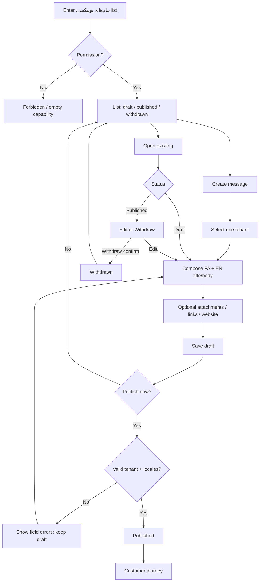

# UX Flow Specification — Admin Unixsee messages

## Document control

| Field | Value |
|---|---|
| Project | Unixsee Admin Panel (`admin-panel/`) |
| Flow or service | Staff compose / publish / edit / withdraw **Unixsee messages** (`پیام‌های یونیکسی`) |
| Version | 0.1 |
| Status | Draft |
| Date | 2026-08-16 |
| Prepared from | [`../unixsee-messages-prd.md`](../unixsee-messages-prd.md); [`../phase-1-application-features.md`](../phase-1-application-features.md) §18; product clarification 2026-08-16 |
| Primary owner | Product, operations, admin frontend, Nest backend |
| Reviewers required | Product, support/ops, security, backend, QA, accessibility |
| Companion | Customer receive journey: [`client-unixsee-messages.md`](./client-unixsee-messages.md) |

## Confidence summary

| Area | Confidence | Reason |
|---|---|---|
| User needs | Medium–High | Confirmed PRD outcomes; no staff interviews |
| Current journey | High | No admin messages surface exists yet (greenfield) |
| Business rules | Medium | Lifecycle Confirmed in PRD; attachment policy and withdraw history Unknown |
| Proposed journey | Medium | Aligns with PRD; not ops-validated |
| Accessibility | Medium | Expert review only |
| Measurement plan | Low | Events proposed; analytics ownership unknown |

## Executive flow summary

- **Primary user:** Authorized admin staff who need to inform one tenant.
- **Goal:** Draft and publish a short bilingual message to one tenant, optionally with attachments, links, and a website context; edit or withdraw after publish.
- **Current problem:** No dedicated tenant-targeted one-way inbox product; News and اعلان‌ها are different later products and must not be reused.
- **Proposed change:** First-class admin queue for پیام‌های یونیکسی with draft → publish, edit, withdraw (no schedule).
- **Main decisions:** Target exactly one tenant; FA+EN required; one-way only; optional website is context only (not اعلان‌ها); Nest owns authz and persistence.
- **Completion state:** Message is published (customer-visible) or safely withdrawn; staff see clear lifecycle status.
- **Highest-risk failure:** Publishing to the wrong tenant, or conflating this channel with tickets / News / اعلان‌ها.
- **Accessibility risk:** Bilingual editors, attachment upload status, and confirm-on-withdraw focus traps.
- **Evidence gap:** Exact staff capability name; attachment MIME/size; whether missing locale blocks publish.
- **Next validation:** Prototype compose → publish → customer popup on companion flow.

## Problem and desired outcome

### Problem statement

Staff lack a controlled way to send a short, durable, tenant-scoped message into the customer dashboard with attachments/links and unread/popup delivery, without opening a ticket or misusing future News/اعلان‌ها products.

### Desired user outcome

Staff can find or create a message for one tenant, complete FA/EN content, attach files and links if needed, optionally link a website, publish when ready, then edit or withdraw with clear confirmation and auditability.

### Desired service outcome

Unixsee can deliver one-way operational/commercial notices per tenant through Nest, with drafts never leaking to customers and publish/withdraw remaining honest and auditable.

### Scope

#### In scope

- Admin list/filter of Unixsee messages (by tenant, status: draft/published/withdrawn).
- Create draft: select one tenant; preferred-locale callout; single title/body + contentLocale; optional multi attachments; optional multi links (external + dashboard deep links); optional one website belonging to that tenant.
- Soft editorial guidance (short title; ~2–3 line body) — **no** hard length limits.
- Save draft, resume draft, publish (immediate only).
- Edit after publish; withdraw with confirmation.
- Loading, empty, validation, permission, conflict, and failure states.
- Persian RTL admin UI (FA labels); bilingual message content fields.
- Cross-link to tenant and optional website records without owning those flows.

#### Out of scope

- Customer popup/inbox/unread UX — [`client-unixsee-messages.md`](./client-unixsee-messages.md).
- Scheduling, broadcast/segment targeting, email/SMS/push.
- Customer replies; ticket creation from this flow (may deep-link to tickets separately later — not required).
- Notifications (News) and website notices (اعلان‌ها).
- Final Nest DTOs/routes (document at implement time; do not silently reuse News `notifications` semantics).
- Detailed staff role matrix beyond “authorized admin can compose”.
- Visual styling / design-system polish.

### Success definition

- Staff can publish a bilingual message to the intended tenant only.
- Drafts are never customer-visible.
- Edit and withdraw are available after publish with clear outcomes.
- Wrong-tenant and invalid-website selections are prevented before publish.
- Keyboard and screen-reader users can complete compose → publish → withdraw.

## Available evidence

| ID | Type | Source | Finding | Strength | Date |
|---|---|---|---|---|---|
| E-001 | Product PRD | `unixsee-messages-prd.md` | Third channel; one tenant; draft→publish; edit/withdraw; FA+EN; attachments; links; optional website | Strong | 2026-08-16 |
| E-002 | Stakeholder clarification | Product Q&A | No schedule; simple roles; one-way; implement in Phase 1 now | Strong | 2026-08-16 |
| E-003 | Phase 1 | §18 | News and اعلان‌ها remain separate later products | Strong | 2026-08-16 |
| E-004 | Implementation | Admin panel | No messages admin surface Observed | Strong | 2026-08-16 |

## Assumptions and unknowns

### Assumptions

| ID | Assumption | Origin | Risk | Validation | Status |
|---|---|---|---|---|---|
| A-001 | Admin nav label is `پیام‌های یونیکسی` | PRD naming | Medium if IA conflicts with future News | Ops review | Open |
| A-002 | Publish requires non-empty title, body, and contentLocale in one language | PRD single-language | Medium if ops want bilingual | Product confirm | Open |
| A-002b | Admin shows recipient preferred locale from tenant OWNER `User.locale` | PRD follow-up | Medium if multi-user later | Prototype | Open |
| A-003 | Withdraw is confirm-gated (destructive-ish) | Heuristic / control rule | Low | Prototype | Open |
| A-004 | Soft length guidance is helper text only | PRD | Low | Copy review | Open |

### Unknowns

| ID | Unknown | Impact | Priority |
|---|---|---|---|
| U-001 | Attachment MIME/size/scan policy | Blocks upload UX rules | High |
| U-002 | Withdraw visibility for already-read customer history | Customer honesty | High |
| U-003 | Whether “edited” badge is shown to customers | Trust copy | Medium |
| U-004 | Exact admin capability key | Permission gating | Medium |
| U-005 | Nest module/path naming vs News | API/IA collision | High |

## Users, roles and permissions

### Users

| Role | Goal | Constraints |
|---|---|---|
| Authorized admin staff | Compose and manage messages for tenants | One-way; no schedule; simple capability for v1 |
| Nest control plane | Persist, authorize, audit | Source of truth |
| Customer | Receives published messages | Out of this admin flow |

### Permissions

| Action | Authorized admin | Unauthorized staff | Enforcement |
|---|---|---|---|
| List messages | Yes | No / empty forbidden | Nest + UI gate |
| Create/save draft | Yes | No | Nest |
| Publish | Yes | No | Nest |
| Edit / withdraw | Yes | No | Nest |
| Download attachment metadata | Yes | No | Nest |

## User needs

### UN-001

**As a:** support/ops admin  
**When:** I need to inform one tenant about something short and durable  
**I need to:** compose FA/EN content with optional files/links/website and publish to that tenant only  
**So that:** the customer sees it in dashboard popup/inbox without opening a ticket.  

Evidence: E-001, E-002 — Priority: High — Status: Proposed

### UN-002

**As an:** admin  
**When:** I published the wrong wording or the notice is obsolete  
**I need to:** edit or withdraw the message  
**So that:** customers stop seeing incorrect active content.  

Evidence: E-001 — Priority: High — Status: Proposed

### UN-003

**As an:** admin  
**When:** I am mid-compose  
**I need to:** save a draft and resume later  
**So that:** I do not lose work or accidentally publish incomplete copy.  

Evidence: E-001 — Priority: High — Status: Proposed

## Current journey

| Stage | Action | Response | Pain |
|---|---|---|---|
| Need to notify tenant | Staff use tickets, chat, or offline channels | No durable tenant inbox | Channel break; no unread/popup contract |
| Admin nav | No messages product | Dead end / wrong product risk | Misuse of future News/اعلان‌ها |

## Proposed journey

| Stage | Behaviour | Backstage | Need |
|---|---|---|---|
| Enter messages list | Staff open پیام‌های یونیکسی | Nest list | UN-001 |
| Create | Select tenant; enter FA/EN; optional attach/links/website | Draft saved | UN-001, UN-003 |
| Publish | Confirm publish | Nest publish; customer unread | UN-001 |
| Maintain | Edit or withdraw | Nest mutate + audit | UN-002 |
| Handoff | Customer receives via client flow | Read state on customer user | Companion doc |

## Mermaid flow diagram

## Screen/state sequence

| Step | State | Goal | Actions | Exit |
|---|---|---|---|---|
| 1 | `list` | Find messages | Filter, create, open | Create / detail |
| 2 | `compose_draft` | Author content | Save draft, publish, cancel | List / published |
| 3 | `publish_confirm` (optional) | Prevent accidental publish | Confirm / back | Published / compose |
| 4 | `published_detail` | Review live message | Edit, withdraw | Compose / withdrawn |
| 5 | `withdraw_confirm` | Confirm remove from customer active set | Confirm / cancel | Withdrawn / detail |
| 6 | `withdrawn_detail` | Audit view | Read-only | List |

## State-transition table

| From | Trigger | Actor | Rules | To | Side effects | Failure |
|---|---|---|---|---|---|---|
| — | Create | Staff | Capability | `draft` | Persist draft | Authz fail |
| `draft` | Save | Staff | Tenant set | `draft` | Update fields | Validation |
| `draft` | Publish | Staff | FA+EN complete; website∈tenant | `published` | Customer unread | Reject |
| `published` | Edit save | Staff | Same content rules | `published` | Customer sees update on reload | Reject |
| `published` | Withdraw confirm | Staff | Confirm required | `withdrawn` | Remove active customer visibility | Reject |
| `withdrawn` | — | — | Terminal for v1 active lifecycle | `withdrawn` | Audit retained | — |

## Business-rule decision table

| Condition/result | C1 | C2 | C3 | C4 |
|---|---|---|---|---|
| Tenant selected | Yes | Yes | No | Yes |
| FA+EN title+body present | Yes | No | Yes | Yes |
| Website set | Optional valid | — | — | Invalid / other tenant |
| Attachments OK | Yes / none | — | — | Rejected type/size |
| **Result** | Allow publish | Block publish | Block publish | Block publish / clear website |

## Loading, empty, error and recovery states

### Loading

| ID | Trigger | User action | Exit |
|---|---|---|---|
| L-001 | List fetch | Wait / retry | List or error |
| L-002 | Save / publish / withdraw in flight | Disable duplicate submit | Success or failure |

### Empty

| ID | Cause | Meaning | Action |
|---|---|---|---|
| E-EMP-1 | No messages | Fresh product | Create message |
| E-EMP-2 | Filter empty | No matches | Clear filters |

### Validation

| ID | Rule | Problem | Correction | Data retained |
|---|---|---|---|---|
| V-001 | Tenant required | Missing target | Select tenant | Yes |
| V-002 | Both locales required (A-002) | Incomplete | Fill FA/EN | Yes |
| V-003 | Website must belong to tenant | Invalid link | Pick valid website or clear | Yes |
| V-004 | Attachment policy | Rejected file | Remove / replace | Other fields yes |

### System failure

| ID | Failure | Data saved | Retry safe | Recovery |
|---|---|---|---|---|
| SF-001 | Publish timeout / unknown | Reconcile by id | Only after status check | Refetch detail |
| SF-002 | Withdraw fails | Still published | Yes | Retry withdraw |
| SF-003 | Upload fails | Draft without that file | Yes | Re-upload |

## Edge cases

| ID | Scenario | Expected behaviour |
|---|---|---|
| EC-001 | Tenant suspended after draft | Block publish with reason |
| EC-002 | Website reassigned/removed | Block publish or force clear website |
| EC-003 | Duplicate rapid publish clicks | Idempotent publish; one customer unread |
| EC-004 | Staff edits while customer has popup open | Next customer load shows updated content (edited badge Unknown) |
| EC-005 | Withdraw after customer read | Follow PRD O-4 when decided; until then treat as not active unread |

## Accessibility review

| ID | Criterion | Required behaviour | Severity |
|---|---|---|---|
| AX-001 | Keyboard | Full compose, upload controls, dialogs operable | 3 |
| AX-002 | Focus | Return focus after publish/withdraw dialogs | 3 |
| AX-003 | Status | Announce save/publish/withdraw success and errors | 3 |
| AX-004 | Errors | Field-linked locale errors | 3 |
| AX-005 | Labels | Distinguish پیام‌های یونیکسی from News/اعلان‌ها | 2 |
| AX-006 | RTL | FA admin chrome + bilingual fields remain usable | 3 |

## Heuristic review

| ID | Heuristic | Finding | Severity | Required behaviour |
|---|---|---|---:|---|
| H-001 | Visibility of status | Draft vs published must be obvious | 3 | Status chip always visible |
| H-002 | Match real world | Label is پیام‌های یونیکسی not “news” | 3 | IA wording |
| H-003 | User control | Withdraw confirm; cancel compose | 3 | Confirm only on withdraw/publish if needed |
| H-004 | Consistency | Attachments like tickets where possible | 2 | Reuse patterns |
| H-005 | Error prevention | Tenant + website checks before publish | 3 | Decision table |
| H-009 | Error recovery | Clear retry on publish unknown | 3 | Reconcile |

## Analytics events

| ID | Event | Trigger | Question |
|---|---|---|---|
| AN-001 | `um_admin_compose_started` | Create opened | Do staff start compose? |
| AN-002 | `um_admin_draft_saved` | Draft save | Draft usage? |
| AN-003 | `um_admin_publish_succeeded` | Publish OK | Publish volume by tenant? |
| AN-004 | `um_admin_publish_failed` | Publish fail | Failure reasons? |
| AN-005 | `um_admin_withdraw_succeeded` | Withdraw OK | Withdraw rate? |

## Acceptance criteria

### AC-001

**Given** authorized staff and a valid tenant  
**When** they save FA+EN draft and publish with optional attachments/links/website  
**Then** the message is `published` and visible only to that tenant’s customer journey  
**And** drafts remain invisible to customers.

### AC-002

**Given** a published message  
**When** staff edit content  
**Then** Nest persists the update  
**And** customers see updated content on next load.

### AC-003

**Given** a published message  
**When** staff confirm withdraw  
**Then** the message is not offered as active unread to customers  
**And** the action is auditable.

### AC-004

**Given** website not owned by selected tenant  
**When** staff attempt publish  
**Then** publish is blocked with a correctable error.

### AC-005

**Given** unauthorized staff  
**When** they open the messages admin surface  
**Then** they cannot publish (forbidden or capability-empty).

### AC-006

**Given** keyboard / screen-reader user  
**When** they compose and publish  
**Then** status is announced and focus remains usable in RTL.

## Questions requiring user research / product decision

| ID | Question | Priority |
|---|---|---|
| RQ-001 | Must both locales always be required to publish? | High |
| RQ-002 | Attachment policy defaults (reuse tickets?) | High |
| RQ-003 | Withdraw history for previously read messages | High |
| RQ-004 | Show “edited” to customers? | Medium |

## Risks and dependencies

### Risks

| ID | Risk | Mitigation |
|---|---|---|
| R-001 | Wrong-tenant publish | Strong tenant picker + confirm summary |
| R-002 | API collision with News | Distinct module/routes; PRD O-7 |
| R-003 | Attachment malware/size | Shared policy before production upload |

### Dependencies

| ID | Dependency | Failure effect |
|---|---|---|
| D-001 | Nest messages domain + contracts | Cannot leave fixtures |
| D-002 | Tenant + website admin pickers | Cannot target safely |
| D-003 | Client UX flow | Publish has no customer delivery |

## Implementation readiness

**Conditionally ready** for technical design and UI prototyping.

### Blockers

- Attachment policy (U-001)
- Nest naming vs News (U-005)
- Publish locale completeness rule (A-002 / RQ-001)

## Final recommendations

### Must resolve before implementation

- Confirm bilingual publish rule and attachment policy.
- Choose Nest route/module name distinct from News.

### Must validate during prototyping

- Tenant picker + website constraint UX.
- Withdraw confirmation copy.

### Can iterate after release

- Analytics dashboards; richer filters; staff capability split.

### Rejected or deferred

- Schedule publish; broadcast audiences; customer reply; email/SMS.
