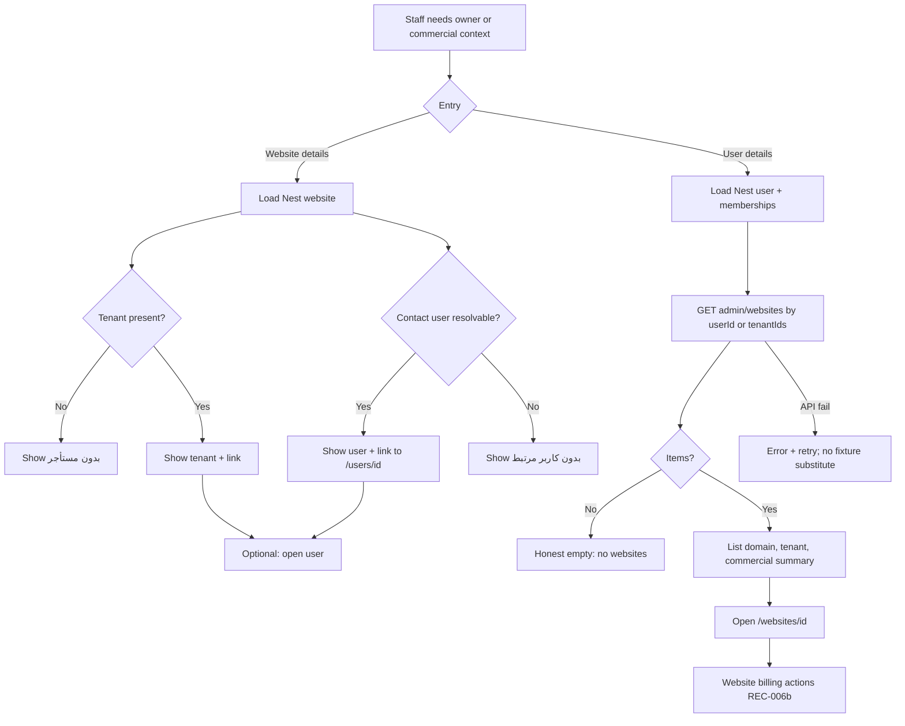

# UX Flow Specification — Admin user ↔ website visibility (with commercial context)

## Document control

| Field | Value |
|---|---|
| Project | Unixsee Admin Panel (`admin-panel/`) |
| Flow or service | Staff visibility of **website owner (tenant / user)** on `/websites/[id]` and **tenant websites** on `/users/[id]`, including commercial projection context |
| Version | 0.1 |
| Status | Draft |
| Date | 2026-08-27 |
| Prepared from | Phase 1 §§9, 12, 21; [`notes/onboarding-plan-request-user-website.md`](../notes/onboarding-plan-request-user-website.md); [`notes/commercial-records.md`](../notes/commercial-records.md); ADR 0015; [`customer-dashboard-billing-prd.md`](../customer-dashboard-billing-prd.md); inspected routes `websites/[id]/page.tsx`, `users/[id]/page.tsx`; Nest `GET /admin/websites?userId=&tenantId=` |
| Primary owner | Product, ops, admin frontend, Nest |
| Reviewers required | Product, support, backend, QA, accessibility |
| Companions | [`admin-users.md`](./admin-users.md); [`admin-servers-websites-agents.md`](./admin-servers-websites-agents.md) (REC-006b commercial on website details) |

## Confidence summary

| Area | Confidence | Reason |
|---|---|---|
| User needs | Medium–High | Staff need owner context for support/commercial work; no new interviews |
| Current journey | High | Code inspected: website shows tenant **name only**; user websites list is **fixture-backed** |
| Business rules | High | Website → tenant; user ↔ tenant via membership; billing is Nest-owned |
| Proposed journey | Medium | Aligns with existing admin list filters; not staff-validated |
| Accessibility | Medium | Link + list patterns; untested |
| Measurement plan | Low | Events proposed; ownership unknown |

## Executive flow summary

- **Primary user:** Authorized ops / support / commercial staff in the admin panel.
- **Goal:** From a website, know **which tenant (and contact user)** owns it; from a user, see **that user’s websites** and enough commercial state to act without guessing.
- **Current problem:** Nest-backed `/users/[id]` still builds “وب‌سایت‌های مستأجرها” from local fixtures (`getTenantWebsites`), so real tenants often show **no websites**. `/websites/[id]` shows tenant name as plain text with **no navigation** to the user/tenant record and no explicit user contact.
- **Proposed change:** Require Nest-backed ownership display and deep links on website details; require Nest-backed website list (and commercial summary) on user details.
- **Main decisions:** Ownership is **tenant-scoped**; the contact **user** is the membership/owner contact for that tenant (or `Website.userId` when present). Commercial fields stay Nest billing items — no payment UI. Website details remain the place for renew/record-terms; user details show **read-only summary + link**.
- **Completion state:** Staff can jump website → user/tenant and user → website without leaving admin or inventing fixture data.
- **Highest-risk failure:** Showing another tenant’s websites, or empty Nest list silently while fixtures hide the bug.
- **Accessibility risk:** Owner links and website list rows without clear names/focus.
- **Evidence gap:** Whether every website always has `userId`; which membership role is “primary contact” when multiple members exist.
- **Next validation:** Open a Nest website with tenant → follow owner link; open Nest user with memberships → see real domains → open website billing.

## Problem and desired outcome

### Problem statement

Staff reviewing a live website or a Nest customer cannot reliably see the **cross-link between user, tenant, and websites**, so commercial and support work depends on search, memory, or fixture data that does not match Nest.

### Desired user outcome

Staff always see:

1. On **website details:** owning **tenant** (name + id-backed navigation) and **contact user** when known.
2. On **user details:** all **websites** for that user’s accessible tenants, with domain, tenant label, plan/commercial snapshot, and a path to website details (where billing actions live).

### Desired service outcome

Admin surfaces tell the same ownership and commercial story as Nest (and the customer billing hub), without WordPress or invented fixtures as SoT.

### Scope

#### In scope

- `/websites/[id]` (Nest live path: `LiveWebsiteDetailsView`) owner block: tenant + user contact.
- `/users/[id]` (`UserDetailsView`) related websites: Nest list for the user’s tenants / `userId` filter.
- Read-only commercial summary on user→website rows (amount/interval/renew or “no record”).
- Deep links: website → user (or users search by tenant); user → `/websites/[id]`.
- Empty / loading / error / permission states for these blocks.
- Persian RTL and English LTR staff UI (admin copy conventions).

#### Out of scope

- Redesigning full users or servers UX flows.
- Customer `/dashboard/billing` (already covered by PRD).
- Staff renew/record-terms UI beyond existing website details (REC-006b).
- Visual polish / design tokens.
- Inventing a new ownership model (tenant remains owner of websites).

### Success definition

- Nest website details always show tenant identity with a working navigation target when `tenantId` exists.
- Nest user details list real websites for that user/tenants (not fixture-only), or an honest empty state.
- Staff can open commercial detail actions from website details after arriving from the user list.
- Cross-tenant leakage never occurs in list or detail.

## Available evidence

| ID | Type | Source | Finding | Strength |
|---|---|---|---|---|
| E-1 | Code | `live-website-details-view.tsx` | Header shows `tenant?.name` text only; billing section exists for managed plan | High |
| E-2 | Code | `user-details-view.tsx` + `getTenantWebsites` | Related websites from `listRuntimeWebsites` fixtures | High |
| E-3 | Code | `users/[id]/page.tsx` | Nest path does not pass website list; `websiteCount` mapped but unused in list | High |
| E-4 | API | `AdminWebsitesController` | `GET /admin/websites?userId=&tenantId=` already supported | High |
| E-5 | API | `users.service getAdmin` | Returns memberships + tenant; websites only as list `_count` on list endpoint | High |
| E-6 | Product | commercial-records + ADR 0015 | Nest owns billing; staff renew on website | High |

## Assumptions and unknowns

### Assumptions

| ID | Assumption | Risk | Validation |
|---|---|---|---|
| A-1 | `GET /admin/websites?userId=` matches websites whose `tenantId` is in the user’s memberships (and/or `Website.userId`) | Wrong set shown | Confirm Nest filter semantics in implementation |
| A-2 | Primary contact = owner membership if present, else first membership, else `Website.userId` | Wrong person linked | Product confirms |
| A-3 | Commercial summary on user rows is enough; full billing actions stay on website details | Extra clicks | Ops feedback |

### Unknowns

| ID | Unknown | Impact | Priority |
|---|---|---|---|
| U-1 | Exact admin DTO for “primary contact user” on website get | May need API include of `user` | High |
| U-2 | Deep-link target for tenant when no single user (multi-member) | Link to `/users?tenant=` vs first member | Medium |
| U-3 | Whether fixture website details must mirror the same owner block | Consistency | Low |

## Users, roles and permissions

| Role | Capability | Restrictions |
|---|---|---|
| ADMIN / OPERATOR with website+user read | See owner block and user website list | Tenant isolation via Nest |
| Staff without users capability | May see website tenant name only; user deep-link disabled/explained | Capability matrix **Unknown** until staff-roles note applied |
| Customer | Not this flow | Customer hub only |

## User needs

### UN-001
**As a:** support/ops staff  
**When:** I open a website details page  
**I need to:** see which tenant and contact user own it and jump to that record  
**So that:** I can continue a commercial or support conversation without searching blindly.  

Evidence: E-1, onboarding note  
Success: Owner block visible; link works when target exists  
Priority: Must  

### UN-002
**As a:** commercial/ops staff  
**When:** I open a user details page  
**I need to:** see that user’s websites with renew/commercial hints  
**So that:** I know what is sold/active before opening each website.  

Evidence: E-2, E-3, Phase 1 §21  
Success: Nest list or honest empty; each row links to website details  
Priority: Must  

### UN-003
**As a:** staff  
**When:** Nest is down or unauthorized  
**I need to:** see an error, not a fake empty success from fixtures  
**So that:** I do not act on wrong ownership.  

Evidence: E-2  
Success: Nest-backed path never silently substitutes fixtures for websites list  
Priority: Must  

## Current journey

| Stage | Action | Response | Pain | Evidence |
|---|---|---|---|---|
| Open Nest website | Staff opens `/websites/[id]` | Domain, tenant **name** text, plan, billing actions | No link to user/tenant; user contact missing | E-1 |
| Open Nest user | Staff opens `/users/[id]` | Memberships + “وب‌سایت‌های مستأجرها” from **fixtures** | Usually empty for real Nest users; count unused | E-2, E-3 |
| Need billing | Staff uses website billing section or customer hub | Works on website if Nest items exist | No summary on user website rows | E-1, E-6 |

## Proposed journey

| Stage | Behaviour | Response | Backstage |
|---|---|---|---|
| Open website details | Load Nest website | Owner block: tenant name + link; contact user name/phone/email + link when known; “بدون مستأجر” / “بدون کاربر مرتبط” empties | Nest get website (+ user include if needed) |
| Jump to owner | Activate user/tenant link | Land on `/users/[id]` or agreed tenant users entry | Authz |
| Open user details | Load Nest user + websites | Related websites from `GET /admin/websites?userId=` (or per-tenant queries) | Nest list |
| Scan commercial | Read row summary | Plan label / amount / renew / status or “بدون رکورد تجاری” | Optional billing fan-in or fields on website DTO |
| Open website | Activate جزئیات | `/websites/[id]` with full billing actions | Existing live view |

## Mermaid flow diagram

## Screen / state sequence

| Step | State | Information | Actions | Exit |
|---|---|---|---|---|
| W1 | Website ready | Domain; tenant; user contact; plan; billing | Link owner; renew/record-terms (existing) | User page / stay |
| W2 | Website no tenant | Explicit empty owner | Assignment path (existing servers flow) | — |
| U1 | User ready + websites loading | Skeleton for related websites | — | U2/U3/U4 |
| U2 | User ready + websites | Rows: domain, tenant, commercial snapshot | Open website | Website details |
| U3 | User ready + empty websites | Honest empty copy | — | — |
| U4 | User websites error | Error + retry | Retry fetch | U1 |

## Business rules

| ID | Rule |
|---|---|
| BR-1 | A website’s commercial owner is its **tenant**. |
| BR-2 | Contact user is membership owner / `Website.userId` / agreed fallback (A-2, U-1). |
| BR-3 | User details websites must come from Nest for `nestBacked` users — **never** silent fixture fill. |
| BR-4 | Commercial mutations (renew, record-terms, replace) stay on website details (and plan-request enablement), not on the user list. |
| BR-5 | Lists must enforce tenant isolation via Nest; admin UI does not invent cross-tenant joins. |

## Decision table — what to show on user website rows

| Condition | Show |
|---|---|
| Website has active managed billing item | Label, amount+currency, interval, renewsAt/status |
| Active plan, no billing item | Plan linked + “بدون رکورد تجاری” |
| Complementary items only | Count or first label + “خدمات تکمیلی” |
| No plan and no billing | “بدون پلن / بدون رکورد” |

## Failure and recovery

| Failure | User-visible | Recovery |
|---|---|---|
| Website get missing tenant | بدون مستأجر | Complete assignment (servers flow) |
| User websites API error | Error panel; no fake empty success | Retry |
| Owner user id unknown | Tenant shown; user empty | Open users search / memberships section |
| Permission denied | Forbidden message | Escalate / other role |

## User control

| Control | Behaviour |
|---|---|
| Back | Existing admin back links |
| Cancel / Undo | N/A (read + navigation) |
| Save | N/A on these blocks |

## Accessibility (flow)

- Owner and website links are real `<a>` / Next `Link` with discernible names (domain + tenant).
- Empty and error states announced as status/alert appropriately.
- Keyboard reaches all row actions; focus visible.
- Commercial amounts/dates use locale formatting; `dir="ltr"` for domains/phones as today.

## Heuristic highlights (severity)

| Heuristic | Finding | Severity |
|---|---|---|
| Visibility of system status | Fixture empty websites hide Nest truth | 3 (major) until fixed |
| Match real world | Tenant owns websites; user is contact | 0 if implemented as BR-1/2 |
| Consistency | Customer hub vs admin website billing | 1 (cosmetic if labels align) |
| Error recovery | Must not look like “no websites” on API fail | 3 if violated |

## Analytics (proposed)

| Event | Question answered |
|---|---|
| `admin_website_owner_link_opened` | Do staff use owner deep links? |
| `admin_user_websites_loaded` | `{count, ok}` — is Nest list healthy? |
| `admin_user_website_opened` | Do staff go user → website for commercial work? |

## Acceptance criteria

1. **Given** a Nest website with `tenantId`, **when** staff open `/websites/[id]`, **then** they see the tenant name and can navigate to the related user/tenant entry when a contact user is resolvable.
2. **Given** a Nest user with tenant memberships and assigned websites, **when** staff open `/users/[id]`, **then** related websites list those Nest websites (domain + tenant label), not an empty fixture list.
3. **Given** Nest websites fetch fails on user details, **when** the page renders, **then** staff see an error/retry state and **not** a successful empty fixture list.
4. **Given** a website row on user details, **when** staff activate جزئیات, **then** they reach `/websites/[id]` where commercial renew/record-terms remain available per REC-006b.
5. **Given** a website row with Nest billing, **when** the row renders, **then** staff see at least amount/interval/renew-or-status or an explicit “بدون رکورد تجاری”.
6. **Given** keyboard-only use, **when** staff tab the owner/website links, **then** focus order is logical and targets are named.

## Implementation notes (for next coding step)

| Surface | Current | Required |
|---|---|---|
| `LiveWebsiteDetailsView` | Tenant name text | Owner block + links; include user on Nest DTO if missing (U-1) |
| `UserDetailsView` related websites | `getTenantWebsites` fixtures | For `nestBacked`: `GET /admin/websites?userId=` (E-4); keep fixtures only when `nestBacked={false}` |
| Commercial summary | Website details only | Compact fields on user website rows; actions stay on website |
| API | List filter exists | Confirm semantics A-1; optionally embed billing summary later |

## Readiness

**Conditionally ready for implementation**

Blockers to close during build (not blockers for this UX contract):

- U-1 primary contact user on website get  
- A-1 confirm `userId` query semantics  

## Traceability

- Product: Phase 1 §9, §12, §21; commercial-records note; customer billing PRD (sibling customer hub)
- UX companions: admin-users; admin-servers-websites-agents REC-006b
- API: [`../../backend/contracts/websites-admin.md`](../../backend/contracts/websites-admin.md); [`../../backend/contracts/users-admin.md`](../../backend/contracts/users-admin.md); billing.md
- Code (current): `admin-panel/src/app/(app)/websites/[id]/page.tsx`, `users/[id]/page.tsx`, `live-website-details-view.tsx`, `user-details-view.tsx`
