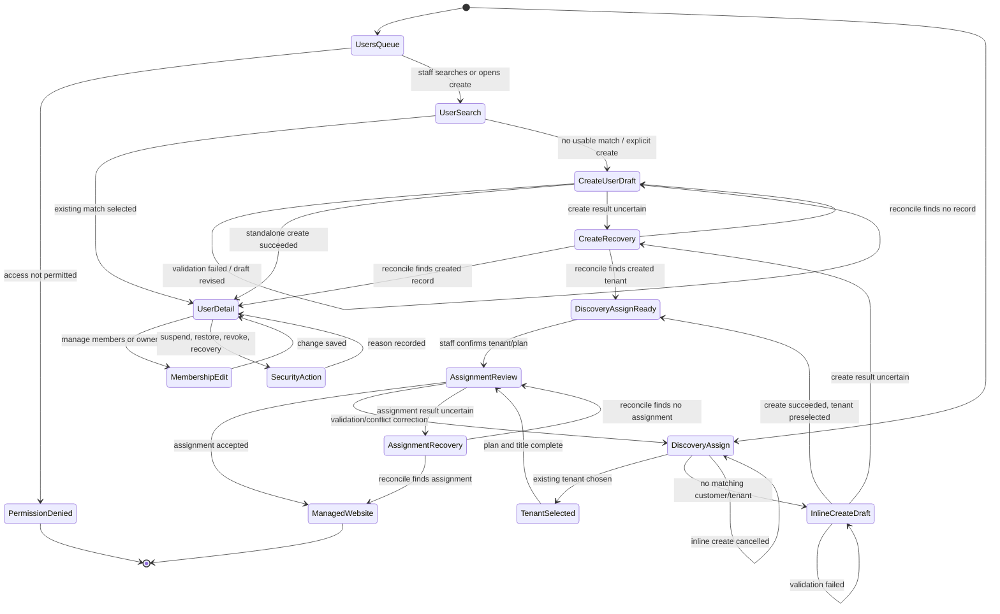
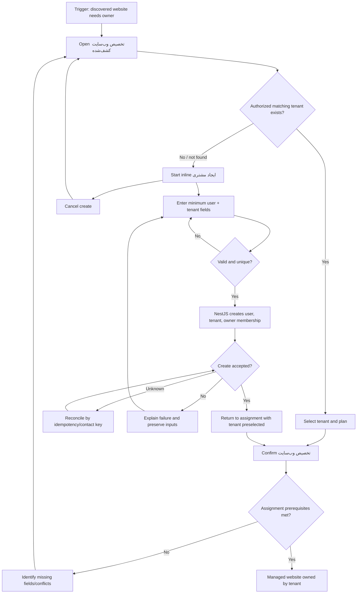

# UX Flow Specification

## Document control

| Field | Value |
|---|---|
| Project | Unixsee Admin Panel |
| Flow or service | Administrator users, customers, tenants, and membership |
| Version | 0.2 |
| Status | Draft |
| Date | 2026-08-07 |
| Prepared from | `docs/product/phase-1-application-features.md` §§5, 8–9, 11–12, 20, 23; `docs/product/notes/servers-agent-data-flow.md`; `docs/product/notes/onboarding-plan-request-user-website.md`; `docs/product/ux-flows/admin-plan-requests.md` v0.2 thin enablement; `docs/product/ux-flows/admin-servers-websites-agents.md`; `docs/architecture/project.md`; current `/users`, `/servers`, and discovery-assignment UI; stakeholder clarification that plan enablement requires an existing user and public signup mechanics remain open |
| Primary owner | Product, operations, and customer administration |
| Reviewers required | Product, operations, support, security, backend engineering, QA, accessibility |

## Confidence summary

| Area | Confidence | Reason |
|---|---|---|
| User needs | Medium | Derived from Phase 1 staff outcomes and the documented onboarding/assignment gap; no staff interviews |
| Current journey | High | `/users` inspected as placeholder; discovery assignment inspected and only selects fixture tenants |
| Business rules | Medium | Tenant isolation, ownership, and account-security principles are documented; capability bundles and invite vs create policy remain open |
| Proposed journey | Medium | Aligns with Phase 1 customer/tenant model and the required uninterrupted website-assignment path; not yet validated with ops |
| Accessibility | Medium | Based on project rules and expert review, not usability testing |
| Measurement plan | Low | Events proposed; analytics ownership unknown |

## Executive flow summary

- **Primary user:** Authorized customer-administration / provisioning staff.
- **Goal:** Find or create the correct customer user and tenant, manage membership and account state, and complete website ownership assignment without leaving the provisioning context.
- **Current problem:** `/users` is a dead end. Discovery assignment (`تخصیص وب‌سایت کشف‌شده`) can only choose from a fixed tenant list and cannot create a missing customer/user while continuing.
- **Proposed change:** Provide a first-class users-and-tenants admin flow, plus an inline **create-customer-and-continue** path inside تخصیص وب‌سایت کشف‌شده.
- **Main decisions:** Distinguish **user account**, **tenant**, and **membership**. Valid account origins include **public signup** (if enabled) and **admin create**. Plan requests may link an existing account but do **not** create users. Website ownership attaches to a tenant. Creating a missing owner during discovery assignment must preserve discovery context and return with the new tenant preselected. This admin flow does **not** design public auth/signup UX.
- **Completion state:** The intended customer/tenant exists, membership and owner are valid, and related website assignment or plan-request linking can complete without offline workaround.
- **Highest-risk failure:** Creating a duplicate of a public-signup or previously admin-created customer, or assigning a website while create/link result is uncertain.
- **Accessibility risk:** Nested create-inside-assign surfaces can trap focus, lose context, or fail to announce create/assign status.
- **Evidence gap:** No staff interviews; public signup rules, invite-vs-create, verification bootstrap, and capability separation are unresolved.
- **Next validation:** Prototype find existing signup customer → or admin create → resume discovery assignment; confirm plan-request enablement only links existing users.

## Problem and desired outcome

### Problem statement

Authorized staff currently struggle to establish the correct customer owner for a managed website when a discovered site must be assigned because the admin panel has no user/tenant workflow and تخصیص وب‌سایت کشف‌شده only offers existing fixture customers. This causes abandoned assignment, offline account creation, delayed onboarding, and elevated risk of incorrect ownership.

### Desired user outcome

Staff can find an existing customer or create the minimum valid user and tenant, assign ownership and membership correctly, and return immediately to the interrupted website-assignment task with preserved discovery context and clear confirmation of what was created.

### Desired service outcome

Unixsee can onboard customers and activate managed websites consistently while preserving tenant isolation, owner safeguards, auditability, and NestJS authority over identity and authorization rules.

### Why this matters now

- Phase 1 foundation includes customer and tenant administration.
- Website activation requires a tenant and cannot become customer-visible from discovery alone.
- Current `/users` is a navigation dead end.
- Current discovery assignment hard-codes `SERVER_TENANTS` and has no create path.
- The servers/agents flow already depends on tenant assignment as the gate from discovery to managed website.

### Scope

#### In scope

- Administrator find, view, create, and maintain customer user accounts.
- Tenant create/approve, membership add/change/remove, and owner assignment safeguards.
- Account state review: active, suspended, locked, verified, 2FA-protected indicators.
- Controlled staff assistance for verification/session recovery without exposing secrets.
- Internal notes that never appear to customers.
- Cross-flow: inline create-user/tenant during `تخصیص وب‌سایت کشف‌شده`, then continue assignment.
- Entry from plan-request enablement when a missing user must be created here first, then linked back on `/plan-requests` (create is never owned by the plan-request surface).
- Loading, empty, permission, validation, conflict, failure, and recovery states.
- Persian RTL and equivalent English LTR behaviour.

#### Out of scope

- Designing the public-site auth/signup, password, verification-challenge, or session journey in this admin doc. Public signup may be a real account origin; the customer journey is specified in [`client-auth.md`](./client-auth.md) (UI companion: [`../../frontend/client-auth-ui.md`](../../frontend/client-auth-ui.md)).
- Customer self-service profile editing in the customer dashboard beyond what admin must display as state.
- Designing the public plan-request form; admin consumes resulting requests via `admin-plan-requests.md`.
- Staff impersonation of customers.
- Showing passwords, OTPs, recovery-code plaintext, refresh tokens, or secret material.
- Final authentication-provider contracts and NestJS identity DTOs.
- Merge/transfer of tenants except as a separately confirmed high-risk workflow.
- Per-website customer permission overrides beyond tenant membership.
- Visual styling and component polish.

### Account origins consumed by this flow

| Origin | Admin responsibility | Must not assume |
|---|---|---|
| Public signup (if enabled) | Find, link, support account state | Signup alone enabled a plan or assigned a website |
| Plan-request contact | Find/link existing account for enablement on `/plan-requests` | Request submission created an account or enabled a plan |
| Admin create | Create minimum user/tenant/owner when no usable account exists (`/users` or discovery assignment) | Create silently assigned a website or enabled a plan |

See `docs/product/notes/onboarding-plan-request-user-website.md` and `docs/product/notes/onboarding-paths-and-handoffs.md` for the cross-flow operating model.

### Success definition

- Staff can create or locate the correct customer/tenant without leaving the website-assignment outcome unfinished.
- A website cannot be assigned without a valid tenant and owner model.
- Creating a user mid-assignment preserves discovery inputs and resumes assignment with the new tenant selected.
- Duplicate identity risk is detected before silent duplicate creation.
- Every consequential create, membership, suspend, and ownership change is authorized and audited.
- Keyboard and screen-reader users can complete find, create, resume, and assign without pointer-only steps.

## Available evidence

| ID | Type | Source | User/role | Finding | Strength | Date |
|---|---|---|---|---|---|---|
| E-001 | Documented product requirement | Phase 1 §9 | Staff | Staff must create/approve tenants, manage memberships/owners, review related records, record internal notes, and suspend while preserving history | Medium | 2026-08-07 |
| E-002 | Documented product requirement | Phase 1 §8.2 | Staff | Staff can find accounts, review security state, suspend/restore with reason, revoke sessions, start controlled recovery, and must never see secret material | Medium | 2026-08-07 |
| E-003 | Documented product requirement | Phase 1 §§5.1, 9.4, 12.3 | Staff/customers | Website belongs to one tenant; access is via membership; staff assign website to exactly one tenant | Strong principle | 2026-08-07 |
| E-004 | Documented product requirement | Phase 1 §11.4–11.5 | Staff | Plan enablement requires an existing linked user/tenant and one active plan per website; infrastructure/assignment stay in their own flows | Medium | 2026-08-08 |
| E-005 | Related UX flow | `docs/product/ux-flows/admin-servers-websites-agents.md` | Staff | Discovery remains staff-only until tenant/plan assignment; assignment is a core completion gate | Medium | 2026-08-07 |
| E-006 | Operator note | `docs/product/notes/servers-agent-data-flow.md` | Ops | After review, staff assign each discovered website to a tenant and plan | Medium | 2026-08-07 |
| E-007 | Implementation inspection | `src/app/users/page.tsx` | Administrator | `/users` shows only an English heading; no list, create, or detail workflow | Strong | 2026-08-07 |
| E-008 | Implementation inspection | `src/components/app-sidebar.tsx` | Administrator | Primary nav already exposes “کاربران” → `/users` | Strong | 2026-08-07 |
| E-009 | Implementation inspection | `src/components/servers/assign-discovery-sheet.tsx` | Provisioning staff | تخصیص وب‌سایت کشف‌شده requires tenant and plan but only selects from fixed `SERVER_TENANTS`; no create-user action | Strong | 2026-08-07 |
| E-010 | Implementation inspection | `src/lib/data/servers-data.ts` | Engineering | Fixture “tenants” use `user-101` style IDs and person names, conflating user and tenant in the UI prototype | Strong | 2026-08-07 |
| E-011 | Architecture constraint | `docs/architecture/project.md` | Engineering | Current phase is UI-only; NestJS owns future identity, authorization, and persistence | Strong | 2026-08-07 |
| E-012 | Stakeholder clarification | Product conversation | Product/ops | Public site collects plan choices; auth/signup mechanics remain open; admin docs must not design that public journey; enablement requires an existing user and one plan per website | Strong | 2026-08-08 |
| E-013 | Related UX | `docs/product/ux-flows/admin-plan-requests.md` v0.2 | Staff | Plan-request flow links existing users only; create happens in users/assignment flows, then staff return to enable | Strong | 2026-08-08 |

No staff interviews, support tickets, or analytics were available. E-001–E-004 come from a **Proposed** product document.

## Assumptions and unknowns

### Assumptions

| ID | Assumption | Origin | Risk | Affected decision | Validation | Status |
|---|---|---|---|---|---|---|
| A-001 | Phase 1 admin “user” work primarily means **customer user accounts** and their **tenant memberships**, not staff RBAC configuration | Phase 1 §9 and nav label “کاربران” | Medium if staff-user admin is also expected here | Scope of `/users` | Product IA decision | Unvalidated |
| A-002 | Creating a missing owner during discovery assignment creates both a customer user and a tenant with that user as owner when no eligible tenant exists | Inference from E-003 and onboarding needs | High if orgs already exist without users or vice versa | Inline create shape | Ops/product walkthrough | Unvalidated |
| A-003 | Minimum create fields for continuing assignment are display name, primary contact identifier, locale preference, and tenant display name | Inference from Phase 1 profile/tenant fields | Medium | Inline create form | Prototype with ops | Unvalidated |
| A-004 | Staff-created accounts start unverified; the customer becomes verified after signing in with the admin-entered phone or email and passing OTP (no invite token required for this Phase 1 path) | Phase 1 §8.1.1 (2026-08-09) | Low once implemented | Post-create security state | Auth/product confirmation | Accepted for this phase |
| A-005 | Search across email/mobile/name/tenant name is capability-scoped and non-enumerating beyond authorized results | §8.2 / §19.2 | Medium | Find-or-create UX | Security review | Unvalidated |
| A-006 | Current fixture conflation of user IDs as tenants is a prototype shortcut, not the target domain model | E-010 + E-003 | High if retained | Data model and labels | Architecture/product | Unvalidated |
| A-007 | Public signup, when enabled, creates a customer user (and possibly tenant) that admin must be able to find during plan-request linking and website assignment | E-012 | High if signup creates only a lead with no account | Find-before-create | Auth/product decision | Unvalidated |

### Unknowns

| ID | Unknown | Impact | Decision blocked | Resolution | Priority |
|---|---|---|---|---|---|
| U-001 | Final administrator capability bundles for create user, create tenant, change owner, suspend, and security recovery | Unauthorized or blocked admin actions | Permission matrix | Security/product decision | Critical |

Staff hierarchy / specialty OPERATORs (main ADMIN → sub-admin → operators) are
proposed in
[`../notes/admin-staff-roles-and-capabilities.md`](../notes/admin-staff-roles-and-capabilities.md)
and intended as the last Phase 1 step; that note should feed the U-001 matrix
before Staff access UI ships.
| U-002 | Whether staff may create a fully usable credentialed account in-panel, or only invite/bootstrap with customer-set password | Create vs invite UX and notification | Inline create completion | Security/product | Critical |
| U-003 | Required unique identifiers for duplicate detection (email, mobile, national id, external CRM id) | Duplicate customers and failed create | Find-or-create rules | Product/security | Critical |
| U-004 | Whether a personal customer is always 1 user = 1 tenant in Phase 1, or multi-member tenants are common at create time | Inline create complexity | Create tenant defaults | Ops research | High |
| U-005 | ~~Verification bootstrap after staff create~~ **Resolved for Phase 1 thin path:** no invite token; customer signs in with admin-entered phone/email and passes OTP to become verified | Was blocking create UX | Closed by Phase 1 §8.1.1 | Done | Closed |
| U-006 | Concurrent create of the same contact by two staff members | Duplicate ownership risk | Idempotency/conflict UX | Backend design | High |
| U-007 | Retention and expiry of abandoned inline-create drafts inside assignment | Lost work vs stale PII | Save/resume policy | Product/security | Medium |
| U-008 | Whether discovery-assignment inline create is the only create-customer contract besides standalone `/users` create | Duplication or inconsistent rules | Shared create design | Product/engineering | Medium |
| U-009 | Exact public signup eligibility and whether plan requests may arrive with only contacts until an account exists elsewhere | Link timing from درخواست‌های پلن (enablement stays blocked until a user exists) | Identity linking | Auth/product decision | Critical |

## Domain distinctions for this flow

| Concept | Meaning in this flow | Must not be confused with |
|---|---|---|
| Customer user | Person identity/contact account that can authenticate and hold memberships | Tenant organization record |
| Tenant | Customer organization/account that owns websites and services | A single login by itself |
| Membership | Link of a user to a tenant with a tenant role | Website-level permission override |
| Tenant owner | Membership role that controls the tenant with owner-safeguard rules | Staff administrator role |
| Managed website ownership | Website belongs to exactly one tenant after assignment | Raw agent discovery |

**Inference:** تخصیص وب‌سایت کشف‌شده should select a **tenant** as owner of the website, while inline create may also create the first **user** and owner membership when the customer does not yet exist.

## Users, roles and permissions

### Users

| Role | Goal | Responsibility | Constraints | Needs |
|---|---|---|---|---|
| Customer admin staff | Establish and maintain customer records | Find/create users and tenants, manage memberships, record internal notes | Must not see secrets or silently overwrite verified contacts | Reliable search and clear ownership state |
| Provisioning / website admin | Finish discovery assignment | Select or create the correct tenant during تخصیص وب‌سایت کشف‌شده | Cannot activate without tenant/plan prerequisites | Create-and-continue without losing discovery context |
| Support staff | Assist locked or unverified customers | Review account state and start controlled recovery | Ordinary support must not silently replace verified contact info | Safe recovery actions and history |
| Security / auditor | Inspect access and high-impact changes | Review suspend, owner change, create, and assignment history | Read-only for mutations unless separately authorized | Immutable audit trail |
| Enablement / ops staff | Ensure identity exists before plan enablement | Create or select tenant in `/users` when plan-request is blocked on missing user | Must not create users from `/plan-requests` | Clear return path to the same request |
| Customer | Receive access to owned websites | Acts outside admin panel after account exists | Sees only tenant-scoped customer data | Truthful account and ownership outcome |

Role names are descriptive placeholders. Enforcement must use approved capabilities.

### Permissions

| Action | Customer admin | Provisioning | Support | Security/auditor | Conditions |
|---|---:|---:|---:|---:|---|
| Search/view customer users and tenants | Yes | Limited | Limited | Yes | NestJS capability + scope; non-enumerating beyond policy |
| Create customer user | Yes | Capability required | No | No | Duplicate checks; audited |
| Create tenant | Yes | Capability required | No | No | Owner required before website activation |
| Add/change/remove membership | Yes | Limited | No | No | Final-owner safeguard |
| Change tenant owner | Yes | No | No | No | Confirmation; cannot leave tenant ownerless |
| Suspend/restore user or tenant | Capability required | No | Limited | No | Reason required |
| Revoke sessions / start recovery | Limited | No | Capability required | No | No secret reveal |
| Assign discovered website to tenant | Limited | Yes | No | No | Valid tenant + plan; NestJS validates |
| Inline create during assignment | Capability required | Capability required | No | No | Same create rules as standalone create |
| View internal notes / audit | Limited | Limited | Limited | Yes | Internal notes never customer-visible |

## User needs

### UN-001 — Find the correct customer without guessing

**As a** customer admin or provisioning staff member, **when** I must assign ownership, link a plan request, or support an account, **I need to** search by safe identifiers and understand account/tenant state and origin **so that** I do not attach a website or plan to the wrong customer or recreate a public-signup account.

- Evidence: E-001, E-002, E-009, E-012.
- Success: Authorized matches show user, tenant memberships, origin marker when available, verification/security state, and related website/request counts without exposing secrets.
- Priority: Critical.

### UN-002 — Create a missing customer without abandoning website assignment

**As a** provisioning staff member, **when** تخصیص وب‌سایت کشف‌شده has no matching tenant/user, **I need to** create the minimum valid customer user and tenant and return to the same assignment with context preserved **so that** onboarding continues in one uninterrupted outcome.

- Evidence: E-005, E-006, E-009; stakeholder request in this task.
- Success: After successful create, assignment resumes with the new tenant selected and discovery fields retained.
- Priority: Critical.

### UN-003 — Keep user, tenant, and website ownership coherent

**As** Unixsee operations, **when** staff create customers or assign websites, **I need** websites to belong to exactly one tenant with a valid owner model **so that** customer access and billing/service boundaries remain correct.

- Evidence: E-003, E-004.
- Success: Assignment blocked when tenant/owner prerequisites fail; no multi-tenant website ownership.
- Priority: Critical.

### UN-004 — Manage membership and owner safeguards

**As a** customer admin, **when** people join or leave a customer organization, **I need to** add, change, or remove members without leaving a tenant ownerless **so that** access remains operable and auditable.

- Evidence: E-001.
- Success: Final owner removal is blocked unless another owner is assigned or an approved close process is used.
- Priority: Critical.

### UN-005 — Assist security state without exposing secrets

**As** support or security staff, **when** a customer is locked, unverified, or session-compromised, **I need** controlled suspend, restore, revoke, and recovery actions with reasons **so that** access can be repaired without leaking credentials or recovery material.

- Evidence: E-002.
- Success: Staff see state indicators and action results, never passwords/OTPs/recovery plaintext.
- Priority: Critical.

### UN-006 — Preserve internal operational context

**As** staff working a customer record, **when** I need operational context, **I need** internal notes and related websites/tickets/requests in one place **so that** I do not rely on offline chat history.

- Evidence: E-001.
- Success: Internal notes never appear in customer responses or customer search.
- Priority: Important.

## Current journey

| Stage | Goal | Action | Response | Actors | Backstage | Pain point | Evidence |
|---|---|---|---|---|---|---|---|
| Need customer record | Manage customers | Open “کاربران” | Placeholder heading only | Administrator | None | JP-001: complete dead end | E-007, E-008 |
| Need owner for discovery | Assign discovered website | Open تخصیص وب‌سایت کشف‌شده | Form asks for tenant/plan from fixed list | Provisioning | Local fixture select | JP-002: cannot create missing customer | E-009, E-010 |
| Missing customer | Continue onboarding | No create action exists | Staff must leave flow or invent offline process | Staff | Unknown offline | JP-003: channel break; assignment stalls | E-009 + evidence gap |
| Observe websites | See customer label | Open website detail | Shows fixture customer name/id | Administrator | Static UI | JP-004: customer exists only as display text, not manageable entity | websites fixtures |
| Recover account | Help locked customer | No staff recovery UI | Unknown | Support | None | JP-005: no controlled recovery path in admin | E-007 |

## Proposed journey

| Stage | Goal | Behaviour | Response | Decision | Backstage | Problem | Need |
|---|---|---|---|---|---|---|---|
| 1. Enter users work | Find actionable customer admin work | Open users queue or search | Lists/scopes authorized users and tenants | Permitted? | Capability filter | JP-001 | UN-001 |
| 2. Find or confirm | Avoid duplicates | Search by approved identifiers | Shows matches with state and memberships | Exact/possible duplicate? | Non-enumerating search | JP-002 | UN-001 |
| 3. Create standalone | Establish customer | Open `/users/new`; enter minimum identity + tenant/owner defaults | User + tenant + owner membership created | Valid and unique? | NestJS create + audit | JP-001 | UN-003 |
| 4. Maintain membership | Keep access correct | Add/change/remove members; change owner with safeguards | Membership and owner state update | Final owner protected? | Authorization + audit | JP-001 | UN-004 |
| 5. Security assist | Restore safe access | Suspend/restore, revoke sessions, start recovery | State changes with reason | Capability and policy ok? | No secret reveal | JP-005 | UN-005 |
| 6. Discovery assign entry | Make website customer-owned | Start تخصیص وب‌سایت کشف‌شده | Tenant/plan required; discovery context visible | Matching tenant exists? | Preserve discovery draft | JP-002 | UN-002 |
| 7. Create from assign | Unblock assignment | Choose “ایجاد مشتری جدید”; complete `/users/new?returnTo=/servers/{id}&assign=` | Create succeeds; return to assignment Dialog with tenant selected | Create authorized and unique? | Same create contract as standalone | JP-003 | UN-002 |
| 8. Resume assign | Finish ownership | Confirm tenant, plan, display title | Managed website ownership created | Activation prerequisites met? | NestJS assignment + audit | E-005 | UN-003 |
| 9. Re-enter | Support later work | Open user/tenant detail | Related websites, requests, tickets, notes, history | Further action needed? | Retrieve related records | JP-004 | UN-006 |

### Cross-flow change required in website assignment

**CH-001 — Create-and-continue from تخصیص وب‌سایت کشف‌شده**

When no suitable tenant/user exists:

1. Staff leave the assignment Dialog for `/users/new?returnTo=/servers/{serverId}&assign={discoveryId}`.
2. System creates user + tenant + owner membership under the same rules as standalone create.
3. On success, staff return to `/servers/{serverId}` with the assign Dialog reopened and the new tenant preselected.
4. Staff confirm assignment as a separate consequential action.
5. Canceling create returns via `returnTo` without creating records; the discovery stays unassigned.

This change should also be reflected in `admin-servers-websites-agents.md` as an alternative path under assignment.

## Mermaid flow diagram

## Screen/state sequence

| Step | State | Goal | Entry condition | Information | Actions | System behaviour | Exit |
|---|---|---|---|---|---|---|---|
| S-01 | Users queue | Find customer admin work | Authorized `/users` | Name, contact masks, tenant(s), account state, website count | Search, filter, create, open | Scope by capability | Record selected/created |
| S-02 | Find results | Prevent duplicates | Search submitted | Ranked authorized matches and “no match” empty state | Open match, start create | Avoid leaking existence beyond policy | Detail or create |
| S-03 | Create user/tenant | Establish customer | Create from `/users/new` or assign returnTo | Display name, contact identifiers, locale, tenant name, owner default, internal note optional | Save, cancel | Validates uniqueness; creates user+tenant+owner as configured | Detail or resume parent flow |
| S-04 | User/tenant detail | Understand customer context | Record opened | Identity, verification/security state, memberships, related websites/requests/tickets, internal notes | Edit permitted fields, manage members, security actions | Separates internal vs customer-visible | Related workflow |
| S-05 | Membership edit | Keep access correct | Manage members | Members, roles, owner marker | Add/change/remove, change owner | Enforces final-owner rule | Updated membership |
| S-06 | Security action | Safe recovery | Suspend/restore/revoke/recovery | Current state, impact summary, reason | Confirm with reason | Never reveals secrets; audits | Updated account state |
| S-07 | Discovery assign | Bind website ownership | Unassigned discovery selected | Domain, server/agent context, title, tenant, plan | Select tenant, create customer, confirm assign | Keeps discovery staff-only until success | Assigned or create branch |
| S-08 | Create from assign | Unblock assign | Create customer from S-07 via `/users/new` | Minimum create fields | Save create, cancel create | Same create rules as S-03; does not assign website yet | S-09 or back to S-07 |
| S-09 | Assignment resume | Finish ownership | Inline create succeeded | Preselected tenant, restored title/plan, create confirmation | Confirm assign, edit, cancel assign | Revalidates prerequisites | Managed website |
| S-10 | Completion | Confirm outcome | Assignment accepted | Website id/reference, tenant, plan, next actions | Open website, open tenant, continue other discoveries | Customer visibility follows activation rules | Re-entry |

### State-transition table

| From | Trigger | Actor | Preconditions | Rules | To | Side effects | Failure |
|---|---|---|---|---|---|---|---|
| — | Open users | Customer admin | View capability | BR-001 | `users_queue` | None | Permission denied |
| `users_queue` / search | Start create | Authorized staff | Create capability | BR-002, BR-003 | `create_draft` | Draft local/server per policy | Permission denied |
| `create_draft` | Submit create | Authorized staff | Required fields valid; no blocking duplicate | BR-002–BR-005 | `user_ready` / `tenant_ready` | User, tenant, owner membership, audit | Validation/conflict/uncertain |
| `user_ready` | Manage membership | Customer admin | Membership capability | BR-006, BR-007 | `user_ready` | Membership audit | Owner safeguard blocked |
| `user_ready` | Suspend/restore/revoke | Support/security | Capability + reason | BR-008, BR-009 | Updated security state | Sessions/access impact + audit | Permission denied |
| `discovery_assign` | Choose existing tenant | Provisioning | Assignment capability | BR-010 | `assignment_review` | Preserve discovery draft | Invalid tenant |
| `discovery_assign` | Start inline create | Provisioning/customer admin | Create capability | BR-011 | `inline_create_draft` | Parent assignment draft retained | Permission denied |
| `inline_create_draft` | Cancel create | Staff | None | BR-012 | `discovery_assign` | No user/tenant created | None |
| `inline_create_draft` | Create succeeds | System/staff | Same as standalone create | BR-002–BR-005, BR-011 | `discovery_assign_ready` | New tenant preselected; inputs restored | Create failure/recovery |
| `discovery_assign_ready` / review | Confirm assign | Provisioning | Tenant + plan + discovery valid | BR-010, BR-013, BR-014 | Managed website state | Ownership audit; discovery marked assigned | Validation/conflict/uncertain |

## Business-rule decision table

### Inline create during discovery assignment

| Condition/result | Case 1 | Case 2 | Case 3 | Case 4 | Case 5 |
|---|---:|---:|---:|---:|---|
| Actor has assignment capability | Yes | Yes | No | Yes | Yes |
| Actor has create-customer capability | Yes | No | Yes | Yes | Yes |
| Matching usable tenant already found | No | No | No | Yes | No |
| Create payload unique and valid | Yes | Yes | Yes | N/A | No |
| Result | Create user/tenant/owner; resume assignment with tenant selected | Deny create; keep assignment open and offer request-help path | Deny both protected actions | Prefer select existing; warn before creating possible duplicate | Identify field/duplicate problems; retain inputs |

### Standalone create vs invite

| Condition/result | Case 1 | Case 2 | Case 3 |
|---|---:|---:|---|
| Phase 1 thin path | Yes | Legacy invite path (out of thin path) | Duplicate contact |
| Contact identifier unique | Yes | Yes | No |
| Result | Create unverified account; customer verifies later via OTP on admin-entered phone/email (A-004 / Phase 1 §8.1.1) | Invite/bootstrap only if a later policy reintroduces it | Block create; open existing authorized match |

### Business-rule register

- **BR-001 — Capability and scope:** Every user/tenant read and mutation is authorized by NestJS capability and scope. Source: Phase 1 access model. Status: Confirmed principle; bundles in U-001.
- **BR-002 — Distinguish user and tenant:** Admin must not treat login identity and owning organization as the same object, even if Phase 1 often creates them together. Source: E-003, A-006. Status: Proposed correction to current fixtures.
- **BR-003 — Minimum create completeness:** Create requires the approved minimum identity and tenant/owner fields before the record can be used for website ownership. Source: A-003, E-004. Status: Proposed.
- **BR-004 — Duplicate prevention:** Create must check approved unique identifiers and surface authorized existing matches before a second customer is created. Source: U-003. Status: Proposed.
- **BR-005 — Verification honesty:** Staff create does not mark contacts verified merely because the admin form saved. Verification happens when the customer signs in with that phone/email and passes OTP. Source: Phase 1 §8.1.1 / §20. Status: Confirmed.
- **BR-006 — Membership access:** Users receive website access through tenant membership, not by website id alone. Source: E-003. Status: Confirmed.
- **BR-007 — Final-owner safeguard:** The last owner cannot be removed without assigning another owner or an approved close process. Source: E-001. Status: Confirmed.
- **BR-008 — Reasoned security actions:** Suspend/restore and equivalent high-impact account actions require a reason and audit. Source: E-002. Status: Confirmed.
- **BR-009 — No secret material:** Staff never see passwords, OTPs, recovery plaintext, refresh tokens, or agent/customer secrets. Source: E-002. Status: Confirmed.
- **BR-010 — Website single-tenant ownership:** A website cannot belong to multiple tenants; assignment chooses exactly one tenant. Source: E-003. Status: Confirmed.
- **BR-011 — Create-and-continue:** Missing customer during discovery assignment is resolved by inline create that returns to the same assignment with preserved context; create alone does not assign the website. Source: stakeholder request + E-005. Status: Proposed.
- **BR-012 — Cancel semantics:** Canceling inline create cancels only the create subflow, not the parent discovery assignment and not an already-created durable account. Source: user-control rule. Status: Proposed.
- **BR-013 — Discovery is not activation:** Unassigned discoveries remain staff-only; customer visibility follows assignment/activation rules. Source: E-005, E-006. Status: Confirmed in related flow.
- **BR-014 — Activation prerequisites:** Staff cannot present a website as active customer service without tenant, plan/service assignment, and required operational configuration. Source: Phase 1 §11.5 / §12. Status: Confirmed.
- **BR-015 — Internal notes isolation:** Internal notes never appear in customer responses or customer search. Source: E-001. Status: Confirmed.
- **BR-016 — Auditability:** Create user/tenant, membership/owner changes, suspend/restore, and website assignment record actor, target, time, result, and relevant before/after context. Source: Phase 1 §6.4 / §17. Status: Confirmed.
- **BR-017 — Idempotent consequential creates/assigns:** Retry after uncertain create or assign must reconcile by idempotency key before creating a second record. Source: failure rule + E-011. Status: Proposed.

## Loading, empty, error and recovery states

### Loading

| ID | Trigger | User action | Status | Timeout/recovery | Exit |
|---|---|---|---|---|---|
| LD-001 | Users queue/search | Continue other nav | Identify loading section | Retry section | Ready/empty/unavailable |
| LD-002 | Create submit | Do not resubmit | Announce creating customer | Reconcile before retry | Ready, failed, or recovery |
| LD-003 | Inline create from assignment | Remain in stacked flow | Announce creating; keep discovery summary visible | Reconcile by contact/idempotency key | Resume assign or failed |
| LD-004 | Assignment confirm | Do not duplicate submit | Announce assigning | Reconcile by discovery/website key | Assigned or conflict |

### Empty

| ID | Cause | Meaning | Action | Permission consideration |
|---|---|---|---|---|
| EM-001 | No users in scope | No customer admin work yet | Create if permitted | Do not imply global emptiness |
| EM-002 | Search no match | No authorized match for query | Start create or refine search | Do not reveal unauthorized existence |
| EM-003 | Tenant has no websites | Ownership exists but no assignments | Continue discovery assignment if relevant | Read-only users get explanation |
| EM-004 | Assignment tenant list empty | No eligible tenants | Inline create if permitted | Hide create when unauthorized |

### Validation

| ID | State | Rule | Problem | Correction | Data retained |
|---|---|---|---|---|---|
| VR-001 | Create | Required identity/tenant fields | Cannot establish customer | Identify missing fields | Yes |
| VR-002 | Create | Unique identifier conflict | Possible duplicate | Open existing match or adjust identifier | Yes |
| VR-003 | Membership | Final owner removal | Would leave tenant ownerless | Assign another owner first | Yes |
| VR-004 | Security action | Reason required | Incomplete evidence | Provide reason | Yes |
| VR-005 | Assignment | Tenant and plan required | Cannot own/activate website | Complete associations or inline create | Yes |
| VR-006 | Assignment | Website already owned elsewhere | Ownership conflict | Open authorized existing record | Yes |
| VR-007 | Inline create | Create capability missing | Cannot unblock alone | Keep assignment draft; request authorized creator | Yes |

### System failure

| ID | Failure | Result certainty | Data saved | Retry safe | Recovery | Owner |
|---|---|---|---|---|---|---|
| SF-001 | Create times out | Unknown | Unknown | Not until reconciled | Search by idempotency/contact key; open existing or resume create | Backend |
| SF-002 | Inline create succeeds but UI return fails | Likely created | User/tenant may exist | Not blind recreate | Reconcile and reselect tenant in assignment | Frontend/backend |
| SF-003 | Assignment times out after create | Unknown | Tenant exists; assignment unknown | Not until reconciled | Lookup by discovery id; do not recreate tenant | Backend |
| SF-004 | Search unavailable | Failed | None | Yes | Explain unavailable search; do not allow blind create without duplicate protection if policy requires search | Backend |
| SF-005 | Notification/invite delivery fails | Core create may succeed | Account/invite saved | Notification retry only | Keep account authoritative; show delivery failure separately | Notification owner |
| SF-006 | Concurrent duplicate create | One wins or both conflict | At most one canonical record preferred | Manual review | Show conflict and authorized surviving record | Backend/ops |

### User control and save/resume

- **Back:** From inline create returns to تخصیص وب‌سایت کشف‌شده with discovery inputs retained and no create committed.
- **Cancel create:** Ends only the create subflow.
- **Cancel assignment:** Ends assignment editing; does not delete a customer created earlier in the session.
- **Undo:** Not available for create user/tenant, owner change, suspend, or website assignment; corrections are new audited events.
- **Save and resume:** Standalone create may use explicit draft if long; inline create should keep parent assignment draft in memory/server draft while create is open. Durable PII draft policy blocked by U-007.
- **Session expiry during inline create:** Preserve confirmed server-side draft if any; require reauthentication; never assume website was assigned.

## Edge cases

| ID | Scenario | Expected behaviour | Rule | Recovery | Criteria |
|---|---|---|---|---|---|
| EC-001 | Search finds similar but not exact contact | Show authorized candidates and require explicit choose-or-create | BR-004 | Staff confirms match or continues create | AC-002 |
| EC-002 | Inline create cancelled after partial typing | Assignment form restored; no account created | BR-012 | Resume tenant selection | AC-007 |
| EC-003 | Create succeeds, staff closes browser before assign | Customer/tenant remains; discovery stays unassigned | BR-011, BR-013 | Reopen discovery and select existing tenant | AC-006 |
| EC-004 | Staff lacks create but has assign | Assignment stays open; create action hidden/disabled with explanation | BR-001, VR-007 | Hand off to authorized creator | AC-011 |
| EC-005 | Tenant exists but has no owner membership | Block website activation/ownership completion until owner exists | BR-007, BR-014 | Add owner then continue | AC-004 |
| EC-006 | Same domain discovery already assigned to another tenant | Block silent reassignment | BR-010 | Show authorized conflict path | AC-008 |
| EC-007 | Staff tries to verify email by editing profile fields | Save may update pending contact but not verified state | BR-005 | Use verification workflow | AC-003 |
| EC-008 | Suspended tenant selected for assignment | Block or require explicit override policy | BR-008 / policy | Restore or choose another tenant | AC-009 |
| EC-009 | Multi-member company needed at first create | Allow optional additional members only if policy ready; otherwise create owner now and add members later | U-004 | Membership edit after create | AC-005 |
| EC-010 | Fixture-style user id used as tenant id | Target model separates them; migration/prototype must not encode fixture conflation as contract | BR-002, A-006 | Correct labels in prototype | AC-001 |

## Accessibility review

| ID | Criterion | State | Problem/status | Required behaviour | Severity | Test |
|---|---|---|---|---|---:|---|
| AX-001 | Keyboard operation | Queue, `/users/new`, assign Dialog | Create is a dedicated page; assign is a Dialog | All find/create/assign actions operable by keyboard | 4 provisional | Keyboard |
| AX-002 | Focus order/restoration | Inline create open/close | Returning from create may lose assignment context | On open, focus first create field; on success/cancel, restore focus to tenant control or status summary | 4 provisional | Keyboard/SR |
| AX-003 | Status messages | Create and assign | Silent success would hide whether continue is safe | Announce create success, selected tenant, assign pending/success/failure | 4 provisional | Screen reader |
| AX-004 | Labels and errors | Create/assign forms | Conditional identity fields may be unclear | Programmatic labels, required state, linked error text, retained valid input | 3 provisional | SR/code |
| AX-005 | Critical submission | Create, owner change, suspend, assign | Accidental high-impact changes | Review summary and confirm for high-impact actions; create-and-assign remain separate confirms | 4 provisional | Keyboard/usability |
| AX-006 | No keyboard trap | Assign Dialog | Focus must remain usable in the Dialog | Escape/cancel closes assign; create uses `/users/new` instead of a nested overlay | 4 provisional | Keyboard |
| AX-007 | RTL/LTR | Contact identifiers and domains | Email/domain are LTR inside RTL UI | Keep identifiers copyable and readable without breaking reading order | 3 provisional | Manual RTL/LTR |
| AX-008 | Timing | Invite/verification windows | Unwarned expiry blocks customer access | Expose pending-verification state and next action in text | 3 provisional | Functional |

## Heuristic review

| ID | Heuristic | State | Finding | Severity | Required behaviour |
|---|---|---|---|---:|---|
| HX-001 | Visibility of system status | Create-and-continue | Staff must know whether customer was created and whether website was assigned | 4 | Separate statuses for create vs assign |
| HX-002 | Match with real world | Users vs tenants | Fixture person-as-tenant language mismatches operations/legal ownership | 3 | Use customer user / tenant / owner vocabulary |
| HX-003 | User control | Inline create | Cancel create must not cancel parent assignment or delete created records unexpectedly | 4 | Explicit back/cancel/assign semantics |
| HX-004 | Consistency | Standalone and inline create | Different required fields would create policy drift | 4 | Shared create contract and validation |
| HX-005 | Error prevention | Duplicate create | Blind create during assignment is high impact | 4 | Search/reconcile before create; confirm assign separately |
| HX-006 | Recognition over recall | Resume assign | Staff should not re-enter discovery title/plan after create | 3 | Restore parent draft automatically |
| HX-007 | Efficiency | Provisioning | Frequent path is find-or-create during assignment, not only from `/users` | 3 | Inline create entry from تخصیص وب‌سایت کشف‌شده |
| HX-008 | Minimalism | User detail | Do not expose secrets or unnecessary security material | 4 | State indicators and safe actions only |
| HX-009 | Error recovery | Timeout on create/assign | Blind retry can duplicate customers or assignments | 4 | Reconcile then act |
| HX-010 | Help | No matching tenant | Staff need a clear next action when list is empty | 3 | Explain create or request-help paths |

## Analytics events

Exclude raw contact values, free-text notes, and secrets unless separately approved.

| ID | Event | Trigger | State change | Properties | Question |
|---|---|---|---|---|---|
| EV-001 | `user_admin_flow_started` | Staff opens users or assignment create branch | Entry → working | entry point, role category | Which entry points start customer creation? |
| EV-002 | `user_search_submitted` | Search executed | Queue → results | result band, entry point | Do staff find matches before creating? |
| EV-003 | `user_create_submitted` | Create submitted | Draft → processing | source=`standalone`/`inline_assignment`, role category | Is inline create used during provisioning? |
| EV-004 | `user_create_accepted` | Nest accepts create | Processing → user/tenant ready | source, whether returned to assignment | Does create complete? |
| EV-005 | `user_create_conflict` | Duplicate/conflict returned | Processing → correction | conflict category | Where do duplicates appear? |
| EV-006 | `inline_create_cancelled` | Staff cancels create subflow | Inline create → assignment | whether fields were entered | Is create abandoned often? |
| EV-007 | `assignment_resumed_after_create` | Return to assign with new tenant selected | Create → assignment ready | time-to-resume band | Does create-and-continue actually continue? |
| EV-008 | `website_assignment_accepted` | Assignment committed | Review → managed website | whether tenant was created in-session | Can provisioning finish after create? |
| EV-009 | `permission_denied` | Protected action rejected | No change | action category | Are create/assign capabilities misaligned? |
| EV-010 | `membership_owner_change_accepted` | Owner change committed | Membership updated | reason present | Are owner safeguards used correctly? |
| EV-011 | `account_security_action_accepted` | Suspend/restore/revoke/recovery accepted | Security state changed | action category | Are recovery actions operable? |

## Acceptance criteria

### AC-001 — Users admin is operable
**Given** an authorized customer-admin user, **when** they open `/users`, **then** they can search and open customer/tenant records or start create, **and** the destination is not a dead-end heading.

### AC-002 — Find before create
**Given** an approved identifier that matches an authorized existing customer (including public-signup or previously admin-created accounts), **when** staff attempt create from queue or inline assignment, **then** the system surfaces the existing match and blocks silent duplicate creation.

### AC-002a — Origin-neutral linking
**Given** a customer originated from public signup or admin create, **when** staff open the account in admin, **then** they can use the same find/link/support actions, **and** origin alone never implies plan enablement or website assignment.

### AC-003 — Verification honesty on staff create
**Given** staff create a customer with email/mobile, **when** the create succeeds, **then** contact fields are not marked verified solely because admin saved them, **and** verification state remains explicit.

### AC-004 — Owner required for operable tenant
**Given** a tenant has no owner, **when** staff attempt website ownership completion that requires an owner model, **then** the system blocks completion and identifies the missing owner prerequisite.

### AC-005 — Membership owner safeguard
**Given** a tenant has only one owner, **when** staff attempt to remove that owner without replacement, **then** NestJS rejects the change and the UI explains the safeguard.

### AC-006 — Inline create-and-continue
**Given** an unassigned discovery and no suitable tenant, **when** authorized staff complete inline create from تخصیص وب‌سایت کشف‌شده, **then** a user and tenant with owner membership are created, **and** the staff returns to the same assignment with the new tenant selected and prior title/plan inputs restored, **and** the website is still unassigned until explicit assign confirmation.

### AC-007 — Cancel create without losing assignment draft
**Given** inline create is open from discovery assignment, **when** staff cancel create, **then** no customer record is created by that cancel action, **and** discovery assignment inputs remain available.

### AC-008 — Assignment ownership integrity
**Given** a valid tenant and plan, **when** authorized staff confirm تخصیص وب‌سایت کشف‌شده, **then** exactly one tenant owns the managed website, **and** unassigned discoveries remain staff-only until that success.

### AC-009 — Suspended or ineligible tenant handling
**Given** a tenant is suspended or otherwise ineligible by policy, **when** staff select it for assignment, **then** assignment is blocked or requires the approved exception path, **and** the reason is understandable.

### AC-010 — No secrets in admin user flows
**Given** any create, detail, recovery, or assignment path, **when** staff view account data, **then** passwords, OTPs, recovery plaintext, and refresh tokens are never displayed.

### AC-011 — Permission enforcement
**Given** a user lacks create or assign capability, **when** they attempt the action, **then** NestJS denies it, the UI does not expose a false success path, and inaccessible records are not disclosed beyond policy.

### AC-012 — Uncertain create/assign recovery
**Given** create or assign times out with unknown result, **when** staff retry, **then** the client reconciles existing records by idempotency/discovery/contact key before creating another customer or assignment.

### AC-013 — Accessible nested create
**Given** a keyboard or screen-reader user starts inline create from assignment, **when** they complete, cancel, or recover from errors, **then** focus remains logical, status is announced, and the parent assignment can be completed without pointer-only interaction in RTL and LTR.

### AC-014 — Audit trail
**Given** user/tenant create, membership/owner change, security action, or website assignment occurs, **when** an auditor reviews history, **then** actor, target, time, and result are available without secret plaintext.

### AC-015 — Shared create behaviour
**Given** create is started from `/users` or from تخصیص وب‌سایت کشف‌شده, **when** validation and success rules are applied, **then** both entry points use the same create contract and duplicate checks.

## Questions requiring user research

| ID | Question | Decision | Users | Method | Priority |
|---|---|---|---|---|---|
| RQ-001 | In real onboarding, how often is the customer missing at discovery-assignment time versus already existing from a plan request? | Prioritize inline create vs find | Provisioning, sales | Case sampling | Critical |
| RQ-002 | Should Phase 1 staff create credentialed accounts, invites only, or both? | Create completion model | Security, support, ops | Policy workshop | Critical |
| RQ-003 | Which identifiers uniquely define a customer today? | Duplicate detection | Support, ops, security | Artifact review | Critical |
| RQ-004 | Are most first-time customers personal 1:1 tenants or multi-member organizations? | Inline create defaults | Sales/ops | Interview | High |
| RQ-005 | Who is allowed to create customers during provisioning: only customer admins, or provisioning staff too? | Permission matrix | Security/product | Decision | Critical |
| RQ-006 | What minimum fields are truly required before website assignment can proceed? | Inline create length | Provisioning | Task observation/prototype | High |
| RQ-007 | After staff create, what should the customer receive immediately? | Notification/verification bootstrap | Support/security | Service blueprint | High |

## Risks and dependencies

### Risks

| ID | Risk | Source | Likelihood | Impact | Mitigation | Owner | Release effect |
|---|---|---|---|---|---|---|---|
| R-001 | Continuing to conflate user and tenant like fixtures | E-010, A-006 | High | High | Separate concepts in UX and future contracts | Product/architecture | Block |
| R-002 | Inline create assigns website implicitly | BR-011 misunderstanding | Medium | High | Keep create and assign as distinct confirms | Product/UX | Block |
| R-003 | Duplicate customers after timeout | SF-001/SF-006 | Medium | High | Idempotency and reconcile-before-retry | Backend | Block |
| R-004 | Staff-created contacts become falsely verified | BR-005 | Medium | High | Explicit verification state and tests | Security/QA | Block |
| R-005 | Nested create accessibility failure | AX-002/AX-006 | Medium | High | Focus restore and status announcements in prototype | UX/accessibility | Conditional |
| R-006 | Over-privileged provisioning create | U-001/U-005 | Medium | High | Capability split and audit | Security | Block |
| R-007 | Offline workaround remains because `/users` stays empty | E-007 | High | Medium | Ship find/create prototype with assignment path | Product | Conditional |

### Dependencies

| ID | Dependency | Type | Owner | Required by | Failure effect | Fallback |
|---|---|---|---|---|---|---|
| D-001 | Capability bundles for user/tenant/assignment | Policy | Security/product | Permission UX | Unsafe or blocked flows | Prototype with capability placeholders |
| D-002 | Create completion / verification path | Policy | Security/product | Create completion | Incorrect account security | Phase 1 thin path: unverified create + OTP verify; no invite token |
| D-003 | Unique-identifier and duplicate policy | Policy | Product/security | Find-or-create | Duplicate tenants/users | Manual ops review queue |
| D-004 | NestJS user/tenant/membership APIs | System | Backend | Real integration | UI remains fixture-only | Static prototype states |
| D-005 | Shared create contract between `/users` and discovery-assignment inline create | Design | Product/engineering | Consistency | Divergent create paths | Document one shared component intent |
| D-006 | Update related servers/websites UX flow for CH-001 | Documentation | Product/UX | Cross-flow coherence | Assignment docs omit create path | Cross-reference this document |
| D-007 | Audit storage | System | Backend/security | AC-014 | Weak incident response | Design before production |

## Implementation readiness

**Ready for prototyping.**

Sufficient to build static Persian RTL admin flows for:

- users queue/search/detail
- standalone create user + tenant + owner
- membership and owner-safeguard states
- security action confirmations without secrets
- تخصیص وب‌سایت کشف‌شده with empty-tenant and inline create-and-continue

**Not ready for production implementation** until U-001–U-003, U-005, and D-001–D-004 are resolved.

### Blockers

- Approve create vs invite policy and verification bootstrap.
- Approve unique identifiers and duplicate handling.
- Approve which staff capabilities may create customers during assignment.
- Separate user and tenant in the target model; do not freeze fixture conflation.
- Validate nested create-and-continue with real provisioning staff.
- Keep NestJS as authority for identity, membership, and assignment mutations.

## Final recommendations

### Must resolve before implementation

- **REC-001:** Model **user**, **tenant**, and **membership** separately in admin UX and future contracts. Traces to BR-002, AC-001, R-001.
- **REC-002:** Add **ایجاد مشتری و ادامه تخصیص** inside تخصیص وب‌سایت کشف‌شده; create must not itself assign the website. Traces to UN-002, CH-001, BR-011, AC-006.
- **REC-003:** Require find/duplicate checks before create from every entry point. Traces to UN-001, BR-004, AC-002/AC-015.
- **REC-004:** Preserve discovery assignment draft across inline create success and cancel. Traces to UN-002, BR-012, AC-007.
- **REC-005:** Enforce owner safeguards and single-tenant website ownership before activation. Traces to UN-003/004, BR-007/010/014, AC-004/005/008.
- **REC-006:** Keep secrets out of all user-admin and recovery views. Traces to UN-005, BR-009, AC-010.
- **REC-007:** Treat public signup as an account origin to find/link, not a journey to design in this admin document. Plan-request enablement may only link existing users created here or via signup. Traces to E-012, E-013, AC-002a.

### Must validate during prototyping

- Find-or-create during discovery assignment with empty and near-duplicate cases.
- Resume assignment after create with restored fields and clear status.
- Standalone `/users` create and detail related-record navigation.
- Owner change and final-owner block.
- Keyboard, screen-reader, Persian RTL, and LTR identifier handling in nested create/assign.

### Can iterate after release

- Richer company membership onboarding during first create after U-004 evidence.
- Saved customer-admin filters after usage evidence.
- Deeper CRM identifiers once approved.

### Explicitly rejected or deferred

- Impersonation of customers: deferred pending separate security design.
- Treating discovery as automatic customer activation: rejected.
- Implicit assign-on-create: rejected.
- Frontend-only authorization or duplicate prevention: rejected.
- Showing credentials/recovery secrets to staff: rejected.
- Silent merge of duplicate customers: deferred to a high-risk confirmed workflow.

---

## Appendix A — Relationship to servers/websites and plan-request flows

This flow supports:

- assignment step **S-07** in `admin-servers-websites-agents.md` via inline create-and-continue (**CH-001**)
- identity resolution for `admin-plan-requests.md` v0.2 when enablement is blocked on a missing user (create here, then link existing on `/plan-requests`)
- the shared operating model in `docs/product/notes/onboarding-plan-request-user-website.md` and `docs/product/notes/onboarding-paths-and-handoffs.md`

| Companion step | User-flow addition |
|---|---|
| Plan-request enablement blocked on missing user | Create/find in `/users`; return to the same request and link the existing account only |
| Review discoveries | Unchanged |
| Assign tenant/plan | If tenant missing → inline create user/tenant/owner → resume assign; prefer chosen plan from a linked plan request when present |
| Managed website active/provisioning | Still requires explicit assignment/activation prerequisites |

Recommended follow-up: consume public auth/signup only as account-origin outcomes here; customer journey lives in [`client-auth.md`](./client-auth.md).

## Appendix B — Minimum inline create information architecture

Functional fields for create-and-continue prototype (policy-final fields remain open):

- Customer display name
- Primary contact identifier(s) approved for duplicate checks
- Locale preference
- Tenant display name defaulting from customer/org name
- Implicit first owner = created user
- Optional internal note
- Read-only discovery context: domain and server label for orientation only

Not included in inline create:

- Website plan confirmation belongs to parent assignment
- Password/secret entry by staff, unless invite policy explicitly requires a controlled bootstrap method later approved in U-002
