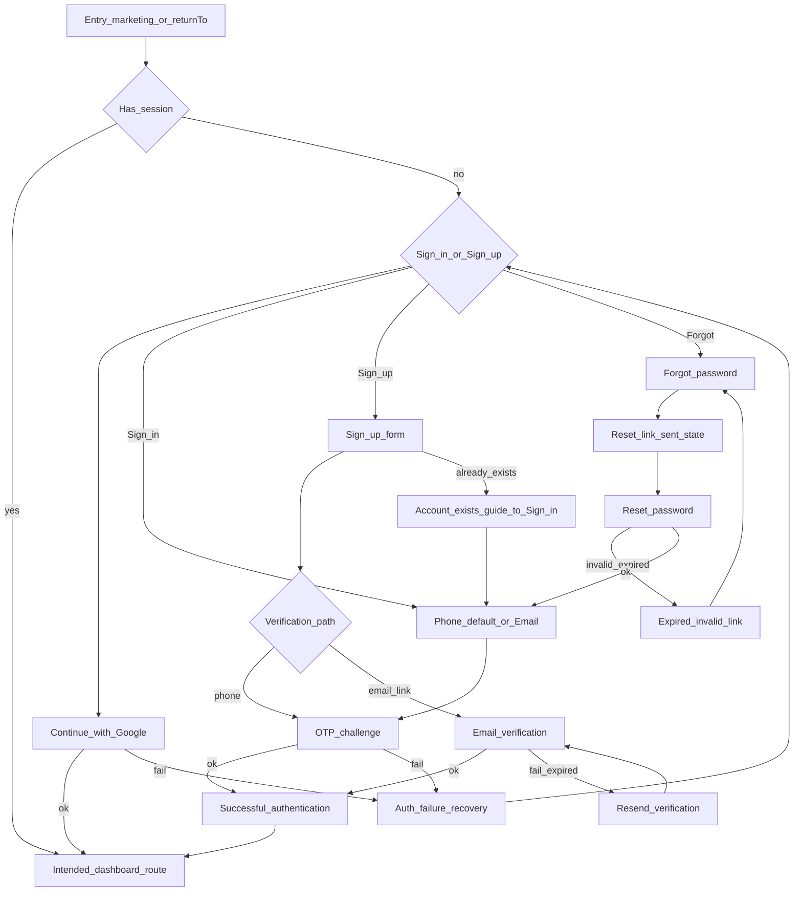

# UX Flow Specification — Customer authentication (public client)

## Document control

| Field | Value |
|---|---|
| Project | Unixsee Client (`client/`) |
| Flow or service | Public customer sign-in, sign-up, verification, and password recovery |
| Version | 0.1 |
| Status | Draft |
| Date | 2026-08-10 |
| Prepared from | `docs/product/phase-1-application-features.md` §§3–4, 8, 20; `docs/product/notes/phase-1-public-entry-channels.md`; `docs/product/notes/phase-1-delivery-waves.md`; `docs/architecture/decisions/0003-ui-only-phase-boundaries.md`; `docs/product/ux-flows/admin-users.md` (defers this journey); stakeholder decisions OTP-first with phone default + Google alternate |
| Primary owner | Product and customer experience |
| Reviewers required | Product, security, backend (Nest auth), frontend (`client/`), QA, accessibility |
| UI companion | [`../frontend/client-auth-ui.md`](../frontend/client-auth-ui.md) |

## Confidence summary

| Area | Confidence | Reason |
|---|---|---|
| User needs | Medium | Derived from Phase 1 §8 outcomes; no customer interviews |
| Current journey | High | Only a stub `/register` page exists; no real public auth UX |
| Business rules | Medium | OTP, signup origin, non-enumerating errors confirmed; Google OAuth and reset mechanics Proposed |
| Proposed journey | Medium | Aligns with Phase 1 OTP-first and easy UX goal; not usability-tested |
| Accessibility | Medium | Expert review against project rules; not tested with users |
| Measurement plan | Low | Events proposed; analytics ownership unknown |

## Executive flow summary

- **Primary user:** Prospective or returning Unixsee customer on the public web app.
- **Goal:** Sign in or create an account with the fewest steps, verify contact, and reach the intended dashboard destination.
- **Current problem:** No designed customer auth UX; stub register page; marketing CTAs jump toward dashboard without a clear auth path.
- **Proposed change:** OTP-first authentication with **phone as default** identifier, email as secondary mode, Google as an alternate path, plus email verification and password recovery surfaces that share one auth shell.
- **Main decisions:** Sign-in is OTP-first (not password-first). Password is collected at sign-up and used for forgot/reset, not as the primary sign-in method. NestJS remains the auth authority. This doc is UX only (ADR 0003). **Signup / sign-in is not احراز هویت**; becoming a tenant is a separate authorization path.
- **Completion state:** Customer has an authenticated session and lands on the intended safe dashboard route (`returnTo` or `/dashboard`).
- **Highest-risk failure:** Account enumeration via error copy; duplicate signup; redirect to an unsafe URL after auth.
- **Accessibility risk:** OTP entry, phone RTL, focus loss on step changes, and password visibility controls.
- **Evidence gap:** Google OAuth product approval; exact phone country-code UX; whether email verification is mandatory before dashboard access; `returnTo` allowlist; customer certification-upload UX lives outside this auth shell.
- **Next validation:** Static UI prototype of Sign in → OTP → redirect; Sign up → verify; Forgot → Reset → Sign in.

## Problem and desired outcome

### Problem statement

Customers cannot complete a clear, trustworthy path from the public site into the customer dashboard because public authentication UX is unspecified and the only register surface is a non-localized stub.

### Desired user outcome

A customer can start from marketing or a protected deep link, sign in or sign up with phone (default) or email, complete OTP or email verification, optionally use Google, recover a password when needed, and arrive at the dashboard route they intended—with clear loading, error, and recovery states.

### Desired service outcome

Unixsee can onboard and authenticate customers through the public channel without inventing Nest contracts in the Next.js app, while preserving non-enumerating security behavior and tenant isolation rules once Nest integration is allowed.

### Why this matters now

- Phase 1 first-wave includes authentication and OTP-based sign-in.
- Public signup is a documented account origin consumed by admin flows.
- Public plan-request OTP verify is another account origin (user created on
  successful contact verify before the request is stored); see
  [`customer-public-plan-request.md`](./customer-public-plan-request.md).
- `admin-users.md` explicitly deferred this journey to a public/customer auth UX document.

### Scope

#### In scope

- Sign in (phone default → OTP; email mode; Google alternate).
- Sign up (minimum fields; phone default; Google alternate; leads into verification).
- Email verification (pending, success, resend, expired link).
- Forgot password and reset password (including expired/invalid reset link).
- Account already exists (sign-up collision → guided sign-in).
- Authentication failure (wrong/expired OTP, rate limit, Google cancel/fail, generic failure).
- Loading / submitting states and double-submit prevention.
- Successful authentication and redirect to intended dashboard route.
- Cancel / back to marketing; edit identifier; resend OTP with cooldown.
- Persian RTL and English LTR behaviour at flow level.
- Honest UI-only / coming-soon labelling until Nest wiring is approved.

#### Out of scope

- NestJS DTOs, auth provider contracts, token storage, and API design.
- Staff / admin-panel login.
- Customer dashboard Profile security (change password after reauth, 2FA, session list) beyond what this flow must hand off to.
- Impersonation.
- Plan enablement or website activation as a side effect of signup.
- احراز هویت certification upload / tenant approval (separate from this auth shell;
  see [`client-authorization.md`](./client-authorization.md) and
  [`../notes/customer-authorization-and-tenant.md`](../notes/customer-authorization-and-tenant.md)).
- Visual polish details (see UI companion).

### Success definition

- A customer can complete auth in a short, understandable path.
- Failures explain recovery without disclosing whether an unrelated account exists.
- After success, the user lands on a safe intended dashboard destination.
- Signup alone never implies a tenant was approved or a plan was enabled.

## Available evidence

| ID | Type | Source | Finding | Strength | Date |
|---|---|---|---|---|---|
| E-001 | Product spec | Phase 1 §4.1 / §8 | OTP-based sign-in; public signup origin; non-enumerating errors | Strong | 2026-08-09 |
| E-002 | Product note | `phase-1-public-entry-channels.md` | Signup is a Phase 1 channel; auth mechanics were open | Strong | 2026-08-08 |
| E-003 | UX flow | `admin-users.md` | Public auth/signup UX belongs in a future customer auth document | Strong | 2026-08-07 |
| E-004 | ADR | ADR 0003 | Next.js apps are UI-only; no inventing approved Nest auth | Strong | Current |
| E-005 | Implementation | `client/.../(website)/register/page.tsx` | Stub only; no i18n, validation, or OTP | Strong | 2026-08-10 |
| E-006 | Stakeholder | Planning conversation | OTP-first; phone default; Google alternate; full recovery surfaces in this spec | Strong | 2026-08-10 |

## Assumptions and unknowns

### Assumptions

| ID | Assumption | Origin | Risk | Affected decision | Validation | Status |
|---|---|---|---|---|---|---|
| A-001 | Default phone country code for FA locale is `+98`; EN may still default to `+98` until locale policy is set | Market inference | Medium | Phone field UX | Product/ops | Proposed |
| A-002 | Sign-up collects password as a secondary credential for recovery; sign-in remains OTP-first | Expanded recovery scope + Phase 1 password management | Medium | Sign-up fields | Security/product | Proposed |
| A-003 | Google sign-in is offered as UI alternate; Nest OAuth is not approved yet | Stakeholder ease goal | High if shipped as live | Google button | Auth ADR | Proposed |
| A-004 | After auth, default destination is `/{locale}/dashboard`; `returnTo` must be same-origin path allowlisted | Common pattern | High if open redirect | Redirect rules | Security | Proposed |
| A-005 | Email verification can complete via link; phone verification uses OTP challenge | Phase 1 email/mobile verification | Medium | Verify surfaces | Product | Proposed |
| A-006 | “Account already exists” uses non-enumerating copy where possible, then offers Sign in | Phase 1 §8.3 | High if enumerating | Collision UX | Security | Proposed |

### Unknowns

| ID | Unknown | Impact | Decision blocked | Resolution | Priority |
|---|---|---|---|---|---|
| U-001 | Whether Google OAuth is approved for Phase 1 | Button live vs disabled/coming-soon | Product + security | Critical |
| U-002 | Exact OTP length, TTL, and resend cooldown | OTP UI and AC | Backend auth | Critical |
| U-003 | Whether unverified email blocks all dashboard routes or only sensitive actions | Post-signup gating | Product | High |
| U-004 | Forgot-password channel: email only vs email or phone | Forgot form | Product/security | High |
| U-005 | `returnTo` allowlist and encoding | Redirect safety | Security/frontend | Critical |

## Users, roles and permissions

### Users

| Role | Goal | Constraints |
|---|---|---|
| Guest / prospective customer | Create an account and reach dashboard | No session yet |
| Returning customer | Sign in and resume intended work | May arrive via deep link |
| Unverified customer | Complete email or phone verification | Limited or gated dashboard per U-003 |
| Admin-created customer (first sign-in) | Verify recorded phone/email via OTP | Account starts unverified (Phase 1 §8.1.1) |

### Permissions

| Action | Guest | Authenticated customer | Staff |
|---|---|---|---|
| Use public auth surfaces | Yes | Redirect if already signed in | No (separate admin app) |
| Access dashboard routes | No | Yes (subject to verification gates) | No via this UI |
| Trigger Nest auth | N/A (UI-only phase) | N/A until ADR allows | Nest owns enforcement |

## User needs

### UN-001 — Sign in easily

**As a** returning customer, **when** I want to use my dashboard, **I need to** sign in with my phone (or email) and a one-time code **so that** I can reach my work without remembering a password every time.

Evidence: E-001, E-006. Priority: Must. Status: Proposed.

### UN-002 — Create an account

**As a** prospective customer, **when** I decide to join Unixsee, **I need to** sign up with minimal fields and verify contact **so that** I have an account admin can later link to plans/websites.

Evidence: E-001, E-002. Priority: Must. Status: Proposed.

### UN-003 — Recover access

**As a** customer who needs to reset a password credential, **I need to** request a reset and set a new password from a valid link **so that** I can regain access without calling support for routine cases.

Evidence: E-001, E-006. Priority: Should. Status: Proposed.

### UN-004 — Resume intended destination

**As a** customer sent to a protected dashboard URL, **when** I finish auth, **I need to** land on that intended route **so that** I do not lose context.

Evidence: A-004. Priority: Must. Status: Proposed.

### UN-005 — Trust and clarity

**As a** customer, **when** auth fails or a link expires, **I need to** understand what happened and the next safe step **so that** I do not abandon Unixsee or create duplicate accounts.

Evidence: E-001. Priority: Must. Status: Proposed.

## Current journey

| Stage | Goal | Action | Response | Pain |
|---|---|---|---|---|
| Discover | Reach Unixsee | Browse marketing | Public pages | No clear auth CTA design |
| Register stub | Create account | Open `/register` | Hardcoded Persian inputs | No OTP, i18n, Google, or recovery |
| Dashboard | Use product | Nav links to `/dashboard` | UI-only dummy dashboard | Auth gate not designed |

## Proposed journey

| Stage | Goal | Behaviour | Decision | Need |
|---|---|---|---|---|
| 1. Enter | Start auth | Marketing CTA, deep link with `returnTo`, email/SMS link | Has session? → destination | UN-004 |
| 2. Choose | Sign in or Sign up | Cross-linked primary surfaces + Forgot | — | UN-001, UN-002 |
| 3a. Identifier | Provide phone (default) or email | Toggle mode; optional Google | Valid format? | UN-001 |
| 3b. Sign up | Minimum profile + phone/email + password | Collision? → already exists path | Valid? | UN-002 |
| 4. Challenge | OTP or email verification | Resend cooldown; edit identifier | Pass? | UN-001 |
| 5. Recover | Forgot → email sent → Reset | Invalid/expired → request again | Token valid? | UN-003 |
| 6. Complete | Success | Brief confirmation optional | — | UN-005 |
| 7. Redirect | Intended work | Allowlisted `returnTo` or `/dashboard` | Safe URL? | UN-004 |

## Mermaid flow diagram

## Screen / state sequence

| Step | State ID | Goal | Entry | Primary actions | Exit |
|---|---|---|---|---|---|
| Sign in | `S-SIGNIN` | Collect identifier | Guest | Continue, Google, switch to email/phone, Sign up, Forgot | → OTP or Google |
| OTP | `S-OTP` | Verify code | OTP sent | Submit code, Resend, Edit identifier | → Success or failure |
| Sign up | `S-SIGNUP` | Create account | Guest | Submit, Google, Sign in | → Verify / OTP / already exists |
| Email verify pending | `S-EMAIL-PENDING` | Wait for link | Signup/email challenge | Resend, change email (if allowed), Sign in | → Verified or expired |
| Email verify result | `S-EMAIL-RESULT` | Confirm outcome | Opened email link | Continue to destination / Sign in | → Success or recover |
| Forgot password | `S-FORGOT` | Request reset | From Sign in | Submit identifier, Back | → Link sent |
| Reset link sent | `S-RESET-SENT` | Confirm request | After forgot submit | Open email, Back to Sign in | — |
| Reset password | `S-RESET` | Set new password | Valid token link | Submit new password | → Sign in |
| Expired/invalid reset | `S-RESET-DEAD` | Recover | Bad/expired token | Request new link | → Forgot |
| Auth failure | `S-AUTH-FAIL` | Recover | Challenge/provider fail | Retry, edit identifier, support help | → prior step |
| Success | `S-SUCCESS` | Confirm | Auth accepted | Auto-continue | → Redirect |
| Redirecting | `S-REDIRECT` | Land safely | Success | None (system) | Dashboard route |

## State-transition table

| From | Trigger | Actor | Rules | To | Failure |
|---|---|---|---|---|---|
| Entry | Open auth with session | System | Session valid | Intended route | Session invalid → Sign in |
| Sign in | Submit phone/email | User | Format valid; non-enumerating send | OTP | Validation / rate limit / unavailable |
| Sign in | Continue with Google | User | Proposed provider | Success | Cancel / provider fail → Auth failure |
| OTP | Submit code | User | Code matches; not expired; not reused | Success | Wrong/expired → stay OTP with error |
| OTP | Resend | User | Cooldown elapsed | OTP (new challenge) | Rate limit |
| Sign up | Submit | User | Unique contact; password rules | Email pending and/or OTP | Already exists / validation |
| Email pending | Open valid link | User | Token valid | Success or verified → redirect | Expired → resend |
| Forgot | Submit | User | Always show generic sent state | Reset sent | System unavailable |
| Reset | Submit passwords | User | Token valid; passwords match rules | Sign in | Invalid token → Reset dead |
| Success | Continue | System | `returnTo` allowlisted | Redirecting | Unsafe `returnTo` → `/dashboard` |

## Business rules

| ID | Rule | Status |
|---|---|---|
| BR-001 | Sign-in primary method is OTP; phone is the default identifier mode | Confirmed (stakeholder + Phase 1 OTP) |
| BR-002 | Email is available as an alternate identifier mode on the same Sign-in/Sign-up pattern | Confirmed |
| BR-003 | Google is an alternate path, not a replacement for OTP availability until product confirms OAuth | Proposed |
| BR-004 | Auth errors are non-enumerating for credential/account existence where Phase 1 requires it | Confirmed |
| BR-005 | Public signup creates a customer **user** account origin; it does not create a tenant, enable a plan, or activate a website | Confirmed |
| BR-005a | Public plan-request OTP verify also creates a customer **user** (and session) on success before plan-request submit; still not a tenant or enablement | Confirmed (product intent 2026-08-14) |
| BR-005a | احراز هویت (certifications → staff approve tenant) is outside this auth shell; see `../notes/customer-authorization-and-tenant.md` | Confirmed |
| BR-006 | Admin-created customers become **contact-verified** after OTP on the recorded phone/email | Confirmed |
| BR-007 | Password is not the primary Sign-in method; used at Sign-up (secondary credential) and Forgot/Reset | Proposed |
| BR-008 | Post-auth redirect uses allowlisted same-app paths only; default `/{locale}/dashboard` | Proposed |
| BR-009 | NestJS owns real authentication; this UX is UI-spec only under ADR 0003 | Confirmed |
| BR-010 | One primary CTA per step; secondary actions must not compete as equal primaries | Confirmed (ease goal) |

## Loading, empty, error and recovery states

### Loading / submitting

| ID | Trigger | User action | Exit |
|---|---|---|---|
| L-001 | Submit identifier / signup / OTP / reset | Fields disabled; primary button pending; no double submit | Success or error |
| L-002 | Google redirect round-trip | Panel busy state with cancel guidance if return fails | Success or Auth failure |
| L-003 | Redirecting after success | Brief continuing state or immediate navigation | Dashboard |

### Empty / waiting

| ID | Meaning | Action |
|---|---|---|
| E-OTP-WAIT | Code sent; waiting for user entry | Enter OTP; resend after cooldown |
| E-EMAIL-WAIT | Verification email sent | Open inbox; resend |
| E-RESET-WAIT | Reset email sent (generic) | Open inbox; return to Sign in |

### Validation

| ID | Rule | Correction | Data retained |
|---|---|---|---|
| V-001 | Phone/email format | Inline field error | Yes |
| V-002 | OTP length / charset | Inline; clear invalid digits | Partial |
| V-003 | Password strength / match on reset or signup | Inline on both fields | Yes |
| V-004 | Required fields on signup | Inline | Yes |

### System / auth failure

| ID | Failure | Retry safe | Recovery |
|---|---|---|---|
| F-001 | Wrong OTP | Yes (limited attempts) | Retry; resend; edit identifier |
| F-002 | Expired OTP | Yes via resend | Resend |
| F-003 | Rate limited | After wait | Show wait; disable resend |
| F-004 | Google cancel/fail | Yes | Return to Sign in/up; offer OTP path |
| F-005 | Network / unavailable | Yes | Retry; keep form |
| F-006 | Expired/invalid reset link | Via new request | Forgot password |
| F-007 | Account already exists | N/A | Guide to Sign in (non-enumerating) |

## Edge cases

| ID | Scenario | Expected behaviour |
|---|---|---|
| EC-001 | User already signed in opens Sign in | Redirect to intended/default dashboard |
| EC-002 | Deep link `returnTo` is external | Ignore; use `/dashboard` |
| EC-003 | User switches phone ↔ email mid-flow | Clear OTP challenge; new send required |
| EC-004 | Paste OTP from SMS autofill | Accept full code; advance when complete |
| EC-005 | Opens reset link twice | Second use rejected → expired/invalid state |
| EC-006 | Signup with admin-precreated contact | Treat as already exists → Sign in + OTP verify |
| EC-007 | Locale switch mid-auth | Preserve step; reload copy; keep identifier |

## Accessibility review (flow-level)

| ID | Criterion | Required behaviour | Severity |
|---|---|---|---:|
| AX-001 | Labels | Every field has a visible label; no placeholder-only | 3 |
| AX-002 | Errors | Announced via `aria-live` / `role="alert"`; associated with fields | 3 |
| AX-003 | Focus | Logical tab order; visible focus; restore focus after step change | 3 |
| AX-004 | OTP | Each cell labelled; group labelled; keyboard operable | 3 |
| AX-005 | Password visibility | Toggle has accessible name; does not trap focus | 2 |
| AX-006 | Status | Loading/success/rate-limit announced | 3 |
| AX-007 | Direction | FA RTL / EN LTR; phone/email values always LTR-isolated in FA copy and inputs; OTP digit order tested | 3 |
| AX-008 | Targets | Primary controls ≥ 44×44 CSS px on touch | 2 |

## Heuristic review (summary)

| Heuristic | Finding | Severity | Required behaviour |
|---|---|---:|---|
| Visibility of status | OTP sent / verifying / redirecting must be explicit | 3 | Status text + pending button |
| Match real world | Phone-first for primary market; familiar Google alternate | 2 | Default phone; clear mode switch |
| User control | Edit identifier; cancel to marketing; resend | 3 | Always offer exit/edit |
| Consistency | Shared auth shell across all surfaces | 2 | One layout system |
| Error prevention | Disable double submit; cooldown on resend | 3 | Pending + cooldown |
| Recognition | Cross-links Sign in ↔ Sign up; Forgot from Sign in | 2 | Persistent secondary links |
| Flexibility | Phone or email; Google alternate | 2 | Mode toggle |
| Minimalism | One job per step | 3 | No marketing chrome clutter |
| Error recovery | Expired links explain next step | 3 | Primary recover CTA |
| Help | Support path only when blocked | 1 | Optional help link |

## Analytics events

| ID | Event | Trigger | Properties | Question |
|---|---|---|---|---|
| A-START | `auth_flow_started` | Open Sign in/up | `surface`, `has_return_to` | Where do users enter? |
| A-OTP-SENT | `auth_otp_sent` | Identifier accepted | `mode=phone\|email` | Phone vs email mix? |
| A-OTP-OK | `auth_otp_succeeded` | OTP accepted | `mode` | Completion rate? |
| A-OTP-FAIL | `auth_otp_failed` | Wrong/expired | `reason_class` | Where do users fail? |
| A-GOOGLE | `auth_google_started/succeeded/failed` | Google path | `surface` | Is Google used? |
| A-SIGNUP | `auth_signup_submitted` | Sign up submit | — | Funnel drop-off? |
| A-EXISTS | `auth_account_exists_shown` | Collision path | — | Duplicate attempts? |
| A-RESET | `auth_reset_requested/completed` | Forgot / reset | — | Recovery volume? |
| A-DONE | `auth_completed` | Session established | `method` | Overall success? |
| A-REDIRECT | `auth_redirected` | Leave auth | `dest_class` | Deep-link usage? |

Do not log raw phone, email, OTP, passwords, or tokens.

## Acceptance criteria

### AC-001 — Sign in phone default

**Given** a guest opens Sign in, **when** the page loads, **then** phone is the default identifier mode, **and** the user can switch to email without losing the shell.

### AC-002 — OTP challenge

**Given** a valid identifier was submitted, **when** the send is accepted, **then** the user enters OTP, can resend after cooldown, and can edit the identifier.

### AC-003 — Sign up minimum path

**Given** a guest opens Sign up, **when** they complete required fields and continue, **then** they enter verification (OTP and/or email pending) and are not told a plan was enabled.

### AC-004 — Google alternate

**Given** Sign in or Sign up, **when** Google is shown, **then** it is a secondary action, **and** until Nest OAuth is approved it must not pretend to complete live auth (disabled or honest coming-soon per product).

### AC-005 — Email verification

**Given** the user must verify email, **when** they open a valid link, **then** they reach success/redirect, **and** when the link is expired they can request a new one.

### AC-006 — Forgot / reset

**Given** the user requests a reset, **when** submit completes, **then** they see a generic “if an account exists, we sent instructions” state, **and** a valid reset link allows setting a new password and returning to Sign in.

### AC-007 — Expired reset link

**Given** an invalid or expired reset token, **when** the page loads, **then** the user sees a clear dead-end with a primary CTA to request a new link.

### AC-008 — Account already exists

**Given** sign-up collides with an existing account, **when** the outcome is shown, **then** copy does not leak unnecessary account details, **and** the primary recovery is Sign in.

### AC-009 — Auth failure

**Given** wrong OTP, rate limit, or Google failure, **when** the error appears, **then** the user can retry or choose an alternate path without losing the auth shell.

### AC-010 — Loading / submitting

**Given** any consequential submit, **when** the request is in flight, **then** the primary button is pending, fields that would duplicate the action are disabled, and status is announced.

### AC-011 — Success and redirect

**Given** authentication succeeds, **when** redirect runs, **then** the user lands on allowlisted `returnTo` or `/{locale}/dashboard`, never on an external URL.

### AC-012 — RTL / LTR

**Given** FA or EN locale, **when** any auth surface renders, **then** layout,
reading order, and controls follow that direction, **and** phone/email
identifier **values** (inputs and masked OTP confirmation text such as
`کد به {identifier} ارسال شد`) always display left-to-right via an LTR isolate
so digits and `+` country codes are not reordered by the surrounding RTL
sentence.

## Questions requiring user research

| ID | Question | Priority |
|---|---|---|
| R-001 | Is phone-default faster than email-default for Iranian customers? | High |
| R-002 | Do users understand OTP-first vs expecting password sign-in? | High |
| R-003 | Does offering Google reduce signup friction without hurting trust? | Medium |
| R-004 | Is generic reset-sent copy trusted or does it feel broken? | Medium |

## Risks and dependencies

| ID | Risk | Mitigation |
|---|---|---|
| RK-001 | Shipping Google UI as live before Nest OAuth | Mark Proposed; coming-soon or hide behind flag |
| RK-002 | Open redirect via `returnTo` | Allowlist only |
| RK-003 | Account enumeration | Shared generic error patterns |
| RK-004 | Conflict with dashboard Profile password/2FA UX | Hand off; do not duplicate session UI here |

| ID | Dependency | Fallback |
|---|---|---|
| D-001 | Nest auth + OTP APIs | UI-only static prototype |
| D-002 | Google OAuth decision | Hide or coming-soon |
| D-003 | UI companion doc | Block visual implementation |

## Implementation readiness

**Ready for prototyping** (UI-static screens following [`../frontend/client-auth-ui.md`](../frontend/client-auth-ui.md)).

**Conditionally ready for Nest-wired implementation** after U-001–U-005 and auth API contracts are resolved.

### Must resolve before live Nest integration

- Google OAuth approval (U-001).
- OTP parameters (U-002).
- `returnTo` allowlist (U-005).
- Verification gating policy (U-003).

### Must validate during prototyping

- Phone-default ease; OTP entry on mobile; FA RTL.
- Expired link and already-exists recovery clarity.

### Can iterate after release

- Microcopy polish; analytics property refinement.
- Optional password-less signup if recovery policy changes.

### Rejected or deferred

- Password-primary sign-in (rejected for this phase; OTP-first).
- Staff login in `client/` (rejected).
- Session list / 2FA management on these pages (deferred to Profile).

## Related

- UI specification: [`../frontend/client-auth-ui.md`](../frontend/client-auth-ui.md)
- Nest session + data fetching (phone OTP live under ADR 0011):
  [`../../frontend/client-data-fetching.md`](../../frontend/client-data-fetching.md) and
  [`../../architecture/decisions/0010-client-hybrid-auth-data-fetching.md`](../../architecture/decisions/0010-client-hybrid-auth-data-fetching.md) /
  [`../../architecture/decisions/0011-client-nest-auth-integration.md`](../../architecture/decisions/0011-client-nest-auth-integration.md)
- Phase 1: [`../phase-1-application-features.md`](../phase-1-application-features.md) §8
- Authorization / tenant: [`../notes/customer-authorization-and-tenant.md`](../notes/customer-authorization-and-tenant.md)
- Customer authorization UX: [`client-authorization.md`](./client-authorization.md)
- Public plan-request intake (OTP → account → request): [`customer-public-plan-request.md`](./customer-public-plan-request.md)
- Admin consumer: [`admin-users.md`](./admin-users.md)
- UI-only phase: [`../../architecture/decisions/0003-ui-only-phase-boundaries.md`](../../architecture/decisions/0003-ui-only-phase-boundaries.md)
