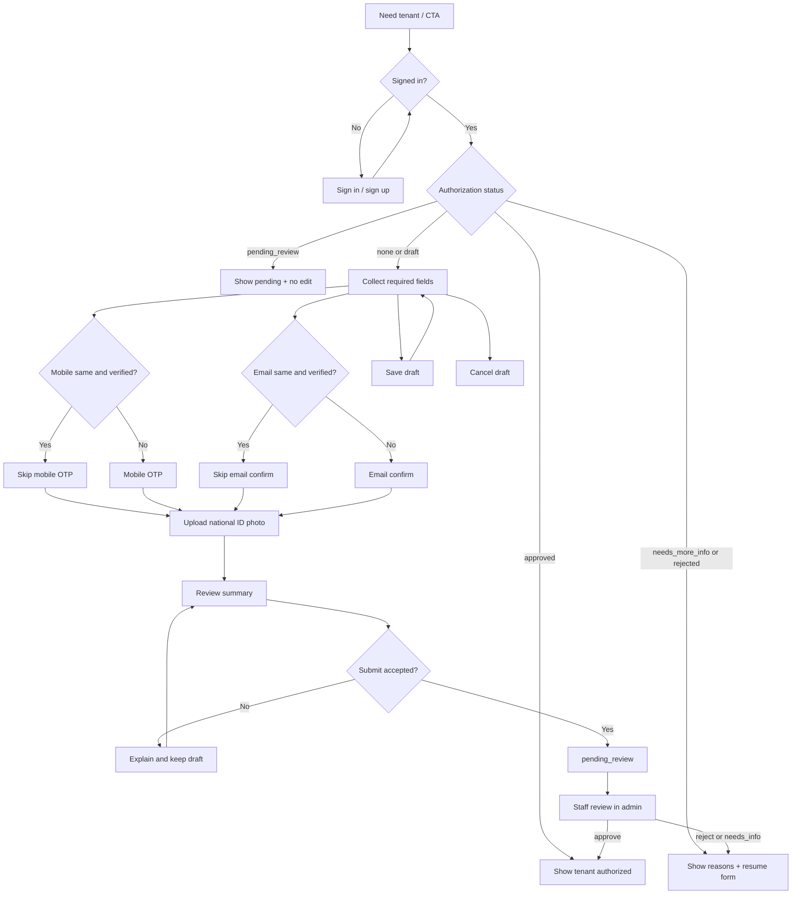

# UX Flow Specification — Customer authorization (احراز هویت)

## Document control

| Field | Value |
|---|---|
| Project | Unixsee Client (`client/`) |
| Flow or service | Customer organizational authorization (احراز هویت) → become tenant |
| Version | 0.1 |
| Status | Draft |
| Date | 2026-08-13 |
| Evidence sources | Stakeholder field list 2026-08-13; `docs/product/notes/customer-authorization-and-tenant.md`; `docs/product/phase-1-application-features.md` §8.1.2; `docs/product/ux-flows/client-auth.md`; inspected `client/` profile (`verification-status`, contact verified/unverified/pending fixtures) — no KYC submission UI yet |
| Owner | Product and customer experience |
| Reviewers | Product, ops, security, backend, frontend (`client/`), QA, accessibility |

## Confidence summary

| Area | Confidence | Reason |
|---|---|---|
| User needs | Medium | Derived from confirmed product stance + required fields; no customer interviews |
| Current journey | High | Auth and profile exist; احراز هویت submission is not implemented |
| Business rules | High for field list / skip-reverify; Medium for auto Shahkar checks | Stakeholder confirmed fields; automation `Unknown` |
| Proposed journey | Medium | Aligns with product note; not usability-tested |
| Accessibility | Medium | Expert review against project rules |
| Measurement plan | Low | Events proposed; analytics ownership unknown |

## Executive flow summary

- **Primary user:** Signed-in customer who needs to become a commercial tenant.
- **Goal:** Submit identity, address, contact proofs, and national-ID card photo so staff can approve احراز هویت.
- **Current problem:** Signup/sign-in and profile contact badges exist, but there is no path to submit tenant-authorization materials; plan requests cannot be enabled until a tenant exists.
- **Proposed change:** A dedicated customer authorization flow (dashboard) that collects the required fields, verifies new contacts only when needed, uploads کارت ملی, and shows pending / rejected / approved status.
- **Main decisions:** Signup creates `role=TENANT` + Tenant shell + OWNER with `authorized=false` (Proposed ADR 0016). Required field set is fixed (below). Reuse already-verified signup mobile/email without re-OTP. Submission is optional and allowed anytime after sign-in; `authorized=true` comes from staff case approve **or** direct admin toggle (customer may never use this flow).
- **Completion state:** Submission accepted → `pending_review`; later `approved` (`authorized=true`) or `rejected` / `needs_more_info` with clear next action. Reject does not clear an admin toggle.
- **Highest-risk failure:** Customer believes they are authorized after submit; or re-verifying already-verified contacts creates friction/drop-off.
- **Accessibility risk:** File upload, OTP challenge, long form, and status announcements.
- **Evidence gap:** Upload constraints; Shahkar automation; exact route IA.
- **Next validation:** Prototype draft → contact verify (skip when already verified) → upload → submit → pending status.

## Problem and desired outcome

### Problem statement

Customers can create an account and send plan requests, but Unixsee cannot sell or enable managed services until they are a tenant. Without a clear احراز هویت submission path and status, customers stall and staff cannot review certifications in-product.

### Desired user outcome

A signed-in customer can complete the required identity package (including کارت ملی photo), understand which contacts still need OTP/email proof, submit once, and see whether they are pending, need changes, or are approved as a tenant.

### Desired service outcome

Unixsee receives a complete, auditable authorization package NestJS can store and staff can approve, creating a tenant without confusing signup with commercial authorization.

### Scope

#### In scope

- Entry from dashboard banner / profile / post–plan-request messaging.
- Collect and validate required fields (table below).
- Conditional mobile OTP and email confirmation (skip when same as already-verified signup contacts).
- Upload national ID card photo.
- Review summary and submit.
- Status: not started, draft, pending review, needs more info, rejected, approved.
- Save draft / resume; cancel draft without submitting.
- Persian RTL primary; English LTR equivalent labels.

#### Out of scope

- Staff review UI (see [`admin-authorization.md`](./admin-authorization.md)).
- Redesigning signup / sign-in ([`client-auth.md`](./client-auth.md)).
- Payment, plan enablement, website activation.
- Visual styling / component polish.
- Nest DTO / storage contracts (engineering later).

### Success definition

- Customer can submit a complete package without re-verifying already-verified signup contacts.
- After submit, status is explicitly `pending_review` (not “authorized”).
- Approved state is shown only after staff approval creates/activates the tenant.
- Incomplete or rejected packages explain what to fix and allow resubmit.

## Available evidence

| ID | Type | Source | User/role | Finding | Strength | Date |
|---|---|---|---|---|---|---|
| E-001 | Stakeholder decision | Product clarification | Product | Required field list for tenant; skip re-verify when signup contact already verified | Strong | 2026-08-13 |
| E-002 | Product note | `customer-authorization-and-tenant.md` | Product | Signup ≠ tenant; request allowed before auth; sell/enable blocked | Strong | 2026-08-13 |
| E-003 | Implementation | `client/` profile fixtures | Customer | Contact `verified` / `unverified` / `pending` badges exist; no KYC form | Strong | 2026-08-13 |
| E-004 | UX flow | `client-auth.md` | Customer | Auth shell owns signup OTP/email verify, not tenant approval | Strong | 2026-08-10 |

## Assumptions and unknowns

### Assumptions

| ID | Assumption | Origin | Risk | Affected decision | Validation | Status |
|---|---|---|---|---|---|---|
| A-001 | Flow requires an authenticated customer session | Product note | Low | Entry gating | Auth design | Accepted |
| A-002 | One active authorization case per user at a time (new draft replaces abandoned draft; pending blocks parallel submit) | Inference | Medium | Resume rules | Product | Unvalidated |
| A-003 | کارت ملی is a single image upload in Phase 1 (front enough; back optional later) | Inference from “عکس از کارت ملی” | Medium | Upload UI | Ops | Unvalidated |
| A-004 | Province/city are selectable controlled lists, not free text only | Common IR address UX | Low | Form shape | Product | Unvalidated |

### Unknowns

| ID | Unknown | Impact | Decision blocked | Resolution | Priority |
|---|---|---|---|---|---|
| U-001 | Image MIME/size/quality rules | Upload validation | File constraints | Product/security | High |
| U-002 | Automated mobile↔کد ملی match vs staff-only | Blocking vs soft warn | Verification step | Product/backend | Critical |
| U-003 | Route: dedicated page vs profile section | IA / deep links | Navigation | Product | High |
| U-004 | Whether rejected submissions retain previous uploads for staff | Storage / privacy | Resubmit UX | Security | Medium |

## Required fields

| Field | Required | Verification |
|---|---|---|
| کد ملی | Yes | Format/checksum rules per Nest policy (`Unknown` exact algorithm) |
| تاریخ تولد | Yes | Valid calendar date; age policy `Unknown` |
| شماره موبایل متعلق به همان کد ملی | Yes | Iranian mobile; OTP unless skip rule |
| تأیید موبایل با OTP | Conditional | Skip if mobile equals signup mobile **and** `mobileStatus=verified` |
| ایمیل | Yes | Valid email; confirm unless skip rule |
| تأیید ایمیل | Conditional | Skip if email equals signup email **and** `emailStatus=verified` |
| استان | Yes | Controlled list preferred |
| شهر | Yes | Controlled list preferred |
| آدرس کامل | Yes | Non-empty text |
| کد پستی | Yes | IR postal format per Nest policy |
| عکس از کارت ملی | Yes | Single required image upload |

## Users, roles and permissions

### Users

| Role | Goal | Responsibility | Constraints | Needs |
|---|---|---|---|---|
| Signed-in customer | Become tenant | Provide truthful data and documents | Cannot self-approve | Clear fields, skip re-verify, status |
| Support (indirect) | Unblock stuck customers | Guide to flow / status meaning | No secret access via this UI | Accurate status language |

### Permissions

| Action | Customer | Conditions |
|---|---|---|
| Open authorization flow | Yes | Authenticated |
| Edit draft / resubmit after reject | Yes | Not while `pending_review` (or only allowed fields if product later allows amend) |
| Approve self as tenant | No | Staff only |

## User needs

### UN-001 — Complete authorization without redoing signup proofs

**As a** signed-in customer, **when** I start احراز هویت with the same verified mobile/email I signed up with, **I need to** skip repeating OTP/email confirmation **so that** I can finish authorization without redundant friction.

- Evidence: E-001.
- Success: Already-verified matching contacts show “already verified”; no challenge issued.
- Priority: Critical.

### UN-002 — Know what is required to become a tenant

**As a** customer who sent a plan request or wants managed service, **when** I open authorization, **I need to** see every required field and document **so that** I submit a complete package the first time.

- Evidence: E-001, E-002.
- Success: Incomplete submit is blocked with field-level errors; missing کارت ملی is explicit.
- Priority: Critical.

### UN-003 — Understand status after submit

**As a** customer, **when** I have submitted, **I need to** see pending / needs info / rejected / approved with next actions **so that** I do not assume I can already buy services.

- Evidence: E-002.
- Success: Approved is the only state that means tenant; pending never uses “sold” or “enabled” language.
- Priority: Critical.

## Current journey

| Stage | Goal | Action | Response | Actors | Backstage | Pain point | Evidence |
|---|---|---|---|---|---|---|---|
| Sign up / sign in | Account | OTP auth | Session | Customer | Nest auth | Not a tenant | E-003, E-004 |
| Profile | Edit basics | Save name/email/mobile | Fixture save | Customer | Local UI | No KYC / tenant path | E-003 |
| Plan request | Ask for plan | Submit request | Intake created | Customer | Nest public/dashboard APIs | Messaging may mention auth, but no submit flow | E-002 |

## Proposed journey

| Stage | Goal | Behaviour | Response | Decision | Backstage | Problem | Need |
|---|---|---|---|---|---|---|---|
| 1. Enter | Start auth | Open authorization from banner/profile/request CTA | Shows status or form | Signed in? | Session check | Dead end | UN-002 |
| 2. Identity | Collect ID | Enter کد ملی, تاریخ تولد | Validates format | Valid? | Client + Nest validation | Bad ID | UN-002 |
| 3. Contacts | Prove contacts | Enter mobile/email; OTP/email confirm only if needed | Verified flags | Skip rule? | Reuse profile verification state | Extra OTP | UN-001 |
| 4. Address | Locate | استان، شهر، آدرس، کد پستی | Saved in draft | Complete? | Draft store | Incomplete address | UN-002 |
| 5. Document | Prove ID card | Upload عکس کارت ملی | Preview + replace | Acceptable file? | Secure upload | Bad image | UN-002 |
| 6. Review | Confirm | Show summary + attest truthfulness | Ready to submit | OK? | — | Wrong data | UN-003 |
| 7. Submit | Hand to staff | Submit package | `pending_review` | Accepted? | Nest create case | Timeout | UN-003 |
| 8. Wait / fix | Finish | See pending; or fix after needs_info/rejected | Resubmit or done | Approved? | Staff review | Silence | UN-003 |
| 9. Approved | Tenant | Show authorized/tenant success + next steps | Can receive enablement | — | Tenant created by staff | Overclaim | UN-003 |

## Mermaid flow diagram

## Screen/state sequence

| Step | State | Goal | Entry condition | Information | Actions | System behaviour | Exit |
|---|---|---|---|---|---|---|---|
| S-01 | Entry / status | Orient | Authenticated | Current authorization state | Start / continue / view | Load case | Form or terminal |
| S-02 | Identity form | Capture ID | Start/resume | کد ملی، تاریخ تولد | Next, save, cancel | Validate | Contacts |
| S-03 | Contacts | Verify channels | Identity OK | Mobile, email, verify CTAs | Send OTP / confirm email | Skip if already verified match | Address |
| S-04 | Address | Capture location | Contacts OK | استان، شهر، آدرس، کد پستی | Next, save | Validate | Document |
| S-05 | Document | Upload card | Address OK | Preview, replace, requirements | Upload, remove | Store securely | Review |
| S-06 | Review | Confirm | All required present | Read-only summary | Submit, edit section | Block if incomplete | Pending |
| S-07 | Pending | Wait | Submit accepted | “Under review”; no sale claim | Open support / dashboard | Lock edits | Approved / fix |
| S-08 | Needs info / rejected | Repair | Staff decision | Reasons, fields to fix | Edit, resubmit | Reopen draft | Pending |
| S-09 | Approved | Complete | Staff approve | Tenant authorized; next steps | Go to plans / dashboard | Reflect tenant | Re-entry read-only |

## State-transition table

| From | Trigger | Actor | Preconditions | Rules | To | Side effects | Failure |
|---|---|---|---|---|---|---|---|
| `not_started` | Start | Customer | Session | — | `draft` | Create draft | Auth expired |
| `draft` | Save | Customer | Session | Retain fields | `draft` | Persist draft | Save fail |
| `draft` | Submit | Customer | All required + contacts verified as needed | Skip-reverify rule | `pending_review` | Notify staff queue | Validation / network |
| `pending_review` | Approve | Staff | Complete package | Admin flow | `approved` | Tenant exists | — |
| `pending_review` | Request info / reject | Staff | Reason required | Admin flow | `needs_more_info` / `rejected` | Notify customer | — |
| `needs_more_info` / `rejected` | Resubmit | Customer | Fixes applied | Same required set | `pending_review` | New review cycle | Validation |
| `approved` | — | — | Tenant exists | Terminal for this flow | `approved` | — | — |

## Business-rule decision table

| Condition / result | New mobile | Signup mobile verified | New email | Signup email verified | Complete fields + photo | Result |
|---|---|---|---|---|---|---|
| Case A | No (same) | Yes | No (same) | Yes | Yes | Submit without OTP/email challenges |
| Case B | Yes | — | Same | Yes | Yes | Require mobile OTP only |
| Case C | Same | Yes | Yes | — | Yes | Require email confirm only |
| Case D | Same | No | Same | No | Yes | Require both challenges |
| Case E | Any | Any | Any | Any | No | Block submit; show field errors |
| Case F | Any | Any | Any | Any | Yes after pending | Edits locked until staff returns case |

## Loading, empty, error and recovery states

### Loading

| ID | Trigger | User action | Exit |
|---|---|---|---|
| L-001 | Open flow / load status | Skeleton / busy | Ready or error |
| L-002 | Send OTP / email link | Disable resend; cooldown | Verified or fail |
| L-003 | Upload / submit | Pending button; no double submit | Success or fail |

### Empty

| ID | Cause | Meaning | Action |
|---|---|---|---|
| E-001 | No case yet | Not started | Start authorization |
| E-002 | No photo | Document missing | Upload required |

### Validation

| ID | Rule | Correction | Data retained |
|---|---|---|---|
| V-001 | Required fields | Inline errors | Yes |
| V-002 | Mobile/email format | Inline | Yes |
| V-003 | OTP / email token | Inline; resend | Yes except secrets |
| V-004 | Upload type/size | Explain limits | Prior file until replaced |

### System failure

| ID | Failure | Certainty | Data saved | Retry safe | Recovery |
|---|---|---|---|---|---|
| F-001 | Draft save timeout | Uncertain | Reconcile | Yes if idempotent | Reload status |
| F-002 | Submit timeout | Uncertain | Reconcile before resubmit | Only after status check | Show pending if created |
| F-003 | Upload fail | No accept | Draft without file | Yes | Re-upload |

## Edge cases

| ID | Scenario | Expected behaviour | Rule |
|---|---|---|---|
| EC-001 | Signup mobile verified, user keeps it | Skip mobile OTP | E-001 |
| EC-002 | User changes mobile during form | Require OTP for new mobile | E-001 |
| EC-003 | Submit while offline | Keep draft; explain retry | F-002 |
| EC-004 | Pending user opens plan request | Allowed; messaging still states auth needed for delivery | Product note |
| EC-005 | Approved user reopens flow | Read-only approved summary | Terminal |
| EC-006 | Duplicate کد ملی policy conflict | Block or escalate per Nest policy (`Unknown`) | U-002 |

## Accessibility review

| ID | Criterion | Required behaviour | Severity |
|---|---|---|---|
| AX-001 | Keyboard | Entire form, OTP, upload control operable | 4 |
| AX-002 | Labels / errors | Every field labelled; errors linked | 4 |
| AX-003 | Status | Pending/approved announced politely | 4 |
| AX-004 | File upload | Name, status, replace announced; not mouse-only | 4 |
| AX-005 | Critical submit | Review step before submit | 3 |
| AX-006 | RTL / LTR | کد ملی، postal, email remain readable/copyable | 3 |

## Heuristic review

| ID | Heuristic | Finding | Severity | Required behaviour |
|---|---|---|---:|---|
| HX-001 | Visibility | Pending must not look like approved | 4 | Distinct status copy |
| HX-002 | Match language | Use احراز هویت / مستأجر vocabulary consistently | 3 | Shared glossary |
| HX-003 | User control | Cancel draft; edit before submit; locked while pending | 3 | Explicit actions |
| HX-004 | Consistency | Contact verify matches auth patterns | 3 | Reuse OTP patterns |
| HX-005 | Error prevention | Block submit without photo | 4 | Client + server |
| HX-006 | Recognition | Show which contacts were skipped as already verified | 3 | Status chips |
| HX-009 | Errors | Reject reasons actionable | 4 | Field-level when possible |

## Analytics events

| ID | Event | Trigger | Question |
|---|---|---|---|
| EV-001 | `authorization_started` | Open flow | Funnel entry? |
| EV-002 | `authorization_contact_challenge_issued` | OTP/email sent | How often skip fails? |
| EV-003 | `authorization_contact_challenge_skipped` | Skip rule applied | Skip rate? |
| EV-004 | `authorization_document_uploaded` | Photo accepted | Drop before upload? |
| EV-005 | `authorization_submitted` | Pending | Completion rate? |
| EV-006 | `authorization_resubmitted` | After reject/needs_info | Fix loop length? |
| EV-007 | `authorization_approved_seen` | Customer sees approved | Time-to-tenant awareness? |

## Acceptance criteria

### AC-001 — Required package
**Given** a signed-in customer on the authorization form, **when** any required field or کارت ملی photo is missing, **then** submit is blocked with identifiable errors, **and** valid entered data is retained.

### AC-002 — Skip re-verification
**Given** the entered mobile equals the signup mobile and is already verified, **when** the customer proceeds, **then** no mobile OTP is required; **and** the same rule applies independently for email.

### AC-003 — Challenge when changed
**Given** the customer enters a different mobile or email, **when** they proceed, **then** that contact must be newly verified before submit.

### AC-004 — Submit ≠ approved
**Given** a successful submit, **when** the customer views status, **then** the state is `pending_review`, **and** copy does not claim tenant approval or plan enablement.

### AC-005 — Resubmit after reject
**Given** staff rejected or requested more info with reasons, **when** the customer fixes and resubmits, **then** the case returns to `pending_review`.

### AC-006 — Approved means tenant
**Given** staff approved authorization, **when** the customer opens the flow, **then** they see approved/tenant status and next actions, **and** selling/enablement may proceed on the admin side.

## Questions requiring user research

| ID | Question | Priority |
|---|---|---|
| RQ-001 | Do customers understand signup verify ≠ احراز هویت? | High |
| RQ-002 | Is single کارت ملی photo enough, or front+back? | High |
| RQ-003 | Where do users expect this: profile vs dedicated page vs after plan request? | Medium |

## Risks and dependencies

### Risks

| ID | Risk | Mitigation |
|---|---|---|
| R-001 | Customers think submit = authorized | Strong pending copy; AC-004 |
| R-002 | PII / ID photo exposure | Nest-owned storage; staff-only access; no public URLs |
| R-003 | Re-verify friction if skip rule wrong | Share verification state with profile/auth |

### Dependencies

| ID | Dependency | Owner |
|---|---|---|
| D-001 | Contact verification state from account | Auth / profile |
| D-002 | Secure upload + staff review | Nest + admin-authorization |
| D-003 | Tenant creation on approve | Admin authorization / users domain |

## Implementation readiness

**Conditionally ready for prototyping** (static form + status). **Not ready for production implementation** until U-001/U-002 and Nest contracts exist.

### Blockers

- Upload constraints and mobile↔کد ملی matching policy.
- Nest persistence and staff review API.
- Final IA route decision (U-003).

## Final recommendations

### Must resolve before implementation
- REC-001: Implement skip-reverify exactly per contact.
- REC-002: Treat pending as non-terminal and non-authorized.
- REC-003: Keep document list aligned with the product note table.

### Must validate during prototyping
- Long-form completion on mobile RTL.
- Upload replace / error recovery.
- Status comprehension after submit.

### Can iterate after release
- Front+back card photos.
- Richer address lookup.

### Rejected or deferred
- Blocking plan-request submission until authorized (rejected by product stance).
- Customer self-approval of tenant (rejected).

## Related

- Product note: [`../notes/customer-authorization-and-tenant.md`](../notes/customer-authorization-and-tenant.md)
- Admin review: [`admin-authorization.md`](./admin-authorization.md)
- Client auth: [`client-auth.md`](./client-auth.md)
- Plan request messaging: [`customer-public-plan-request.md`](./customer-public-plan-request.md)
- Phase 1: [`../phase-1-application-features.md`](../phase-1-application-features.md) §8.1.2
