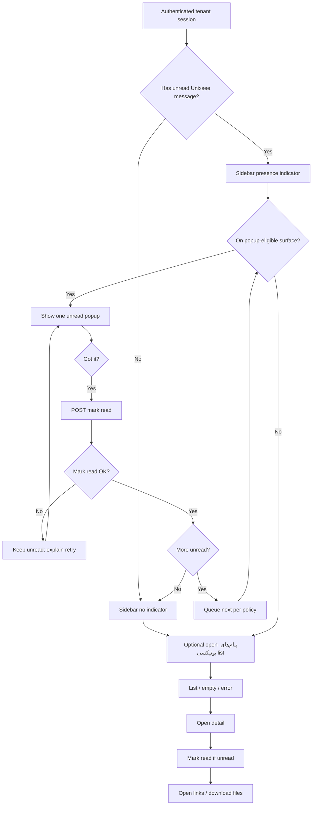

# UX Flow Specification — Customer Unixsee messages

## Document control

| Field | Value |
|---|---|
| Project | Unixsee Client (`client/`) |
| Flow or service | Customer receive / unread / popup / inbox for **Unixsee messages** (`پیام‌های یونیکسی`) |
| Version | 0.1 |
| Status | Draft |
| Date | 2026-08-16 |
| Prepared from | [`../unixsee-messages-prd.md`](../unixsee-messages-prd.md); [`../phase-1-application-features.md`](../phase-1-application-features.md) §18; product clarification 2026-08-16 |
| Primary owner | Product, customer experience, client frontend, Nest backend |
| Reviewers required | Product, support, security, backend, QA, accessibility |
| Companion | Staff compose journey: [`admin-unixsee-messages.md`](./admin-unixsee-messages.md) |

## Confidence summary

| Area | Confidence | Reason |
|---|---|---|
| User needs | Medium–High | Confirmed PRD; no customer interviews |
| Current journey | High | No customer messages page/popup exists (greenfield) |
| Business rules | Medium | Read-on-dismiss and sidebar presence Confirmed; popup trigger routes and multi-unread queue Unknown |
| Proposed journey | Medium | Aligns with PRD defaults; not usability-tested |
| Accessibility | Medium | Dialog/focus risks identified; untested |
| Measurement plan | Low | Events proposed; ownership unknown |

## Executive flow summary

- **Primary user:** Authenticated tenant dashboard user (Phase 1: one user per tenant).
- **Goal:** Learn about staff messages without missing unread ones; dismiss popup; browse inbox; open links/attachments.
- **Current problem:** No tenant-targeted one-way inbox; staff have no durable in-dashboard delivery path for short notices.
- **Proposed change:** Sidebar item پیام‌های یونیکسی with unread **presence** indicator; dismissible first-see popup (“got it”); list/detail page; server-backed read state.
- **Main decisions:** Dismiss marks read; list/detail also clears unread; no unread count API; one-way (no reply); distinct from News and اعلان‌ها.
- **Completion state:** User has read or consciously browsed messages; unread indicator clears when none remain.
- **Highest-risk failure:** Read mark fails so popup/indicator loop; or message from another tenant leaks.
- **Accessibility risk:** Modal focus trap, status announcement on dismiss, RTL dialog, attachment download affordances.
- **Evidence gap:** Which routes trigger popup (home only vs any dashboard page); multi-unread queue order; withdraw history display.
- **Next validation:** Prototype popup → got it → indicator clears; list marks read.

## Problem and desired outcome

### Problem statement

Customers have no first-class place to receive short staff notices with attachments/links and clear unread handling, so important Unixsee communications risk being missed or forced into tickets.

### Desired user outcome

A tenant user sees when something new exists (sidebar indicator), can understand the message in a dismissible popup, mark it read with “got it”, and later find the same content in پیام‌های یونیکسی list/detail with links and files.

### Desired service outcome

Unixsee delivers tenant-scoped one-way messages with cross-device read state owned by Nest, without email/SMS and without conflating News or website اعلان‌ها.

### Scope

#### In scope

- Dashboard nav item: Unixsee messages / پیام‌های یونیکسی.
- Unread **presence** indicator (dot/point) when any unread published message exists — **no** numeric count API.
- First-see dismissible popup for unread message(s) with primary action “got it” / localized equivalent.
- Messages list page (empty, loading, error) and detail view.
- Mark read on popup dismiss; mark read when opening list item/detail if still unread.
- Show optional website context; open external and in-dashboard links; download allowed attachments.
- Cross-device read consistency for the same user.
- Persian RTL and English LTR customer UI for the same flows.
- Honest empty/error states (no fake success).

#### Out of scope

- Staff compose/publish — [`admin-unixsee-messages.md`](./admin-unixsee-messages.md).
- Customer reply; ticket thread behaviour.
- Email/SMS/push notifications.
- Notifications (News) feed and website-specific اعلان‌ها product behaviour.
- Unread count badges / count endpoints.
- Hard title/body length enforcement.
- Future multi-member capability filtering (model must not forbid later expansion).
- Visual styling polish.

### Success definition

- Unread published messages produce sidebar presence and a dismissible popup path.
- “Got it” and list/detail open clear unread server-side and across devices.
- Users can browse historical visible messages, open links, and download allowed files.
- Other tenants cannot access messages by ID.
- Keyboard and screen-reader users can dismiss popup and use the inbox without pointer-only steps.

## Available evidence

| ID | Type | Source | Finding | Strength | Date |
|---|---|---|---|---|---|
| E-001 | Product PRD | `unixsee-messages-prd.md` | Popup dismiss→read; sidebar presence; list page; FA/EN content; attachments/links; optional website | Strong | 2026-08-16 |
| E-002 | Stakeholder clarification | Product Q&A | No count API; cross-device; one-way; Phase 1 now | Strong | 2026-08-16 |
| E-003 | PRD default | O-2 | Multi-unread: one popup at a time, oldest first (Inferred default) | Medium | 2026-08-16 |
| E-004 | Implementation | `client/` | No messages inbox/popup Observed | Strong | 2026-08-16 |

## Assumptions and unknowns

### Assumptions

| ID | Assumption | Origin | Risk | Status |
|---|---|---|---|---|
| A-001 | Popup shows one unread at a time, oldest first | PRD O-2 default | Medium if many unread annoy users | Open default |
| A-002 | After dismiss, next unread may show on next eligible navigation/visit (not infinite same-view loop) | Flow control | Medium | Open |
| A-003 | Esc / backdrop dismiss either disabled or equivalent to “got it” (must not leave unread ambiguous) | Accessibility / consistency | High if mismatch | Open — prefer explicit “got it” only until decided |
| A-004 | Non-tenant authenticated users see gated/empty messages, not other tenants’ data | Phase 1 tenancy | High if wrong | Open |

### Unknowns

| ID | Unknown | Impact | Priority |
|---|---|---|---|
| U-001 | Popup trigger surfaces (dashboard home only vs any authenticated dashboard route) | Interruption scope | High |
| U-002 | Esc/backdrop = read or not | Unread honesty | High |
| U-003 | Withdrawn message appearance in customer history | Trust | High |
| U-004 | Customer-visible “edited” label | Trust | Medium |
| U-005 | Attachment download auth and expiry | Security | High (shared with admin U-001) |

## Users, roles and permissions

### Users

| Role | Goal | Constraints |
|---|---|---|
| Tenant dashboard user | See and acknowledge staff messages | Own tenant only; no reply |
| Future tenant members | Same inbox later | Capability filter Unknown |
| Nest | Authorize list/read/mark-read; serve attachments | Authority |

### Permissions

| Action | Tenant member | Other tenant / guest | Enforcement |
|---|---|---|---|
| List messages | Yes (own tenant published/visible set) | No | Nest |
| Open detail / attachments | Yes if allowed for message | No | Nest |
| Mark read | Yes own user | No | Nest |
| Reply | No | No | UI + API absent |

## User needs

### UN-001

**As a:** tenant user  
**When:** Unixsee staff sent me a notice  
**I need to:** see that something unread exists and read it without hunting  
**So that:** I do not miss important information.  

Evidence: E-001 — Priority: High — Status: Proposed

### UN-002

**As a:** tenant user  
**When:** I have seen the popup  
**I need to:** dismiss with “got it” and have it stay read on other devices  
**So that:** I am not interrupted again for the same message.  

Evidence: E-001, E-002 — Priority: High — Status: Proposed

### UN-003

**As a:** tenant user  
**When:** I want to revisit a message, file, or link  
**I need to:** find it in پیام‌های یونیکسی  
**So that:** I can act later without asking support to resend.  

Evidence: E-001 — Priority: High — Status: Proposed

## Current journey

| Stage | Action | Response | Pain |
|---|---|---|---|
| Staff needs to notify | Offline / ticket only | No inbox | Missed notices; ticket overload |

## Proposed journey

| Stage | Behaviour | Backstage | Need |
|---|---|---|---|
| Enter dashboard | If unread exists, sidebar shows presence; eligible route may open popup | Nest unread presence + message payload | UN-001 |
| Popup | Read title/body/links/files/website context; choose got it | Mark read | UN-002 |
| Inbox | Open list/detail anytime | List + mark read on open | UN-003 |
| Multi-unread | After mark read, next unread follows A-001/A-002 | Queue | UN-001 |

## Mermaid flow diagram

## Screen/state sequence

| Step | State | Goal | Actions | Exit |
|---|---|---|---|---|
| 1 | `dashboard_with_indicator` | Notice unread exists | Navigate to messages / continue | Popup or list |
| 2 | `unread_popup` | Consume one message | Got it; open link; download | Read or retry |
| 3 | `messages_list` | Browse history | Open item | Detail / empty |
| 4 | `message_detail` | Full content | Links, files; back | List |
| 5 | `mark_read_pending` | Persist read | Wait | Cleared or error |
| 6 | `gated_non_tenant` | Honest denial/empty | Go authorization | Exit messages |

## State-transition table

| From | Trigger | Actor | Rules | To | Side effects | Failure |
|---|---|---|---|---|---|---|
| `unread` | Popup shown | System | Eligible surface; published; not withdrawn | `unread_popup` | Focus to dialog | — |
| `unread_popup` | Got it | User | — | `mark_read_pending` | Disable double submit | — |
| `mark_read_pending` | Success | Nest | Per-user read | `read` | Clear indicator if none left | Stay unread |
| `unread` | Open list/detail | User | Same message | `mark_read_pending` | Same as dismiss | Retry |
| `published` | Staff withdraw | Staff | PRD O-4 TBD | `not_active` / history policy | Remove from unread queue | — |

## Business-rule decision table

| Condition/result | C1 | C2 | C3 | C4 |
|---|---|---|---|---|
| Message published for this tenant | Yes | Yes | Yes | No |
| Already read by this user | No | Yes | No | — |
| Withdrawn | No | No | Yes | — |
| **Popup eligible** | Yes | No | No | No |
| **Sidebar presence** | Yes | No (if no other unread) | No (if no other unread) | No |
| **List visible** | Yes | Yes | Per O-4 | No |

## Loading, empty, error and recovery states

### Loading

| ID | Trigger | Behaviour |
|---|---|---|
| L-001 | List fetch | Skeleton/list pending; no fake rows |
| L-002 | Mark read | Button pending; prevent double got it |
| L-003 | Attachment download | Progress/error on failure |

### Empty

| ID | Cause | Meaning | Action |
|---|---|---|---|
| E-EMP-1 | No messages | Nothing sent yet | Stay; no error |
| E-EMP-2 | Non-tenant | Not eligible | Link to احراز هویت / explain |

### Validation / client rules

| ID | Rule | Behaviour |
|---|---|---|
| V-001 | One-way channel | No reply composer |
| V-002 | External links | Open safely (new tab / confirmed pattern per app norms) |
| V-003 | Internal links | Navigate within dashboard allowlist only |

### System failure

| ID | Failure | Result certainty | Retry safe | Recovery |
|---|---|---|---|---|
| SF-001 | Mark read fails | Still unread | Yes | Keep popup/indicator; show error |
| SF-002 | List fetch fails | Unknown list | Yes | Retry; preserve nav |
| SF-003 | Attachment forbidden/expired | No file | Maybe later | Explain; contact support if needed |

## Edge cases

| ID | Scenario | Expected behaviour |
|---|---|---|
| EC-001 | Multiple unread | One popup at a time; oldest first (A-001) until product changes O-2 |
| EC-002 | User dismisses then other device | Second device already read |
| EC-003 | Staff edits while unread | Popup/list show latest content on next fetch |
| EC-004 | Staff withdraws while popup open | Next reconcile hides active unread; do not claim success incorrectly |
| EC-005 | Deep link to message id from other tenant | Fail closed |
| EC-006 | Popup on mobile RTL | Dialog usable; got it reachable; no keyboard trap |

## Accessibility review

| ID | Criterion | Required behaviour | Severity |
|---|---|---|---|
| AX-001 | Dialog keyboard | Focus trap inside popup; Tab cycles; Got it reachable | 4 |
| AX-002 | Focus return | After dismiss, return to logical trigger/main | 3 |
| AX-003 | Status | Announce unread presence changes and mark-read success/failure | 3 |
| AX-004 | Indicator | Not color-only; presence has accessible name on nav item | 3 |
| AX-005 | Attachments | Download controls labeled; errors announced | 3 |
| AX-006 | Timing | No auto-dismiss that marks read without explicit action | 3 |

## Heuristic review

| ID | Heuristic | Finding | Severity | Required behaviour |
|---|---|---|---:|---|
| H-001 | System status | Indicator + popup must agree with server unread | 3 | Reconcile after mark-read |
| H-002 | Match language | پیام‌های یونیکسی / Unixsee messages | 2 | Localized labels |
| H-003 | User control | Explicit got it; avoid silent read on backdrop unless decided | 3 | Resolve U-002 |
| H-006 | Recognition | List shows title, time, website context, read state | 2 | Clear list rows |
| H-008 | Minimalist | Short content; no reply chrome | 2 | One-way UI |
| H-009 | Errors | Mark-read failure explains retry | 3 | SF-001 |

## Analytics events

| ID | Event | Trigger | Question |
|---|---|---|---|
| AN-001 | `um_popup_shown` | Popup opened | Are popups reaching users? |
| AN-002 | `um_popup_dismissed` | Got it success | Acknowledgement rate? |
| AN-003 | `um_mark_read_failed` | Mark read error | Reliability? |
| AN-004 | `um_inbox_opened` | List page | Inbox usage vs popup-only? |
| AN-005 | `um_link_opened` / `um_attachment_downloaded` | User follows CTA | Content usefulness? |

Do not require unread **count** properties.

## Acceptance criteria

### AC-001

**Given** a published unread message for the user’s tenant  
**When** the user reaches a popup-eligible dashboard surface  
**Then** a dismissible popup shows title/body and available links/files/website context  
**And** the sidebar shows an unread presence indicator.

### AC-002

**Given** the unread popup  
**When** the user chooses “got it” and Nest accepts mark-read  
**Then** that message is read for the user across devices  
**And** the indicator clears if no other unread remain.

### AC-003

**Given** mark-read fails  
**When** the user dismisses attempt completes with error  
**Then** the message remains unread  
**And** the UI does not claim success.

### AC-004

**Given** zero or more messages  
**When** the user opens پیام‌های یونیکسی  
**Then** they see an honest list or empty state  
**And** opening an unread item marks it read when Nest succeeds.

### AC-005

**Given** a message for another tenant  
**When** the user requests it by id  
**Then** access fails closed.

### AC-006

**Given** keyboard / screen-reader user  
**When** popup appears  
**Then** focus moves into the dialog, got it is operable, and status changes are announced.

## Questions requiring user research / product decision

| ID | Question | Priority |
|---|---|---|
| RQ-001 | Popup on home only or all dashboard routes? | High |
| RQ-002 | Does Esc/backdrop mark read? | High |
| RQ-003 | How are withdrawn messages shown in history? | High |
| RQ-004 | After got it, show next unread immediately or on next navigation? | Medium |

## Risks and dependencies

### Risks

| ID | Risk | Mitigation |
|---|---|---|
| R-001 | Popup fatigue with many unread | Oldest-first single popup; presence indicator; inbox |
| R-002 | Ambiguous dismiss ≠ read | Prefer explicit got it until U-002 decided |
| R-003 | Cross-tenant leak | Nest tenancy checks; client never trusts IDs alone |

### Dependencies

| ID | Dependency | Failure effect |
|---|---|---|
| D-001 | Nest list / mark-read / attachment APIs | Fixture-only dishonest UX |
| D-002 | Admin publish flow | No messages to show |
| D-003 | Client hybrid JWT fetch (ADR 0011) | Cannot call Nest safely |

## Implementation readiness

**Conditionally ready** for technical design and UI prototyping.

### Blockers

- Popup trigger surfaces (U-001)
- Esc/backdrop read semantics (U-002)
- Attachment download policy (U-005)
- Withdraw history policy (U-003)

## Final recommendations

### Must resolve before implementation

- Decide popup-eligible routes and dismiss semantics.
- Align attachment download rules with admin policy.

### Must validate during prototyping

- Mobile RTL popup + indicator.
- Multi-unread queue feel (A-001/A-002).

### Can iterate after release

- Richer inbox filters; edited labels; multi-member visibility rules.

### Rejected or deferred

- Unread counts; email/SMS; customer reply; News/اعلان‌ها merge.
