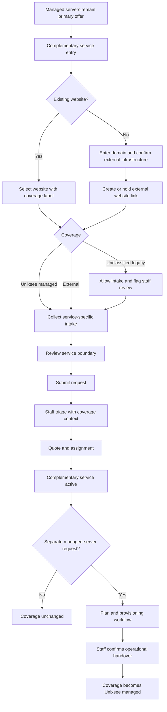

# Website management coverage and complementary services — UX PRD

## Document control

| Field              | Value                                                                                                                |
| ------------------ | -------------------------------------------------------------------------------------------------------------------- |
| Project            | Unixsee public site, customer dashboard, and admin panel                                                             |
| Flow or service    | Distinguish Unixsee-managed websites from externally hosted websites                                                 |
| Version            | 0.2                                                                                                                  |
| Status             | Accepted                                                                                                             |
| Date               | 2026-08-24                                                                                                           |
| Primary owner      | Product and operations                                                                                               |
| Reviewers required | Product, managed-infrastructure operations, complementary-service delivery, engineering, QA, accessibility, security |

## Executive decision

### Accepted intake refinement (v0.2)

Customers do not create Website records directly. The complementary-service
request field may accept an existing Website or a typed domain. A typed domain
is normalized and stored only on the request.

An external Website record is created or reused only when staff explicitly
accepts the request and an authorized tenant exists. Without a tenant,
acceptance remains domain-only as `DEFERRED_NO_TENANT`. Service assignment and
activation are later, independent states and may record
`NOT_AUTHORIZED_AT_ACTIVATION`.

This section supersedes later proposed wording that says customer submission
“adds,” creates, or links an external Website. Rejection or withdrawal never
creates a Website. Cross-tenant conflicts return a generic conflict without
disclosing ownership. No complementary transition assigns or activates a
managed-server plan.

Detailed customer flow:
[Customer complementary-service request](./client-complementary-service-request.md).
Backend wire contract:
[Customer complementary-service requests](../../backend/contracts/complementary-services-customer.md).

Unixsee remains a managed-server company first. Complementary services may now
be requested for websites whose infrastructure Unixsee does not manage.

Every website therefore needs an explicit, durable **management coverage**
classification. It is independent of plan linkage, plan activation, website
lifecycle, server assignment, agent connection, monitoring health, and
complementary-service state.

| Semantic value            | Customer label (fa)        | English label                  | Meaning                                                                            |
| ------------------------- | -------------------------- | ------------------------------ | ---------------------------------------------------------------------------------- |
| `UNIXSEE_MANAGED`         | مدیریت سرور با Unixsee     | Server managed by Unixsee      | Unixsee has an active operational responsibility for the website's server          |
| `EXTERNAL_INFRASTRUCTURE` | سرور خارج از Unixsee       | Server outside Unixsee         | Unixsee may deliver accepted complementary services but does not manage the server |
| `UNCLASSIFIED`            | وضعیت مدیریت نیازمند بررسی | Management status needs review | Migration-only state for records that cannot yet be classified safely              |

`UNCLASSIFIED` is not selectable for new records. The exact field and API enum
names belong to technical design; the semantics above are the product contract.

Migration decision (v0.2): every Website that predates this feature is backfilled
to `UNIXSEE_MANAGED`, because the product previously admitted Website records only
through the managed-server journey. `UNCLASSIFIED` remains reserved for future
ambiguous imports or exceptional records that require staff review.

## Confidence summary

| Area                          | Confidence                     | Reason                                                                                                       |
| ----------------------------- | ------------------------------ | ------------------------------------------------------------------------------------------------------------ |
| Product direction             | High                           | The owner confirmed managed servers remain primary and external websites may request complementary services  |
| Current journey               | High                           | Product docs, Prisma models, customer fixtures, and admin website views were inspected                       |
| Classification model          | Medium                         | It resolves observed ambiguity but has not been tested with customers or staff                               |
| Eligibility                   | High for current four families | SEO, design, product entry, and social support do not inherently require Unixsee-managed infrastructure      |
| Migration and ownership rules | Medium                         | Legacy records have an accepted managed backfill; future authority evidence and reclassification remain open |
| Accessibility and measurement | Medium                         | Expert requirements are defined; no usability or analytics evidence exists                                   |

## Outcome and scope

### Desired customer outcome

A customer can immediately tell which websites receive Unixsee server
management and which only receive selected complementary services. They can
request SEO, graphic design, product data entry, or social-media support for
either type without mistaking that work for infrastructure management.

### Desired staff outcome

Staff can identify management responsibility in lists, details, request queues,
and assignments without inferring it from unreliable proxies. They can avoid
promising monitoring or operational actions for an external server.

### Desired business outcome

Unixsee expands complementary-service intake while preserving the prominence
and meaning of its primary managed-server offer.

### In scope

- Public positioning and entry to complementary-service intake.
- Customer website lists, cards, pickers, details, filters, and service records.
- Admin website lists, details, complementary-service queues, and assignments.
- Adding an externally hosted website during authenticated service intake.
- Management-coverage states, transitions, failures, recovery, accessibility,
  measurement, and implementation acceptance criteria.
- The four current complementary-service families.

### Out of scope

- Visual styling, badge colors, typography, and layout polish.
- Final database field, DTO, route, or event names.
- Server-plan pricing, checkout, or automatic conversion to managed hosting.
- Credential storage and detailed access-handoff workflows for each service.
- A promise to monitor, back up, secure, or operate external infrastructure.

## Evidence and authority

| ID    | Authority                 | Source                                          | Finding                                                                                                      |
| ----- | ------------------------- | ----------------------------------------------- | ------------------------------------------------------------------------------------------------------------ |
| E-001 | Confirmed direction       | Product owner, 2026-08-24                       | External websites may request complementary services; managed servers remain the primary Unixsee offer       |
| E-002 | Confirmed product context | `docs/architecture/overview.md` and Phase 1 §2  | Unixsee is positioned as a premium managed-infrastructure service; complementary services are secondary      |
| E-003 | Observed documentation    | Phase 1 §12.1 and §16.1                         | Existing language assumes managed websites and existing managed customers                                    |
| E-004 | Accepted implementation   | `backend/prisma/schema.prisma`, `Website`       | Website has explicit management coverage independent of plan, activation, VPS, lifecycle, and telemetry      |
| E-005 | Accepted implementation   | Customer complementary-service request page     | Real catalog/Website data and a writable combobox expose identity and management coverage                    |
| E-006 | Observed implementation   | Admin and customer website lists/details        | Plan, lifecycle, server, agent, and monitoring are shown, but management responsibility is not explicit      |
| E-007 | Accepted contract         | `docs/backend/contracts/websites-admin.md`      | A linked plan is not necessarily active; plan linkage cannot represent management coverage safely            |
| E-008 | Accepted implementation   | Complementary-service request model and service | Domain snapshot, target, coverage, resolution, and authorization remain explicit before and after acceptance |

### Assumptions and unknowns

| ID    | Type     | Statement                                                                                               | Risk / validation                                               |
| ----- | -------- | ------------------------------------------------------------------------------------------------------- | --------------------------------------------------------------- |
| A-001 | Accepted | Customers may type an external domain during intake; this creates only a request until staff acceptance | Enforced by the customer create contract                        |
| A-002 | Inferred | The four current complementary-service families are eligible for both coverage states                   | Confirm with each delivery lead                                 |
| A-003 | Inferred | External-domain authority can be attested at intake and verified later when a service requires access   | Security and legal review                                       |
| D-004 | Accepted | Pre-feature Website records came only from the managed-server journey                                   | Backfill them to `UNIXSEE_MANAGED`; review only true exceptions |
| U-002 | Unknown  | Whether external-domain ownership must be verified before request, quotation, or assignment             | Product/security decision                                       |
| U-003 | Unknown  | Which roles can change coverage and whether dual approval is required                                   | Capability decision                                             |
| U-004 | Unknown  | Which managed benefits remain visible after offboarding                                                 | Operations and retention policy                                 |
| U-005 | Unknown  | Whether future catalog items may be managed-only                                                        | Catalog policy; default must not silently become managed-only   |

## Users and needs

| ID     | User                      | Need                                                       | Success                                                           |
| ------ | ------------------------- | ---------------------------------------------------------- | ----------------------------------------------------------------- |
| UN-001 | Prospective customer      | Understand Unixsee's primary offer quickly                 | Managed servers remain the first and strongest public proposition |
| UN-002 | Tenant owner/admin        | Request complementary work for an external website         | No active Unixsee server plan is required to submit               |
| UN-003 | Customer user             | Understand the service boundary on every website           | Coverage is visible wherever website identity drives a decision   |
| UN-004 | Intake/delivery staff     | Know what Unixsee can safely promise and access            | Queue/detail shows coverage and applicable capabilities           |
| UN-005 | Infrastructure operations | Change responsibility only after real handover/offboarding | Coverage transition is explicit, effective-dated, and audited     |
| UN-006 | Support/audit staff       | Explain historical responsibility                          | Coverage history and request-time context are retained            |

## Service-scope decision

### Brand hierarchy

1. Public home, service navigation, and primary calls to action continue to lead
   with managed servers.
2. Complementary services are a secondary offer with explicit copy such as:
   “Available for websites on Unixsee-managed servers or other infrastructure.”
3. External-site intake must not imply hosting, monitoring, backup, security,
   incident response, or server administration by Unixsee.
4. An optional managed-server consultation may appear after the complementary
   request is safe, but it cannot block, preselect, or replace the request.

### Current catalog eligibility

| Service family       | Unixsee-managed | External infrastructure | Extra review for external site               |
| -------------------- | --------------: | ----------------------: | -------------------------------------------- |
| SEO                  |             Yes |                     Yes | Access and technical-change feasibility      |
| Graphic design       |             Yes |                     Yes | Brand assets and approval process            |
| Product data entry   |             Yes |                     Yes | CMS access, data source, and permissions     |
| Social-media support |             Yes |                     Yes | Channel access and publishing responsibility |

Future items may declare a documented eligibility restriction. Absence of a
restriction means both classified coverage states are eligible.

## Current journey and gap

| Stage             | Current behavior                                                  | Gap                                                    | Evidence     |
| ----------------- | ----------------------------------------------------------------- | ------------------------------------------------------ | ------------ |
| Public discovery  | Managed servers are primary; complementary services are secondary | Eligibility for external sites is not clear            | E-002, E-003 |
| Website inventory | Lists show plan, health, server, or agent values                  | Users must infer responsibility from proxies           | E-004, E-006 |
| Customer request  | Fixture picker contains existing websites only                    | External classification and add-domain path are absent | E-005        |
| Admin review      | Request context may include tenant/website                        | Staff cannot see whether infrastructure is in scope    | E-006, E-008 |
| Delivery          | Assignment is attached to request/website                         | Server-management promise is not explicitly bounded    | E-008        |

## Proposed end-to-end journey

| Stage                   | User action                                          | System response                                                                                                  | Decision / recovery                                     |
| ----------------------- | ---------------------------------------------------- | ---------------------------------------------------------------------------------------------------------------- | ------------------------------------------------------- |
| 1. Discover             | Reads Unixsee service proposition                    | Managed-server offer remains primary; complementary availability for external sites is stated secondarily        | No account required                                     |
| 2. Start request        | Chooses a complementary family                       | Explains scope and that server management is separate                                                            | Service unavailable only by explicit catalog rule       |
| 3. Identify website     | Selects an existing website or “Add another website” | Shows management coverage beside each website                                                                    | Never infer from plan/agent in the browser              |
| 4. Add external website | Enters domain and confirms server is outside Unixsee | Normalizes domain and prepares an external website link                                                          | Duplicate/ownership uncertainty follows review path     |
| 5. Describe work        | Completes service-specific fields and attachments    | Shows access information that may be needed after review                                                         | Missing minimum intake fields remain inline errors      |
| 6. Review               | Reviews website, coverage, service, and scope        | Explicitly states complementary work does not activate server management                                         | Back preserves safe draft                               |
| 7. Submit               | Confirms once                                        | Creates request idempotently; links/creates external website only when ownership rules permit                    | Uncertain result is reconciled before retry             |
| 8. Staff triage         | Opens request                                        | Sees coverage, service eligibility, access gaps, and any ownership conflict                                      | May request information without demanding a server plan |
| 9. Quote/assign         | Scopes and activates accepted work                   | Assignment retains website and coverage context                                                                  | Does not change coverage                                |
| 10. Track               | Views request or service                             | Coverage label remains visible; infrastructure-only features are not represented as available for external sites | Support route remains available                         |
| 11. Optional conversion | Requests a managed-server plan separately            | Normal plan/provisioning workflow begins                                                                         | Coverage changes only after completed handover          |

## Cross-surface presentation contract

### Customer and public surfaces

- Use “websites,” not “managed websites,” for mixed lists.
- Show coverage as persistent text on website cards/rows, website details,
  website pickers, complementary request review, active service details, and
  any support flow where server responsibility changes the answer.
- Keep lifecycle, plan, availability, and coverage as separate fields.
- For external sites, infrastructure monitoring, backup, server access, and
  operational actions are **not applicable**, not unhealthy, disconnected, or
  zero. Hide them when no decision depends on them; otherwise explain why they
  are unavailable.
- Offer a secondary “Explore Unixsee server management” action without
  interrupting complementary-service work.

### Admin surface

- Add management coverage as a visible website-list column/card field and a
  filter independent of plan, lifecycle, and agent status.
- Show coverage in website detail headers, request/assignment context, tenant
  website lists, ticket context, and search results when operational scope
  matters.
- For external sites, show agent/server/monitoring as “Not applicable — server
  outside Unixsee,” not “Disconnected.”
- `UNCLASSIFIED` must be visibly actionable in staff queues and must never be
  silently displayed as managed.
- Bulk operations and counts must not combine external “not applicable” records
  with unhealthy managed infrastructure.

## States, rules, and transitions

### Classification decision table

| Evidence / action                                                           | Coverage result           | Rule                                                           |
| --------------------------------------------------------------------------- | ------------------------- | -------------------------------------------------------------- |
| New authenticated external-domain intake                                    | `EXTERNAL_INFRASTRUCTURE` | User explicitly confirms external hosting                      |
| Staff completes Unixsee provisioning and accepts operational responsibility | `UNIXSEE_MANAGED`         | Plan request alone is insufficient                             |
| Unixsee offboarding takes effect                                            | `EXTERNAL_INFRASTRUCTURE` | Preserve prior managed period in history                       |
| Legacy record has ambiguous evidence                                        | `UNCLASSIFIED`            | Staff must review; do not guess in UI                          |
| Plan linked but inactive                                                    | No automatic change       | Plan linkage is commercial intent, not responsibility          |
| Agent/server linked or disconnected                                         | No automatic change       | Operational associations are evidence, not the source of truth |
| Complementary service activated/completed                                   | No automatic change       | Service delivery never changes infrastructure responsibility   |

### Business-rule register

- **BR-001 — Explicit source of truth:** Coverage is stored explicitly and
  authorized by NestJS; clients do not derive it from other fields.
- **BR-002 — Orthogonal state:** Coverage, website lifecycle, plan linkage,
  plan activation, monitoring health, and complementary-service lifecycle are
  separate dimensions.
- **BR-003 — External eligibility:** The four current families accept
  `EXTERNAL_INFRASTRUCTURE` without an active server plan.
- **BR-004 — No implied management:** Request, quotation, or assignment never
  changes coverage.
- **BR-005 — Controlled transition:** Only authorized staff can confirm managed
  handover or offboarding; record actor, reason, evidence, and effective time.
- **BR-006 — Migration honesty:** Ambiguous legacy records remain
  `UNCLASSIFIED` until resolved.
- **BR-007 — Tenant isolation:** Website choices and mutations remain
  tenant-scoped; domain conflicts do not disclose another tenant.
- **BR-008 — Request resilience:** An ownership or classification review may
  leave a request temporarily unlinked, but must not lose the submitted domain
  and service context.
- **BR-009 — Public intake restraint:** A signed-out lead may submit contact and
  domain context, but public intake does not create a tenant-owned website.
- **BR-010 — Scope-specific access:** Credentials or technical access are
  requested only when required for the accepted service and are not evidence of
  server-management coverage.

## Loading, empty, error, and recovery

| State                       | Required behavior                                                          |
| --------------------------- | -------------------------------------------------------------------------- |
| Loading                     | Preserve page structure; do not flash a guessed coverage badge             |
| No websites                 | Explain that an external website can be added for this request             |
| Filtered empty              | State which coverage/filter removed results and provide clear reset        |
| Unclassified legacy         | Allow safe intake, explain staff review, and avoid managed-only promises   |
| Domain conflict             | Do not reveal owner; preserve request draft and offer staff review/support |
| Eligibility rejection       | Name the catalog restriction and provide another service/support path      |
| Save failure                | Keep entered scope and website context; focus/announce error summary       |
| Submission timeout          | Show “checking request status”; reconcile idempotency before retry         |
| Partial infrastructure data | Coverage remains visible; missing telemetry does not alter it              |
| Permission loss             | Preserve safe draft where allowed and provide an authorized handoff path   |

Back or cancel before confirmation creates no website or request. Removing an
external website with active/pending services requires resolution of those
records; it must not erase service or coverage history.

## Edge cases

| ID     | Scenario                                                               | Expected behavior                                                                       |
| ------ | ---------------------------------------------------------------------- | --------------------------------------------------------------------------------------- |
| EC-001 | External website already has a linked inactive plan                    | Remains external until managed handover completes                                       |
| EC-002 | Managed website agent is stale                                         | Remains managed; health becomes stale separately                                        |
| EC-003 | External website has no agent                                          | Display not applicable, not disconnected                                                |
| EC-004 | Same domain appears under another tenant                               | Do not disclose ownership; retain intake for authorized review                          |
| EC-005 | Customer requests managed plan after complementary work starts         | Run separate plan flow; assignment continues and coverage stays external until handover |
| EC-006 | Managed service is offboarded while complementary assignment is active | Change coverage with history; complementary assignment continues if its scope permits   |
| EC-007 | Legacy record has plan and server but uncertain contract               | Keep unclassified until staff verifies responsibility                                   |
| EC-008 | Future catalog item requires Unixsee management                        | Show restriction before detailed intake; current four remain available                  |

## Roles, permissions, and completion

| Action                               | Customer owner/admin | Customer viewer | Complementary staff |    Infrastructure ops | Enforcement                         |
| ------------------------------------ | -------------------: | --------------: | ------------------: | --------------------: | ----------------------------------- |
| View coverage                        |                  Yes |             Yes |              Scoped |                Scoped | Tenant/capability authorization     |
| Add external website for request     |             Proposed |              No |   Scoped staff path |                Scoped | U-003 and tenant rules              |
| Submit complementary request         |                  Yes |              No |   Staff intake path |                    No | Service eligibility + idempotency   |
| Classify legacy record               |                   No |              No |           View/flag |   Capability required | Audit required                      |
| Confirm managed handover/offboarding |                   No |              No |                  No |   Capability required | Evidence + effective time           |
| Change plan or agent association     |                   No |              No |                  No | Existing capabilities | Must not implicitly change coverage |

Request completion means a durable request exists with truthful website/domain
and coverage context. It does not mean the complementary service or server
management has started. Assignment activation starts only the complementary
service; managed handover is a separate completion event.

## Accessibility and heuristic review

| ID     | Requirement                                                                                  | Severity | Verification              |
| ------ | -------------------------------------------------------------------------------------------- | -------: | ------------------------- |
| AX-001 | Coverage is conveyed by text, not color/icon alone                                           |        4 | Visual + screen reader    |
| AX-002 | Every picker option exposes website, domain, and coverage in its accessible name/description |        4 | Keyboard + screen reader  |
| AX-003 | Dynamic eligibility, conflict, and submission states are announced                           |        4 | Screen reader             |
| AX-004 | Focus moves to the error summary or success heading after submit                             |        3 | Keyboard                  |
| AX-005 | Persian RTL and English LTR keep domain strings readable in LTR isolation                    |        3 | Manual bidirectional test |
| AX-006 | “Not applicable” is distinguishable from unavailable/error/stale                             |        4 | Content + screen reader   |
| HX-001 | Visibility of status: coverage appears before actions that depend on it                      |        4 | Flow review               |
| HX-002 | Match with real world: use responsibility language, not vague “type”                         |        3 | Content review            |
| HX-003 | Error prevention: plan/agent fields cannot silently recalculate coverage                     |        4 | Contract test             |
| HX-004 | Consistency: same labels and meanings across client/admin                                    |        3 | Cross-surface review      |
| HX-005 | User control: optional managed-server promotion never blocks external request                |        3 | Usability test            |

## Measurement plan

Do not collect raw domains, credentials, free text, or tenant-identifying values
in analytics.

| ID     | Event                                                       | Question                                                  |
| ------ | ----------------------------------------------------------- | --------------------------------------------------------- |
| EV-001 | `complementary_request_started` with coverage category      | Do external-site users reach intake?                      |
| EV-002 | `external_website_add_started`                              | Where does external onboarding begin?                     |
| EV-003 | `external_website_add_blocked` with reason category         | Are duplicates, permissions, or validation causing loss?  |
| EV-004 | `complementary_request_submitted` with service and coverage | Is expanded eligibility producing completed requests?     |
| EV-005 | `coverage_filter_used` by surface                           | Do staff/customers need this distinction in lists?        |
| EV-006 | `coverage_changed` with transition/reason category          | Are handover and offboarding controlled?                  |
| EV-007 | `managed_server_exploration_opened` from external context   | Is secondary conversion useful without disrupting intake? |

Track start-to-submit completion, error recovery, time to staff triage, external
request acceptance rate, and later managed-server conversion. Establish a
baseline before setting targets.

## Acceptance criteria

### AC-001 — Explicit mixed inventory

**Given** a list contains managed and external websites, **when** a customer or
authorized staff member views it, **then** every item exposes its management
coverage in text, **and** lifecycle/health/plan remain separately labeled.

### AC-002 — External request eligibility

**Given** an authorized tenant has an external website and chooses one of the
four current service families, **when** they start intake, **then** no active
Unixsee server plan is required, **and** the request can be submitted after the
ordinary service validation succeeds.

### AC-003 — Add external website

**Given** an authorized tenant has no suitable website, **when** they enter a
valid domain and confirm external infrastructure, **then** the normalized domain
is retained, **and** a tenant website is created/linked or safely held for
review according to the approved ownership policy.

### AC-004 — No implied infrastructure service

**Given** an external-site request is quoted, accepted, or assigned, **when**
the user reopens the website or service, **then** coverage remains external,
**and** no monitoring, backup, security, or operational responsibility is shown
as active because of the complementary service.

### AC-005 — Managed health remains separate

**Given** a Unixsee-managed website loses agent communication, **when** it is
shown in a list/detail, **then** coverage remains Unixsee-managed while health
is stale/disconnected, **and** staff receive the correct recovery path.

### AC-006 — External not applicable state

**Given** an external website has no Unixsee agent or server, **when**
infrastructure fields are relevant, **then** they show “not applicable — server
outside Unixsee,” not unhealthy, zero, or disconnected.

### AC-007 — Controlled managed transition

**Given** a customer requested a Unixsee server plan, **when** the request is
enabled but operational handover is incomplete, **then** coverage does not
change, **and** only authorized staff can mark it managed after the handover
preconditions succeed.

### AC-008 — Offboarding history

**Given** Unixsee management ends, **when** authorized staff confirm offboarding
with reason and effective time, **then** coverage becomes external, **and** the
prior managed period and active complementary assignments remain traceable.

### AC-009 — Safe legacy migration

**Given** a legacy record cannot be classified confidently, **when** it is
rendered, **then** it is shown as needing review and never silently treated as
managed or external.

### AC-010 — Tenant-safe conflict

**Given** an entered domain conflicts with a record outside the actor's scope,
**when** validation occurs, **then** no other tenant is disclosed, **and** the
user can preserve the request for authorized review.

### AC-011 — Accessible distinction

**Given** a keyboard or screen-reader user selects a website, **when** options
are presented or coverage changes, **then** the website, domain, coverage, and
result are operable and announced without relying on color.

### AC-012 — Brand hierarchy

**Given** a visitor encounters Unixsee through public navigation or the home
page, **when** they scan the primary proposition and actions, **then** managed
server operation remains the primary service, **and** external complementary
eligibility appears as a secondary, truthful expansion.

## Risks, dependencies, and readiness

| ID    | Risk / dependency                                          | Release effect          | Mitigation / owner                                               |
| ----- | ---------------------------------------------------------- | ----------------------- | ---------------------------------------------------------------- |
| R-001 | Teams continue inferring coverage from plan, VPS, or agent | Block                   | Explicit contract + backend source of truth; product/engineering |
| R-002 | External users assume Unixsee monitors their server        | Block                   | Persistent boundary copy and not-applicable states; product/UX   |
| R-003 | Legacy backfill marks unsupported sites as managed         | Block                   | Conservative unclassified state and staff review; data/ops       |
| R-004 | Domain conflict leaks another tenant                       | Block                   | Non-enumerating errors and authorized review; security/backend   |
| D-001 | Coverage persistence and history contract                  | Block implementation    | Backend technical design                                         |
| D-002 | Domain authority/duplicate policy                          | Block external add flow | Product/security                                                 |
| D-003 | Capability matrix for classification changes               | Block mutation          | Product/security                                                 |
| D-004 | Catalog eligibility representation                         | Conditional             | Product/backend                                                  |

**Implemented for the accepted v0.2 intake scope.** The cross-surface flow,
terminology, customer intake, staff acceptance, coverage persistence, legacy
backfill, and lifecycle separation are implemented. Future reclassification,
authority evidence, and managed-benefit retention remain policy follow-ups.

### Research questions

| ID     | Question                                                                                | Method                                  | Priority |
| ------ | --------------------------------------------------------------------------------------- | --------------------------------------- | -------- |
| RQ-001 | Do customers understand “server outside Unixsee” without reading help text?             | Five-user comprehension test in Persian | Critical |
| RQ-002 | Which list/detail locations most often drive responsibility mistakes for staff?         | Operations workflow observation         | High     |
| RQ-003 | At what step will customers accept external-domain verification with least abandonment? | Prototype test                          | High     |
| RQ-004 | Which access requirements differ for external SEO and product-entry work?               | Delivery-lead interviews                | High     |
| RQ-005 | Does the secondary managed-server prompt feel helpful or coercive?                      | Moderated usability test                | Medium   |

## Traceability and related documents

- Phase 1 product contract:
  [`../phase-1-application-features.md`](../phase-1-application-features.md)
- Admin complementary-service lifecycle:
  [`admin-complementary-services.md`](./admin-complementary-services.md)
- Staff-created assignment:
  [`admin-create-complementary-service-assignment.md`](./admin-create-complementary-service-assignment.md)
- Managed server/discovery flow:
  [`admin-servers-websites-agents.md`](./admin-servers-websites-agents.md)
- Website plan linkage versus activation:
  [`../../backend/contracts/websites-admin.md`](../../backend/contracts/websites-admin.md)
